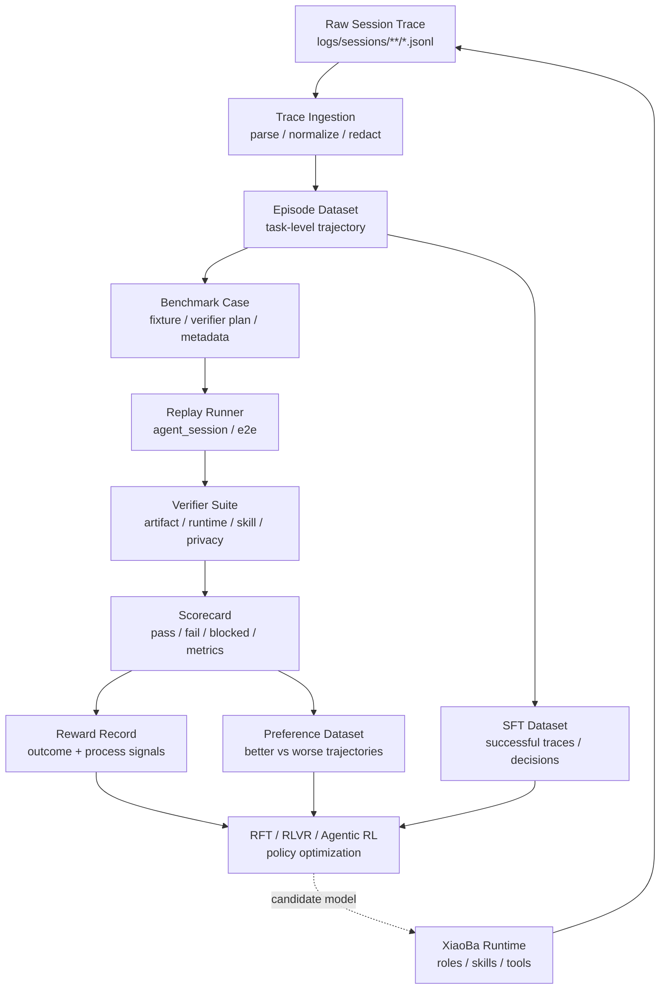

# Post-Training

状态：Draft
目标版本：v0.1
适用范围：`XiaoBa-CLI` 的 trace、episode、case、replay、verifier、reward 与后训练数据闭环。
最后更新：2026-05-21

## 1. 项目定位

XiaoBa 不只是一套 agent harness。它可以演进成一套面向 agentic post-training 的数据与 reward 环境：

```text
真实 agent 工作流
  -> session trace
  -> episode / case
  -> replay environment
  -> verifier / scorecard
  -> reward record
  -> SFT / RFT / RLVR / process reward training data
```

本 spec 的目标是定义这条链路，让 XiaoBa 的角色、工具、日志、评测和反馈闭环服务于后训练，而不是停留在“能跑 agent”的 runtime 层。

核心问题：

> 如何把真实 message-native agent 工作流，转成可训练、可回放、可验证、可打分的 agentic trajectory dataset？

## 2. 与现有文档的关系

- `SPEC.md`：仍然是 XiaoBa-CLI 唯一整体架构 spec。
- `benchmarks/SPEC.md`：定义 trace-derived benchmark catalog、episode / case schema 和 replay 资产结构。
- `docs/reference/replay-loop.md`：定义 case replay 与 Inspector / Engineer / Reviewer 反馈闭环。
- 本文档：定义这些资产如何进一步变成后训练数据、reward signal 和 agentic RL 实验环境。

因此本文档不是替代架构 spec，而是一个专题方向 spec。

## 3. 非目标

本 spec 不主张为了使用小模型、SFT 或 RL 而强行训练模型。

非目标：

- 不把 deterministic trace cleaning 交给模型。
- 不让小模型替代 episode / case 生成代码。
- 不把 LLM judge 当作第一版唯一 verifier。
- 不在没有 replay / verifier / held-out set 时宣称 RL 有收益。
- 不让模型直接根据 reward 自动改生产代码。

第一原则：

```text
代码能确定的事情先代码化。
模型只处理规则很难覆盖、但输出能被 schema 和 verifier 约束的语义判断。
```

## 4. 分层边界

### 4.1 Deterministic Layer

这一层必须以代码和 schema 为主。

职责：

- 解析 JSONL。
- 脱敏和路径匿名化。
- 统一 turn / tool call / runtime event 结构。
- 统计 token、tool success rate、latency、failure count。
- 切 episode。
- 生成 case id / episode id。
- 抽取 artifact references。
- 生成 benchmark metadata。
- 执行 replay。
- 执行 deterministic verifier。

这些工作不适合交给小模型，因为它们需要稳定、可复现、可审计。

### 4.2 Semantic Annotation Layer

这一层可以先用规则和强模型低频兜底，将来再评估是否需要 SFT / 小模型。

职责：

- 判断 root cause layer：`runtime` / `skill` / `prompt` / `usage` / `mixed` / `unknown`。
- 判断 case value：`regression` / `training` / `archive` / `ignore`。
- 判断是否存在 skill opportunity。
- 为 case 推荐 verifier plan。
- 为 case 写自然语言 expectation。
- 为 Engineer / Reviewer 推荐 owner 和 priority。
- 对 replay 失败做高层归因。

这一层的输出必须结构化，并记录 confidence。低置信度输出必须交给 ReviewerCat 或人工确认。

### 4.3 Training Data Layer

这一层把 episode / case / replay / verifier 结果转成后训练样本。

可生成的数据类型：

- `sft_action_trace`：模仿成功 agent trajectory。
- `sft_tool_call`：学习在上下文中选择和组织 tool calls。
- `sft_reviewer_decision`：学习如何根据证据写 `closed` / `reopened` / `blocked` 判断。
- `preference_pair`：同一 case 下好轨迹和坏轨迹的偏好对。
- `reward_record`：replay 和 verifier 输出的机器可读 reward。
- `process_reward_trace`：把长轨迹拆成 step-level 或 stage-level credit 信号。

## 5. 总体数据流



## 6. Core Data Contracts

### 6.1 Reward Record

`reward_record` 是后训练闭环的核心资产。它不是单个分数，而是可解释的 reward bundle。

```json
{
  "version": 1,
  "reward_id": "xiaoba.reward.000001",
  "case_id": "benchmark.case.000001",
  "source_episode_id": "benchmark.ep.000001",
  "run_id": "replay.run.000001",
  "policy_id": "model-or-agent-version",
  "outcome": "pass",
  "reward": 0.86,
  "reward_components": {
    "task_success": 1.0,
    "artifact_quality": 0.8,
    "tool_reliability": 0.9,
    "runtime_hygiene": 0.8,
    "efficiency": 0.6,
    "safety": 1.0
  },
  "evidence": [
    {
      "verifier_id": "artifact_exists",
      "status": "pass",
      "summary": "Expected report artifact was produced."
    }
  ],
  "blocked_reason": null,
  "created_at": "2026-05-21T00:00:00.000Z"
}
```

### 6.2 Process Reward Trace

Long-horizon agent tasks need more than outcome rewards. A failed case may include useful intermediate behavior, and a passed case may include wasteful or risky steps.

```json
{
  "version": 1,
  "case_id": "benchmark.case.000001",
  "run_id": "replay.run.000001",
  "steps": [
    {
      "step_id": "turn-1.tool-1",
      "stage": "context_scan",
      "action_type": "read_file",
      "status": "useful",
      "process_reward": 0.2,
      "evidence": "Read the exact file later modified."
    },
    {
      "step_id": "turn-2.tool-3",
      "stage": "execution",
      "action_type": "shell",
      "status": "wasteful",
      "process_reward": -0.1,
      "evidence": "Repeated a failing command without new information."
    }
  ]
}
```

第一版不需要直接训练 process reward model，但必须把可用信号记录下来。

### 6.3 Training Sample Manifest

每个训练样本必须能追溯到原始 case、replay run 和 verifier 证据。

```json
{
  "version": 1,
  "sample_id": "xiaoba.sft.000001",
  "sample_type": "sft_tool_call",
  "case_id": "benchmark.case.000001",
  "source_episode_id": "benchmark.ep.000001",
  "policy_id": "baseline-agent",
  "input": {},
  "target": {},
  "reward_ref": "xiaoba.reward.000001",
  "privacy_level": "redacted",
  "split": "train"
}
```

## 7. Reward Design

Reward 必须来自 verifier 和可审计 evidence，而不是模型自评。

默认 reward components：

| Component | 含义 | 典型来源 |
| --- | --- | --- |
| `task_success` | 核心任务是否完成 | case verifier / expected result |
| `artifact_quality` | 文件、图表、报告、patch 是否合格 | artifact verifier |
| `tool_reliability` | tool call 是否成功、是否少重试 | tool transcript |
| `runtime_hygiene` | 日志、脱敏、上下文、状态是否健康 | runtime verifier |
| `efficiency` | token、轮次、工具次数是否合理 | metrics |
| `safety` | 是否避免危险命令、凭证泄露、越权操作 | safety / privacy verifier |

第一版 reward 可以是加权和：

```text
reward =
  0.40 * task_success
+ 0.20 * artifact_quality
+ 0.15 * tool_reliability
+ 0.10 * runtime_hygiene
+ 0.10 * efficiency
+ 0.05 * safety
```

不同 benchmark 可以覆盖权重，但必须把权重写入 scorecard。

## 8. 训练路线

### Phase 0: RL-Ready Trace Foundation

目标：不训练模型，只把数据层打稳。

产物：

- `episodes.jsonl`
- `cases.jsonl`
- replay run output
- verifier output
- `scorecard.json`
- `reward-records.jsonl`

验收：

- 任意 reward 都能追溯到 case 和 verifier evidence。
- 任意训练样本都能追溯到 redacted episode。
- deterministic verifier 覆盖最小闭环。

### Phase 1: SFT / Distillation

目标：先学习稳定成功轨迹，不急着做 RL。

训练方向：

- tool-call formatting
- role-specific decision style
- reviewer decision writing
- engineer task handoff
- inspector root-cause annotation

验收：

- held-out case 上 tool schema error 降低。
- Reviewer decision 与人工/强模型 judge 一致率提升。
- replay 前的 task plan 更稳定。

### Phase 2: RFT / RLVR

目标：用 programmable verifier reward 优化候选模型或策略。

适合任务：

- 结构化 tool call。
- 代码修复后测试通过。
- artifact 生成。
- 日志问题归因。
- Reviewer closed / reopened 判断。

不适合第一批做 RL 的任务：

- 开放式聊天。
- 长周期科研策略。
- 缺少 verifier 的审美质量判断。
- 无法自动复现的外部环境任务。

### Phase 3: Agentic RL / Process Reward

目标：从 outcome reward 走向 long-horizon credit assignment。

研究问题：

- 哪些中间步骤对最终 pass 贡献最大？
- 如何惩罚无信息重复、过度探索和危险工具调用？
- 如何奖励“先验证再修复”的过程？
- 如何区分环境 blocked 和 agent failure？
- 如何让 process reward 在不同 role / skill 间迁移？

## 9. Role Responsibilities

### InspectorCat

负责从 trace / episode / case 中发现问题和训练机会。

后训练相关职责：

- 维护 semantic annotation。
- 输出 root cause layer。
- 推荐 case 是否进入 training / regression / archive。
- 识别 skill opportunity。
- 标记哪些失败适合变成 reward case。

### EngineerCat

负责把 replay failure 转成修复，并生成可训练的工程轨迹。

后训练相关职责：

- 产出 implementation trace。
- 记录 plan -> action -> validation。
- 提供可复用的 fix trajectory。
- 对失败修复保留 negative trace。

### ReviewerCat

负责把 case 变成可验证评价，并给出最终 judgment。

后训练相关职责：

- 维护 verifier plan。
- 执行 replay / verifier / scorecard。
- 输出 `closed` / `reopened` / `blocked` 决策。
- 为 preference pair 提供更可信的比较信号。

### ResearcherCat

不直接负责 runtime RL 闭环，但可以作为特定领域 case 来源。

适合产生：

- long-horizon research workflow trajectory
- experiment recovery cases
- manuscript sync cases
- evidence auditing cases

这类 case 只有在 verifier 可定义后才进入 RL 阶段。

## 10. Storage Layout

建议新增或复用以下目录：

```text
benchmarks/<BenchmarkName>/
├── benchmark.json
├── episodes.jsonl
├── cases.jsonl
├── verifiers/
├── runs/
└── rewards/
    ├── reward-records.jsonl
    └── process-reward-traces.jsonl

data/post-training/
├── manifests/
├── sft/
├── preferences/
└── exports/
```

规则：

- `benchmarks/*/rewards/` 保存 benchmark-local reward evidence。
- `data/post-training/` 保存跨 benchmark 汇总和训练导出。
- 不把未脱敏原文、凭证、本机绝对路径写入训练导出。
- 所有导出必须包含 source pointers，而不是孤立样本。

## 11. Metrics

### Data Metrics

- episode count
- case count
- replayable case ratio
- verifier coverage
- reward coverage
- redaction coverage
- schema validation pass rate

### Agent Metrics

- pass rate
- blocked rate
- reopened rate
- tool success rate
- schema error rate
- artifact success rate
- avg turns per case
- avg tool calls per case
- avg tokens per case

### Training Metrics

- held-out replay pass rate
- reward model agreement
- preference agreement
- tool-call validity
- verifier pass delta
- cost per passed case

## 12. Evaluation Gates

任何 post-training 实验必须先过这些 gate：

1. **Data Gate**：训练样本能追溯到 redacted episode / case。
2. **Verifier Gate**：reward 至少有一个 deterministic verifier 来源。
3. **Split Gate**：train / validation / held-out case 分离。
4. **Regression Gate**：新模型不能显著降低核心 runtime / safety pass rate。
5. **Cost Gate**：训练和推理成本收益必须可量化。

如果这些 gate 没过，就不要把实验称为有效 RL 改进。

## 13. MVP

第一版最小可行闭环：

```text
1 selected benchmark
  -> 20 replayable cases
  -> deterministic verifier
  -> scorecard.json
  -> reward-records.jsonl
  -> sft export
```

MVP 不需要真的训练模型。它只需要证明：

- XiaoBa trace 能稳定转成 RL-ready assets。
- 每条 reward 都有 evidence。
- 训练样本不是从空气里合成的。
- 后续接 SFT / RFT / RLVR 时有明确输入输出。

## 14. Open Questions

- episode 边界是否应该由 runtime 辅助写入，还是继续离线推断？
- verifier plan 应该由 case authoring 写入，还是由 ReviewerCat 生成后人工确认？
- process reward 是先规则化，还是先从 preference pair 学 implicit reward？
- ResearcherCat 这类长周期任务是否需要单独 benchmark，而不是混入 runtime regression？
- 哪些 role 的 trajectory 最适合第一批 SFT？
- 哪些 case 足够可验证，适合作为第一批 RFT / RLVR 数据？

## 15. 近期建议

近期不要把重点放在“训练一个小模型”上。更好的顺序是：

1. 把 replayable cases 做实。
2. 把 verifier 和 scorecard 做实。
3. 生成 `reward-records.jsonl`。
4. 从成功/失败 replay 中导出 SFT 和 preference 样本。
5. 积累足够 held-out cases 后，再决定是否做 SFT、RFT 或 agentic RL。

这样 XiaoBa 的定位会从 agent harness 自然升级为 agentic post-training loop，而不是为了赶概念牺牲工程可控性。
