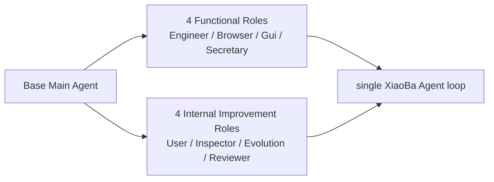

# Roles & Skills PLAN

状态：Active
最后更新：2026-07-15
Owner：Policy maintainers

## Current Status

- Base Main Agent is the only user-facing main agent and dispatcher.
- EngineerCat、BrowserCat、GuiCat、SecretaryCat are the four functional Roles that take over user work.
- UserCat、InspectorCat、EvolutionCat、ReviewerCat are the four internal continuous-improvement Roles used on demand by evaluation, self-evolution and formal replay workflows.
- The 4 + 4 grouping expresses responsibility and activation mode only; all eight Roles remain on the same runtime and control plane.
- EvolutionCat owns deterministic long-term memory plus candidate capability and explicit publish workflows within the internal group.
- EngineerCat owns coding and executes Inspector/Reviewer repair work.
- SecretaryCat owns Feishu workplace workflows over the official `lark-cli`; `FeishuCat` is an alias.
- When Feishu Surface config is present, SecretaryCat resolves and uses the `lark-cli` profile with the same App ID without changing the global active profile.
- All eight roles reuse XiaoBa AgentSession/ConversationRunner.
- RouterCat is retired; browser/GUI upstream Chat/Agent/MCP loops are absent from the production boundary.
- Default assets contain eight roles and zero base skills. EvolutionCat carries the three evolution/publish Skills and the deterministic `remember` role tool; BrowserCat and GuiCat carry the official role-local agent-browser core / Peekaboo Skills.
- Nightly evolution is Inspector-first: deterministic harvest → InspectorCat → typed Route Gate → EvolutionCat / EngineerCat / ReviewerCat / `no_op`. It does not enter Base.
- Skill and Role loaders enforce the single `candidate | active | blocked` lifecycle: legacy assets default to active, candidate assets require explicit selection or Arena mounting, and blocked assets cannot resolve.
- Dashboard management follows the same ordered lifecycle: unblock returns Candidate, while Candidate-to-Active requires an explicit Promote action.

## Milestones

1. Base + eight-role topology：completed。
2. Review/repair chain：completed for current role and tool paths。
3. EngineerCat Codex/coding takeover：completed for current local runner path。
4. BrowserCat typed browser adapter and official core Skill vendoring：completed; packaged driver remains partial。
5. GuiCat typed desktop adapter and official Skill vendoring：completed; the exact optional npm driver、macOS resource mapping、upstream Skill and MIT LICENSE are implemented。
6. Duplicate Router role and Base agent-browser routing Skill retirement：completed。
7. SecretaryCat default packaging and FeishuCat alias：completed。
8. SecretaryCat canonical Feishu application binding：completed。
9. Third-party role/runtime plugin：future explicit-install work, not part of the default topology。
10. EvolutionCat ownership and Base zero-default-Skill migration：completed；including exact-hash Electron retirement of legacy bundled Base Skills。
11. Evolution trace harvest and worker supervision foundation：completed。
12. Inspector-first cross-role evolution DAG：completed；Base hop removal, typed routes, isolated Candidate handoff, Reviewer terminals and Arena intake are implemented。

## Next Steps

- Keep Base as the only user-facing control plane; the scheduled evolution runner remains a fixed typed switch, not another Agent or general workflow framework.
- Finish BrowserCat packaging and broaden BrowserCat/GuiCat real-task verification.
- Keep EngineerCat as coding owner and repair executor.
- Keep SecretaryCat as a thin XiaoBa policy layer over official `lark-cli`; do not add new domain wrappers when an official command/skill already supplies the capability.
- Complete SecretaryCat user OAuth login before claiming personal calendar/mail/drive workflows are operationally ready.
- Measure the existing 36 typed wrappers against official CLI skills and remove compatibility code only after equivalent confirmation, delivery and evidence behavior is verified.
- Keep candidate roles/skills outside the default trusted bundle until Arena evidence supports a separate explicit promotion.
- Collect real-provider evidence for non-`no_op` routes before claiming broad self-evolution effectiveness.
- Maintain role behavior in role prompts, `role.json`, role-local skills and this module—not per-role SPEC/PLAN files.

## Owners

- Role definitions and prompts：`roles/**`
- Runtime role tools/adapters：`src/roles/**`
- Skill assets/runtime：`skills/**`, `src/skills/**`
- Role dispatch：`src/core/**`, `src/tools/spawn-subagent-tool.ts`
- Default package inventory：`package.json`, Electron packaging tests

## Acceptance Criteria

- Exactly eight default roles remain in tracked/default package inventory.
- Base remains the only user-facing main agent and dispatcher.
- The default inventory is presented as four functional Roles and four internal continuous-improvement Roles without introducing another runtime or control plane.
- All eight roles use the shared XiaoBa Agent loop.
- EngineerCat, BrowserCat and GuiCat exclusively own coding, browser and desktop takeover respectively.
- UserCat, InspectorCat, EvolutionCat and ReviewerCat keep their internal continuous-improvement boundaries and participate only when their workflow stage is needed.
- EvolutionCat alone owns `remember`, `self-evolution`, `skill-publish` and `role-publish`; Base has zero bundled default Skills.
- Runtime harvest is deterministic and role-free; InspectorCat alone diagnoses its digest and emits one of `evolution | repair | replay | no_op` with source evidence.
- Evolution requires evidence from at least two independent root-task lineages. EvolutionCat may create at most one run-local Candidate Skill / Role from Inspector findings; it cannot evaluate, publish, promote or dispatch another role in that DAG stage.
- Candidate assets are only explicitly callable or Arena-mountable; blocked assets are never callable; old assets without `status` remain active.
- Blocked assets cannot transition directly to Active; unblock yields Candidate and only explicit promotion yields Active.
- ReviewerCat alone executes formal replay and returns `closed | next_run | blocked`; `next_run` is persisted for a future run, survives an idempotent same-date rerun, and cannot jump back to EngineerCat in the same run.
- SecretaryCat delegates Feishu domain capability to official `lark-cli`; FeishuCat does not become a separate role or control plane.
- When Feishu Surface credentials are configured, SecretaryCat commands use the same App ID profile; bot/user remain actor identities under that one application.
- No duplicate Router role or driver-side Chat/Agent/MCP is provider-visible.
- Base has no duplicate agent-browser routing Skill; browser tasks enter BrowserCat through normal role dispatch.
- BrowserCat's official agent-browser `core` `SKILL.md` remains byte-for-byte pinned with its Apache-2.0 LICENSE, while role-visible execution tools remain the XiaoBa typed adapter only.
- GuiCat's official Peekaboo `SKILL.md` remains byte-for-byte pinned with its MIT LICENSE, while role-visible execution tools remain the XiaoBa typed adapter only.
- Role/skill architecture changes update this PLAN and [`SPEC.md`](SPEC.md), not role-local design documents.

## Risks / Open Questions

- BrowserCat packaging and trusted consequential-action confirmation remain incomplete. GuiCat's pinned driver and local macOS app artifact are verified; signed/notarized release verification remains outside this local build check.
- SecretaryCat's shared application profile and bot identity are ready on the verification machine, but user identity is missing; user-scoped workflows are not yet operationally available.
- SecretaryCat still carries a large typed-wrapper compatibility layer that can drift from the official CLI; simplification must preserve XiaoBa's Owner confirmation and evidence boundary.
- Native runtime tool extension for third-party roles remains a trusted-core change.

## Recent Verification

- BrowserCat/GuiCat/SecretaryCat focused tests：88/88 passed；the BrowserCat/GuiCat/package Skill subset passed 40/40 after adding the BrowserCat core Skill。
- Base default Skill inventory is empty；Electron upgrade cleanup removes only exact retired XiaoBa copies of the four evolution Skills and preserves customized user Skills。
- EvolutionCat/GuiCat/subagent focused subset：26/26 passed。
- Full repository tests：573/573 passed after the Inspector-first DAG and lifecycle gates landed。
- A real-provider nightly E2E ran harvest → InspectorCat → `no_op` without creating a Base session or changing production `skills/`, `roles/` or long-term memory.
- Focused lifecycle, role-tool, DAG and Arena tests verify the three asset states, Reviewer tool boundary, all four typed routes, isolated Candidate Role intake and no same-run back edge.
- Focused DAG/replay/UserCat/eval regression tests：96/96 passed；including replay provenance, Role prompt validation and same-date `next_run` preservation。
- `npm run build` passed。
- Current and target Roles & Skills Mermaid diagrams rendered successfully; the target map was simplified to role groups and ownership boundaries。
- `lark-cli` was found on the verification machine at `/opt/homebrew/bin/lark-cli`，version 1.0.44。
- Feishu Surface and SecretaryCat App ID fingerprints matched; explicit per-command profile binding passed a real `auth status --verify` check without changing the global active profile.
- SecretaryCat real auth status：bot ready，user missing；the configured application reports 140 enabled scopes。
- BrowserCat real status：`BROWSER_DRIVER_NOT_FOUND` for pinned `agent-browser` 0.31.1。
- BrowserCat's official complete `core` Skill is vendored byte-for-byte from `vercel-labs/agent-browser` tag `v0.31.1` / commit `ed2e10598c9064aecfaeb7cf21b540684db4be2c`；SHA-256 is `cc5ec94697530e750bcb9776479d71ef7966e7cf874b9a60b091a986b1ae5b9d`，and the upstream Apache-2.0 LICENSE is packaged beside it。
- The official `core` Skill loads with the role-local SkillManager；BrowserCat still has no shell, raw agent-browser, Chat/Agent or MCP tool, so the copied instructions cannot bypass the typed adapter boundary。
- The local macOS `.app` contains the same BrowserCat `core` Skill and Apache-2.0 LICENSE hashes, and contains no Base `skills/agent-browser` directory。
- GuiCat real status：project-local Peekaboo 3.8.0 found；macOS 16、Screen Recording、Accessibility、event synthesizing and bridge checks passed，`ready=true`。
- GuiCat typed-adapter read-only smoke returned a non-empty real application inventory without taking the desktop lease。
- GuiCat's official Peekaboo Skill is vendored byte-for-byte from `openclaw/Peekaboo` commit `ed1a72186cd365281e534570b68089ebf6ae6c57`；SHA-256 is `0bfe8b25ef9ac2ffc99c7135ddc3b7258abb0a41da0bbeeb9c27d1faa52f2d28`，and the upstream MIT LICENSE is packaged beside it。
- The official Skill loads with the role-local SkillManager；GuiCat still has no shell, raw Peekaboo, Agent or MCP tool, so the copied instructions cannot bypass the typed adapter boundary。
- The local macOS `.app` contains the same official Skill and LICENSE hashes and does not contain the removed generated `agents/openai.yaml`。
- Local macOS Electron packaging passed；the packaged driver is executable at `Contents/Resources/drivers/peekaboo/peekaboo` and the packaged resource-path status check returned `ready=true`。
- Default tool visibility remains four tools before domain skill activation; domain writes remain confirmation-gated。
