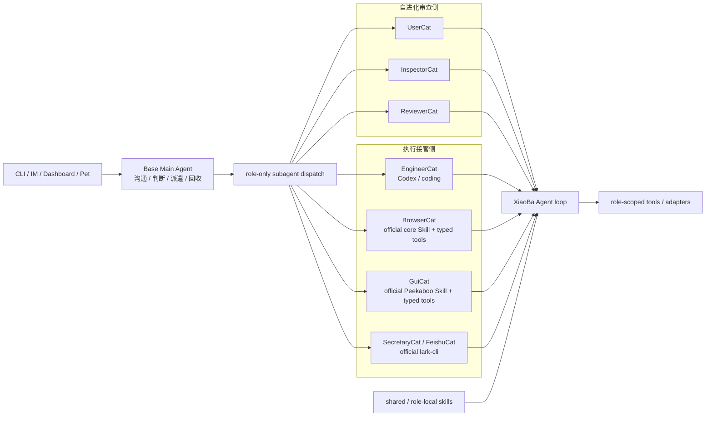
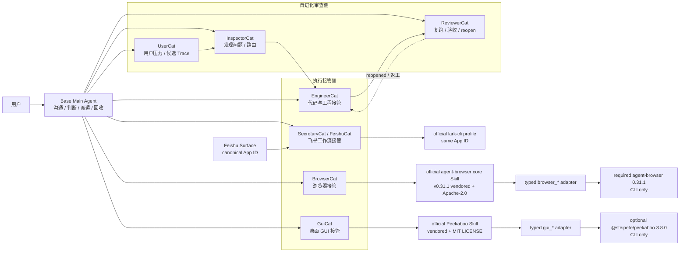

# Roles & Skills SPEC

状态：Active
最后更新：2026-07-13
适用范围：`roles/`、`src/roles/`、`skills/`、`src/skills/` 和 Base Main Agent 使用的角色/技能策略。

本文是 XiaoBa-CLI 六个顶层模块之一 `Roles & Skills` 的唯一架构真相源。角色实现直接由 `role.json`、prompt、role-local `SKILL.md`、`src/roles/**` 和测试表达；不再为每个角色复制 SPEC/PLAN/README。用户用法统一维护在 [`../../roles/README.md`](../../roles/README.md) 和 [`../../skills/README.md`](../../skills/README.md)。

## Problem

XiaoBa 需要让一个面向用户的 Base Main Agent 把专业工作交给角色 Subagent，同时避免出现第二套控制平面、第二套 agent loop 或把外部 capability driver 误当成 Agent。

稳定结构已经实现为一个 Base Main Agent 加七个默认角色 Subagent。三个角色负责自进化审查，EngineerCat、BrowserCat、GuiCat 和 SecretaryCat 负责代码、浏览器、桌面与飞书工作流接管；EngineerCat 是审查侧与执行侧之间的修复执行连接点。

## Scope

In scope:

- Base Main Agent 与默认角色的责任边界。
- 默认角色的拓扑、prompt、role-local skills 和 role-scoped tools。
- shared skills、role-local skills、加载、激活和可见性策略。
- role-only subagent dispatch、默认角色打包和角色生命周期。
- EngineerCat、BrowserCat、GuiCat 使用的确定性执行 adapter 边界。

Out of scope:

- Agent loop、provider transcript 和 ToolManager 执行语义，属于 [`../agent-runtime/SPEC.md`](../agent-runtime/SPEC.md)。
- CLI、飞书、微信、Pet 和 Dashboard 入口，属于 [`../surface/SPEC.md`](../surface/SPEC.md)。
- trace、artifact 和 scorecard 的持久化，属于 [`../observability-evidence/SPEC.md`](../observability-evidence/SPEC.md)。
- replay、live agent eval 和 scorecard gate，属于 [`../evaluation/SPEC.md`](../evaluation/SPEC.md)。

## Current Architecture

当前实现已经使用 Base Main Agent 作为唯一面向用户的主 Agent 和调度入口。跨角色工作通过 `spawn_subagent(role_name=...)` 进入共享 `SubAgentSession` / `AgentSession` loop；角色只提供策略、工具和验收边界。



## Target Architecture

目标拓扑已经实现，不引入 RouterCat、Recovery Role 或 driver-side Agent。BrowserCat 原样 vendoring 与固定 `agent-browser` 版本匹配的官方完整 `core` Skill 并携带 Apache-2.0 LICENSE；GuiCat 原样 vendoring 官方 Peekaboo Skill 并携带 MIT LICENSE。Skill 是 instruction asset，即使正文描述 raw CLI、Agent 或 MCP，也不能扩大角色的 ToolManager 权限。生产执行仍只经过 XiaoBa 的类型化 `browser_*` / `gui_*` 工具，driver package 只提供 CLI 二进制。SecretaryCat 负责飞书工作流接管，但不复制官方 CLI 的 Agent loop、API client 或通用领域能力。Feishu Surface 配置的 App ID 是 XiaoBa 的 canonical application identity；SecretaryCat 显式选择官方 `lark-cli` 中 App ID 相同的 profile，`bot` 与 `user` 只是同一应用下的两种 actor identity。



## Stable Boundaries

- Base Main Agent 是唯一用户入口和调度中心；不再增加 Router 角色。
- Base 直接通过 role dispatch 派遣 BrowserCat，不额外保留 agent-browser 路由 Skill。
- Role 是专业 Subagent 的可复用定义；所有默认角色复用同一套 XiaoBa Agent loop。
- `UserCat -> InspectorCat -> EngineerCat -> ReviewerCat` 是自进化 review/repair 闭环。
- EngineerCat 属于电脑接管执行侧，负责代码与工程环境，同时承接 Inspector 路由和 Reviewer 返工。
- BrowserCat 和 GuiCat 分别接管浏览器与桌面 GUI；底层 driver 只提供确定性 capability，不运行 Chat、Agent、MCP 或第二个模型 loop。
- BrowserCat 的 `core` role-local Skill 原样来自与 `agent-browser@0.31.1` 对齐的官方仓库固定 commit；不复制只负责发现的顶层 stub，也不在 vendored 文件内维护 XiaoBa fork。BrowserCat prompt、`role.json`、ToolManager 和 typed adapter 独立负责权限，因此官方 Skill 中提到的 raw CLI、Shell、MCP、auth、upload 或 download 不会自动成为可调用工具。
- GuiCat 的 `peekaboo` role-local Skill 原样来自官方仓库固定 commit；不在 vendored 文件内维护 XiaoBa fork。GuiCat prompt、`role.json`、ToolManager 和 typed adapter 独立负责权限，因此官方 Skill 中提到的 raw CLI、坐标、Agent、MCP、run、config 或 AI analysis 不会自动成为可调用工具。
- SecretaryCat 是默认飞书工作流角色，`FeishuCat` 只是它的调用别名；底层能力来自官方 `lark-cli`，不再建立第二套飞书 API client 或 Agent loop。
- Feishu Surface 与 SecretaryCat 必须共享同一个飞书应用身份：Surface 的 App ID 是 canonical identity；SecretaryCat 按 App ID 选择 `lark-cli` profile，不切换或覆盖用户的全局 active profile。`bot` / `user` 表示该应用下的 actor identity，不是两个 XiaoBa 智能体。
- 官方 `lark-cli` 负责飞书命令、领域能力、身份登录和凭据；XiaoBa 只负责角色派遣、Owner 绑定的后果动作确认、有限工具暴露、交付和 evidence。当前 typed wrappers 是迁移期兼容层，不作为继续横向扩张的目标架构。
- Skill 是 Base 或 Role 使用的工作方法；文件、Shell、Codex、浏览器、飞书和系统操作是 Tool / Adapter，不再包装成平行 Capability Agent。
- 自进化产生的 role / skill 变更默认只是 candidate；是否进入默认可信资产由 Arena、Reviewer 或人工证据决定。

## Default Inventory

| 分类 | 默认资产 | 责任 |
| --- | --- | --- |
| Main | Base Main Agent | 用户沟通、任务判断、派遣、状态回收和最终交付 |
| Review | `user-cat` | 低信息用户压力和候选 trace |
| Review | `inspector-cat` | 问题发现、证据取证和路由 |
| Review | `reviewer-cat` | replay、验收、closed/reopened/blocked 判断 |
| Computer | `engineer-cat` | 代码仓库、Codex runner、构建和工程任务接管 |
| Computer | `browser-cat` | 浏览器接管和页面证据验证 |
| Computer | `gui-cat` | 本地桌面 GUI 接管和操作证据 |
| Workplace | `secretary-cat` | 飞书日历、消息、任务、文档和协同工作流接管；`feishu-cat` 为别名 |
| Skills | 4 个 default base skills | Base/Role 可复用工作方法，不拥有 runtime loop；浏览器路由由 Base 直接进入 BrowserCat |

## Role Package Contract

默认或可安装角色包只需要运行所需资产：

```text
roles/<role-name>/
  role.json
  prompts/<prompt-file>.md
  skills/<skill-name>/SKILL.md   # optional
```

- `role.json` 声明名称、别名、prompt、skill/tool inheritance、allowlist 和确认 gate。
- prompt 是角色行为的运行时来源，不复制架构文档。
- role-local `SKILL.md` 是角色工作方法，不拥有新的 agent loop。
- native role tools 注册在 `src/roles/**`，必须经过共享 ToolManager。
- 外部 CLI 和最低运行环境集中列在仓库根目录 `requirement.txt`；它是用户安装清单，不是新的架构文档或 pip 输入。
- 角色状态和跨角色边界只更新本文与配套 PLAN。

## Interaction With Other Modules

- Agent Runtime 提供 Base、SubAgentSession、统一 Agent loop 和分层 ToolManager。
- Surface 把用户消息送进 Base，并承载进度与最终交付。
- Observability & Evidence 保存角色执行产生的 trace、artifact、delivery 和 review evidence。
- Evaluation 复跑当前 runtime 并验证行为；Arena 验收外部 skill、本地 role 和其他候选能力。
