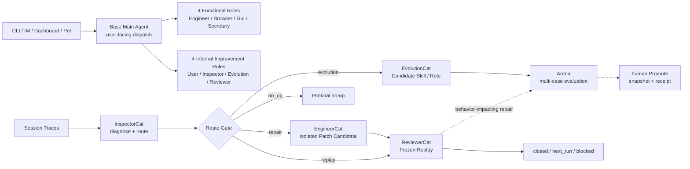
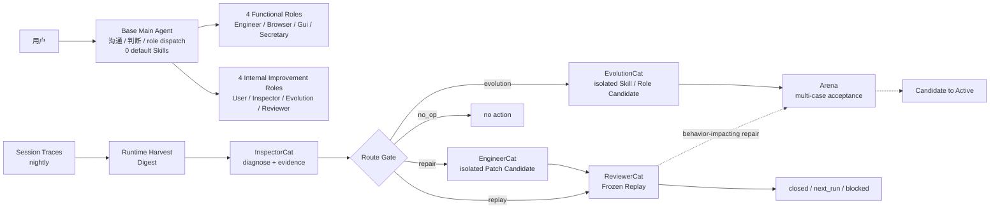

# Roles & Skills SPEC

状态：Active
最后更新：2026-07-20
适用范围：`roles/`、`src/roles/`、`skills/`、`src/skills/` 和 Base Main Agent 使用的角色/技能策略。

本文是 XiaoBa-CLI 六个顶层模块之一 `Roles & Skills` 的唯一架构真相源。角色实现直接由 `role.json`、prompt、role-local `SKILL.md`、`src/roles/**` 和测试表达；不再为每个角色复制 SPEC/PLAN/README。用户用法统一维护在 [`../../roles/README.md`](../../roles/README.md) 和 [`../../skills/README.md`](../../skills/README.md)。

## Problem

XiaoBa 需要让一个面向用户的 Base Main Agent 把专业工作交给角色 Subagent，同时避免出现第二套控制平面、第二套 agent loop 或把外部 capability driver 误当成 Agent。

稳定结构已经实现为一个 Base Main Agent 加八个默认角色 Subagent。四个功能型 Role——EngineerCat、BrowserCat、GuiCat、SecretaryCat——直接接管用户任务；四个内部持续改进 Role——UserCat、InspectorCat、EvolutionCat、ReviewerCat——按需参与评测、自进化和正式回放。两组复用同一 Agent loop，不是两套控制平面；EngineerCat 仍是代码实现与返工的唯一 owner。

## Scope

In scope:

- Base Main Agent 与默认角色的责任边界。
- 默认角色的拓扑、prompt、role-local skills 和 role-scoped tools。
- 显式安装的 standalone skills、role-local skills、加载、激活和可见性策略。
- role-only subagent dispatch、默认角色打包和角色生命周期。
- EngineerCat、BrowserCat、GuiCat 使用的确定性执行 adapter 边界。

Out of scope:

- Agent loop、provider transcript 和 ToolManager 执行语义，属于 [`../agent-runtime/SPEC.md`](../agent-runtime/SPEC.md)。
- CLI、飞书、微信、Pet 和 Dashboard 入口，属于 [`../surface/SPEC.md`](../surface/SPEC.md)。
- trace、artifact 和 scorecard 的持久化，属于 [`../observability-evidence/SPEC.md`](../observability-evidence/SPEC.md)。
- replay、live agent eval 和 scorecard gate，属于 [`../evaluation/SPEC.md`](../evaluation/SPEC.md)。

## Current Architecture

当前实现使用 Base Main Agent 作为唯一面向用户的主 Agent 和普通会话 dispatcher。跨角色工作通过共享 `SubAgentSession` / `AgentSession` loop；角色只提供策略、工具和验收边界。八个默认 Role 分为四个功能型 Role 和四个内部持续改进 Role，但仍运行在同一控制平面。定时自进化不经过 Base：scheduler 启动固定 `EvolutionDAGRunner`，runtime 只 harvest 一次，随后直接等待 InspectorCat，并按类型化 route 进入 EvolutionCat、EngineerCat、ReviewerCat 或终止。EvolutionCat 只能在 run-local 目录生成 Candidate Skill / Role；固定逐行输出的 Skill 可用 `arena-output-line-prefixes` 声明一个窄的 Arena 硬合同。Repair route 从固定 `base_commit` 建 detached worktree，runtime 禁用可另选 cwd 的嵌套 Engineer/Codex 写控制面，并用 macOS Seatbelt 把 Engineer Shell 写入限制在该 worktree；runtime 再生成内容寻址 Patch Candidate。ReviewerCat 在同一 worktree 中通过独立子进程复跑候选代码，`closed` 时必须给出 Arena 风险分类，行为型修复再进入 Arena `repair_regression`。ReviewerCat 不拥有 Codex 实现控制工具。Skill / Role loader 已执行 `candidate | active | blocked` 三态，旧资产缺省为 `active`；自进化 Candidate 只有经 evidence-bound 人工 CLI Promote 才能从 Arena snapshot 进入生产目录。



## Target Architecture

目标拓扑是 Base Main Agent 加八个默认 Role Subagents：四个功能型 Role 直接承接用户任务，四个内部持续改进 Role 按 workflow 场景参与，不引入 RouterCat、Recovery Role 或 driver-side Agent。Base 只负责用户沟通、判断和普通会话中的 role dispatch，不参与定时自进化链路，也不常驻 default base Skill。定时器直接启动一个固定、确定性的自进化 DAG：runtime 只采集 trace、验证类型化合同并按 `evolution | repair | replay | no_op` 路由；InspectorCat 是第一个模型角色。EvolutionCat 只处理跨任务、可泛化模式，并在隔离目录生成 Candidate Skill / Role。EngineerCat 的 `repair` 路径必须从固定 `base_commit` 建立隔离 worktree，产出内容寻址的 Patch Candidate，不能修改调度器所在 checkout；ReviewerCat 在同一候选快照上执行单次 Frozen Replay 并判断是否需要行为复审。只有影响 Agent 行为的 Patch Candidate 才追加 Arena `repair_regression` 多次复跑，普通确定性修复在 Reviewer 通过后结束。`remember` 仍是 EvolutionCat 独占的确定性 role tool，`self-evolution`、`skill-publish`、`role-publish` 仍是它的 role-local Skills。BrowserCat、GuiCat 和 SecretaryCat 的 driver/Skill 权限边界保持不变。



## Stable Boundaries

- Base Main Agent 是唯一用户入口和调度中心；不再增加 Router 角色。
- 八个默认 Role 固定分为四个功能型 Role 与四个内部持续改进 Role；分组只表达责任和启动方式，不建立第二套 Runtime 或控制平面。
- 功能型 Role 直接接管用户任务；内部持续改进 Role 按评测、自进化或正式回放场景启动，并不构成每次全部执行的线性链。
- Base 的默认 Skill inventory 为 0；显式安装 Skill 与 Arena 临时挂载仍是受支持的独立路径。
- Base 直接通过 role dispatch 派遣 BrowserCat，不额外保留 agent-browser 路由 Skill。
- Role 是专业 Subagent 的可复用定义；所有默认角色复用同一套 XiaoBa Agent loop。
- UserCat 负责生产真实 E2E trace，并作为 Arena 内部 evaluator；它不是夜间生产 trace 的上游替身。
- 定时自进化固定从本地 session traces 开始，由 InspectorCat 先诊断，再经过确定性 Route Gate；Base 不参与这条链路。
- Route Gate 只接受 `evolution | repair | replay | no_op`，只验证并分发 Inspector 的结构化结果，不做模型判断，也不是 RouterCat。
- EvolutionCat 承接 Inspector 的候选能力机会，独占确定性 `remember` role tool 和三个演化/发布 role-local Skills；它不写 runtime 代码、不自评通过、不派遣其他默认角色。
- `evolution` 必须由至少两个独立根任务 lineage 的 source trace refs 支持。EvolutionCat 最多生成一个隔离的 callable Candidate Skill / Role，再交给 Arena，不负责 gate 或 promotion。
- Candidate Skill 只有在确实承诺固定逐行文本输出时才声明 `arena-output-line-prefixes`；Arena 对所有被评测 turn 做唯一文本交付与逐行前缀硬验收。EvolutionCat 不执行或解释验收结果。
- Candidate Role 的评测只从 Arena run-local snapshot 解析规范 role identity、role-local Skills 与 ToolManager policy；同名生产 Role 不得覆盖它。`role_skill` subject 与 role-local Skill 同名时必须拒绝，而不是猜加载优先级。
- EngineerCat 接受 `repair` route，只在固定 `base_commit` 的 detached worktree 中修改；显式写文件工具受 `allowedWriteRoot` 约束，Shell 写入受 macOS Seatbelt 约束，可另选 cwd 的嵌套工程控制工具在该 stage 不可见。runtime 自动生成 `candidate.patch`、`patch_sha256`、包含删除在内的 changed files 和证据快照，scheduler checkout 保持不变。ReviewerCat 在同一候选代码快照中执行 Frozen Replay，或者直接接受 `replay` route，在干净 session 中输出 `closed | next_run | blocked`。Repair `closed` 还必须给出 `arena_review=required|not_required`；行为型修复进入 Arena `repair_regression`，同一次 DAG 不回跳 EngineerCat。
- Repair `closed` 表示 Patch Candidate 的验收链结束，不表示 scheduler checkout 已被修改；补丁和证据保留在 DAG run root，当前实现不自动 Apply/Merge。
- 未解决的 `next_run` 在同日重跑时保持幂等，只有后续 run 的 `closed` 或新 `next_run` 才消费原 handoff。
- `no_op` 是显式终态；非法合同、缺证据或 stage failure 必须 fail closed 为 `blocked`，不能伪装成 `no_op`。
- Candidate / Active / Blocked 是 Skill 与 Role 的唯一资产状态；旧资产缺省为 Active，Blocked 不可调用，Candidate 只允许显式调用或 Arena 挂载。
- 生命周期迁移固定为 `blocked → candidate → active`：解除阻塞不能直接恢复 Active。自进化 Candidate 的 Promote 是 runtime 人工控制面命令，只能从已通过的 Arena 不可变 snapshot materialize 并写 receipt；它不是 EvolutionCat tool/Skill，也不是 Arena 自动动作。显式试用 Candidate Role 不等于晋升。
- EngineerCat 属于电脑接管执行侧，负责代码与工程环境，同时承接 Inspector 路由和 Reviewer 返工。
- BrowserCat 和 GuiCat 分别接管浏览器与桌面 GUI；底层 driver 只提供确定性 capability，不运行 Chat、Agent、MCP 或第二个模型 loop。
- GuiCat 负责桌面 GUI 接管；生产操作仍只经过受限、可验证的 typed adapter。
- BrowserCat 的 `core` role-local Skill 原样来自与 `agent-browser@0.31.1` 对齐的官方仓库固定 commit；不复制只负责发现的顶层 stub，也不在 vendored 文件内维护 XiaoBa fork。BrowserCat prompt、`role.json`、ToolManager 和 typed adapter 独立负责权限，因此官方 Skill 中提到的 raw CLI、Shell、MCP、auth、upload 或 download 不会自动成为可调用工具。
- GuiCat 的 `peekaboo` role-local Skill 原样来自官方仓库固定 commit；不在 vendored 文件内维护 XiaoBa fork。GuiCat prompt、`role.json`、ToolManager 和 typed adapter 独立负责权限，因此官方 Skill 中提到的 raw CLI、坐标、Agent、MCP、run、config 或 AI analysis 不会自动成为可调用工具。
- SecretaryCat 是默认飞书工作流角色，`FeishuCat` 只是它的调用别名；底层能力来自官方 `lark-cli`，不再建立第二套飞书 API client 或 Agent loop。
- Feishu Surface 与 SecretaryCat 必须共享同一个飞书应用身份：Surface 的 App ID 是 canonical identity；SecretaryCat 按 App ID 选择 `lark-cli` profile，不切换或覆盖用户的全局 active profile。`bot` / `user` 表示该应用下的 actor identity，不是两个 XiaoBa 智能体。
- 官方 `lark-cli` 负责飞书命令、领域能力、身份登录和凭据；XiaoBa 只负责角色派遣、Owner 绑定的后果动作确认、有限工具暴露、交付和 evidence。当前 typed wrappers 是迁移期兼容层，不作为继续横向扩张的目标架构。
- Skill 是 Base 或 Role 使用的工作方法；文件、Shell、Codex、浏览器、飞书和系统操作是 Tool / Adapter，不再包装成平行 Capability Agent。
- 自进化产生的 role / skill 变更默认只是 candidate；Arena 负责候选能力评测，进入默认可信资产仍需显式 promotion。

## Default Inventory

| 分类 | 默认资产 | 责任 |
| --- | --- | --- |
| Main | Base Main Agent | 用户沟通、任务判断、派遣、状态回收和最终交付 |
| Functional | `engineer-cat` | 代码仓库、Codex runner、构建和工程任务接管 |
| Functional | `browser-cat` | 浏览器接管和页面证据验证 |
| Functional | `gui-cat` | 本地桌面 GUI 接管和操作证据 |
| Functional | `secretary-cat` | 飞书日历、消息、任务、文档和协同工作流接管；`feishu-cat` 为别名 |
| Internal improvement | `user-cat` | 内部 evaluation actor、低信息用户压力和候选 trace |
| Internal improvement | `inspector-cat` | 问题发现、证据取证和路由 |
| Internal improvement | `evolution-cat` | 长期记忆、候选 Skill/Role 沉淀与显式发布工作流 |
| Internal improvement | `reviewer-cat` | replay、验收、`closed / next_run / blocked` 判断 |
| Skills | 0 个 default base skills | 默认工作方法归 role-local Skill；独立 Skill 只通过显式安装或 Arena 挂载进入 |

## Role Package Contract

默认或可安装角色包只需要运行所需资产：

```text
roles/<role-name>/
  role.json
  prompts/<prompt-file>.md
  skills/<skill-name>/SKILL.md   # optional
```

- `role.json` 声明名称、别名、prompt、skill/tool inheritance、allowlist 和确认 gate。
- prompt 是角色行为的运行时来源，不复制架构文档。
- role-local `SKILL.md` 是角色工作方法，不拥有新的 agent loop。
- native role tools 注册在 `src/roles/**`，必须经过共享 ToolManager。
- 外部 CLI 和最低运行环境集中列在仓库根目录 `requirement.txt`；它是用户安装清单，不是新的架构文档或 pip 输入。
- 角色状态和跨角色边界只更新本文与配套 PLAN。

## Interaction With Other Modules

- Agent Runtime 提供 Base、SubAgentSession、统一 Agent loop 和分层 ToolManager。
- Surface 把用户消息送进 Base，并承载进度与最终交付。
- Observability & Evidence 保存角色执行产生的 trace、artifact、delivery 和 review evidence。
- Evaluation 复跑当前 runtime 并验证行为；Arena 验收外部 skill、本地 role 和其他候选能力。
