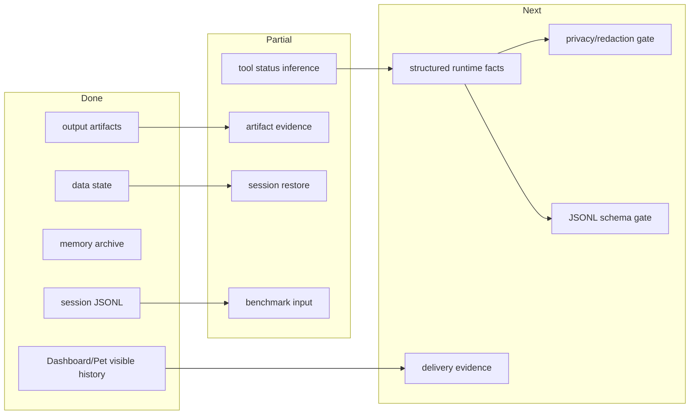

# State And Evidence PLAN

状态：Active
最后更新：2026-05-30
Owner：Runtime evidence maintainers

本文维护本地状态和运行证据层的执行状态。架构边界见 `SPEC.md`。

## Current Status

`logs/sessions/**/*.jsonl` 是当前 session trace 主线；`data` 保存 durable/chat/role 工作状态；`memory` 保存长期上下文资产；`output` 保存工具和角色产物。当前最大缺口是结构化 tool status、artifact manifest、delivery evidence 和 privacy/schema gate。

## Milestones

1. State/Evidence module spec baseline: completed.
2. Session JSONL as main trace input: completed.
3. Dashboard/Pet visible history: partial and implemented for current chat path.
4. Structured tool status and error_code evidence: not started.
5. Artifact manifest and delivery evidence: not started.
6. Privacy/redaction gate for logs/artifacts/scorecards: not started.
7. JSONL schema compatibility gate: not started.

## Next Steps

- Define structured evidence records for tool status, error_code, artifact manifest and delivery evidence.
- Add JSONL schema checks for session logs.
- Add privacy scan gates before trace-derived benchmark assets are committed.
- Document restore boundaries for durable session versus provider transcript.

## Owners

- Session logs：`src/core/**`, `logs/sessions/**`
- Durable session state：`src/core/message-session-manager.ts`, `data/sessions/**`
- Dashboard/Pet visible history：`src/pet/chat-history-store.ts`, `data/chat/**`
- Role work data：`src/roles/**`, `data/engineer-tasks/**`, `data/reviewer-runs/**`, `data/codex-jobs/**`
- Tool artifacts：`src/tools/**`, `output/**`
- Memory：`src/core/context-compressor.ts`, `memory/**`

## Acceptance Criteria

- Session JSONL remains line-parseable and ingestion-compatible.
- Tool failures, delivery events and artifacts produce structured evidence.
- Private credentials, tokens, private hosts and private paths are blocked or redacted before release-grade artifacts.
- Benchmark ingestion can consume logs and artifacts without relying on private local-only state.

## Verification Log

- 2026-05-30：Added `state-evidence/SPEC.md` and `state-evidence/PLAN.md` to make State/Evidence one of the five top-level module specs.

## Risks / Open Questions

- Some historical logs may not contain enough structure to backfill future evidence fields.
- Artifact evidence must avoid committing generated private output while still preserving enough replay metadata.

## Status Maintenance Rules

- Any change to session log schema, data layout, memory layout or artifact evidence must update this plan and `SPEC.md`.
- Do not call a trace-derived benchmark case ready until its evidence is cleaned and fixture-ready.
