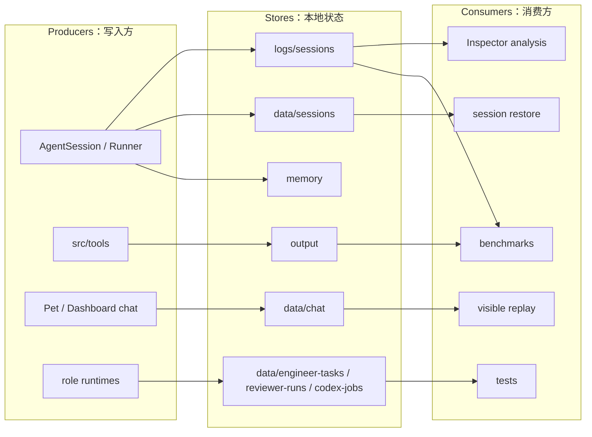
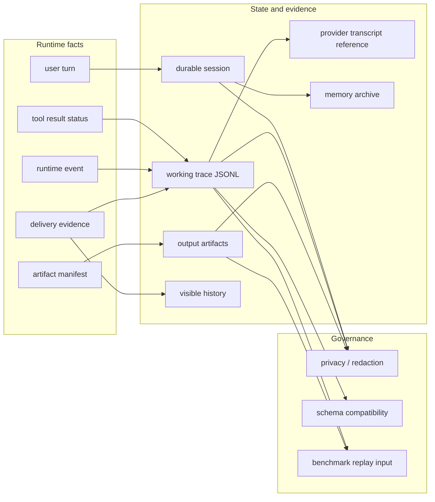

# State And Evidence SPEC

状态：Active
最后更新：2026-05-30
适用范围：XiaoBa 的本地状态和运行证据层，包括 `data`、`logs`、`memory`、`output` 以及写入这些目录的 runtime/role/surface/tool 代码。

本文是五大顶层模块之一的状态与证据 spec。它定义什么是 durable session、working trace、provider transcript、visible history、artifact 和 evaluation input。

## Problem

XiaoBa 是本地优先的 agent harness，不能只靠 `messages[]` 保存状态，也不能把日志当作临时 debug 输出。状态与证据层要保证运行可恢复、失败可归因、artifact 可追踪、日志可解析、后续 benchmark 可以复用。

## Scope

In scope:

- Session logs：`logs/sessions/**/*.jsonl`。
- Durable session 和 chat state：`data/sessions/**`、`data/chat/**`。
- Role/runtime 工作资产：`data/engineer-tasks/**`、`data/reviewer-runs/**`、`data/codex-jobs/**` 等。
- Memory archive：`memory/**`。
- Tool artifacts 和交付产物：`output/**`。
- JSONL compatibility、privacy/redaction、artifact manifest、delivery evidence。

Out of scope:

- Agent loop 和 tool execution，属于 `docs/harness/SPEC.md`。
- 平台输入输出协议，属于 `docs/surfaces/SPEC.md`。
- Role/skill 策略，属于 `docs/roles/SPEC.md`。
- Case replay、verifier 和 scorecard，属于 `docs/benchmarks/SPEC.md`。

## Current Architecture

当前证据层已经有 session JSONL、Dashboard/Pet visible history、memory 和 output 目录，但部分字段仍由日志后处理推断，artifact evidence 和 tool status 还没有完全结构化。

## Target Architecture

目标是把状态分成 durable session、working trace、provider transcript 和 artifacts/evidence 四类，并让每类都有稳定 schema、privacy boundary 和 replay 入口。

## Data Contracts

Stable session JSONL records should preserve:

- `schema_version`
- `entry_type`
- `session_id`
- `session_type`
- `turn_id`
- `user.text`
- `assistant.text`
- `assistant.tool_calls`
- `tokens.prompt`
- `tokens.completion`
- runtime event metadata

Structured evidence should additionally converge on:

- `tool_call_id`
- `status`
- `error_code`
- `retryable`
- `artifact_manifest`
- `delivery_evidence`
- `skill_id`
- `role_name`
- privacy/redaction metadata when applicable

## Contracts

- `logs/sessions/**/*.jsonl` must be line-delimited JSON and backward compatible for ingestion.
- User-visible file generation or sending must leave artifact or delivery evidence.
- Credential, token, private host and private path leaks are hard failures for reply, log, artifact and scorecard surfaces.
- Visible history, durable session, working trace and provider transcript are different records; code must not silently treat one as the other.
- Benchmark assets derived from logs must be cleaned, fixture-ready and privacy-reviewed before being committed.

## Interaction With Other Modules

- Receives runtime facts from `docs/harness/SPEC.md`.
- Receives visible delivery semantics from `docs/surfaces/SPEC.md`.
- Stores role-specific work evidence described by `docs/roles/SPEC.md` and role-local specs.
- Feeds `docs/benchmarks/SPEC.md` with trace, artifacts and replay evidence.
