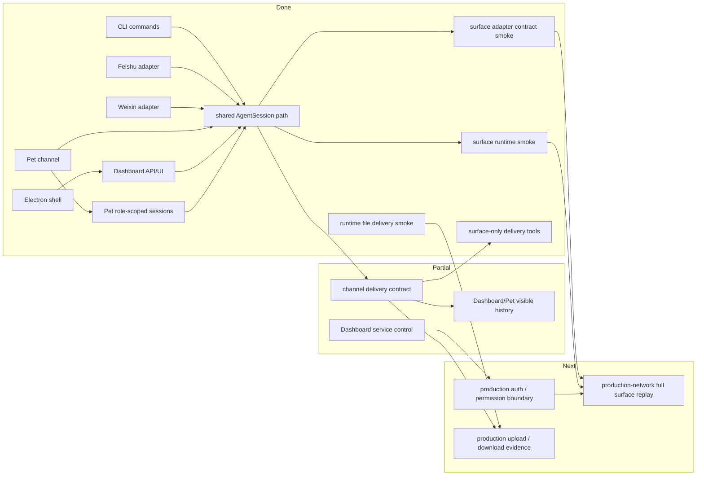

# Surfaces PLAN

状态：Active
最后更新：2026-06-18
Owner：Surface maintainers

本文维护 XiaoBa 入口层的执行状态。架构边界见 `SPEC.md`。

## Current Status

CLI、Feishu、Weixin、Pet、Dashboard 和 Electron 已经能通过共享 `AgentSession` 进入同一套 runtime。CLI 走 direct final reply，不注入 `send_text` / `send_file`；Feishu、Weixin、Pet 和 Dashboard 作为 channel-backed surface 才注入 surface delivery tools，且默认只有 `send_text` / `send_file` 产生用户可见输出，direct final reply 只进入 trace/session，不自动外发。`delivery_fallback_final_reply` 保留为显式 opt-in 兼容策略，默认关闭。Dashboard 和 Pet 的可见历史、Room agent stream、Feishu/Weixin channel delivery 已有实现；Pet Chat events 会写入 `data/chat/sessions/**`，Dashboard Room SSE events 会写入 `data/chat/dashboard-room/**`，Pet/Dashboard 的 role session key 已经绑定 role-scoped skills/tools，并按 session key 隔离历史和 SSE replay。PetChannel 现在会注册 subagent 平台回调，后台子智能体完成后可重新注入同一 Pet session，并把后续 text/file/tool events 写入 Pet visible history。Dashboard Room、Pet 和 Feishu 入口现在会提取合法 W3C `traceparent` 并传给共享 `AgentSession`，用于本地 parent trace continuity；invalid trace context 会被丢弃。production FeishuBot event handler、Dashboard Room router 和 Pet router 已接入 `test:surface-runtime`，用 scripted AI 验证平台 parser / normalizer、入口 runtime 到 channel callback / SSE delivery 的最小闭环；`test:surface-runtime-file` 已在相同 production entrypoint path 上验证 `send_file`、IM/SSE file event、file name、artifact evidence 和 Feishu message/upload/file external receipts。更重的真实外部鉴权、真实上传下载、跨进程恢复和完整用户路径 E2E 后续归 ReviewerCat / role benchmark，不再作为 surface runtime harness 的第四条默认 gate。

## Milestones

1. Surface inventory and module spec: completed.
2. Shared `AgentSession` entry path for maintained surfaces: completed.
3. Channel delivery fallback policy: completed as explicit opt-in with default-off behavior.
4. Surface-only delivery tool injection for Feishu、Weixin、Pet and Dashboard, with CLI excluded: completed in current ToolManager path.
5. Dashboard/Pet visible history: partial v2, implemented for Dashboard pet chat and Dashboard Room visible SSE events, isolated by normalized session key.
6. Auth and permission boundary for local HTTP/control surfaces: production auth still not started; future coverage belongs to ReviewerCat / role benchmark true E2E.
7. File delivery evidence contract across IM/Pet/Dashboard: partial via `test:surface-runtime-file` for Feishu、Dashboard Room and Pet `send_file` delivery, including Feishu message/upload/file external receipt shape.
8. Surface contract smoke in `test/contract-smoke`: partial via `test:surface-runtime` and `test:surface-runtime-file` for Feishu、Dashboard Room and Pet; observability source contract also gates surface `traceparent` extraction/forwarding fragments.
9. Pet role-scoped sessions: completed for Dashboard Chat and desktop pet widget paths; `pet:<petId>:role-<role>` creates role-scoped skills/tools, while `role-base` aliases to the default pet session.

## Next Steps

- Define minimum production auth and permission rules before treating Dashboard/Pet endpoints as network-ready.
- Define ReviewerCat / role benchmark ownership before adding production-network IM/Dashboard/Pet E2E with real auth, file upload/download, long task queue and recoverable session coverage.
- Keep production parser / normalizer coverage inside `test:surface-runtime` so entry behavior is checked through the real runtime path.
- Extend trace continuity tests from ingress normalization into production-network surface E2E once real external auth/file paths are available.
- Promote file upload/download and `send_file` evidence into structured state/evidence records.
- Keep `dashboard/SPEC.md` for Dashboard-specific UI and Room details; keep this spec focused on cross-surface contracts.

## Owners

- CLI：`src/commands/**`
- Feishu：`src/feishu/**`
- Weixin：`src/weixin/**`
- Pet：`src/pet/**`
- Dashboard：`src/dashboard/**`, `dashboard/**`
- Electron：`electron/**`

## Acceptance Criteria

- Every maintained surface has an explicit `surface` value and session key rule.
- Pet/Dashboard role session keys bind to role-scoped services, so `/skills` and slash skill activation expose the active role's skills in both Chat and desktop pet widget paths.
- CLI does not expose `send_text` / `send_file`; channel-backed surfaces expose them only when surface context is explicit and channel callbacks are present.
- Channel-backed slash commands that activate skills preserve `surface` and `channel` into the follow-up agent turn, so delivery tools are either executable or hidden.
- Channel surfaces expose user-visible output through callbacks only after explicit `send_text` / `send_file`; fallback final reply is default-off and must be opted in per call or entrypoint.
- Surface tests cover CLI, at least one IM adapter path, Pet/Dashboard channel delivery and file evidence.
- Network-exposed or service-control endpoints have explicit auth and command/path validation before being called production-ready.

## Verification Log

- 2026-06-18：PetChannel now registers subagent callbacks and writes background completion delivery/tool events into Pet visible history, enabling IM-style subagent completion benchmark evidence. Verification：`npm run build`; `npm run eval:base-runtime`（6/6 benchmark cases，6/6 eval cases）。
- 2026-06-17：Channel final reply fallback changed to default-off opt-in policy at the `AgentSession` / `ConversationRunner` boundary. Verification：`npm run build`; `node --test -r tsx test/conversation-runner-harness.test.ts test/agent-session-log.test.ts`（18/18）；`node --test -r tsx test/pet-channel.test.ts test/room-channel-history.test.ts test/dashboard-pet-runtime.test.ts`（20/20）；`npm run eval:gate`（22/22 items，130/130 cases）。
- 2026-05-30 至 2026-06-04：Surfaces module baseline completed: shared `AgentSession` entry path, explicit surface values, Weixin durable save, surface-only `send_text` / `send_file`, Pet/Dashboard role-scoped sessions, Dashboard Room visible JSONL history, and Feishu/Dashboard/Pet adapter/runtime/file smoke coverage.
- Current runtime contract smoke lives in `test:contract-smoke` through surface adapter/runtime/file, delivery and state/evidence smoke cases; release-blocking runtime benchmark evidence is produced by `eval:base-runtime`. Retired historical surface gates are no longer current release evidence.
- 2026-06-10：Surface plan verification log slimmed to current gate terminology after the two-layer eval cleanup. Verification：covered by eval cleanup build/schema/dashboard tests in `eval/PLAN.md`.

## Risks / Open Questions

- Current local Dashboard service-control endpoints are useful but still need clearer auth and permission boundaries.
- IM file delivery semantics differ by platform; the shared evidence model must leave room for platform-specific delivery ids.

## Status Maintenance Rules

- Any new entrypoint must update this plan and `SPEC.md`.
- Dashboard-only UI changes belong in `dashboard/PLAN.md`; cross-entry delivery or auth changes belong here.
