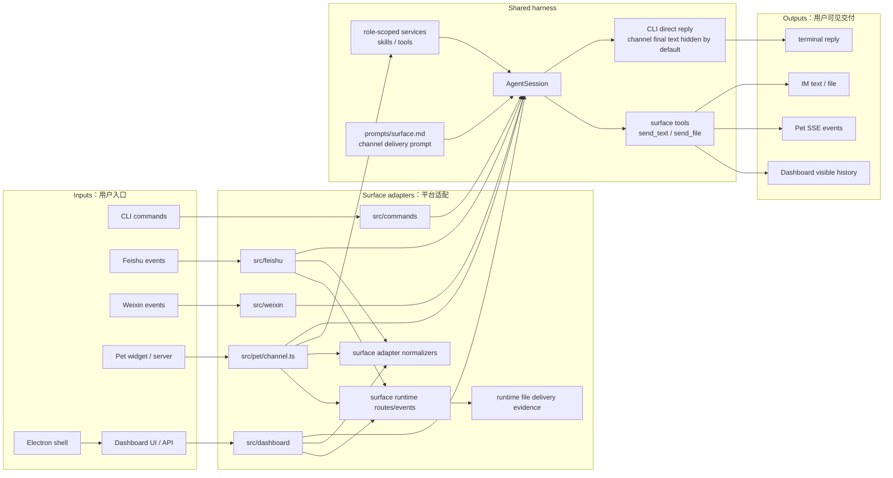
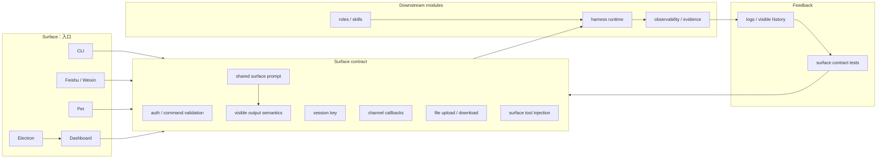

# Surfaces SPEC

状态：Active
最后更新：2026-06-24
适用范围：XiaoBa 的用户入口层，包括 `src/commands`、`src/feishu`、`src/weixin`、`src/pet`、`src/dashboard`、`dashboard` 和 `electron`。

本文件是五大顶层模块之一的入口层 spec。Dashboard 的页面细节继续由 `dashboard/SPEC.md` 维护；本文只定义所有入口共同遵守的边界和 contract。

## Problem

Surfaces 把不同用户入口统一接到同一套 local-first agent harness。CLI、Feishu、Weixin、Pet、Dashboard 和 Electron 桌面壳的协议、鉴权、事件形态和用户可见输出不同，但它们不能各自实现一套 agent loop。

入口层要解决的问题是：

- 把平台消息解析成 runtime 可消费的 user turn。
- 显式声明 `surface`、session key 和 channel callbacks。
- 将用户可见文本、文件和错误交付回对应平台。
- 保持平台适配和 agent harness 的责任边界清楚。

## Scope

In scope:

- CLI 命令入口：`src/commands/**`。
- IM 平台入口：`src/feishu/**`、`src/weixin/**`。
- Pet 和 Dashboard 入口：`src/pet/**`、`src/dashboard/**`、`dashboard/**`。
- Electron 桌面壳：`electron/**`。
- 入口级 session key、channel callbacks、文件上传下载、SSE、service control 和配置入口。

Out of scope:

- Provider 调用和 transcript 修复，属于 `docs/agent-runtime/SPEC.md`。
- Role/skill 策略，属于 `docs/roles-skills/SPEC.md`。
- trace、visible history、memory、artifact 的观测证据和持久化 schema，属于 `docs/observability-evidence/SPEC.md` / `docs/observability-evidence/state-evidence/SPEC.md`。
- Unit / integration / deterministic contract smoke，属于 `test/SPEC.md`。
- Replay、verifier、role benchmark 和 release eval，属于 `eval/SPEC.md`。

## Current Architecture

当前入口层已经收敛到共享 `AgentSession`，但各入口仍分别维护平台协议、文件语义和服务控制。Channel delivery 的 canonical prompt 现在集中在 `prompts/surface.md`：`AgentSession` 用它注入 Feishu、Weixin、Pet 和 Dashboard 的 surface system message，role prompt 可通过 include 引用同一份交付规则。Pet/Dashboard 的 `pet:<petId>:role-<role>` session key，以及带附加隔离后缀的 `pet:<petId>:role-<role>:run-<run-id>` 这类 session key，已经绑定到 role-scoped `SkillManager` / `ToolManager`；同一个宠物在 Chat 页面和桌宠窗口之间按 session key 共享角色技能、历史和 SSE replay。Pet Chat visible events 写入 `data/chat/sessions/**`。PetChannel 现在也会为 session 注册 `SubAgentManager` 回调，后台子智能体完成通知会重新注入同一个 Pet `AgentSession`，并把后续 text/file/tool events 写入 Pet visible history。入口 runtime smoke 由 `test/contract-smoke/suites/surface-runtime-smoke.json` 和 `test/contract-smoke/suites/surface-runtime-file-smoke.json` 承担，当前维护中的 gate 覆盖 production FeishuBot event handler 和 Pet router，验证平台 parser / normalizer、入口 runtime、channel callback / SSE delivery 以及 runtime file delivery 的最小闭环。Feishu sender 现在会把 SDK message/file upload response 转成 `external_delivery_receipts`，Surface Runtime File gate 要求 Feishu runtime replay 具备 message/upload/file receipt 和 platform ids。更重的真实入口 E2E 不再放在 runtime harness 中扩张，后续应由 ReviewerCat 或 role-owned benchmark 明确拥有。

## Target Architecture

目标是让所有入口都显式实现同一套 surface contract：平台层只做输入解析、鉴权、文件处理和交付回调，agent loop、role/skill、tool、state/evidence 都由下游模块统一承担。

## Contracts

- 每个入口必须显式传入 `surface`，不能从 session key 反推入口类型。
- 每个入口的 raw event / route payload 应能归一化为稳定 surface event：surface、event type、event id、session key、channel id、user id、user message、payload type 和必要 metadata。
- Pet/Dashboard 的 `pet:<petId>:role-<role>` session key，以及 `pet:<petId>:role-<role>:<safe-suffix>` 这类带附加隔离后缀的 session key，必须创建或复用对应角色的 scoped services；`/skills`、skill 激活、tool allowlist、visible history 和 SSE replay 都必须按归一化后的 session key 隔离，`role-base` 归一到默认 `pet:<petId>`。
- CLI 的正常用户可见输出是 direct final reply；CLI 不应向模型暴露 `send_text` / `send_file`。
- Feishu、Weixin、Pet 和 Dashboard 这类 channel-backed surface 的正常用户可见输出是 `send_text` / `send_file` 或等价 channel callback；direct final reply 默认只进入 provider/session trace，不外发给用户。
- Channel delivery prompt 的 canonical source 是 `prompts/surface.md`；surface system message 和 role prompt 只能读取或 include 这份规则，不应复制维护另一份完整文本。
- Channel final reply fallback 是显式 opt-in：入口只有传入 `deliveryFallbackFinalReply=true` 时，`ConversationRunner` 才能把 final text 合成为 synthetic `send_text` 交付证据；默认关闭。
- 当 `AgentSession.handleMessage` 返回 `finalResponseVisible=true` 且带有 `text` 时，channel adapter 必须把该文本通过当前 channel callback 交付给用户；这是 runtime 显式标记的可见结果，不等同于默认关闭的 final reply fallback。
- `send_text` / `send_file` 属于 surface tool，只能在入口显式传入 channel-backed `surface` 且提供真实 `channel` callbacks 时注入；slash command 激活 skill 后继续进入 agent loop 时也必须保留同一组 `surface` / `channel`。
- 入口 runtime smoke 必须捕获 request/response artifacts、IM reply 或 SSE events、session key、channel id、visible delivery count、file delivery count 和 file names。
- 真实入口 E2E 若覆盖 auth、upload/download、long task queue、session restore/resume 或跨平台用户路径，必须进入 ReviewerCat / role benchmark 边界，而不是扩张 runtime harness。
- 平台层只负责鉴权、消息解析、文件上传下载、callback 和服务控制，不复制 `ConversationRunner`。
- 新增入口必须定义 session key 规则、用户可见输出语义、文件处理、TTL/cleanup/wakeup 行为。
- Dashboard/Pet 这类本地 HTTP surface 在扩大网络暴露前必须先有 auth、permission 和 command/path validation。

## Interaction With Other Modules

- 调用 `docs/agent-runtime/SPEC.md` 定义的 `AgentSession` 和 runner，不直接调用 provider。
- 使用 `docs/roles-skills/SPEC.md` 定义的 role/skill policy，不自行拼接角色运行时。
- 将可观测输出写入 `docs/observability-evidence/SPEC.md` / `docs/observability-evidence/state-evidence/SPEC.md` 定义的 trace、visible history 或 artifact evidence。
- 入口级 deterministic contract smoke 由 `test/contract-smoke/suites` 维护；当前 Feishu 和 Pet 的入口 runtime 最小闭环由 `test:surface-runtime` 覆盖，runtime file delivery 和 Feishu external receipt shape 由 `test:surface-runtime-file` 覆盖。release-blocking runtime benchmark 由 `eval:base-runtime` 消费；更重的真实入口 E2E 归未来 role-owned live benchmark 边界。
