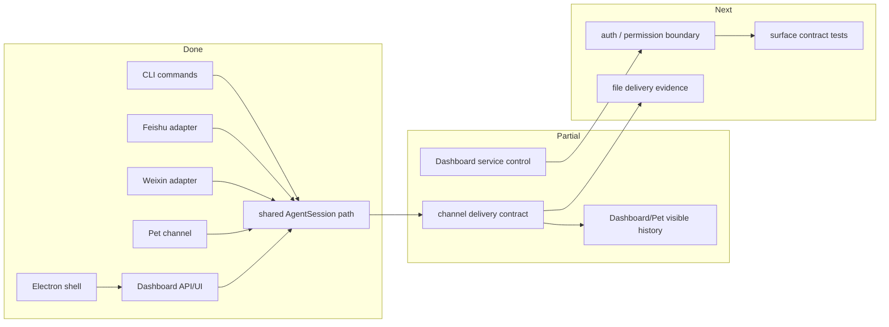

# Surfaces PLAN

状态：Active
最后更新：2026-05-30
Owner：Surface maintainers

本文维护 XiaoBa 入口层的执行状态。架构边界见 `SPEC.md`。

## Current Status

CLI、Feishu、Weixin、Pet、Dashboard 和 Electron 已经能通过共享 `AgentSession` 进入同一套 runtime。Dashboard 和 Pet 的可见历史、Room agent stream、Feishu/Weixin channel delivery 已有实现；入口层仍需要继续收敛 auth、permission、文件交付证据和 surface contract tests。

## Milestones

1. Surface inventory and module spec: completed.
2. Shared `AgentSession` entry path for maintained surfaces: completed.
3. Channel delivery fallback policy: completed in current runtime docs and tests.
4. Dashboard/Pet visible history: partial, implemented for current Dashboard pet chat.
5. Auth and permission boundary for local HTTP/control surfaces: not started.
6. File delivery evidence contract across IM/Pet/Dashboard: not started.
7. Surface contract gate in tests/benchmarks: not started.

## Next Steps

- Define minimum auth and permission rules before treating Dashboard/Pet endpoints as network-ready.
- Add shared tests for `surface`, session key, callback delivery and fallback behavior.
- Promote file upload/download and `send_file` evidence into structured state/evidence records.
- Keep `dashboard/SPEC.md` for Dashboard-specific UI and Room details; keep this spec focused on cross-surface contracts.

## Owners

- CLI：`src/commands/**`
- Feishu：`src/feishu/**`
- Weixin：`src/weixin/**`
- Pet：`src/pet/**`
- Dashboard：`src/dashboard/**`, `dashboard/**`
- Electron：`electron/**`

## Acceptance Criteria

- Every maintained surface has an explicit `surface` value and session key rule.
- Channel surfaces expose user-visible output through callbacks and log fallback final replies as fallback.
- Surface tests cover CLI, at least one IM adapter path, Pet/Dashboard channel delivery and file evidence.
- Network-exposed or service-control endpoints have explicit auth and command/path validation before being called production-ready.

## Verification Log

- 2026-05-30：Added `surfaces/SPEC.md` and `surfaces/PLAN.md` to make Surfaces one of the five top-level module specs.

## Risks / Open Questions

- Current local Dashboard service-control endpoints are useful but still need clearer auth and permission boundaries.
- IM file delivery semantics differ by platform; the shared evidence model must leave room for platform-specific delivery ids.

## Status Maintenance Rules

- Any new entrypoint must update this plan and `SPEC.md`.
- Dashboard-only UI changes belong in `dashboard/PLAN.md`; cross-entry delivery or auth changes belong here.
