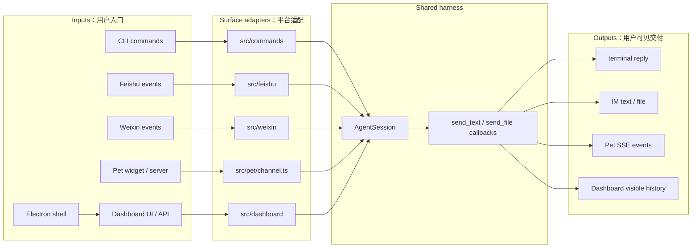
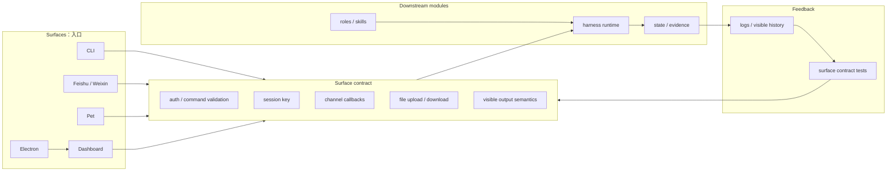

# Surfaces SPEC

状态：Active
最后更新：2026-05-30
适用范围：XiaoBa 的用户入口层，包括 `src/commands`、`src/feishu`、`src/weixin`、`src/pet`、`src/dashboard`、`dashboard` 和 `electron`。

本文件是五大顶层模块之一的入口层 spec。Dashboard 的页面和 Room 细节继续由 `dashboard/SPEC.md` 维护；本文只定义所有入口共同遵守的边界和 contract。

## Problem

Surfaces 把不同用户入口统一接到同一套 local-first agent harness。CLI、Feishu、Weixin、Pet、Dashboard 和 Electron 桌面壳的协议、鉴权、事件形态和用户可见输出不同，但它们不能各自实现一套 agent loop。

入口层要解决的问题是：

- 把平台消息解析成 runtime 可消费的 user turn。
- 显式声明 `surface`、session key 和 channel callbacks。
- 将用户可见文本、文件和错误交付回对应平台。
- 保持平台适配和 agent harness 的责任边界清楚。

## Scope

In scope:

- CLI 命令入口：`src/commands/**`。
- IM 平台入口：`src/feishu/**`、`src/weixin/**`。
- Pet 和 Dashboard 入口：`src/pet/**`、`src/dashboard/**`、`dashboard/**`。
- Electron 桌面壳：`electron/**`。
- 入口级 session key、channel callbacks、文件上传下载、SSE、service control 和配置入口。

Out of scope:

- Provider 调用和 transcript 修复，属于 `harness/SPEC.md`。
- Role/skill 策略，属于 `roles/SPEC.md`。
- 日志、memory、artifact 的持久化 schema，属于 `state-evidence/SPEC.md`。
- Replay、verifier 和 release gate，属于 `benchmarks/SPEC.md`。

## Current Architecture

当前入口层已经收敛到共享 `AgentSession`，但各入口仍分别维护平台协议、文件语义和服务控制。

## Target Architecture

目标是让所有入口都显式实现同一套 surface contract：平台层只做输入解析、鉴权、文件处理和交付回调，agent loop、role/skill、tool、state/evidence 都由下游模块统一承担。

## Contracts

- 每个入口必须显式传入 `surface`，不能从 session key 反推入口类型。
- Channel surface 的正常用户可见输出是 `send_text` / `send_file` 或等价 channel callback；direct final reply 只能作为 fallback。
- 平台层只负责鉴权、消息解析、文件上传下载、callback 和服务控制，不复制 `ConversationRunner`。
- 新增入口必须定义 session key 规则、用户可见输出语义、文件处理、TTL/cleanup/wakeup 行为。
- Dashboard/Pet 这类本地 HTTP surface 在扩大网络暴露前必须先有 auth、permission 和 command/path validation。

## Interaction With Other Modules

- 调用 `harness/SPEC.md` 定义的 `AgentSession` 和 runner，不直接调用 provider。
- 使用 `roles/SPEC.md` 定义的 role/skill policy，不自行拼接角色运行时。
- 将可观测输出写入 `state-evidence/SPEC.md` 定义的日志、visible history 或 artifact evidence。
- 入口级 contract 测试最终进入 `benchmarks/SPEC.md` 的 release gate。
