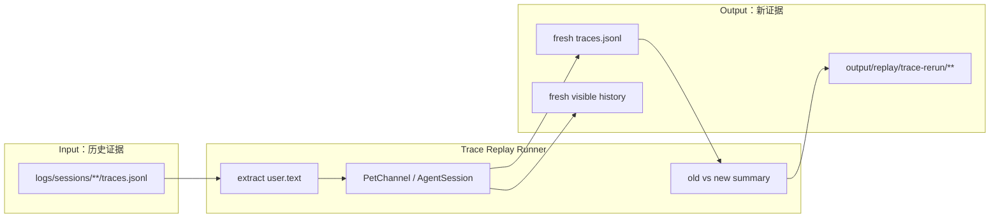
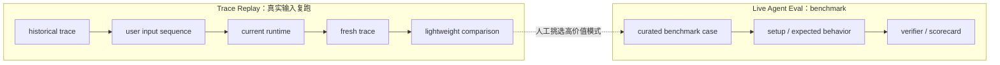

# Trace Replay SPEC

状态：Active
最后更新：2026-06-23
Owner：Runtime / Evaluation maintainers

## Problem

Trace Replay 解决一个很具体的问题：拿一次历史真实运行里的用户输入，重新驱动当前 XiaoBa runtime，观察新的 trace 是否还能复现同类行为。

它不是 benchmark，不负责给产品能力打最终分；它是本地排障和回归观察工具。用户问“同款输入现在还能不能跑出同类观测 trace”，答案应该来自 trace replay。

## Scope

In scope:

- 从本地 `logs/sessions/**/traces.jsonl` 读取历史 trace。
- 抽取历史 `user.text`，按原顺序重新发送到当前 Pet/Chat runtime。
- 使用新的 session key 产生 fresh trace、visible history 和 replay summary。
- 对比旧/新 trace 的基础结构：用户输入数、工具类型、可见交付、final 可见性、失败工具。

Out of scope:

- 自动接受 benchmark case。
- LLM 打分、rubric audit、trace proposal。
- 完整 workspace snapshot / restore。
- 复现 provider 的随机输出。
- 上传、分享或脱敏历史 trace。

## Current Architecture

当前实现新增一个轻量 trace replay runner。它只支持 Pet/Chat surface 的历史 session trace，并通过 production `PetChannel` 重新驱动当前 runtime。

## Target Architecture

目标是保持小而清楚：Replay 只回答“同款用户输入重新跑会发生什么”，Live Agent Eval 才回答“benchmark 是否通过”。

## Data Contract

Trace replay input:

- `trace_path`：历史 `traces.jsonl`。
- `entries[].user.text`：重放的用户消息来源。
- `entries[].session_id` / `session_type`：用于推断 surface 和 pet id。

Trace replay output:

- `manifest.json`：run id、输入 trace、session key、输出路径。
- `extracted-inputs.json`：抽取出的用户输入序列。
- `replay-results.json`：每轮 runtime response、SSE events、tool starts、visible delivery。
- `comparison.json`：旧/新 trace 的轻量结构对比。
- `report.md`：给人看的 replay 结论。

## Boundaries

- Replay 可以读取本地私密 trace，但产物默认仍留在本地。
- Replay 重新跑当前 runtime，不承诺复现旧模型 token 级输出。
- Replay 不把历史 trace 原样塞进 `eval/`。
- Live Agent Eval 只能消费 curated benchmark case，不能直接消费 replay output。
