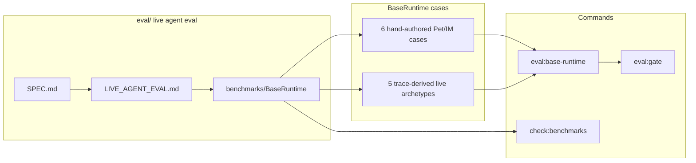

# Evaluation PLAN

状态：Active
最后更新：2026-06-23
Owner：Evaluation maintainers

## Current Status

`eval/` 已收窄为 live agent eval benchmark 目录。历史 trace replay 已从 `eval` 命名空间分离，由 `src/replay` / `xiaoba replay --trace` / `npm run replay:trace` 承担。

当前只保留 BaseRuntime live agent eval：

- `eval/benchmarks/BaseRuntime/benchmark.json`
- `eval/benchmarks/BaseRuntime/runtime-benchmark.jsonl`
- `eval/benchmarks/BaseRuntime/suites/base-runtime-pet-work-loop.json`
- `eval/benchmarks/BaseRuntime/suites/trace-derived-runtime-cases.json`

当前公开 `eval:*` 命令只保留：

- `npm run eval:base-runtime`
- `npm run eval:gate`（只聚合 live agent eval benchmark）

Deterministic suite execution 已迁出 eval 命名：`test:*` 使用 `scripts/run-test-suite.ts` / `scripts/run-contract-smoke.ts`。`src/eval/gate-runner.ts` 不再包含 runtime-harness profile 或 test suite item。

Runnable replay 已收窄为 `surface_runtime` only；旧 `conversation_runner`、`agent_session` 和 `surface_adapter` replay 模式不再作为 eval/test runner 能力存在。

已删除：

- `eval/contracts/**`
- `eval/rubrics/**`
- `eval/schemas/**`
- non-live RoleArena / EngineerCat / ResearcherCat / UserCat benchmark assets
- BaseRuntime 100 条 real trace structural replay cases
- BaseRuntime high-value structural replay suite
- low-level replay suites for `conversation_runner`、`agent_session`、`surface_adapter`

## Milestones

1. M0：删除非 live eval 资产：completed。
2. M1：BaseRuntime 收成 11 条 live agent eval：completed。
3. M2：文档定义 live agent eval 准入标准：completed。
4. M3：移除泛用 `eval:run` 公开入口，让 `eval:*` 只代表 live agent eval：completed。
5. M4：`eval:gate` 只保留 live agent eval item，runtime-harness/test profile 已移出 eval gate：completed。
6. M5：`check:benchmarks` 增加 live-only guard，拒绝静态 JSONL / non-surface_runtime / non-live metadata：completed。
7. M6：删除低层 replay mode，让 accepted eval replay 只剩 `surface_runtime`：completed。
8. M7：未来 role eval 重新进入前必须按 live agent eval shape 重写：not started。

## Next Steps

1. 如果要恢复 role eval，必须新建 live case：`input + setup + replay + expected_tool_use + expected_result + verifier`。
2. 不把 historical trace regression、schema governance、source contracts、rubric-only 文件放回 `eval/`。
3. 后续真实 trace 先用 Trace Replay 复跑；进入 eval 前仍必须人工改写成 live benchmark case。

## Acceptance Criteria

- `eval/` 下不存在 `contracts/`、`rubrics/`、`schemas/`。
- `eval/benchmarks/BaseRuntime/runtime-benchmark.jsonl` 只有 11 行 live cases。
- `eval/benchmarks/BaseRuntime` 不包含 high-value structural trace replay suite。
- `EvalReplaySpec.mode` 只允许 `surface_runtime`。
- `npm run eval:base-runtime` 通过 11/11。
- `npm run eval:gate` 只聚合 live BaseRuntime eval。
- `npm run check:benchmarks` 拒绝 non-live 或 non-surface_runtime benchmark case，并确认 referenced suite case 会重新跑 runtime/agent。
- `package.json` 不暴露可运行任意 suite 的泛用 `eval:*` 命令。
- `package.json` 使用 `replay:*` 暴露历史 trace replay，使用 `eval:*` 暴露 benchmark 评测。
- `npm run eval:gate -- --profile runtime-harness` 必须失败，并提示使用 `test:contract-smoke`。

## Verification Log

- 2026-06-25：BaseRuntime Pet live fixtures now use production-valid `pet:<petId>:role-base:<case>` session keys, and `check:benchmarks` preflight validates Pet surface payloads through the production normalizer so illegal session keys fail before release eval. Verification：`npm run check:benchmarks`（1 manifest，11 cases）；`npm run eval:base-runtime`（11/11 benchmark cases，11/11 eval cases）；`npm run eval:gate`（1/1 items，11/11 cases）；`node --test -r tsx test/eval-benchmark-bridge.test.ts`（3/3）；`npm run build`；`npm test`（354/354）；`git diff --check`。

- 2026-06-23：删除低层 replay 执行能力：`EvalReplaySpec.mode` 只允许 `surface_runtime`，`runReplay` 只分派 surface runtime，`conversation_runner` / `agent_session` / `surface_adapter` replay suites、package scripts、scripted tool executor、adapter-only verifier 和旧测试已移除；observability regression proposal 不再生成 runnable replay。Verification：`npm run build`；`npm run check:benchmarks`（1 manifest，11 cases）；`npm run eval:base-runtime`（11/11 benchmark cases，11/11 eval cases）；`npm run eval:gate`（1/1 items，11/11 cases）；`npm run test:contract-smoke`（6/6 items，28/28 cases）；`node --test -r tsx test/eval-gate.test.ts test/eval-benchmark-bridge.test.ts test/eval-runner.test.ts test/provider-network-readiness-runner.test.ts`（42/42）；`npm test`（360/360）；`git diff --check`。

- 2026-06-23：切断 test/eval 执行边界：`test:*` 改用 `run-test-suite.ts` / `run-contract-smoke.ts`，`eval:gate` 只剩 BaseRuntime live benchmark item，`eval:base-runtime` 不再接受任意 `--benchmark` 路径，`check:benchmarks` 和 `runEvalBenchmark` 增加 live-only replay guard。Verification：`npm run build`；`npm run check:benchmarks`（1 manifest，11 cases）；`npm run eval:gate`（profile=live-agent-eval，1/1 items，11/11 cases）；`npm run eval:base-runtime`（11/11 benchmark cases，11/11 eval cases）；`npm run test:contract-smoke`（10/10 items，34/34 cases）；`node --test -r tsx test/eval-gate.test.ts test/eval-benchmark-bridge.test.ts test/eval-runner.test.ts`（43/43）；`npm run eval:gate -- --profile runtime-harness` 按预期失败并提示使用 `test:contract-smoke`；`npm run eval:base-runtime -- --benchmark eval/benchmarks/BaseRuntime/benchmark.json` 按预期失败；`npm test`（364/364）；`git diff --check`。

- 2026-06-23：收窄 `eval/` 为 live agent eval 目录；删除 contracts/rubrics/schemas、non-live role/static benchmark roots、BaseRuntime 100 条 structural trace regression；新增 `LIVE_AGENT_EVAL.md` 明确准入标准。Verification：`npm test`（364 passed，6 skipped）；`npm run build`；`npm run eval:base-runtime`（11/11 benchmark cases，11/11 eval cases）；`npm run eval:gate`（1/1 items，11/11 cases）；`npm run check:benchmarks`（1 manifest，11 cases）。
- 2026-06-23：强化 `eval/SPEC.md` 为 live-agent-eval-only 边界；移除公开 `eval:run` 泛用入口，并给 `eval:gate` 加 live-only guard，避免非 live suite 通过 `eval:*` 命名空间回流。Verification：`npm run eval:gate -- --profile runtime-harness` 按预期失败并提示使用 `test:contract-smoke`；`npm run eval:gate`（1/1 items，11/11 cases）；`npm run eval:base-runtime`（11/11 benchmark cases，11/11 eval cases）；`npm run test:contract-smoke`（10/10 items，34/34 cases）；`npm run check:benchmarks`（1 manifest，11 cases）；`npm run build`；`npm test`（364 passed，6 skipped）；`git diff --check`。

## Risks / Open Questions

- 旧 role 文档的历史验证记录可能仍提到删除的旧 eval commands；这些只保留为历史记录，不能作为当前命令面。
- Role eval 重新进入前必须重写为 live replay benchmark，不能直接恢复旧 deterministic/static suites。

## Status Maintenance Rules

- 修改 `eval/SPEC.md` 的 live eval 准入标准时，同步本 PLAN。
- 新增 eval case 前，先确认它会重新跑 agent/runtime。
- 不接受只审旧 JSONL 的 case 进入 `eval/`。
