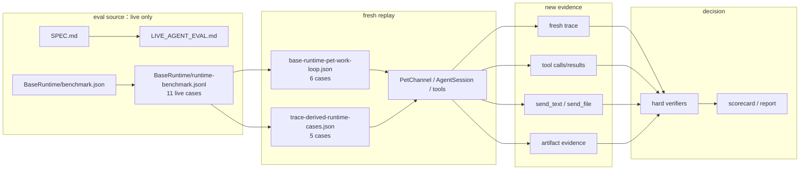
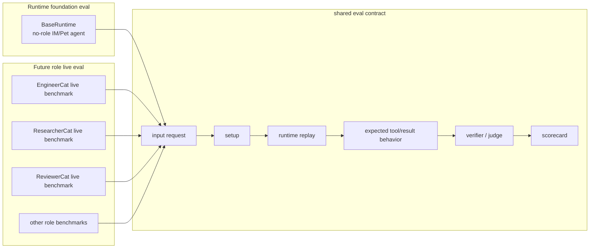

# Evaluation SPEC

状态：Active
最后更新：2026-06-23
Owner：Evaluation maintainers

## Principle

`eval/` 只做一件事：**live agent eval benchmark**。

这里的价值判断很明确：

> 对 agent 来说，真正有评测价值的是把一个用户请求交给当前 runtime/agent 重新跑一遍，再检查它实际做了什么。

普通 unit test、integration test、contract smoke、schema check、manifest preflight、historical trace replay 都有工程价值，但它们不是 live agent eval benchmark。它们不能放在 `eval/` 里，也不能用 `eval:*` 命令包装。

## Definition

一个 live agent eval case 必须满足这个闭环：

```text
user request
  + initial setup / workspace / session state
  -> replay current agent/runtime
  -> produce fresh trace / tool calls / delivery / artifacts
  -> verify behavior, result, safety and evidence
  -> emit scorecard
```

关键点是 **fresh behavior**：case 必须重新驱动当前实现。只读取旧 JSONL、旧 trace、旧 scorecard 或旧 artifact 的检查，不是 eval。

## Scope

In scope:

- `eval/benchmarks/BaseRuntime/benchmark.json`
- `eval/benchmarks/BaseRuntime/runtime-benchmark.jsonl`
- `eval/benchmarks/BaseRuntime/suites/*.json`
- future `eval/benchmarks/<Role>/` live replay benchmarks
- `npm run eval:base-runtime`
- `npm run eval:gate`

Out of scope:

- schema / contract / source governance
- rubric-only packs
- source acceptance / generated-output drift / scorecard drift
- historical trace replay / regression
- raw private logs
- static JSONL fixture suites
- unit / integration / deterministic contract smoke
- observability regression candidates or trace proposals
- generic suite runners exposed as public `eval:*` commands

这些东西如果需要，应由 owning boundary 维护：

- `test/`：unit、integration、contract smoke、deterministic runtime harness checks。
- `check:*`：manifest preflight、source checks。
- `docs/trace-replay/` + `src/replay`：历史真实用户输入复跑当前 runtime。
- `docs/observability-evidence/`：trace/event/metric/artifact evidence spec。
- role-local docs/tests：role runtime tools、candidate trace generation、focused tool checks。

## Current Architecture



当前 `eval/` 只有 BaseRuntime live agent eval benchmark。`runtime-benchmark.jsonl` 有 11 行，每一行都映射到会重新运行 `surface_runtime` replay 的 suite case。

历史 trace replay 不在 `eval/` 中实现；它由 `src/replay` / `xiaoba replay --trace` 负责。Replay 的产物可以帮助人工发现值得沉淀的 case，但不能自动进入 benchmark。

## Target Architecture



未来 role eval 可以回来，但只能以 role-owned live benchmark 回来。不能把旧 deterministic/static suite 原样恢复到 `eval/`。

## Case Contract

每个 accepted eval case 至少要定义：

- `input`：用户请求或等价 surface message。
- `setup`：workspace 文件、session state、工具环境、fixture 或前置对话。
- `replay`：重新驱动当前 agent/runtime 的方式；accepted eval source 只允许 `surface_runtime`。
- `expected_tool_use`：期望、允许、禁止的工具调用和顺序约束。
- `expected_result`：用户可见文本、文件交付、artifact、拒绝或 blocked state。
- `expected_evidence`：trace、tool result、delivery evidence、artifact manifest、state boundary。
- `verifiers`：结构化 hard verifier；需要语义判断时可加 judge，但不能替代 hard evidence。
- `budgets`：turn、tool call、token、latency 或 retry budget。

一个来自真实 trace 的 case 只有在被重写成下面形态后才可以进入 `eval/`：

```text
historical trace insight
  -> runnable task archetype
  -> input + setup + replay
  -> expected tool/result/evidence
  -> verifier
```

原始 trace 本身不能进入 `eval/`。

## Acceptance Matrix

| Asset | Accepted in `eval/` | Reason |
| --- | --- | --- |
| Live Pet/IM runtime replay benchmark | yes | 重新跑当前 agent 并验证行为 |
| Live role replay benchmark | yes, future | 必须 role-owned 且满足 case contract |
| Historical trace replay | no | 属于 `src/replay`，复跑真实输入但不做 benchmark scorecard |
| Historical trace catalog | no | 只是素材，不是 benchmark case |
| Static JSONL fixture check | no | 只审旧证据，不跑 agent |
| Schema / contract / source check | no | 属于 `test/` 或 `check:*` |
| Rubric-only file | no | 没有 replay 和 evidence |
| Observability summary/regression candidate | no | 属于观测证据或 proposal |
| Unit / integration test | no | 属于 `test/` |
| Manifest/case reference preflight | no | 属于 `check:benchmarks` |

## Command Policy

Public `eval:*` commands must run live agent eval and write scorecards under `output/eval/**` or `output/eval-gate/**`.

Current public eval commands:

```bash
npm run eval:base-runtime
npm run eval:gate
```

Allowed support command:

```bash
npm run check:benchmarks
```

`check:benchmarks` is not eval. It validates that live benchmark manifests and referenced suite cases are loadable, metadata-marked as live, and backed by replay cases that rerun the runtime/agent.

`eval:gate` only runs the live agent eval gate. Runtime harness profiles belong to `test:contract-smoke`, not eval.

Historical trace rerun uses the replay command namespace:

```bash
npm run replay:trace -- --trace logs/sessions/.../traces.jsonl
xiaoba replay --trace logs/sessions/.../traces.jsonl
```

Generic deterministic suite runners are test harness implementation details. They must not be exposed as broad public `eval:*` entrypoints.

## Current Inventory

BaseRuntime live eval has 11 cases:

- `base-runtime.im-coding-patch`
- `base-runtime.im-subagent-goal`
- `base-runtime.pet-work-loop`
- `base-runtime.delivery-no-fallback`
- `base-runtime.malformed-tool-recovery`
- `base-runtime.dangerous-command-boundary`
- `base-runtime.trace-derived.artifact-locator`
- `base-runtime.trace-derived.command-recovery`
- `base-runtime.trace-derived.path-env-recovery`
- `base-runtime.trace-derived.user-correction-latest-artifact`
- `base-runtime.trace-derived.long-work-status`

These cover default no-role XiaoBa as an IM coding agent: coding patch, subagent delegation, explicit delivery, malformed tool recovery, dangerous command blocking, artifact lookup/resend, command recovery, path/env recovery, user correction, and long-work status synthesis.

## Maintenance Rules

- New files under `eval/` must be live agent eval source or eval docs.
- New benchmark roots must include their own `SPEC.md` and explain why cases are live replay.
- Every accepted case must rerun current runtime/agent.
- Historical logs can be rerun by Trace Replay and can inspire cases, but raw logs or replay output cannot be stored as accepted eval evidence without curation.
- If a check can pass without running an agent, it belongs in `test/` or `check:*`, not `eval/`.
- If a command can run arbitrary non-live suites, it must not be published as `eval:*`.
