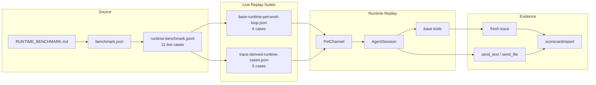
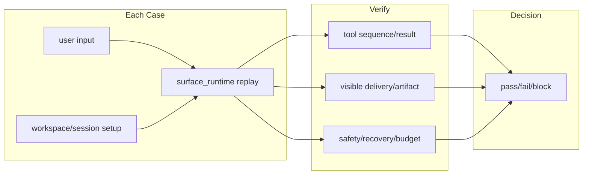

# BaseRuntime Live Agent Eval SPEC

状态：Active
最后更新：2026-06-23

## Problem

BaseRuntime 是所有 specialist role 之前的默认 runtime 能力地基。这个 benchmark 只验证一件事：无角色 XiaoBa 在 Pet/IM 场景里，收到用户请求后，能否重新跑 runtime、正确使用工具、产出证据、显式交付结果，并处理失败/危险命令/多轮追问。

## Scope

In scope:

- 11 条 live Pet/runtime eval cases。
- `surface_runtime` replay。
- scripted model responses。
- workspace/session fixtures。
- tool use、delivery evidence、artifact evidence、safety/recovery hard verifiers。

Out of scope:

- historical trace structural replay。
- static JSONL fixture benchmark。
- raw private IM logs。
- schema/contracts/rubrics governance。
- specialist role benchmark。

## Current Architecture

## Target Architecture

新增 case 必须保持 live eval shape：`input + setup + replay + expected_tool_use + expected_result + verifier`。

## Data Contracts

- Manifest：`benchmark.json`
- Case ledger：`runtime-benchmark.jsonl`
- Case count：11
- Case kind：`live_pet_runtime_case`
- Suites：
  - `suites/base-runtime-pet-work-loop.json`
  - `suites/trace-derived-runtime-cases.json`
- Command：`npm run eval:base-runtime`

Every JSONL row must include:

- `case_id`
- `name`
- `eval_suite`
- `eval_case_ids`
- `benchmark_case_kind=live_pet_runtime_case`
- `task_prompt`
- `verifier_ids`
- `budgets`

Pet `surface_runtime` suite payloads must use production-valid session keys. Base runtime cases use `pet:<petId>:role-base:<case-suffix>` so they remain isolated per case while still exercising the maintained default-role PetChannel path.

## Boundaries

- Real trace patterns may inspire synthetic live cases, but raw/historical trace rows do not live here.
- User-visible output must use explicit `send_text` or `send_file`; channel final fallback is not accepted as delivery evidence.
- Role-specific eval must live in a future role-owned live benchmark root only after it is rewritten as live replay.
