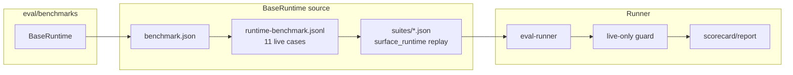
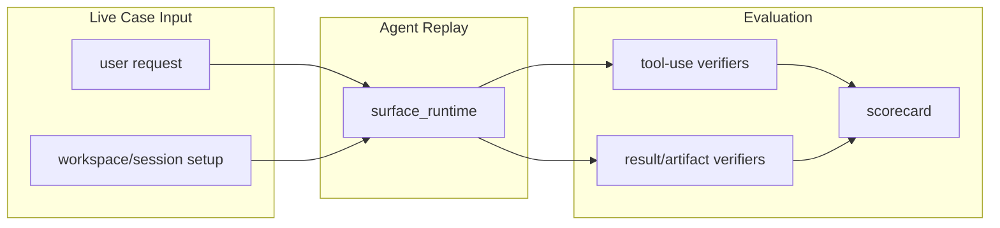

# Live Benchmarks SPEC

状态：Active
最后更新：2026-06-23

`eval/benchmarks/` 只保存 live agent eval benchmark source。

## Current Architecture

当前只有 `BaseRuntime`。被删除的 RoleArena / EngineerCat / ResearcherCat / UserCat 静态或混合 benchmark 不能直接回到这里。

## Target Architecture

未来新增 benchmark root 必须是 live replay benchmark。静态 trace fixtures、schema contracts、rubric packs 和 observability regression candidates 不属于这里。

## Contract

Accepted benchmark case fields:

- `case_id`
- `name`
- `eval_suite`
- `eval_case_ids`
- `benchmark_case_kind`
- `raw_user_text_included=false`
- `task_prompt`
- `verifier_ids`
- `budgets`

Accepted suite case requirement:

- 必须有 `replay`。
- replay 必须重新驱动 runtime/agent。
- replay 必须是 `surface_runtime`。
- verifier 必须检查 tool use 或最终结果，不能只检查 JSONL 格式。

`runEvalBenchmark` 和 `check:benchmarks` 都会执行 live-only guard；不满足上述条件的 benchmark 不能作为 eval 运行，也不能通过 preflight。
