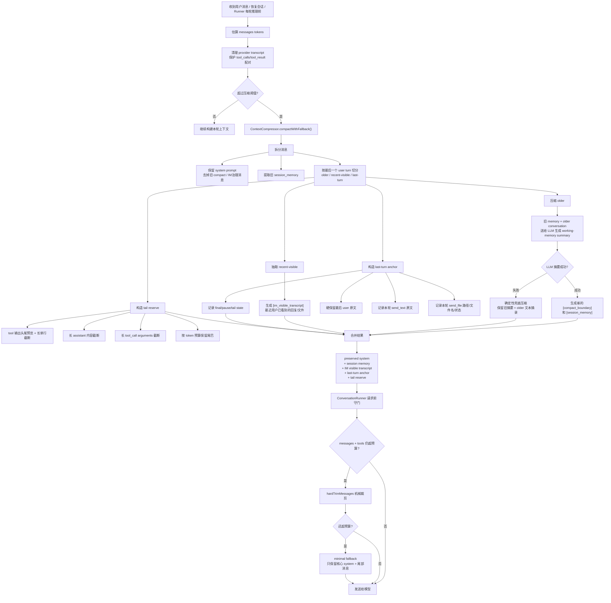

# ContextCompressor Harness

这个 harness 描述 IM 助手 runtime 里的 context 压缩机制：什么时候触发、怎么拆分、怎么摘要、如何保留用户已经看到的输出、失败时怎么兜底，以及发送模型前最后如何守门。

## Runtime Flow



## Compacted Shape

```text
原始历史：
system + 很多旧对话 + 多轮 IM 输出 + 最后一轮工具链

压缩后：
system
[compact_boundary] 说明压缩发生过
[session_memory] 全部旧轮压缩后的工作记忆
[im_visible_transcript] 有上限的近期用户已见 IM 输出窗口
[last_turn_anchor] 最后一轮的用户原文、已发送文本、已发送文件、收束状态
最后一轮 user 原文
最后一轮 tail reserve（工具调用 / 工具结果 preview / final assistant，按 token 预算保留）
```

## Layer Reasons

### `[session_memory]` 全部旧轮压缩

目的：保留任务连续性。

原因：
- 旧轮完整 transcript 太贵，必须压成 working memory。
- 这里承载用户目标、关键事实、已完成事项、失败尝试、下一步状态。
- LLM 摘要失败时用确定性兜底，避免一次摘要 API 失败导致 IM 会话不可继续。

### `[im_visible_transcript]` 有上限的近期用户可见输出

目的：保留对话连续性。

原因：
- IM 助手最怕忘记自己已经对用户说过什么，然后重复发送、改口或前后矛盾。
- 这层只记录近期用户已经看到的结果，例如 assistant final reply、`send_text` 原文、`send_file` 文件记录。
- 这层必须是 bounded rolling window，不能保存全量用户可见历史。
- 旧的 `[im_visible_transcript]` 和 `[last_turn_anchor]` 会在下一次压缩时送入 `[session_memory]` 摘要输入，然后被新的窗口替换。
- 它不保存完整工具过程，只保存用户侧事实。

### `[last_turn_anchor]` 最后一轮锚点

目的：保护当前任务意图和本轮副作用。

原因：
- 最后一轮 user 原文是当前意图的根，不能被工具输出挤掉。
- 本轮 `send_text` 原文和 `send_file` 路径/文件名/状态是外部副作用，必须硬保留。
- 如果最后没有 final assistant，也要记录 tail state，让下一轮知道当前停在哪里。

### Tail Reserve 最后一轮尾巴预留

目的：保留必要证据，但不让证据淹没锚点。

原因：
- 最后一轮可能包含巨大 stdout、日志、文件内容或失败堆栈。
- 这些内容有用，但优先级低于用户原文和用户已见输出。
- 因此 tail 按 token 预算保留，工具结果只给头尾预览、长度、行数和必要片段。

### `ConversationRunner.ensurePromptBudget()` 请求前守门

目的：最后一道防线。

原因：
- 压缩器关注语义结构，仍可能遇到极端输入或工具定义过大。
- Runner 会把 tool definitions 的 token 也算进去。
- 如果仍超预算，执行机械裁剪；再不够时进入 minimal fallback，避免 prompt 过长直接请求失败。

## Core Contract

- 旧消息变成 `[session_memory]`，保留任务目标、事实、已做工作、失败尝试、下一步状态。
- 近期用户可见输出进入 `[im_visible_transcript]`，防止重复发送、重复解释或改口；旧窗口滚入 `[session_memory]`，避免无限增长。
- 最后一轮进入 `[last_turn_anchor]`，其中最后 user 原文、`send_text` 原文、`send_file` 路径/文件名/状态是硬保留事实。
- 工具输出不全量进入上下文，只保留头尾预览、长度、行数和必要片段。
- 最后一轮尾巴按 token 预算保留，普通 tool result 不能挤掉 anchor。
- LLM 摘要失败时走确定性兜底压缩，不阻塞当前会话。
- 真正请求模型前，`ConversationRunner` 还会用硬预算守门，避免 prompt 过长。
- compact system message 是持久状态的一部分。`SessionStore` 可以过滤普通 system prompt，但必须保留 `[compact_boundary]`、`[session_memory]`、`[im_visible_transcript]`、`[last_turn_anchor]` 这些压缩治理消息。
- 发送给 provider 的 transcript 必须满足工具调用不变量：不存在孤立 tool result，不存在缺失 result 的 assistant tool_calls，也不能在硬裁剪时拆散同一组 tool call/result。

## Current Implementation Points

- `src/core/context-compressor.ts`
  - `compactWithFallback()` 是外部优先调用入口。
  - `compact()` 负责 LLM working-memory 摘要。
  - `compactDeterministic()` 负责摘要失败时的机械兜底。
  - `buildVisibleTranscriptMessage()` 负责最近 IM 可见事实。
  - `buildLastTurnAnchorMessage()` 负责最后一轮锚点。
  - `buildLastTurnTail()` 负责最后一轮 token 预算尾巴。
  - `slimMessageForRetention()` 负责工具输出、长文本和长参数瘦身。
- `src/core/agent-session.ts`
  - 恢复会话和处理用户消息前触发压缩检查。
- `src/core/conversation-runner.ts`
  - 每轮推理前把 tool definitions 的 token 也纳入预算。
  - 请求模型前还有 `ensurePromptBudget()` 硬守门。
  - 请求前清理 tool transcript 形状，硬裁剪按合法消息组处理。
  - 工具参数坏 JSON 走工具层错误结果，返回给模型继续修复，而不是让 runner 直接抛错。
- `src/utils/session-store.ts`
  - 持久化 compact system message 前缀，保证压缩记忆在进程退出和 TTL cleanup 后仍可恢复。
- `src/utils/memory-finalizer.ts`
  - TTL cleanup / session close 时从 context 中抽取稳定长期记忆。
  - 写入人类可读的 `memory/sessions/<session-key-hash>/MEMORY.md`。
  - 不参与 restore 默认注入；长期 memory 以后只允许显式或按需 recall。
- `src/core/message-session-manager.ts`
  - TTL cleanup 调用 `session.cleanup({ checkWakeup: true, finalizeMemory: true })`。
- `src/core/agent-session.ts`
  - restore 时只恢复 `SessionStore` transcript。
  - `/exit` / `summarizeAndDestroy()` 会触发长期 memory 候选提取。
- `src/commands/chat.ts`
  - 交互式 CLI 启动时 restore，退出时触发 `session_close` memory finalization。
  - 单次 CLI message 结束时也会 cleanup + finalization，避免 CLI 入口漏归档。
- `src/utils/prompt-manager.ts`
  - `behavior.md` 采用全局 + 角色合并语义，避免角色 behavior 覆盖全局用户笔记。

## Current Score And Gap

当前 context 管理大约是 **8.8 / 10**。

已经比较稳的部分：

- 有压缩和确定性兜底。
- 有 tail reserve、last-turn anchor、IM visible transcript。
- 用户已见输出和工具过程分开保存，避免重复发送或前后矛盾。
- 压缩记忆已经能 save/restore。
- 请求前 hard trim 已经保护 tool_calls/tool_result 配对。
- TTL cleanup 和交互式 CLI 退出会更新长期 Markdown memory。
- restore 不再默认注入长期 memory；`data/sessions` 是恢复上下文主路径。
- 全局 behavior 和角色 behavior 已合并。

剩下的空间主要在质量、治理和长期记忆晋升：

| Gap | 权重 | 为什么值得修 |
| --- | ---: | --- |
| Memory extraction quality | 0.4 | 第一版 finalizer 是 deterministic extraction，稳定可测，但语义抽取质量还比较初级。 |
| Compaction quality audit | 0.3 | 还缺 validator 证明每次压缩/归档保留了关键事实、用户已见输出和未完成承诺。 |
| Memory recall UX | 0.2 | 长期 `MEMORY.md` 已改为按需存储后，还需要明确显式 recall 命令或工具入口。 |
| Memory extraction quality | 0.2 | 第一版长期记忆提取应保守，只接受明确偏好、习惯、默认行为和 remember-style 表达。 |
| Token budget calibration | 0.1 | 估算能防炸，但还没有基于真实 provider usage 按模型和工具集动态校准。 |

## Optimization Roadmap

### Prompt And Memory Directory Contract

推荐把 prompt、behavior、memory 三类文件分开看：

```text
prompts/
  system-prompt.md              # 全局默认 system prompt
  behavior.md                   # 全局稳定用户偏好

roles/
  <role>/
    role.json                   # promptFile 指向角色 system prompt
    prompts/
      <role>-system-prompt.md   # 角色 system prompt
      behavior.md               # 角色专属稳定偏好

memory/
  sessions/
    <session-key-hash>/
      MEMORY.md                   # 按 session/person 维度的长期记忆，按需 recall
```

职责边界：

- `system-prompt.md`：长期角色契约、工具使用边界、能力声明；人维护，不由 runtime 自动改。
- `behavior.md`：长期稳定笔记和偏好；可以由 remember skill 在用户明确授权时改。它会被 prompt 读取，所以内容应该像“以后怎么做”的笔记，而不是运行时流水账。
- `memory/`：人类可读的长期记忆笔记；主要在 TTL cleanup、显式结束/归档、session close 这类生命周期边界从 context 中保守提取，默认不进入 prompt。

当前 `PromptManager.getBehaviorPrompt()` 是 merge 语义：全局 `prompts/behavior.md` 先加载，角色 `roles/<role>/prompts/behavior.md` 再追加。这样 remember skill 写入全局 behavior 后，在 EngineerCat 这类有角色 behavior 的场景里仍会生效。

### Phase 1: Session Context Restore + Markdown Long-Term Memory

每个 session key 在产品语义上对应一个人或一个稳定对话对象。因此恢复上下文和长期记忆要分开：

`data/sessions/*` 是恢复上下文主路径。它保存 provider-visible transcript 和 compact system messages，用来继续同一个会话。

`[session_memory]` 仍是活跃期 provider context 的工作记忆。`memory/sessions/*/MEMORY.md` 是长期 Markdown 笔记，只保存稳定偏好、习惯、默认工作方式、称呼和用户明确要求记住的事实。

目标行为：

- 活跃期 compactor 只更新 compact system messages，不直接改长期 memory。
- save/restore 持久化 compact message projection，保证进程重启和 TTL 前恢复可用。
- TTL cleanup、`summarizeAndDestroy()`、显式归档时运行 `MemoryFinalizer`，只从用户消息和 compact memory 中抽取长期价值明确的记忆候选。
- restore 只恢复 `data/sessions`，不默认加载 `MEMORY.md`。
- 长期 memory 未来通过显式命令、工具或用户请求按需 recall，注入时应使用小而相关的 `[long_term_memory]`。

第一版 Markdown sections 保持小而实用：

- Stable Preferences：语言、风格、默认选择。
- Work Habits：常用工具、工作方式、稳定习惯。
- Instructions：用户明确要求以后遵守的规则。
- Facts：用户明确要求记住的稳定事实。

建议不要把长期 memory 混进 `data/sessions/` 的 JSONL transcript。`data/sessions/` 是消息账本，适合保存 provider-visible / replayable message；memory 是人类可读的长期笔记，应该独立成根目录 `memory/`：

```text
memory/
  sessions/
    <session-key-hash>/
      MEMORY.md                # session/person 长期记忆，Markdown 主存储
```

第一阶段只实现 `sessions/<session-key-hash>/MEMORY.md`，并且只在 TTL cleanup / 显式归档时写入。不要引入 project/user 多层存储；当前产品语义里一个 session 就是一个人。

### Phase 2: Memory Tier Contract

把每一层记忆的 owner、生命周期和用途写成明确 contract。

| Tier | Storage | Lifetime | Purpose |
| --- | --- | --- | --- |
| Turn buffer | in-memory messages | 当前 run | 保留精确工具调用循环和 provider response 状态。 |
| Recent tail | provider transcript | 当前 session | 高保真最近几轮，必须保持合法 tool group。 |
| Last-turn anchor | compact system message | 当前 session + persisted | 锚住最后一轮用户意图、已发送文本/文件和收束状态。 |
| Working memory | compact system message | 当前 session + persisted | 活跃期会话级 working context。 |
| Long-term memory | `memory/sessions/*/MEMORY.md` | 跨 session，按需 recall | 这个 session/person 的稳定偏好、习惯、默认行为和明确记住的事实。 |

晋升规则：

- raw tool output、失败命令、未解决任务、下一步待办默认不进入长期 memory。
- “以后/默认/记住/我喜欢/我习惯/不要”这类明确稳定表达可以进入长期 memory。
- 模型推断出的偏好默认不写入；第一版宁可少记。
- 长期 memory 不默认进入 prompt，必须显式或按需 recall。

### Phase 2.5: `behavior.md` Boundary

`behavior.md` 不是 runtime memory store。它更像用户/角色笔记本：表达稳定、静态、低频变化的行为偏好，例如工程品味、沟通口味、边界感、默认工作目录规则。

`behavior.md` 不应该保存：

- 当前任务目标。
- 本 session 已完成事项。
- 已发送给 IM 用户的文本或文件。
- 某次失败命令和不要重复的尝试。
- 临时文件路径、产物路径、case 进度。
- 需要过期、覆盖、去重、回滚的事实。

正确分工：

| Source | Nature | Runtime position |
| --- | --- | --- |
| `system-prompt.md` | 基础角色/能力边界 | 长期静态 prompt |
| `behavior.md` | 用户/角色稳定笔记和偏好 | 长期静态 prompt |
| `[session_memory]` | 当前 session working state | 活跃期 compact system projection |
| `memory/sessions/*/MEMORY.md` | session/person 长期记忆 | on-demand recall，不默认加载 |
| `[im_visible_transcript]` | 用户已经看到的 IM 副作用窗口 | provider-visible compact message |
| recent transcript tail | 最近原文和合法 tool groups | provider-visible messages |

自动 compaction 不能直接改 `behavior.md`。`behavior.md` 只接受全局静态行为笔记；`memory/` 只在生命周期边界保守写入 session/person 长期笔记。

### Phase 2.6: Remember Skill Split

当前 `skills/remember/remember.py` 会把用户要求记住的内容直接追加到根 `prompts/behavior.md`。这符合“behavior 是笔记”的方向，但不适合写 session memory。

角色模式下已经合并全局 behavior 和角色 behavior。因此当前 remember skill 固定写根 behavior 时，内容仍会进入角色会话；未来如果要区分全局/角色笔记，再增加显式 scope。

建议先不要把普通 remember skill 扩展成“主动写 memory”。它的默认职责应该是写 `behavior.md` 笔记。`memory/sessions/*/MEMORY.md` 由 session 生命周期被动维护，用来记录当前 session/person 的长期偏好和习惯：

```text
remember behavior
  -> prompts/behavior.md 或 roles/<role>/prompts/behavior.md
  -> 全局或角色级静态行为偏好

session memory finalization
  -> memory/sessions/<session-key-hash>/MEMORY.md
  -> 当前 session/person 的长期偏好、习惯、默认行为和明确记住的事实
```

第一阶段不要让 remember skill 写 session working memory。session working memory 仍由 context compressor 在活跃期维护 compact projection；长期 Markdown memory 由 TTL cleanup / 显式归档时从 context 中保守提取。

推荐规则：

- “以后都用中文回复”“叫我 X”“默认工作目录用 Y” -> 可以进入 `memory/sessions/*/MEMORY.md`。
- “我常用的项目是 X”“我偏好 pnpm”“我的 GitHub 用户名是 X” -> 可以进入 `memory/sessions/*/MEMORY.md`。
- “这次任务已经跑到 step 3”“刚才 npm test 失败” -> 只留在 `data/sessions` / `[session_memory]`。
- “这个 repo 的启动命令是 X” -> 只有用户表达成稳定默认事实时才进入 `MEMORY.md`。

实现建议：

- 给 `remember.py` 保持默认写 behavior note，不直接写 session working memory。
- PromptManager 保持全局 behavior + 角色 behavior 合并。
- 后续若增加显式 recall，读取 `MEMORY.md` 后只注入少量相关条目。

### Phase 2.7: Memory Finalizer

`MemoryFinalizer` 是长期 Markdown memory 的写入组件。它不参与每轮推理，只在生命周期边界运行。

触发时机：

- session TTL cleanup。
- 用户显式结束会话 / `/summarize` / `summarizeAndDestroy()`。
- 进程退出时的 best-effort cleanup。
- 管理命令手动归档某个 session。

输入：

- 已持久化的 session JSONL。
- 最新 `[session_memory]`。
- 最新 `[im_visible_transcript]`。
- 最新 `[last_turn_anchor]`。
- 最近合法 tail groups。

输出：

- `memory/sessions/<session-key-hash>/MEMORY.md`。

这能保留“记忆是被动沉淀”的模型：活跃期不把每个临时状态都写成长期事实；只有会话自然结束、过期或用户要求归档时，才把明确稳定的偏好和习惯固化。

当前 TTL cleanup 不只 `saveContext()`，还会在保存 transcript 的同时更新长期 Markdown memory：

```text
MessageSessionManager TTL cleanup
  -> session.cleanup({ checkWakeup: true, finalizeMemory: true })
      -> optional wakeup check
      -> SessionStore.saveContext(key, messages)
      -> MemoryFinalizer.finalizeSession(key, messages)
      -> clear in-memory messages
```

要求：

- `SessionStore.saveContext()` 仍然是恢复当前会话的主路径。
- `MemoryFinalizer` 写入失败不能阻断 transcript 保存。
- `MemoryFinalizer` 必须使用 session key hash，不把 IM 用户 id / 群 id 明文直接当文件名。
- TTL finalization 是长期记忆落盘，不应把 `MEMORY.md` 立刻注入当前已结束的 in-memory session。
- 下一次同 key restore 时只恢复 `SessionStore` transcript；长期 memory 仍保持 on-demand。

### Phase 2.8: Channel Lifecycle Triggers

TTL 不是所有入口都有的全局机制。当前 60 分钟默认 TTL 来自 `MessageSessionManager`，主要覆盖消息/IM 型通道：

| Entry | Uses `MessageSessionManager` | TTL behavior |
| --- | --- | --- |
| Feishu | yes | 默认 60 分钟，可由 `feishu.sessionTTL` 配置覆盖。 |
| Weixin | yes | 默认 60 分钟。 |
| Pet channel | yes | 默认 60 分钟。 |
| CLI chat | no | 没有空闲 TTL；退出、`exit/quit`、`/summarize` 或进程清理时保存/总结。 |
| AutoDev / role workers | no | 以任务完成、失败、worker cleanup 作为生命周期边界。 |

因此长期 memory finalization 不能只绑定 TTL。推荐触发矩阵：

- IM/message channel：TTL cleanup 是主触发，显式结束/归档是补充触发。
- CLI interactive：用户退出、`summarizeAndDestroy()`、进程退出 best-effort 是触发；当前交互式 CLI 已接入 restore 和 `session_close` finalization。
- 单次 CLI message：本轮结束后 cleanup，并触发 `session_close` finalization。
- Worker/task runner：任务完成或失败时触发 task/session finalization。

这条规则避免把 IM 的 60 分钟空闲模型误套到所有 runtime。TTL 是 IM 会话生命周期，不是 memory 的唯一生命周期。

### Restore Fidelity Contract

TTL 后同 key 用户再次发消息时，恢复的是“可继续对话的 provider context”，不是 TTL 前内存对象的逐字节快照，也不是长期 memory 的默认注入。

当前恢复路径：

```text
SessionStore.loadContext(key)
  -> AgentSession.pendingRestore
  -> AgentSession.init()
      -> 重新构建 system prompt / surface prompt
      -> append persisted compact messages and transcript
      -> 如果超过阈值，再触发 compaction
```

会恢复：

- 非 system transcript：user / assistant / tool messages。
- compact system messages：`[compact_boundary]`、`[session_memory]`、`[im_visible_transcript]`、`[last_turn_anchor]`。
- 已持久化的 tool_calls/tool_result transcript，只要保存前 transcript 合法。

不会逐字节恢复：

- 普通 system prompt；它会按当前 `PromptManager`、当前日期、当前角色和当前平台重新生成。
- surface prompt；Feishu/Weixin/Pet 等 surface system message 会重新注入。
- transient context：skills list、subagent status、runner hint、soft check、`__injected` context。
- in-memory runtime state：busy、interrupt flag、active skill turn scope、wakeup callback、lastActiveAt。
- 保存后如果恢复时上下文过大，`init()` 可能立即再压缩一次。
- `memory/sessions/*/MEMORY.md`：长期 memory 默认不加载，未来只能通过显式 recall 或工具按需注入。

因此 contract 应该是：

- 语义连续性尽量一致。
- provider-visible transcript 合法。
- compact memory / visible transcript / last-turn anchor 持久保留。
- runtime prompt 和 transient 状态允许重建，不承诺 byte-for-byte identical。

### Phase 3: Compaction Quality Gate

每次压缩后先跑 validator，过了再接受新 transcript。

最低校验：

- 最新 user request 被保留。
- 已经发给用户的 assistant 输出被保留。
- tool_call/tool_result 组没有被拆坏。
- protected tail 里的文件路径、命令失败、产物路径仍能找到。
- 未完成承诺和未解决问题仍在 memory 里。
- token 估算低于目标预算，并保留 output headroom。

失败策略：

- LLM compaction 失败时先用 stricter repair prompt 重试一次。
- repair 失败后走 deterministic compaction。
- 如果 deterministic 也不满足质量门，但原 transcript 仍低于 provider budget，则保留原 transcript。

### Phase 4: Token Budget Calibration

记录每次 provider call 的真实 usage，并按 provider/model/toolset 校准估算。

建议预算桶：

- system/developer instructions。
- tool definitions。
- structured memory projection。
- recent transcript tail。
- output headroom。
- provider overhead safety margin。

目标不是完美计数，而是减少 emergency hard trim，避免因为估算过悲观而过早丢掉有价值的 tail。

### Phase 5: Observability, Replay, And Rollback

新增 compaction audit log。建议 JSONL，每条记录足够便宜、可 grep、可回放。

建议字段：

- session key hash、compaction id、timestamp。
- compactor 使用的 provider/model。
- 压缩前后 token estimate。
- 被摘要的 message range。
- structured memory diff。
- validator 结果和 fallback reason。
- pre/post compact prefixes、protected tail 数量。

再补一个 replay helper：加载保存过的 transcript，执行 compaction，验证不变量，并把 memory diff 和 golden expectation 对比。

## Proposed Structured Memory Shape

```ts
interface StructuredSessionMemory {
  version: 1;
  sessionKeyHash: string;
  updatedAt: string;
  currentTask?: {
    goal: string;
    status: "active" | "blocked" | "paused" | "done";
    constraints: string[];
    nextSteps: string[];
  };
  facts: Array<{
    id: string;
    kind: "user_preference" | "project_fact" | "decision" | "constraint";
    text: string;
    sourceTurnId?: string;
    confidence: number;
    updatedAt: string;
  }>;
  artifacts: Array<{
    pathOrUrl: string;
    kind: "file" | "command" | "test" | "external_output";
    summary: string;
    sourceTurnId?: string;
  }>;
  commitments: Array<{
    text: string;
    status: "open" | "done" | "blocked";
    sourceTurnId?: string;
  }>;
  hazards: Array<{
    text: string;
    severity: "info" | "warning" | "error";
    sourceTurnId?: string;
  }>;
}
```

这个 schema 应该刻意朴素。价值不在“聪明”，而在可 diff、可校验、可迁移。

## Acceptance Tests

- save/restore 保留 compact memory prefixes 和 structured memory。
- CLI 交互式退出会更新 `memory/sessions/*/MEMORY.md`。
- restore 不默认注入长期 memory；`data/sessions` 是恢复上下文主路径。
- PromptManager 会合并全局 `prompts/behavior.md` 和角色 `roles/<role>/prompts/behavior.md`。
- fuzz transcript 不产生孤立 tool result 或未完成 assistant tool_calls。
- 工具参数坏 JSON 返回模型可见的 tool error，不让 runner crash。
- compaction validator 会拒绝丢掉最新用户请求、用户已见输出、改动文件路径或未完成承诺的摘要。
- 长会话 golden fixture 经过多次压缩后，仍保留任务目标、关键决策、文件路径和下一步。
- usage calibration 在 replay fixture 上减少 hard trim 次数，同时不超过配置的 context budget。

## Non-goals For Next Iteration

- 结构化 session memory 稳定前，不引入 vector search 或复杂 semantic long-term memory。
- 不允许 compaction 静默写入 cross-session project memory。
- 默认不保存完整 tool output；只晋升 concise meaning、id、path 和用户可见后果。
