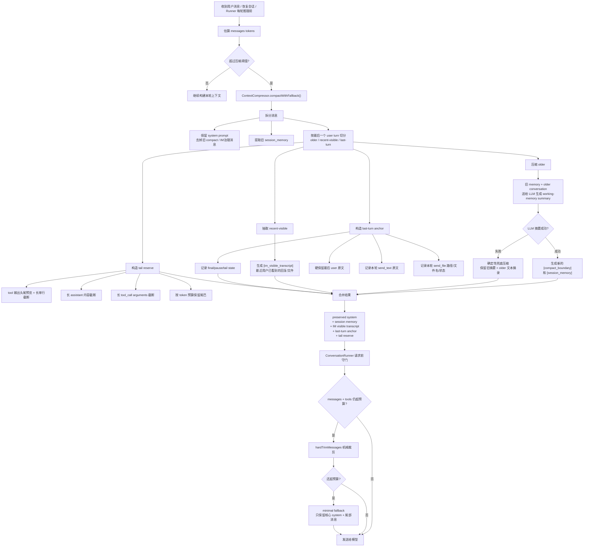

# ContextCompressor Harness

这个 harness 描述 IM 助手 runtime 里的 context 压缩机制：什么时候触发、怎么拆分、怎么摘要、如何保留用户已经看到的输出、失败时怎么兜底，以及发送模型前最后如何守门。

## Runtime Flow



## Compacted Shape

```text
原始历史：
system + 很多旧对话 + 多轮 IM 输出 + 最后一轮工具链

压缩后：
system
[compact_boundary] 说明压缩发生过
[session_memory] 全部旧轮压缩后的工作记忆
[im_visible_transcript] 有上限的近期用户已见 IM 输出窗口
[last_turn_anchor] 最后一轮的用户原文、已发送文本、已发送文件、收束状态
最后一轮 user 原文
最后一轮 tail reserve（工具调用 / 工具结果 preview / final assistant，按 token 预算保留）
```

## Layer Reasons

### `[session_memory]` 全部旧轮压缩

目的：保留任务连续性。

原因：
- 旧轮完整 transcript 太贵，必须压成 working memory。
- 这里承载用户目标、关键事实、已完成事项、失败尝试、下一步状态。
- LLM 摘要失败时用确定性兜底，避免一次摘要 API 失败导致 IM 会话不可继续。

### `[im_visible_transcript]` 有上限的近期用户可见输出

目的：保留对话连续性。

原因：
- IM 助手最怕忘记自己已经对用户说过什么，然后重复发送、改口或前后矛盾。
- 这层只记录近期用户已经看到的结果，例如 assistant final reply、`send_text` 原文、`send_file` 文件记录。
- 这层必须是 bounded rolling window，不能保存全量用户可见历史。
- 旧的 `[im_visible_transcript]` 和 `[last_turn_anchor]` 会在下一次压缩时送入 `[session_memory]` 摘要输入，然后被新的窗口替换。
- 它不保存完整工具过程，只保存用户侧事实。

### `[last_turn_anchor]` 最后一轮锚点

目的：保护当前任务意图和本轮副作用。

原因：
- 最后一轮 user 原文是当前意图的根，不能被工具输出挤掉。
- 本轮 `send_text` 原文和 `send_file` 路径/文件名/状态是外部副作用，必须硬保留。
- 如果最后没有 final assistant，也要记录 tail state，让下一轮知道当前停在哪里。

### Tail Reserve 最后一轮尾巴预留

目的：保留必要证据，但不让证据淹没锚点。

原因：
- 最后一轮可能包含巨大 stdout、日志、文件内容或失败堆栈。
- 这些内容有用，但优先级低于用户原文和用户已见输出。
- 因此 tail 按 token 预算保留，工具结果只给头尾预览、长度、行数和必要片段。

### `ConversationRunner.ensurePromptBudget()` 请求前守门

目的：最后一道防线。

原因：
- 压缩器关注语义结构，仍可能遇到极端输入或工具定义过大。
- Runner 会把 tool definitions 的 token 也算进去。
- 如果仍超预算，执行机械裁剪；再不够时进入 minimal fallback，避免 prompt 过长直接请求失败。

## Core Contract

- 旧消息变成 `[session_memory]`，保留任务目标、事实、已做工作、失败尝试、下一步状态。
- 近期用户可见输出进入 `[im_visible_transcript]`，防止重复发送、重复解释或改口；旧窗口滚入 `[session_memory]`，避免无限增长。
- 最后一轮进入 `[last_turn_anchor]`，其中最后 user 原文、`send_text` 原文、`send_file` 路径/文件名/状态是硬保留事实。
- 工具输出不全量进入上下文，只保留头尾预览、长度、行数和必要片段。
- 最后一轮尾巴按 token 预算保留，普通 tool result 不能挤掉 anchor。
- LLM 摘要失败时走确定性兜底压缩，不阻塞当前会话。
- 真正请求模型前，`ConversationRunner` 还会用硬预算守门，避免 prompt 过长。

## Current Implementation Points

- `src/core/context-compressor.ts`
  - `compactWithFallback()` 是外部优先调用入口。
  - `compact()` 负责 LLM working-memory 摘要。
  - `compactDeterministic()` 负责摘要失败时的机械兜底。
  - `buildVisibleTranscriptMessage()` 负责最近 IM 可见事实。
  - `buildLastTurnAnchorMessage()` 负责最后一轮锚点。
  - `buildLastTurnTail()` 负责最后一轮 token 预算尾巴。
  - `slimMessageForRetention()` 负责工具输出、长文本和长参数瘦身。
- `src/core/agent-session.ts`
  - 恢复会话和处理用户消息前触发压缩检查。
- `src/core/conversation-runner.ts`
  - 每轮推理前把 tool definitions 的 token 也纳入预算。
  - 请求模型前还有 `ensurePromptBudget()` 硬守门。
