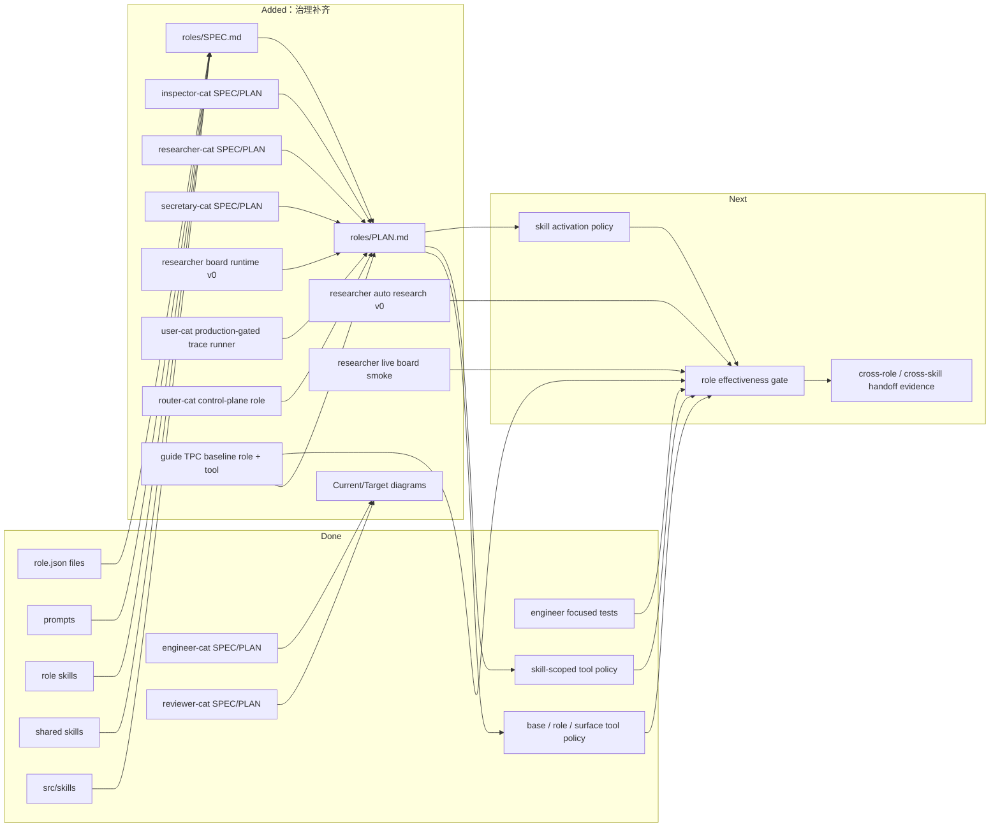

# Roles And Skills PLAN

状态：Active
最后更新：2026-06-27
Owner：Policy maintainers

本文维护 `roles/` + `skills/` 的策略层执行计划。`roles/SPEC.md` 定义 Roles & Skills 顶层模块架构和边界；各角色目录继续维护自己的 `SPEC.md` 和 `PLAN.md`。

## Current Status

2026-06-07 追加：Sub-agent dispatch 现在使用 `role_name` / `skill_name` 二选一契约：只传 `skill_name` 表示当前/继承 role 的明确后台 skill；只传 `role_name` 表示跨 role 派遣，由子智能体加载目标 role 后通过 `skill` 工具自行选择 role-local skill。`task_description` / `user_message` 仍是必填。

ResearcherCat 现在有面向 CLI 用户的 `--role researcher` 推荐别名；RoleResolver 会把它解析到 canonical role id `researcher-cat`，并沿用同一套 role-aware ToolManager 工具注入。

`roles/` 当前包含八个长期角色：`engineer-cat`、`inspector-cat`、`reviewer-cat`、`researcher-cat`、`secretary-cat`、`router-cat`、`user-cat` 和 `guide`。这些角色都有角色级 SPEC/PLAN；`inspector-cat` 保留 runtime triage / evidence forensics / issue router 的角色边界和 `analyze_log` 取证工具，`analyze_log` 会输出 `summary.signalQuality`、`summary.recommendedIntakeAction` 和 `issueProfiles[]`。旧 Inspector hook executor、hook API、独立 runtime auto-start、Dashboard Inspector config 和 `INSPECTOR_*` / `MYSQL_*` example config 已暂停，等待 Inspector refactor 重新定义 intake/runtime/config 合同。`engineer-cat`、`inspector-cat`、`reviewer-cat`、`researcher-cat`、`secretary-cat` 和 `user-cat` 已有 README、role.json、prompt 和 role-local skills；`router-cat` 已有 README、role.json、prompt 和窄 base tool policy，但没有 role-local skills 或 role-specific runtime tools。ToolManager 已支持 base / role / surface 三层工具注册，role config 可以通过 `inheritBaseTools`、`baseToolAllowlist`、`baseToolDenylist` 控制 base tool 继承；现在还支持 `toolVisibility.mode:"skill_scoped"`、`skillToolsetAliases` 和 `confirmedToolGate`。SecretaryCat 已关闭 base tool 继承并只 allowlist `skill`，同时声明 skill-scoped Feishu toolsets，让默认 provider-visible tools 只剩 `skill + auth`，由 domain skills 激活 calendar/message/task/mail/minutes/docs/drive/sheets/base 等 scoped tools；UserCat 已关闭 base tool 继承并只 allowlist read/search/skill helpers，新增 `xiaoba-cli-product-test` skill 用于把短产品试用需求转成 candidate trace run，且 `user_trace_run` 默认通过 Dashboard Chat/Pet 原生入口写 native pet/chat evidence；RouterCat 已关闭 base tool 继承并只 allowlist subagent 控制工具与只读 read/search helpers。`engineer-cat`、`inspector-cat`、`reviewer-cat`、`researcher-cat`、`secretary-cat`、`user-cat` 和 `guide` 有对应 `src/roles/**` runtime 扩展；RouterCat 复用 base `spawn_subagent` runtime，不新增 `src/roles` 扩展。Guide 的 `guide_tpc_baseline` / `guide_tpc_env_baseline` / `guide_tpc_eval_analysis` 已覆盖 schema-only baseline、environment-bound baseline、verifier-filtered repair 和 stage-level analysis。当前 Guide 最高 Phase 1 候选在 `output/guide/tpc-env-baseline/phase1-v12-quoteparse-full/`，生成 1000/1000 prediction files 和 `XiaoBaGuide_venv12.zip`，官方 scorecard 为 overall 90.3290 / FPR 93.8，eval-analysis 拆出 schema 1000/1000、commonsense/environment 999/1000、raw hard logic 938/1000、all-pass 938/1000。旧 EngineerCat / ResearcherCat / UserCat deterministic or static eval assets 已从 `eval/` 删除；当前 role 层只保留 runtime tools、focused tests 和候选 trace 生产能力，未来 role benchmark 必须按 live agent eval shape 重写后再进入 `eval/benchmarks/<Role>`。

2026-06-12 追加：`Guide` 已把 Phase 1 优先级推进到 v12 高分候选：`guide_tpc_env_baseline` 使用官方 environment 生成稳定 skeleton，并用官方 commonsense / hard-logic functions 过滤 chronology、budget-transport、route-mode、time/place、hotel-distance、cheapest-intercity、budget-prune 和 quote-safe entity repair。当前 score 从 env-bound v1 的 overall 70.4136 / FPR 53.7 提升到 v12 的 overall 90.3290 / FPR 93.8；下一步是 residual chronology、other.unclassified time-window/duration、budget 和 residual entity repair。

## Milestones

1. Role and skill inventory plus root policy module docs: completed.
2. Current/Target architecture diagrams for durable role specs: completed.
3. InspectorCat production triage role: refactor prep. SPEC/PLAN/prompt/README boundary and `analyze_log.issueProfiles[]` remain active; old hook executor binding, Dashboard config, and standalone startup are paused until the new Inspector contract is defined.
4. ResearcherCat SPEC/PLAN baseline: completed.
5. Role-scoped tool policy enforcement: completed for base / role / surface visibility in ToolManager; eval coverage remains follow-up.
6. Shared skill activation and visibility policy enforcement: partial.
7. Role live eval / benchmark: reset. Old all-roles/core-skills/handoff/EngineerCat/ResearcherCat/UserCat deterministic eval commands were removed from the maintained command surface; future role eval must be live agent replay cases with explicit setup, tool/result expectations and verifiers.
8. Cross-role handoff evidence schema: completed v0 through deterministic `role_handoffs` fixture and `cross_role_handoff` verifier; live runtime handoff capture remains follow-up work.
9. SecretaryCat local secretary role MVP: completed for role assets, Feishu auth/calendar/contact/message wrappers, role-specific allowlist, and focused unit coverage.
10. SecretaryCat expanded Feishu wrapper slice: completed first typed wrapper coverage for task, mail, minutes, docs, drive, sheets, and base; local file artifact evidence is covered for drive/minutes wrappers; live smoke and future live role eval coverage remain follow-up work.
11. UserCat trace-production role: completed for role.json、README、prompt、trace-simulation skill、xiaoba-cli-product-test product-use preset skill、narrow tool policy、`user_trace_run` Dashboard Chat/Pet entrypoint runner、candidate trace package writer and focused positive/negative tests; ReviewerCat curation integration and full existing-role trace pilots are not started.
12. ResearcherCat durable Research Board runtime and auto research orchestration: completed v0 with role-specific `auto_research_run` / board read/update tools, local JSON/JSONL/Markdown board artifacts, intake manifest/report artifacts, prompt guidance, focused tests, live AgentSession board smoke, programmatic board quality gate, workspace-intake fake-workspace auto research gate, and delivery-artifact-readiness fake-workspace gate; broader fake-workspace live effectiveness remains follow-up.
13. ResearcherCat CLI alias entrypoint: completed with `--role researcher` resolving to canonical `researcher-cat` and exposing the same auto-research / board tools.
14. SecretaryCat two-stage skill/tool visibility: completed v1 with role-level `toolVisibility`, domain skills, skill toolset aliases, confirmed tool gate, runtime enforcement, and focused tests; live Feishu effectiveness remains follow-up.
15. Guide ChinaTravel / TPC competition role: completed role asset baseline, data profile, eval stage analysis, schema baseline, environment-bound baseline and v12 verifier-filtered repair with `role.json`、README、prompt、`data-profiling` / `eval-analysis` / `tpc-baseline` skills、SPEC/PLAN、`guide_tpc_baseline` / `guide_tpc_env_baseline` / `guide_tpc_eval_analysis` tools、focused role tests、1000 v12 Phase 1 predictions and `XiaoBaGuide_venv12.zip`; latest official verifier scorecard is overall 90.3290 / FPR 93.8; old role-wide evidence is historical only, and future Guide eval must be rebuilt as live agent replay before entering active `eval/`; residual chronology / other.unclassified / budget / residual entity repair remain follow-up.
16. RouterCat IM control-plane role: completed initial role asset baseline with `role.json`、README、prompt、SPEC/PLAN、narrow base tool allowlist and focused role/tool tests; manual IM smoke and future live routing eval remain follow-up.

## Next Steps

- Add role-boundary live eval cases for base-tool inheritance, role tools, and surface delivery tools only after they satisfy the live agent eval contract.
- Define the new InspectorCat intake/runtime/config contract before re-enabling hook server behavior or adding live uploaded-case quality gates.
- Make shared skill activation and role-private skill visibility explicit in tests.
- Rebuild former all-roles / core-skills / skill-handoff / role-handoff coverage as live role and skill effectiveness cases before reintroducing commands.
- Rebuild former EngineerCat deterministic workflow smoke as live AgentSession / Feishu replay once safe external smoke environments are available.
- Rebuild former ResearcherCat deterministic workflow smoke as broader fake research workspace live replay.
- Promote the deterministic InspectorCat -> EngineerCat -> ReviewerCat `role_handoffs` contract into live runtime handoff capture.
- Extend true ReviewerCat semantic scoring over ResearcherCat board artifacts beyond the current deterministic `research_board_reviewer_semantic` hard verifier.
- Add SecretaryCat live role eval coverage only after the wrapper set is manually smoked with a test Feishu tenant and can run through the live agent eval contract.
- Add SecretaryCat small-model boundary benchmark coverage for visible tool count, mail/message separation, docs/drive separation, and confirmed write blocking.
- Connect ReviewerCat curation for UserCat candidate packages, then use `xiaoba-cli-product-test` / `user_trace_run` to generate pilot multi-turn traces for EngineerCat first, followed by ReviewerCat、InspectorCat、ResearcherCat 和 SecretaryCat.
- Run a manual RouterCat IM smoke for representative engineering, research, triage, review and secretary requests; if useful, design a future live routing eval that checks role_name dispatch and avoids static fixtures.
- Connect Guide's next repair path in data/eval-derived order: fix chronology, solve budget/inner-city transport, add verifier-filtered intercity mode repair, finish residual entity failures, make `guide_tpc_data_profile` reproducible, stabilize the official repo/database/database_en mount, then consider LLM/SFT/RL only after deterministic verifier overlap plateaus.
- Keep role docs aligned when prompt, skill, tool, or runtime behavior changes.

## Owners

- Role catalog and activation：`roles/**`, `src/roles/runtime-role-registry.ts`
- Shared skill catalog and activation：`skills/**`, `src/skills/**`
- EngineerCat：`roles/engineer-cat/**`, `src/roles/engineer-cat/**`
- InspectorCat：`roles/inspector-cat/**`, `src/roles/inspector-cat/**`
- ReviewerCat：`roles/reviewer-cat/**`, `src/roles/reviewer-cat/**`
- ResearcherCat：`roles/researcher-cat/**`, `src/roles/researcher-cat/**`
- SecretaryCat：`roles/secretary-cat/**`, `src/roles/secretary-cat/**`
- RouterCat：`roles/router-cat/**`
- UserCat：`roles/user-cat/**`
- Guide：`roles/guide/**`, `src/roles/guide/**`
- Role verification：`roles/reviewer-cat/**`, future live `eval/benchmarks/**`, `test/**`

## Acceptance Criteria

- Every durable role has README, role.json, prompt assets, SPEC and PLAN.
- Every role SPEC has Current Architecture and Target Architecture Mermaid diagrams.
- Role-specific tools and skills are visible only where the active role or role-scoped session allows them.
- `spawn_subagent` can dispatch by either explicit same-role `skill_name` or explicit target `role_name`; role-only child sessions may use `skill` to choose role-local skills, while main-session control and outbound delivery tools stay hidden.
- RouterCat can act as a narrow IM control plane that dispatches by `role_name`, tracks subagent status, and does not expose worker execution tools.
- Base tools are inherited by default, but roles can opt out and selectively allow helpers; surface tools such as `send_text` / `send_file` are not role tools.
- Roles can opt into `toolVisibility.mode:"skill_scoped"` so active skills narrow provider-visible role tools, and confirmed write tools are blocked by runtime without immediate user confirmation intent.
- Shared skills define instruction scope, required tools and side-effect/evidence expectations when relevant.
- Cross-role handoff produces evidence that ReviewerCat can verify independently.
- Role/skill effectiveness release gate reports pass, fail, partial, or blocked per role and core skill; it must not collapse all policy assets into one aggregate result.
- UserCat candidate trace generation stays separated from ReviewerCat curation and benchmark acceptance.

## Verification Log

- 2026-06-24：Added RouterCat as an IM control-plane role. It has role assets, SPEC/PLAN, no base skill inheritance, no broad base tool inheritance, and only exposes subagent control plus read/search helpers. Verification：focused RouterCat role/tool tests; targeted role/tool-manager tests; `npm run build`; `git diff --check`.
- 2026-06-27：Removed legacy Inspector standalone config from Dashboard and `.env.example`, and paused automatic Inspector hook runtime/API registration while keeping `analyze_log` available for refactor evidence. Verification：`node --test -r tsx test/tool-manager-roles.test.ts`; `node --test -r tsx test/skill-manager-runtime.test.ts`; `node --test -r tsx test/analyze-log-tool.test.ts test/inspector-runtime-support.test.ts`; `npm run build`; `git diff --check`.
- 2026-06-24：Added UserCat `xiaoba-cli-product-test` role-local skill for turning short XiaoBa-CLI product-use requests into low-information candidate trace runs. Updated UserCat prompt routing, README, SPEC/PLAN, top-level roles docs, and focused skill-loading tests. Verification：`node --test -r tsx test/user-cat-role.test.ts test/user-trace-run-tool.test.ts` (9/9) and `npm run build`.
- 2026-06-24：Aligned UserCat product-use runs with native IM/Chat testing: `user_trace_run` now defaults to Dashboard Chat/Pet `/api/pet/message`, uses role-scoped `pet:<petId>:role-<role>:run-<run-id>` session keys, and leaves native evidence under `logs/sessions/pet/**` plus `data/chat/sessions/**`; direct `AgentSession` is explicit legacy fallback only. Verification：`node --test -r tsx test/user-cat-role.test.ts test/pet-channel.test.ts test/user-trace-run-tool.test.ts` (26/26); `npm run build`.
- 2026-06-12：Guide Phase 1 v12 repair evidence added. `guide_tpc_env_baseline` now performs environment-bound generation plus official verifier-filtered chronology, budget-transport, route-mode, time/place, hotel-distance, cheapest-intercity, budget-prune and quote-safe entity repair. Full artifacts are under `output/guide/tpc-env-baseline/phase1-v12-quoteparse-full/`, zip `XiaoBaGuide_venv12.zip`; latest official score is overall 90.3290 / FPR 93.8, with eval-analysis under `output/guide/eval-analysis/phase1-v12-quoteparse-full/`. Verification：`npm run build`; focused Guide/ToolManager tests; `npm run eval:all-roles`; `npm run check:eval-assets`; `git diff --check`; real v12 full run; real v12 `guide_tpc_eval_analysis` run; zip audit found 1000 prediction JSON files.
- 2026-06-10：Guide Phase 1 v6 repair evidence added. `guide_tpc_env_baseline` now performs environment-bound generation plus official verifier-filtered chronology, budget-transport, route-mode and entity repair. Full artifacts are under `output/guide/tpc-env-baseline/phase1-v6-route-full/`, zip `XiaoBaGuide_venv6.zip`; latest official score is overall 85.0561 / FPR 82.6, with eval-analysis under `output/guide/eval-analysis/phase1-v6-route-full/`. Verification：`npm run build`; focused Guide/ToolManager tests; real v4/v5/v6 smoke/full tool runs; real v6 `guide_tpc_eval_analysis` run; zip audit found 1000 prediction JSON files.
- 2026-06-10：Guide Phase 1 v3 repair evidence added. `guide_tpc_env_baseline` now performs environment-bound generation plus official verifier-filtered attraction/restaurant/hotel entity repair. Full artifacts are under `output/guide/tpc-env-baseline/phase1-env-bound-v3-tool/`, zip `XiaoBaGuide_venv3.zip`; latest official score is overall 80.1696 / FPR 73.1, with eval-analysis under `output/guide/eval-analysis/phase1-v3-repair-tool/`. Verification：`npm run build`; real 100-task tool smoke; real full tool run; real v3 `guide_tpc_eval_analysis` run.
- 2026-06-09：Added Guide eval-analysis skill, `guide_tpc_eval_analysis` runtime tool, and stage-level official verifier analysis artifacts. `output/guide/eval-analysis/phase1-schema-baseline-v1-tool/eval-analysis.md` / `.json` and CSV matrices show schema 1000/1000, commonsense/environment 0/1000, raw hard logic 462/1000, raw hard micro 81.362, and C-LPR/FPR 0 because no uid enters `commonsense_pass_id` / `all_pass_id`. Updated Guide and top-level role docs so future repair tools cite both data profile and eval stage evidence before implementation, and restored the existing SecretaryCat `feishu_auth_login_complete` role-tool artifact contract entry while editing the shared artifact contract. Verification：`node --test -r tsx test/guide-role.test.ts test/tool-manager-roles.test.ts` (25/25); `npm run build`; real `guide_tpc_eval_analysis` run with `/tmp/chinatravel-official-xiaoba-guide/.venv/bin/python`; `npm run check:eval-assets` (4779/4779); `git diff --check`.
- 2026-06-09：Added Guide data profiling before new tool/skill decisions. The profile artifacts at `output/guide/data-profile/phase1-en-v0/profile.json` and `profile.md` cover 1000 tasks, 1073 normalized hard_logic constraints, database_en entity/transport coverage, and derive the next Guide tool order: profile runtime tool, constraint parser, entity binder, route selector, budget solver, failure taxonomy extractor, then LLM writer. Added role-local `data-profiling` skill and updated Guide prompt / `tpc-baseline` workflow to require profile evidence before new Guide tools/skills.
- 2026-06-09：Added Guide `guide_tpc_baseline` runtime tool, artifact contract coverage, role registry wiring, focused tests, and a real local schema baseline run over 1000 Phase 1 EN tasks. Artifacts：`output/guide/tpc-baseline/phase1-schema-baseline-v0/results/guide_schema_baseline_en`，`output/guide/tpc-baseline/phase1-schema-baseline-v0/XiaoBaGuide_v0.zip`；local schema 1000/1000 passed。After mounting local `extract_zh/database` and `extract_en/database_en` into the temporary ChinaTravel clone, official `eval_tpc.py` completed against generated `tpc_phase1` split: MicEPR 21.008, MacEPR 0, C-LPR 0, FPR 0, DAV 0, ATT 0, DDR 0, overall 4.2016; scores at `output/guide/tpc-baseline/phase1-schema-baseline-v0/verifier-scores.json`. Verification：`node --test -r tsx test/guide-role.test.ts test/tool-manager-roles.test.ts` (24/24); `npm run build`; `legacy eval contract check` (12/12); `node --test -r tsx test/eval-schema-validation.test.ts` (65/65); `npm run eval:all-roles` (6/6); `npm run eval:runtime` (33/33 benchmark cases, 70/70 eval cases); `npm run eval:gate` (28/28 items, 146/146 cases); `legacy eval baseline check` (154/154); `legacy eval review check` (queued=56, manualRequired=2); `legacy eval coverage check` (125/125); `npm run check:eval-assets` (7340/7341 passed, 0 failed, 1 skipped); `git diff --check`.
- 2026-06-09：Added Guide as a maintained ChinaTravel / TPC competition role with role.json, README, prompt, `tpc-baseline` skill, SPEC/PLAN, All-Roles boundary fixture and focused role tests. Verification：`node --test -r tsx test/guide-role.test.ts test/tool-manager-roles.test.ts` (22/22); `npm run eval:all-roles` (6/6); `npm run eval:runtime` (33/33 benchmark cases, 70/70 eval cases); `npm run build`; `npm run eval:gate` (28/28 items, 146/146 cases); `legacy eval baseline check` (154/154); `legacy eval coverage check` (125/125); `npm run check:eval-assets` (7330/7331 passed, 0 failed, 1 skipped).
- 2026-06-07：Added either/or role/skill dispatch to `spawn_subagent`: `skill_name` alone preserves inherited-role explicit skill execution, while `role_name` alone loads the target role and lets the child session call `skill` to choose role-local skills. ReviewerCat sub-agent visibility now has focused coverage for reviewer-specific tools, role-only `skill` access, and hidden main-session control tools. Verification：`node --test -r tsx test/skill-manager-runtime.test.ts test/sub-agent-status.test.ts test/tool-manager-roles.test.ts` (28/28); `npm run build`.
- 2026-05-29：Added `roles/SPEC.md` and `roles/PLAN.md`.
- 2026-05-29：Added baseline SPEC/PLAN docs for InspectorCat and ResearcherCat.
- 2026-05-29：Aligned EngineerCat and ReviewerCat specs with Current/Target architecture diagrams.
- 2026-05-30：Expanded `roles/SPEC.md` / `roles/PLAN.md` to represent the top-level Roles & Skills policy module for the five-module spec structure.
- 2026-05-31：Added `eval:all-roles` release gate covering EngineerCat, ReviewerCat, InspectorCat and ResearcherCat role-boundary evidence, `eval:core-skills` covering skill activation signal/system prompt/upsert/post-activation evidence, `eval:skill-handoff` covering log-triage-skill -> patch-plan-skill -> review-evidence-skill deterministic handoff evidence, and `eval:role-handoff` covering InspectorCat -> EngineerCat -> ReviewerCat deterministic handoff evidence. Verification：`npm run eval:all-roles` (4/4), `npm run eval:core-skills` (2/2), `npm run eval:skill-handoff` (1/1), `npm run eval:role-handoff` (1/1), `npm run eval:gate` (21/21 items, 78/78 cases), `legacy eval baseline check` (118/118 checks), `legacy eval review check` (31 queued, 2 manual, 29 samples), `npm run check:eval-assets` (1501/1501 checks), and targeted eval tests passed; live effectiveness remains follow-up work.
- 2026-06-01：Added SecretaryCat role MVP with role assets, prompt, two role-local skills, Feishu auth/calendar/contact/message wrappers, role-specific registration, and an initial role-aware visibility path for Feishu wrappers plus delivery/helper tools. Verification：`node --test -r tsx test/secretary-cat-role.test.ts test/secretary-feishu-tools.test.ts test/tool-manager-roles.test.ts`, `node --test -r tsx test/reviewer-eval-profile.test.ts`, `npm run build`, and targeted `git diff --check` passed.
- 2026-06-02：Expanded SecretaryCat runtime tools with typed wrappers for task, mail, minutes/VC notes, docs, drive, sheets, and base. Verification：`node --test -r tsx test/secretary-cat-role.test.ts test/secretary-feishu-tools.test.ts test/tool-manager-roles.test.ts`, `node --test -r tsx test/secretary-feishu-tools.test.ts`, `npm run build`, and SecretaryCat forbidden-flag `rg` check passed.
- 2026-06-02：Added UserCat SPEC/PLAN draft as a planned trace-production role with data-flow-first target architecture, candidate trace contracts, curation boundary, and feedback loop. Verification：documentation review and `git diff --check -- roles/user-cat roles/SPEC.md roles/PLAN.md docs/PLAN.md`.
- 2026-06-02：Added UserCat M1 role assets with `role.json`, README, low-information system prompt, `trace-simulation` role-local skill, role resolver activation, isolated skill loading, and no reviewer/engineer/secretary-specific runtime tools. Verification：`node --test -r tsx test/user-cat-role.test.ts` and `npm run build`.
- 2026-06-02：Added UserCat `user_trace_run` runtime tool with real target-role `AgentSession` multi-turn interaction, role-specific tool registration, raw trace storage under `data/user-cat/traces/<run-id>/`, candidate output under `output/user-cat/candidates/<run-id>/`, and focused fake-AI runtime tests. Verification：`node --test -r tsx test/user-cat-role.test.ts test/user-trace-run-tool.test.ts test/tool-manager-roles.test.ts` and `npm run build`.
- 2026-06-02：Implemented base / role / surface tool registry policy. SecretaryCat now sets `inheritBaseTools:false` with `baseToolAllowlist:["skill"]`; `send_text` / `send_file` are surface tools injected only for channel-backed surfaces, not CLI. Verification：targeted SecretaryCat, tool manager, skill runtime, rate-limit and session-log tests plus `npm run build` passed.
- 2026-06-03：Added ResearcherCat trace-derived workflow smoke from sanitized TTT Feishu logs and hardened prompt rules around compression recovery, experiment ownership, argmax/OvR protocol drift, stale artifact delivery, and InspectorCat/ReviewerCat handoff. Verification：`npm run eval:researcher` (2/2), `npm run eval:researcher:benchmark` (2/2 benchmark cases, 2/2 eval cases), `node --test -r tsx test/eval-benchmark-bridge.test.ts test/eval-schema-validation.test.ts test/researcher-cat-role.test.ts` (13/13), `npm run build`, and `git diff --check -- eval benchmarks roles docs package.json src/eval tests`.
- 2026-06-03：Expanded ResearcherCat trace-derived workflow smoke to v0.2 after broader log mining: 8 deterministic cases now cover state recovery, claim/evidence audit, stale artifact delivery, latest attachment/PDF delivery, experiment workspace recovery, EPT metric framing, submission package readiness and provider/runtime failure recovery. Prompt now includes hard rules for latest attachment priority, diff/hash before resend, delivery blockers, threshold policy, venue-specific submission gates and provider/API failure recovery. Verification passed：`npm run eval:researcher` (8/8 cases, 0 hard failures, 0 privacy failures), `npm run eval:researcher:benchmark` (8/8 benchmark cases, 8/8 eval cases, 0 hard failures, 0 privacy failures), `node --test -r tsx test/eval-benchmark-bridge.test.ts test/eval-schema-validation.test.ts test/researcher-cat-role.test.ts` (13/13), `npm run build`, targeted privacy scan, and `git diff --check -- eval benchmarks roles docs package.json src/eval tests output/benchmarks/researcher-workflow-smoke/researcher-benchmark-report.zh.md`.
- 2026-06-03：Expanded ResearcherCat trace-derived workflow smoke to v0.3 after taxonomy-based trace digestion: 26 deterministic cases now cover paper reading, subagent tracking, review triage, figure/PPT/PDF evidence, prior-log recovery, multi-seed aggregation, split protocol fairness, contribution reset and run registry in addition to the v0.2 state/claim/delivery/runtime cases. Prompt now includes hard rules for those behaviors. Verification：`npm run eval:researcher` (26/26 cases, 0 hard failures, 0 privacy failures), `npm run eval:researcher:benchmark` (26/26 benchmark cases, 26/26 eval cases, 0 hard failures, 0 privacy failures), `node --test -r tsx test/eval-benchmark-bridge.test.ts test/eval-schema-validation.test.ts test/researcher-cat-role.test.ts` (13/13), `npm run build`, targeted privacy scan, and `git diff --check -- eval benchmarks roles docs package.json src/eval tests output/benchmarks/researcher-workflow-smoke/researcher-benchmark-report.zh.md`.
- 2026-06-03：Added ResearcherCat durable Research Board runtime v0 with `research_board_update` / `research_board_read`, role-specific ToolManager registration, `ResearchBoardStore`, local board JSON/event-log/Markdown artifacts, external-path hashing, and prompt guidance. Verification：`node --test -r tsx test/researcher-board-tool.test.ts test/tool-manager-roles.test.ts test/researcher-cat-role.test.ts` (17/17) and `npm run build`.
- 2026-06-03：Added ResearcherCat focused live AgentSession board smoke and `test:researcher-live`. Verification：`npm run test:researcher-live` proves the real session loop loads ResearcherCat prompt, exposes board tools, executes `research_board_update`, and writes board JSON/JSONL/Markdown evidence.
- 2026-06-03：Added ResearcherCat live board quality gate and `research_board_quality` verifier. Verification：`npm run eval:researcher` (27/27), `npm run eval:researcher:benchmark` (27/27 benchmark cases, 27/27 eval cases), and targeted eval/researcher tests passed.
- 2026-06-03：Added ResearcherCat `auto_research_run` orchestration v0 and fake-workspace AgentSession replay. Verification：targeted researcher/tool/eval tests passed; `npm run eval:researcher` (28/28); `npm run eval:researcher:benchmark` (28/28 benchmark cases, 28/28 eval cases).
- 2026-06-03：Added first-class `--role researcher` CLI alias for ResearcherCat and moved live role-tool replay inputs to `role_name: researcher`. Verification：`node --test -r tsx test/researcher-cat-role.test.ts test/tool-manager-roles.test.ts test/researcher-live-agent-session.test.ts test/researcher-board-tool.test.ts` (20/20) proves `researcher` resolves to `researcher-cat` and exposes `auto_research_run`; `node --test -r tsx test/eval-runner.test.ts test/eval-benchmark-bridge.test.ts test/eval-schema-validation.test.ts` (58/58), `npm run eval:researcher` (28/28), `npm run eval:researcher:benchmark` (28/28 benchmark cases, 28/28 eval cases), `npm run build`, and `npm run check:eval-assets` passed.
- 2026-06-03：Added ResearcherCat delivery artifact readiness gate and evaluation report. Verification：`node --test -r tsx test/researcher-board-tool.test.ts test/eval-runner.test.ts test/eval-benchmark-bridge.test.ts test/eval-schema-validation.test.ts` (63/63), `npm run eval:researcher` (29/29), `npm run eval:researcher:benchmark` (29/29 benchmark cases, 29/29 eval cases), and `npm run check:eval-assets` passed.
- 2026-06-03：Added ResearcherCat deterministic ReviewerCat-style board semantic gate (`research_board_reviewer_semantic`). Verification：`node --test -r tsx test/researcher-board-tool.test.ts test/eval-runner.test.ts test/eval-benchmark-bridge.test.ts test/eval-schema-validation.test.ts` (64/64), `npm run eval:researcher` (29/29), `npm run eval:researcher:benchmark` (29/29 benchmark cases, 29/29 eval cases), `npm run check:eval-assets` (3152/3152), and `npm run build` passed.
- 2026-06-03：Added ResearcherCat board-aware `auto_research_run` resume gate. Verification so far：`node --test -r tsx test/researcher-board-tool.test.ts` (5/5), `node --test -r tsx test/eval-runner.test.ts` (52/52), and targeted resume eval case (1/1, 0 hard/privacy failures) passed.
- 2026-06-03：Added EngineerCat production workflow eval / benchmark and changed-file-aware targeted gates. Verification：`npm run eval:engineer` (4/4), `npm run eval:engineer:benchmark` (4/4 benchmark cases, 4/4 eval cases), `npm run eval:gate` (28/28 items, 108/108 cases), `legacy eval baseline check` (154/154 checks), `npm run check:eval-assets` (3070/3070 checks), targeted EngineerCat/eval tests (23/23), `npm run build`, and targeted diff/conflict-marker checks passed.
- 2026-06-03：Added EngineerCat multi-Codex supervisor runtime/tools/prompt/skill coverage and deterministic benchmark case. Verification：`node --test -r tsx test/engineer-codex-supervisor.test.ts test/engineer-task-runner.test.ts test/tool-manager-roles.test.ts` (23/23), `npm run eval:engineer` (5/5), `npm run eval:engineer:benchmark` (5/5 benchmark cases, 5/5 eval cases), `npm run eval:gate` (28/28 items, 110/110 cases), `legacy eval baseline check` (154/154 checks), `npm run check:eval-assets` (3270/3270 checks), and `npm run build`.
- 2026-06-03：Revalidated EngineerCat real local Codex E2E through Feishu-style and FeishuBot entrypoints, including an editable temporary git workspace. Verification：`XIAOBA_REAL_CODEX_E2E=1 node --test -r tsx test/e2e/feishu-engineer-real-codex.e2e.ts test/e2e/feishu-bot-engineer-real-codex.e2e.ts` passed (3/3).
- 2026-06-03：Promoted UserCat to production-gated/evaluable v1 with narrow base tool policy, hardened candidate trace package invariants, `user_trace_candidate` hard verifier, `eval:user-cat`, All-Roles UserCat release boundary case, eval-smoke benchmark mapping, and baseline update. Verification：`npm run build`; `npm run eval:user-cat` (1/1); `node --test -r tsx test/user-cat-role.test.ts test/user-trace-run-tool.test.ts` (8/8); `node --test -r tsx test/eval-runner.test.ts test/eval-benchmark-bridge.test.ts test/eval-gate.test.ts` (54/54); `npm run eval:all-roles` (5/5); `npm run eval:runtime` (23/23 benchmark cases, 47/47 eval cases); `npm run eval:gate` (28/28 items, 108/108 cases); `legacy eval baseline check` (154/154 checks); `legacy eval review check` (42 queued, 2 manual, 40 samples); `legacy eval coverage check` (82/82 checks); and `npm run check:eval-assets` (3070/3070 checks).
- 2026-06-03：Removed the retired platform integration from role runtime startup, role docs, prompts, skills and deterministic handoff fixtures; role readiness now depends on active role tools, eval gates, benchmarks and live smoke evidence. Verification：`npm run build`, `node --test -r tsx test/skill-manager-runtime.test.ts test/tool-manager-roles.test.ts test/engineer-task-runner.test.ts test/reviewer-eval-profile.test.ts` (29/29), `npm run eval:engineer` (5/5), `npm run eval:engineer:benchmark` (5/5 benchmark cases, 5/5 eval cases), `npm run eval:role-handoff` (1/1), and `npm run check:eval-assets` (3270/3270 checks).
- 2026-06-03：Promoted InspectorCat from broad review wording to production runtime triage / evidence forensics / issue routing. `analyze_log` now returns `signalQuality` and `issueProfiles[]`; hook executor explicitly runs as `inspector-cat` and records routeable `inspector-handoff.json` readiness; prompt/README/SPEC/PLAN now forbid implementation and closure ownership. Verification：`node --test -r tsx test/analyze-log-tool.test.ts test/inspector-case-worker.test.ts test/inspector-runtime-support.test.ts test/tool-manager-roles.test.ts test/skill-manager-runtime.test.ts` (21/21), `npm run eval:all-roles` (5/5), `npm run eval:role-handoff` (1/1), `npm run check:eval-assets` (3270/3270), and `npm run build` passed.
- 2026-06-04：Added SecretaryCat role-level two-stage skill/tool visibility. `role.json` declares default tools, domain toolsets, skill aliases and confirmed write gate; role-local domain skills carry `toolsets`; ToolManager/ConversationRunner enforce scoped visibility and log visible/hidden tools. Verification：`node --test -r tsx test/secretary-cat-role.test.ts test/conversation-runner-skill-activation.test.ts test/tool-manager-roles.test.ts test/logger.test.ts` and `npm run build` passed.
- 2026-06-04：Added SecretaryCat Feishu local file artifact evidence. Drive upload/import source files, drive downloads, minutes notes exports and minutes media downloads now emit workspace-relative tool-owned manifests; URL-only/cloud-only operations remain artifact-free. Verification：`node --test -r tsx test/secretary-feishu-tools.test.ts` (15/15), `npm run build`, `legacy eval contract check` (8/8), `npm run check:eval-assets` (4079/4079), `npm run eval:runtime` (23/23 benchmark cases, 54/54 eval cases), `npm run eval:gate` (28/28 items, 124/124 cases), and `legacy eval baseline check` (154/154) passed.

## Risks / Open Questions

- Current role activation still has global-state paths; role-scoped Room agents partly avoid this but the broader runtime is not fully isolated.
- ResearcherCat now has durable board state v0, focused live session bootstrap evidence, one live board quality gate, three fake-workspace auto research gates, and deterministic ReviewerCat-style board semantic scoring, but live model effectiveness across full research task families and true ReviewerCat semantic scoring over board artifacts remain incomplete.
- All-roles release gate could become expensive if every role requires live model E2E; use layered gates before full live runs.
- SecretaryCat can touch personal Feishu resources; wrapper confirmation policy and manual smoke evidence must mature before Feishu chat rollout.
- UserCat can create low-quality or self-referential traces if seed quality, role-intent mapping, and ReviewerCat curation are weak; keep it out of benchmark acceptance decisions.
- RouterCat may over-delegate simple requests or under-delegate long worker tasks until live smoke evidence tunes the prompt and future routing eval.

## Status Maintenance Rules

- Any role prompt, skill, tool, or runtime boundary change must update that role's SPEC/PLAN.
- Any shared skill activation, visibility, tool requirement or evidence expectation change must update this plan and `roles/SPEC.md`.
- Do not mark a role capability complete without evidence in tests, logs, artifacts, or an explicit blocked reason.
- Role specs define responsibilities; [`docs/SPEC.md`](../docs/SPEC.md) still owns harness-wide invariants.
