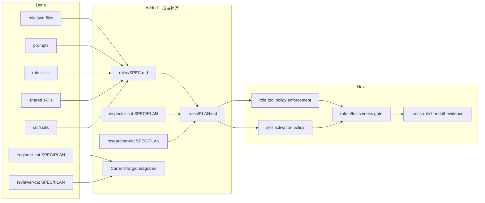

# Roles And Skills PLAN

状态：Active
最后更新：2026-05-30
Owner：Policy maintainers

本文维护 `roles/` + `skills/` 的策略层执行计划。`roles/SPEC.md` 定义 Roles & Skills 顶层模块架构和边界；各角色目录继续维护自己的 `SPEC.md` 和 `PLAN.md`。

## Current Status

`roles/` 当前包含四个长期角色：`engineer-cat`、`inspector-cat`、`reviewer-cat`、`researcher-cat`。所有角色都有 `role.json`、README、prompt 和 role-local skills；`engineer-cat`、`inspector-cat`、`reviewer-cat` 有对应 `src/roles/**` runtime 扩展；`researcher-cat` 当前主要是 prompt + skills 驱动。`skills/` 和 `src/skills/` 作为同一顶层策略模块的一部分，提供共享 workflow skill、skill loader、parser、activation 和 executor。

## Milestones

1. Role and skill inventory plus root policy module docs: completed.
2. Current/Target architecture diagrams for durable role specs: completed.
3. InspectorCat SPEC/PLAN baseline: completed.
4. ResearcherCat SPEC/PLAN baseline: completed.
5. Role-scoped tool policy enforcement: not started.
6. Shared skill activation and visibility policy enforcement: partial.
7. All-roles and core-skills release/effectiveness gate: not started.
8. Cross-role handoff evidence schema: not started.

## Next Steps

- Enforce role-scoped tool visibility in the actual tool manager path.
- Make shared skill activation and role-private skill visibility explicit in tests.
- Add role effectiveness cases that cover InspectorCat, EngineerCat, ReviewerCat and ResearcherCat separately.
- Define structured handoff evidence between InspectorCat -> EngineerCat -> ReviewerCat.
- Decide whether ResearcherCat needs `src/roles/researcher-cat/**` runtime support for durable Research Board state.
- Keep role docs aligned when prompt, skill, tool, or runtime behavior changes.

## Owners

- Role catalog and activation：`roles/**`, `src/roles/runtime-role-registry.ts`
- Shared skill catalog and activation：`skills/**`, `src/skills/**`
- EngineerCat：`roles/engineer-cat/**`, `src/roles/engineer-cat/**`
- InspectorCat：`roles/inspector-cat/**`, `src/roles/inspector-cat/**`
- ReviewerCat：`roles/reviewer-cat/**`, `src/roles/reviewer-cat/**`
- ResearcherCat：`roles/researcher-cat/**`
- Role verification：`roles/reviewer-cat/**`, `benchmarks/**`, `tests/**`

## Acceptance Criteria

- Every durable role has README, role.json, prompt assets, SPEC and PLAN.
- Every role SPEC has Current Architecture and Target Architecture Mermaid diagrams.
- Role-specific tools and skills are visible only where the active role or role-scoped session allows them.
- Shared skills define instruction scope, required tools and side-effect/evidence expectations when relevant.
- Cross-role handoff produces evidence that ReviewerCat can verify independently.
- Role/skill effectiveness release gate reports pass, fail, partial, or blocked per role and core skill; it must not collapse all policy assets into one aggregate result.

## Verification Log

- 2026-05-29：Added `roles/SPEC.md` and `roles/PLAN.md`.
- 2026-05-29：Added baseline SPEC/PLAN docs for InspectorCat and ResearcherCat.
- 2026-05-29：Aligned EngineerCat and ReviewerCat specs with Current/Target architecture diagrams.
- 2026-05-30：Expanded `roles/SPEC.md` / `roles/PLAN.md` to represent the top-level Roles & Skills policy module for the five-module spec structure.

## Risks / Open Questions

- Current role activation still has global-state paths; role-scoped Room agents partly avoid this but the broader runtime is not fully isolated.
- ResearcherCat may need durable state before it can safely own long-running research boards.
- All-roles release gate could become expensive if every role requires live model E2E; use layered gates before full live runs.

## Status Maintenance Rules

- Any role prompt, skill, tool, or runtime boundary change must update that role's SPEC/PLAN.
- Any shared skill activation, visibility, tool requirement or evidence expectation change must update this plan and `roles/SPEC.md`.
- Do not mark a role capability complete without evidence in tests, logs, artifacts, or an explicit blocked reason.
- Role specs define responsibilities; [`docs/SPEC.md`](../docs/SPEC.md) still owns harness-wide invariants.
