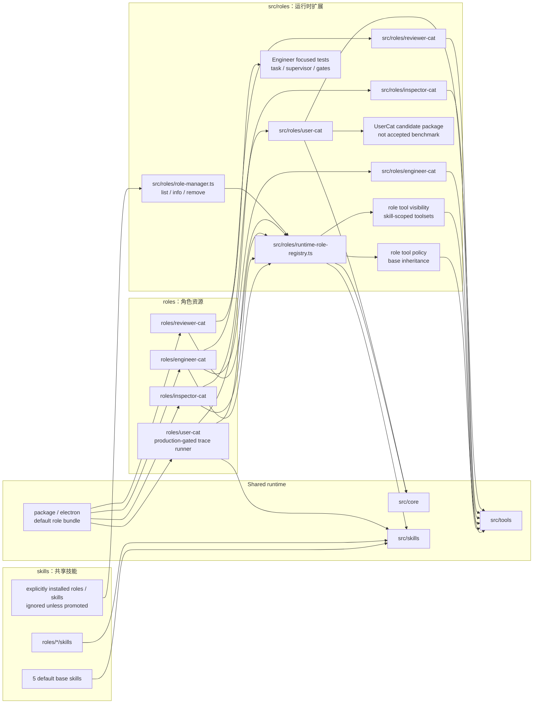
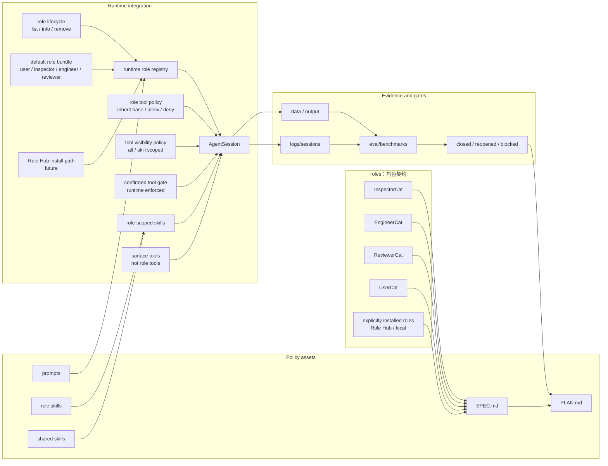

# Roles And Skills SPEC

状态：Active
最后更新：2026-07-01
适用范围：XiaoBa 的策略层，包括 `roles/`、`src/roles/`、`skills/` 和 `src/skills/`。

`roles/` 和 `skills/` 是 XiaoBa Runtime 的策略层。角色不是独立 runtime，skill 也不拥有 runtime loop；它们是在统一 agent harness 上叠加身份、职责、prompt、workflow、tools、验收边界和可见交付方式。GitHub 默认跟踪资产和默认 Electron 包只保留 5 个 base skills 与 4 个核心协作 roles：`remember`、`role-publish`、`self-evolution`、`skill-publish`、`agent-browser`，以及 `user-cat`、`inspector-cat`、`engineer-cat`、`reviewer-cat`。其他 role / skill 必须走显式安装、Role Hub 或本地 ignored 资产，不进入默认跟踪口径。

## Problem

XiaoBa 需要用多个长期角色和可复用 skill 承载不同工程职责：

- `InspectorCat` 是 runtime triage / evidence forensics / issue router：当前保留角色资产和 `analyze_log.issueProfiles[]` 取证合同；旧 hook server、Dashboard Inspector config 和 MySQL archive 路径已暂停，等待 Inspector refactor 重新定义 intake/runtime/config 合同。
- `EngineerCat` 实现修复、运行验证并交付证据；当前 runtime/tool/test 路径约束它像人工 Codex 操作者一样完成任务整理、Codex runner dispatch、状态同步、验证失败返工、会话续接、多 Codex supervisor 和 ReviewerCat handoff。旧 deterministic role eval 已从 `eval/` 移除，未来必须重写成 live agent eval 才能回到 benchmark。
- `ReviewerCat` 负责 replay、verification、scorecard 和 closed/reopened/blocked 判断。
- `UserCat` 负责基于真实 seed 和目标 role 设计意图扮演低质量/低信息终端用户，生成多轮候选用户 trace，供 ReviewerCat 和 benchmark harness 后续 curation；它不是 developer、engineer、QA lead 或 benchmark author。当前已落地 role assets、窄 base tool policy、`trace-simulation` / `xiaoba-cli-product-test` role-local skills、默认走 Dashboard Chat/Pet 原生入口的 `user_trace_run` runner、adaptive next-message controller、minimum two-turn evidence pressure、required artifact/schema pressure preservation 和 candidate trace package writer。旧 `eval:user-cat` smoke 已从 `eval/` 移除，候选 trace 不能直接变成 benchmark。
- 非默认角色可以作为 Role Hub / 本地安装资产继续演进，但不能被默认 Git 跟踪、默认 package 或默认 runtime inventory 偷偷带出去。

角色层要避免两类问题：一是每个角色复制自己的 runtime loop；二是所有角色共享一团不可追踪的全局 prompt/tool 状态。

Skill 层要避免两类问题：一是把流程策略写死在 runtime 里；二是让 skill 绕过 tool boundary、日志和 evidence contract。

## Scope

In scope:

- `roles/<role-name>/role.json`
- `roles/<role-name>/prompts/`
- `roles/<role-name>/skills/`
- `roles/<role-name>/SPEC.md` 和 `PLAN.md`
- `src/roles/**` 的角色专属工具、runner、worker、adapter
- `skills/**` 的共享 workflow skill pack
- `src/skills/**` 的 skill loader、parser、activation 和 executor
- role activation、role-scoped tools、role-scoped skills、role metadata
- packaged default role allowlist、role listing / info / removal lifecycle
- shared skill metadata、activation policy、skill inheritance 和 role-private skill 可见性

Out of scope:

- Provider 和 agent loop 实现细节，属于 `agent-runtime/SPEC.md`。
- 平台入口协议，属于 `surface/SPEC.md`。
- Dashboard Room 的界面布局，属于 `dashboard/SPEC.md`。
- Benchmark 通用 replay/eval schema，属于 `eval/benchmarks/SPEC.md`。

## Current Architecture

当前策略层的默认 Git 跟踪资产由四个核心协作角色、五个 base skills、共享 runtime 扩展和安装/删除生命周期组成。默认角色是 `user-cat`、`inspector-cat`、`engineer-cat`、`reviewer-cat`；默认 base skills 是 `remember`、`role-publish`、`self-evolution`、`skill-publish`、`agent-browser`。角色生命周期现在通过 `RoleManager`、`xiaoba role list/info/remove` 和 Dashboard `DELETE /api/roles/:name` 支持删除，删除当前激活角色会回到 Base。`EngineerCat` 现在有 `engineer_task_*`、`engineer_codex_supervisor_*`、`EngineerTaskRunner` 和 `EngineerCodexSupervisor`；changed-file-aware quality gates 只追加 test/build/diff 类工程验证，不再追加已删除的 role eval 命令。`InspectorCat` 当前保留 `analyze_log` role-specific tool；旧 Inspector hook API、hook runtime auto-start、Dashboard Inspector config 和 `INSPECTOR_*` / `MYSQL_*` example config 已从 active path 移除，等待 refactor。非默认角色与非默认 skill 只能作为显式安装资产进入本机 `roles/` / `skills/`，默认 Git ignore 和 package allowlist 不会跟踪它们。

`UserCat` 当前是 prompt + role-local skill + runtime tool 驱动的低质量用户 trace 生产角色：已有 `role.json`、README、system prompt、`trace-simulation` skill、`xiaoba-cli-product-test` product-use preset skill 和 `user_trace_run`；role tool policy 已设置 `inheritBaseTools:false`，只 allowlist `read_file`、`grep`、`glob`、`skill`，并通过 role-specific tool 暴露 `user_trace_run`。`xiaoba-cli-product-test` 会把一句“像真实用户一样测试 XiaoBa-CLI 某能力”的需求转成 seed、role intent map、persona、scenario plan、opening message 和 fallback pressure turns，但 persona 必须保持终端用户视角，不主动提供 developer-grade 复现、架构诊断、测试计划或修复方案；`user_trace_run interaction_mode:"adaptive"` 默认通过 Dashboard Chat/Pet `/api/pet/message` 入口发送开场消息，然后读取上一轮用户可见回复、tool events 和证据来决定下一句低信息用户输入或停止；如果 planner 在两轮前想停止且 turn budget 仍允许，会继续发出 fallback / heuristic 追问，保证最少两轮证据压力；如果 planned fallback 包含 `answer.json`、`fake_citations` 这类 required artifact/schema pressure 而 planner 没覆盖，会保留该 fallback 以继续施压；`interaction_mode:"scripted"` 仅保留给固定脚本回放和兼容。native evidence 落在 `logs/sessions/pet/**` 和 `data/chat/sessions/**`，candidate package 只是后续 curation input，不是 accepted benchmark。ReviewerCat curation integration 和 full existing-role pilot 仍未完成。

## Target Architecture

目标是让每个长期角色和可复用 skill 都有清晰的职责边界、工具边界、证据边界和验收计划。角色可以拥有专属 runner 或 worker，但不能复制 agent harness；skill 可以定义流程和操作策略，但不能绕过 tool/evidence 边界。跨角色协作通过明确的 handoff、evidence 和 replay gate 闭环。

## Role Boundaries

| Role | Primary responsibility | Must not become |
| --- | --- | --- |
| `inspector-cat` | Runtime triage, evidence forensics, issue profile generation, handoff routing, skill/benchmark opportunity mining | General implementation worker, Reviewer, or release judge |
| `engineer-cat` | Authorized implementation, validation, coding-agent delegation, delivery evidence | Reviewer or release judge |
| `reviewer-cat` | E2E evidence design, replay, verification, scorecard, closed/reopened/blocked decision | Main feature implementer |
| `user-cat` | Candidate multi-turn user trace generation from role intent, real seeds, personas, and evidence pressure | Reviewer, judge, benchmark acceptance owner, or target-role implementer |
| installed non-default roles | Explicitly installed Role Hub / local role behavior, scoped by its own role docs | Default GitHub/package inventory unless promoted through the default allowlist |

## Data Contracts

Every durable role should maintain:

- `role.json` with `name`, `displayName`, `description`, `promptFile`, skill inheritance, optional base-tool inheritance policy and metadata.
- `README.md` for user-facing role summary and usage.
- `SPEC.md` with Current/Target architecture diagrams.
- `PLAN.md` with current status, milestones, next steps, owners, acceptance criteria and risks.
- `prompts/` for role prompt assets.
- `skills/` for role-local workflow instructions when needed.

Default distribution and lifecycle:

- Default Electron packages include only `user-cat`、`inspector-cat`、`engineer-cat`、`reviewer-cat`.
- Non-default roles may exist locally or in a future Role Hub, but should not be silently tracked by Git or installed into a default package.
- `xiaoba role remove <name>` and Dashboard role deletion remove installed role directories; `base` / `default` / `none` cannot be removed.
- Removing the active role clears the active role and returns subsequent sessions to Base.

Runtime extensions under `src/roles/<role-name>/` should define:

- tool names and argument schemas,
- role-scoped runner or worker state,
- evidence artifacts written under `data/**`,
- integration points with shared tools, AgentSession, Dashboard, inspector hooks when active, or benchmark gates.

Role tool policy fields:

- `inheritBaseTools`: defaults to `true`; set to `false` for weak-model or narrow-action roles that should not see raw runtime tools by default.
- `baseToolAllowlist`: base tools still visible when `inheritBaseTools:false`, for example `skill`.
- `baseToolDenylist`: base tools hidden even when `inheritBaseTools:true`.
- `toolVisibility`: optional provider-visible tool policy. `mode:"all"` preserves current behavior; `mode:"skill_scoped"` exposes `defaultTools` until an active skill maps to one or more scoped `skillToolsets`.
- `skillToolsetAliases`: optional mapping from role-local skill names to one or more toolset names, for example `daily-brief -> calendar + task + mail`.
- `confirmedToolGate`: optional runtime-enforced list of tools that require immediate user confirmation intent before they are provider-visible or executable.
- Role-specific tools come from `src/roles/runtime-role-registry.ts`.
- Surface delivery tools such as `send_text` and `send_file` are not role tools; they are injected only by channel-backed surface context.
- Role-aware sub-agent dispatch uses an either/or contract: pass `skill_name` alone for a current/inherited-role explicit skill, or pass `role_name` alone for a cross-role child session that loads the target role and then uses the `skill` tool to choose from that role's visible skills.
- Router-style control-plane roles should prefer `role_name` dispatch only, with no `skill_name`, so the target worker role owns its own skill selection.

Shared skills under `skills/**` and runtime support under `src/skills/**` should define:

- skill id, instruction scope and expected activation context,
- role visibility or inheritance rules when relevant,
- required tools and side-effect boundaries,
- evidence expectations when the skill creates files, sends messages or changes durable state.

## Interaction With Other Modules

- `agent-runtime/SPEC.md` owns the agent loop, session lifecycle, provider transcript and tool execution boundary.
- `src/skills` loads role-local and shared skill packs, but skill policy remains defined here.
- `surface/SPEC.md` owns user entrypoints; Dashboard can create role-scoped Room agents.
- `docs/observability-evidence/SPEC.md` and `docs/observability-evidence/state-evidence/SPEC.md` own trace projection, logs, artifacts and durable evidence written by role/skill execution.
- `UserCat` produces low-quality end-user candidate traces for role effectiveness and benchmark expansion; ReviewerCat and `eval/benchmarks/SPEC.md` decide which traces can become accepted replay cases.
- `eval/benchmarks/SPEC.md` defines how future role live benchmarks must be structured before they can become release gates.
- [`docs/SPEC.md`](../docs/SPEC.md) owns project-level harness contracts; role specs cannot weaken those contracts.
