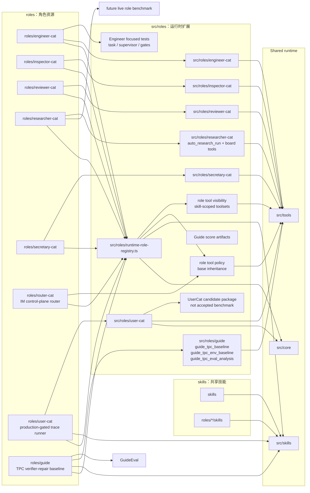
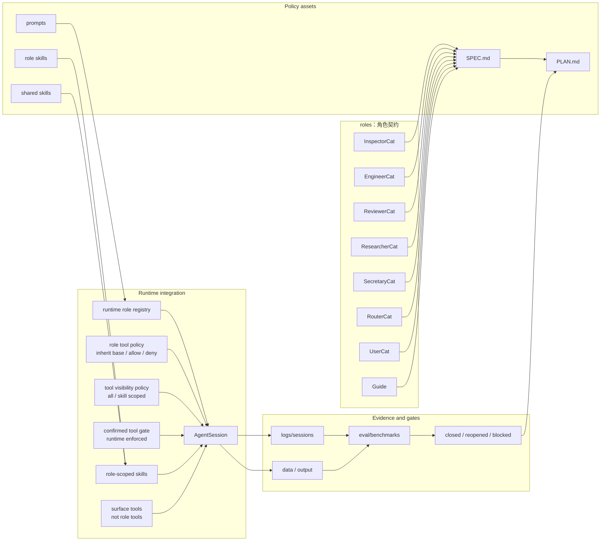

# Roles And Skills SPEC

状态：Active
最后更新：2026-06-27
适用范围：XiaoBa 的策略层，包括 `roles/`、`src/roles/`、`skills/` 和 `src/skills/`。

`roles/` 和 `skills/` 是 XiaoBa Runtime 的策略层。角色不是独立 runtime，skill 也不拥有 runtime loop；它们是在统一 agent harness 上叠加身份、职责、prompt、workflow、tools、验收边界和可见交付方式。

## Problem

XiaoBa 需要用多个长期角色和可复用 skill 承载不同工程职责：

- `InspectorCat` 是 runtime triage / evidence forensics / issue router：当前保留角色资产和 `analyze_log.issueProfiles[]` 取证合同；旧 hook server、Dashboard Inspector config 和 MySQL archive 路径已暂停，等待 Inspector refactor 重新定义 intake/runtime/config 合同。
- `EngineerCat` 实现修复、运行验证并交付证据；当前 runtime/tool/test 路径约束它像人工 Codex 操作者一样完成任务整理、Codex runner dispatch、状态同步、验证失败返工、会话续接、多 Codex supervisor 和 ReviewerCat handoff。旧 deterministic role eval 已从 `eval/` 移除，未来必须重写成 live agent eval 才能回到 benchmark。
- `ReviewerCat` 负责 replay、verification、scorecard 和 closed/reopened/blocked 判断。
- `ResearcherCat` 维护长周期科研工作流状态和交付证据；CLI 用户可用 `--role researcher` 激活，canonical role id 是 `researcher-cat`。当前已有 durable Research Board runtime tools 与 `auto_research_run` orchestration v0，把研究状态落到 `data/researcher-cat/boards/**` / `output/researcher-cat/boards/**`，把 workspace intake evidence 和 PDF/PPT/figure delivery artifact readiness 落到 `data/researcher-cat/auto-research/**` / `output/researcher-cat/auto-research/**`；旧 deterministic workflow benchmark 已从 `eval/` 移除，未来 role benchmark 需要按 live replay 重新建设。
- `SecretaryCat` 提供本地优先的个人秘书能力，通过窄 Feishu wrapper tools 处理日程、授权、联系人、消息、任务、邮件、妙记、文档、云盘、表格、Base 和日常简报。
- `RouterCat` 是 IM 控制平面角色：识别用户意图，使用 `spawn_subagent(role_name=...)` 派发到 EngineerCat、ResearcherCat、InspectorCat、ReviewerCat、SecretaryCat、Guide 或 UserCat，并负责进度、停止、恢复和结果汇总；它不直接执行 worker 工作。
- `UserCat` 负责基于真实 seed 和目标 role 设计意图生成低信息多轮候选用户 trace，供 ReviewerCat 和 benchmark harness 后续 curation；当前已落地 role assets、窄 base tool policy、`trace-simulation` / `xiaoba-cli-product-test` role-local skills、默认走 Dashboard Chat/Pet 原生入口的 `user_trace_run` runner 和 candidate trace package writer。旧 `eval:user-cat` smoke 已从 `eval/` 移除，候选 trace 不能直接变成 benchmark。
- `Guide` 负责 ChinaTravel / TPC 旅行规划比赛，当前已有 `data-profiling` / `eval-analysis` skills 和 `guide_tpc_baseline` / `guide_tpc_eval_analysis` / `guide_tpc_env_baseline` runtime tools；Phase 1 profile 已分析 1000 tasks、1073 normalized hard_logic constraints 和 database_en 覆盖，官方 `eval_tpc.py` verifier wrapper 已跑通 schema baseline、environment-bound baseline 和 v12 verifier-filtered repair。当前最高候选为 `XiaoBaGuide_venv12.zip`，overall 90.3290 / FPR 93.8；runtime stage-level eval analysis 显示 schema 1000/1000、commonsense/environment 999/1000、raw hard logic 938/1000、all-pass 938/1000，下一步做 residual chronology、other.unclassified time-window/duration、budget 和 residual entity repair。

角色层要避免两类问题：一是每个角色复制自己的 runtime loop；二是所有角色共享一团不可追踪的全局 prompt/tool 状态。

Skill 层要避免两类问题：一是把流程策略写死在 runtime 里；二是让 skill 绕过 tool boundary、日志和 evidence contract。

## Scope

In scope:

- `roles/<role-name>/role.json`
- `roles/<role-name>/prompts/`
- `roles/<role-name>/skills/`
- `roles/<role-name>/SPEC.md` 和 `PLAN.md`
- `src/roles/**` 的角色专属工具、runner、worker、adapter
- `skills/**` 的共享 workflow skill pack
- `src/skills/**` 的 skill loader、parser、activation 和 executor
- role activation、role-scoped tools、role-scoped skills、role metadata
- shared skill metadata、activation policy、skill inheritance 和 role-private skill 可见性

Out of scope:

- Provider 和 agent loop 实现细节，属于 `agent-runtime/SPEC.md`。
- 平台入口协议，属于 `surface/SPEC.md`。
- Dashboard Room 的界面布局，属于 `dashboard/SPEC.md`。
- Benchmark 通用 replay/eval schema，属于 `eval/benchmarks/SPEC.md`。

## Current Architecture

当前策略层由 repo 内的角色资源、共享 skill packs 和 runtime 扩展共同组成。`EngineerCat`、`ReviewerCat`、`InspectorCat`、`ResearcherCat`、`SecretaryCat`、`RouterCat`、`UserCat` 和 `Guide` 都有角色级 SPEC/PLAN。`EngineerCat` 现在有 `engineer_task_*`、`engineer_codex_supervisor_*`、`EngineerTaskRunner` 和 `EngineerCodexSupervisor`；changed-file-aware quality gates 只追加 test/build/diff 类工程验证，不再追加已删除的 role eval 命令。`InspectorCat` 当前保留 `analyze_log` role-specific tool；旧 Inspector hook API、hook runtime auto-start、Dashboard Inspector config 和 `INSPECTOR_*` / `MYSQL_*` example config 已从 active path 移除，等待 refactor。`ResearcherCat` 已有 `auto_research_run` / `research_board_update` / `research_board_read` runtime tools、durable Research Board store v0 和 fake-workspace focused tests；role benchmark 暂时退出 `eval/`，等待 live replay 化。`SecretaryCat` 已有 Feishu wrapper runtime 扩展，并通过 `inheritBaseTools:false` + `baseToolAllowlist:["skill"]` 收窄 base tool 暴露面；现在进一步声明 `toolVisibility.mode:"skill_scoped"`、domain toolsets、skill aliases 和 confirmed tool gate，让默认 provider-visible tools 收窄到 `skill + auth`，再由 role-local skills 激活 calendar/message/task/mail/minutes/docs/drive/sheets/base 等 scoped tools。`RouterCat` 当前是 prompt + 窄 base tool policy 驱动的 IM control-plane 角色：它没有 role-local skills 或 role-specific tools，`inheritBaseTools:false` 只 allowlist `spawn_subagent` / `check_subagent` / `stop_subagent` / `resume_subagent` 和只读 `read_file` / `grep` / `glob`，跨 role 工作只传 `role_name` 让目标 subagent 自行选择 role-local skill。

`UserCat` 当前是 prompt + role-local skill + runtime tool 驱动的候选 trace 生产角色：已有 `role.json`、README、system prompt、`trace-simulation` skill、`xiaoba-cli-product-test` product-use preset skill 和 `user_trace_run`；role tool policy 已设置 `inheritBaseTools:false`，只 allowlist `read_file`、`grep`、`glob`、`skill`，并通过 role-specific tool 暴露 `user_trace_run`。`xiaoba-cli-product-test` 会把一句“像真实用户一样测试 XiaoBa-CLI 某能力”的需求转成 seed、role intent map、persona、scenario plan 和多轮 user messages；`user_trace_run` 默认通过 Dashboard Chat/Pet `/api/pet/message` 入口发送用户消息，native evidence 落在 `logs/sessions/pet/**` 和 `data/chat/sessions/**`，candidate package 只是后续 curation input，不是 accepted benchmark。`Guide` 当前是 prompt + role-local `data-profiling` / `eval-analysis` / `tpc-baseline` skills + `guide_tpc_baseline` / `guide_tpc_eval_analysis` / `guide_tpc_env_baseline` runtime tools 驱动的 ChinaTravel/TPC 比赛角色；它已能读取本地 1000 条 Phase 1 EN tasks，生成 schema-only baseline、environment-bound baseline 和 verifier-filtered repair predictions。当前最高官方 scorecard 来自 `output/guide/tpc-env-baseline/phase1-v12-quoteparse-full/`：overall 90.3290 / FPR 93.8，submission zip 为 `XiaoBaGuide_venv12.zip`。`guide_tpc_eval_analysis` 已拆出当前 blocker 是 residual chronology、other.unclassified time-window/duration、budget 和 residual entity constraints。ReviewerCat curation integration 和 full existing-role pilot 仍未完成。

## Target Architecture

目标是让每个长期角色和可复用 skill 都有清晰的职责边界、工具边界、证据边界和验收计划。角色可以拥有专属 runner 或 worker，但不能复制 agent harness；skill 可以定义流程和操作策略，但不能绕过 tool/evidence 边界。跨角色协作通过明确的 handoff、evidence 和 replay gate 闭环。

## Role Boundaries

| Role | Primary responsibility | Must not become |
| --- | --- | --- |
| `inspector-cat` | Runtime triage, evidence forensics, issue profile generation, handoff routing, skill/benchmark opportunity mining | General implementation worker, Reviewer, or release judge |
| `engineer-cat` | Authorized implementation, validation, coding-agent delegation, delivery evidence | Reviewer or release judge |
| `reviewer-cat` | E2E evidence design, replay, verification, scorecard, closed/reopened/blocked decision | Main feature implementer |
| `researcher` / `researcher-cat` | Long-running research board, evidence audit, experiment/manuscript delivery workflow | Runtime benchmark replay owner |
| `secretary-cat` | Local personal secretary workflows for Feishu calendar, contact, im, task, mail, minutes, docs, drive, sheets/base, and daily brief coordination through narrow wrappers | General shell/code agent or unconfirmed external side-effect sender |
| `router-cat` | IM control plane: intent classification, role-only subagent dispatch, progress, stop/resume, and evidence-aware summary | Worker implementer, researcher, reviewer, inspector, secretary side-effect executor, or skill runner |
| `user-cat` | Candidate multi-turn user trace generation from role intent, real seeds, personas, and evidence pressure | Reviewer, judge, benchmark acceptance owner, or target-role implementer |
| `guide` | ChinaTravel / TPC competition planning: schema-valid itinerary predictions, official verifier/eval-analysis repair loop, Phase 1 zip readiness, and Phase 2 harness preparation; current runtime tools are `guide_tpc_baseline`, `guide_tpc_env_baseline` and `guide_tpc_eval_analysis` | Generic travel recommender, unverified prose planner, or premature small-model training owner |

## Data Contracts

Every durable role should maintain:

- `role.json` with `name`, `displayName`, `description`, `promptFile`, skill inheritance, optional base-tool inheritance policy and metadata.
- `README.md` for user-facing role summary and usage.
- `SPEC.md` with Current/Target architecture diagrams.
- `PLAN.md` with current status, milestones, next steps, owners, acceptance criteria and risks.
- `prompts/` for role prompt assets.
- `skills/` for role-local workflow instructions when needed.

Runtime extensions under `src/roles/<role-name>/` should define:

- tool names and argument schemas,
- role-scoped runner or worker state,
- evidence artifacts written under `data/**`,
- integration points with shared tools, AgentSession, Dashboard, inspector hooks when active, or benchmark gates.

Role tool policy fields:

- `inheritBaseTools`: defaults to `true`; set to `false` for weak-model or narrow-action roles that should not see raw runtime tools by default.
- `baseToolAllowlist`: base tools still visible when `inheritBaseTools:false`, for example `skill`.
- `baseToolDenylist`: base tools hidden even when `inheritBaseTools:true`.
- `toolVisibility`: optional provider-visible tool policy. `mode:"all"` preserves current behavior; `mode:"skill_scoped"` exposes `defaultTools` until an active skill maps to one or more scoped `skillToolsets`.
- `skillToolsetAliases`: optional mapping from role-local skill names to one or more toolset names, for example `daily-brief -> calendar + task + mail`.
- `confirmedToolGate`: optional runtime-enforced list of tools that require immediate user confirmation intent before they are provider-visible or executable.
- Role-specific tools come from `src/roles/runtime-role-registry.ts`.
- Surface delivery tools such as `send_text` and `send_file` are not role tools; they are injected only by channel-backed surface context.
- Role-aware sub-agent dispatch uses an either/or contract: pass `skill_name` alone for a current/inherited-role explicit skill, or pass `role_name` alone for a cross-role child session that loads the target role and then uses the `skill` tool to choose from that role's visible skills.
- Router-style control-plane roles should prefer `role_name` dispatch only, with no `skill_name`, so the target worker role owns its own skill selection.

Shared skills under `skills/**` and runtime support under `src/skills/**` should define:

- skill id, instruction scope and expected activation context,
- role visibility or inheritance rules when relevant,
- required tools and side-effect boundaries,
- evidence expectations when the skill creates files, sends messages or changes durable state.

## Interaction With Other Modules

- `agent-runtime/SPEC.md` owns the agent loop, session lifecycle, provider transcript and tool execution boundary.
- `src/skills` loads role-local and shared skill packs, but skill policy remains defined here.
- `surface/SPEC.md` owns user entrypoints; Dashboard can create role-scoped Room agents.
- `docs/observability-evidence/SPEC.md` and `docs/observability-evidence/state-evidence/SPEC.md` own trace projection, logs, artifacts and durable evidence written by role/skill execution.
- `UserCat` produces candidate traces for role effectiveness and benchmark expansion; ReviewerCat and `eval/benchmarks/SPEC.md` decide which traces can become accepted replay cases.
- `Guide` consumes external ChinaTravel/TPC tasks and verifier evidence; until a dedicated benchmark module exists, official competition verification remains external domain evidence rather than XiaoBa release benchmark truth.
- `eval/benchmarks/SPEC.md` defines how future role live benchmarks must be structured before they can become release gates.
- `ResearcherCat` should consume future live benchmark failures as prompt/runtime feedback for Research Board behavior; raw research logs still remain private.
- [`docs/SPEC.md`](../docs/SPEC.md) owns project-level harness contracts; role specs cannot weaken those contracts.
