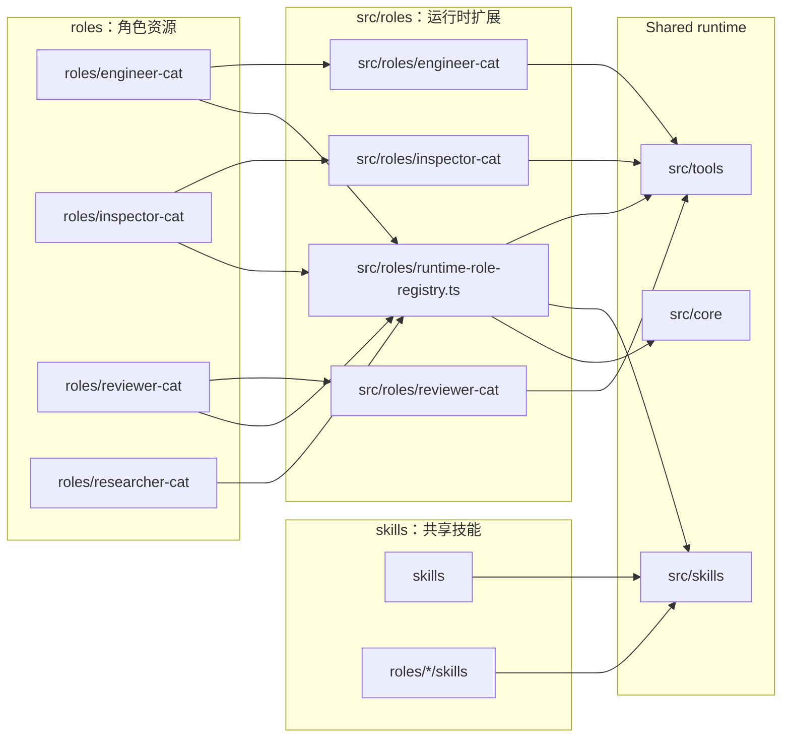
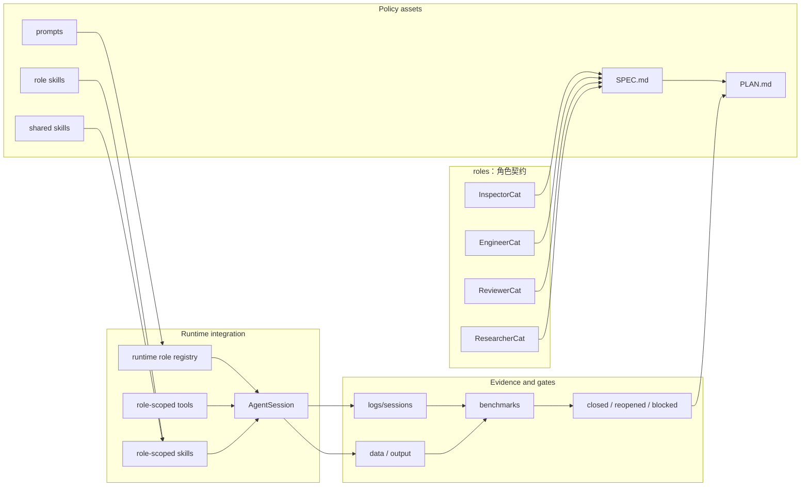

# Roles And Skills SPEC

状态：Active
最后更新：2026-05-30
适用范围：XiaoBa 的策略层，包括 `roles/`、`src/roles/`、`skills/` 和 `src/skills/`。

`roles/` 和 `skills/` 是 XiaoBa Runtime 的策略层。角色不是独立 runtime，skill 也不拥有 runtime loop；它们是在统一 agent harness 上叠加身份、职责、prompt、workflow、tools、验收边界和可见交付方式。

## Problem

XiaoBa 需要用多个长期角色和可复用 skill 承载不同工程职责：

- `InspectorCat` 发现 runtime/skill/role 问题并做归因路由。
- `EngineerCat` 实现修复、运行验证并交付证据。
- `ReviewerCat` 负责 replay、verification、scorecard 和 closed/reopened/blocked 判断。
- `ResearcherCat` 维护长周期科研工作流状态和交付证据。

角色层要避免两类问题：一是每个角色复制自己的 runtime loop；二是所有角色共享一团不可追踪的全局 prompt/tool 状态。

Skill 层要避免两类问题：一是把流程策略写死在 runtime 里；二是让 skill 绕过 tool boundary、日志和 evidence contract。

## Scope

In scope:

- `roles/<role-name>/role.json`
- `roles/<role-name>/prompts/`
- `roles/<role-name>/skills/`
- `roles/<role-name>/SPEC.md` 和 `PLAN.md`
- `src/roles/**` 的角色专属工具、runner、worker、adapter
- `skills/**` 的共享 workflow skill pack
- `src/skills/**` 的 skill loader、parser、activation 和 executor
- role activation、role-scoped tools、role-scoped skills、role metadata
- shared skill metadata、activation policy、skill inheritance 和 role-private skill 可见性

Out of scope:

- Provider 和 agent loop 实现细节，属于 `harness/SPEC.md`。
- 平台入口协议，属于 `surfaces/SPEC.md`。
- Dashboard Room 的界面布局，属于 `dashboard/SPEC.md`。
- Benchmark 通用 replay/eval schema，属于 `benchmarks/SPEC.md`。

## Current Architecture

当前策略层由 repo 内的角色资源、共享 skill packs 和 runtime 扩展共同组成。`EngineerCat` 和 `ReviewerCat` 已有完整 SPEC/PLAN；`InspectorCat` 和 `ResearcherCat` 之前主要由 README、role.json、prompt 和 skills 描述。

## Target Architecture

目标是让每个长期角色和可复用 skill 都有清晰的职责边界、工具边界、证据边界和验收计划。角色可以拥有专属 runner 或 worker，但不能复制 agent harness；skill 可以定义流程和操作策略，但不能绕过 tool/evidence 边界。跨角色协作通过明确的 handoff、evidence 和 replay gate 闭环。

## Role Boundaries

| Role | Primary responsibility | Must not become |
| --- | --- | --- |
| `inspector-cat` | Runtime/skill/role issue discovery, evidence review, failure routing, skill opportunity mining | General implementation worker |
| `engineer-cat` | Authorized implementation, validation, coding-agent delegation, delivery evidence | Reviewer or release judge |
| `reviewer-cat` | E2E evidence design, replay, verification, scorecard, closed/reopened/blocked decision | Main feature implementer |
| `researcher-cat` | Long-running research board, evidence audit, experiment/manuscript delivery workflow | Runtime benchmark replay owner |

## Data Contracts

Every durable role should maintain:

- `role.json` with `name`, `displayName`, `description`, `promptFile`, skill inheritance and metadata.
- `README.md` for user-facing role summary and usage.
- `SPEC.md` with Current/Target architecture diagrams.
- `PLAN.md` with current status, milestones, next steps, owners, acceptance criteria and risks.
- `prompts/` for role prompt assets.
- `skills/` for role-local workflow instructions when needed.

Runtime extensions under `src/roles/<role-name>/` should define:

- tool names and argument schemas,
- role-scoped runner or worker state,
- evidence artifacts written under `data/**`,
- integration points with shared tools, AgentSession, Dashboard, AutoDev, or benchmark gates.

Shared skills under `skills/**` and runtime support under `src/skills/**` should define:

- skill id, instruction scope and expected activation context,
- role visibility or inheritance rules when relevant,
- required tools and side-effect boundaries,
- evidence expectations when the skill creates files, sends messages or changes durable state.

## Interaction With Other Modules

- `harness/SPEC.md` owns the agent loop, session lifecycle, provider transcript and tool execution boundary.
- `src/skills` loads role-local and shared skill packs, but skill policy remains defined here.
- `surfaces/SPEC.md` owns user entrypoints; Dashboard can create role-scoped Room agents.
- `state-evidence/SPEC.md` owns logs, artifacts and durable evidence written by role/skill execution.
- `benchmarks/SPEC.md` and `ReviewerCat` verify role/skill effectiveness and release gates.
- [`docs/SPEC.md`](../docs/SPEC.md) owns project-level harness contracts; role specs cannot weaken those contracts.
