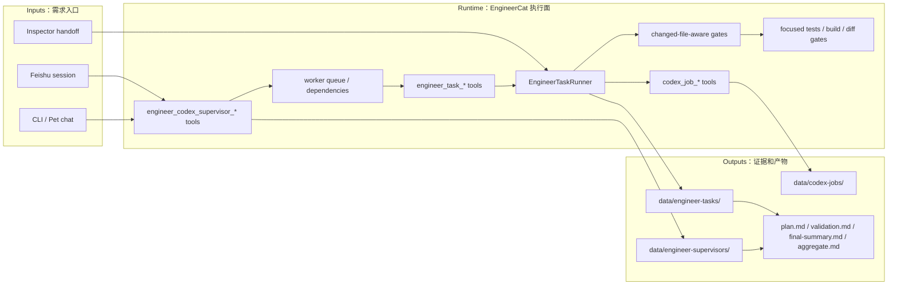

# EngineerCat Plan

## Current Status

EngineerCat is now a role-specific engineering agent on XiaoBa runtime. Its durable runtime path is implemented as `engineer_task_*` tools over `EngineerTaskRunner`, with Codex CLI as the first real coding-agent backend. EngineerCat also has `engineer_codex_supervisor_*` tools over `EngineerCodexSupervisor`, so one EngineerCat can own multiple Codex workers with queue/dependency state, `max_parallel`, batch status, controlled cancellation, worker resume, and aggregate handoff evidence. The old deterministic production workflow eval and benchmark were removed from `eval/`; current quality coverage lives in focused runtime tests, build/test validation, diff gates, and a future live EngineerCat benchmark rebuild.

Done:

- `engineer_task_run` / `engineer_task_status` / `engineer_task_resume` / `engineer_task_cancel` are registered for `engineer-cat`.
- `EngineerTaskRunner` creates `task.json`, `plan.md`, and `final-summary.md` under `data/engineer-tasks/<task-id>/`.
- EngineerCat can query Codex sessions and can start/resume Codex jobs through the shared `codex_job_*` tools.
- Feishu `MessageSessionManager` surface can expose engineer tools and route a user message to `engineer_task_run`.
- A locally simulated Feishu E2E can route a Feishu-style message through real `engineer_task_run`, start the PATH-local Codex CLI, query `engineer_task_status`, and run validation.
- Actual `FeishuBot.onMessage` can accept an `im.message.receive_v1` shaped event, expose EngineerCat tools, run a real local Codex-backed task, and reply to the originating chat when SDK/network dependencies are injected for local testing.
- The same FeishuBot event-entry path can run an editable Codex maintenance task against an isolated temporary git workspace, verify the file change, and cleanly tear down the bot.
- Real local Codex smoke passed on 2026-05-23 for both start and resume.
- `engineer_task_run` / `engineer_task_resume` can carry `validation_commands`; `engineer_task_status` runs them after Codex completion and writes `validation.md`.
- `engineer-quality-gates` can infer basic Node/TypeScript validation commands from `package.json` when `validation_commands` are omitted, while preserving explicit commands and skipping inference for read-only tasks.
- Failed validation marks the task `failed` instead of letting a Codex-completed job masquerade as verified delivery.
- `engineer-quality-gates` now infers changed-file-aware XiaoBa targeted tests for EngineerCat、CLI、core/tools changes and appends diff/conflict-marker gates when needed; it no longer appends deleted role eval commands.
- `engineer_codex_supervisor_start` / `engineer_codex_supervisor_status` / `engineer_codex_supervisor_resume` / `engineer_codex_supervisor_cancel` are registered for `engineer-cat` and persist `supervisor.json` / `plan.md` / `aggregate.md` under `data/engineer-supervisors/<supervisor-id>/`.
- Old `eval:engineer` and `eval:engineer:benchmark` deterministic workflow cases have been removed from the active eval surface; future coverage must be rebuilt as live agent eval.
- Legacy external-provider routing has been removed from EngineerCat's role contract; the target runtime now centers on the verified `EngineerTaskRunner` -> `codex_job_*` -> Codex CLI path.

Partially done:

- Quality gate registry exists for basic Node/TypeScript build/test inference, change-aware `git diff --check` validation, and XiaoBa path-aware targeted tests for EngineerCat / CLI / core/tool changes; deeper task-type-specific selection is still pending.
- Inspector handoff runtime capture remains follow-up; deterministic handoff fixtures cover the current contract.

Not started:

- PR preparation loop.
- Live ReviewerCat automated end-to-end test of EngineerCat through the same Feishu/CLI interaction surface.
- Live Feishu WebSocket smoke with an external Feishu message through Lark servers.

## Milestones

1. Runner control plane MVP: completed.
2. Real local Codex start/resume smoke: completed.
3. Inspector handoff to shared runner: partial through deterministic handoff fixtures; live runtime capture remains follow-up.
4. Validation command loop: completed; basic quality gate registry and diff gate: completed; targeted changed-file matrix: pending.
5. FeishuBot event-entry E2E: completed locally with injected SDK/network dependencies; live external WebSocket smoke pending.
6. ReviewerCat tests EngineerCat as an agent-under-test: deterministic workflow smoke completed; live AgentSession/Feishu path pending.
7. PR handoff loop: pending.
8. Multi-Codex supervisor: completed for deterministic runtime coverage. Supervisor tools start multiple workers, enforce `max_parallel`, respect dependencies, batch-sync status, resume/cancel workers, and write `aggregate.md`; live eval coverage is a future rebuild.

## Next Steps

- Extend changed-file-aware targeted tests beyond the current XiaoBa role/CLI/core mapping, and add blocked-reason gates for unverified editable delivery.
- Teach EngineerCat to include gate rationale in user-facing progress and final summaries.
- Use UserCat to generate candidate EngineerCat multi-turn traces, then let ReviewerCat curate accepted benchmark additions.
- Run a live Feishu WebSocket smoke with an external Feishu message and compare it with the local FeishuBot event-entry E2E trace.
- Add future live ReviewerCat/EngineerCat agent-to-agent eval cases that behave like a human user testing EngineerCat.

## Owners

- EngineerCat runtime owner: `src/roles/engineer-cat/**`
- Shared Codex job owner: `src/roles/reviewer-cat/tools/codex-job-tools.ts`
- Feishu surface owner: `src/feishu/**` and `src/core/message-session-manager.ts`
- Review/eval owner: `roles/reviewer-cat/**`

## Acceptance Criteria

- `npm run build` passes.
- Role-specific tool tests prove `engineer-cat` receives `engineer_task_*` and `codex_job_*` tools.
- Feishu surface test proves a Feishu message can route to `engineer_task_run` and reply to the channel.
- Real local Feishu-style E2E proves the same message surface can trigger `engineer_task_run`, wait on `engineer_task_status`, and complete a real Codex-backed task with validation.
- Real local FeishuBot event-entry E2E proves `im.message.receive_v1` shaped input can pass through `FeishuBot.onMessage`, use EngineerCat tools, call the local Codex CLI, run validation, and reply to the source chat.
- Real local FeishuBot editable E2E proves EngineerCat can allow Codex to modify a workspace file, validate the change, persist task/job/session evidence, and cleanly tear down the bot without touching XiaoBa-CLI source files.
- Real local Codex smoke proves `engineer_task_run` starts Codex and records session/job artifacts.
- Real local Codex resume smoke proves `engineer_task_resume` continues the same session.
- Validation tests prove passing commands write `validation.md` and failed commands turn the task `failed`.
- Quality gate tests prove editable Node/TypeScript tasks infer build/test commands when omitted, and read-only tasks do not run inferred validation unexpectedly.
- Change-aware gate tests prove editable tasks with real git changes add `git diff --check && git diff --cached --check`, while runner trace files are ignored as implementation noise.
- Changed-file-aware gate tests prove EngineerCat prompt/runtime changes infer targeted EngineerCat tests and no deleted role eval command.
- Supervisor tests prove one EngineerCat can create a multi-worker run, enforce `max_parallel`, preserve dependency order, batch-sync worker status, resume or cancel individual workers, and write supervisor aggregate evidence.
- Future live `eval/benchmarks/EngineerCat` coverage includes a multi-Codex supervisor case before it is reintroduced.
- Future aggregate `eval:gate` includes EngineerCat only after a live benchmark exists.
- Handoff tests prove structured implementation evidence is present before ReviewerCat review.
- Handoff paths do not mark a case `reviewing` without structured output and human-readable implementation notes.

## Verification Log

- 2026-05-23: `npm run build` passed.
- 2026-05-23: `npm test -- test/engineer-task-runner.test.ts` ran the full suite: 168 pass, 0 fail.
- 2026-05-23: `EngineerTaskRunner` validation tests cover both `validation_status=passed` and validation failure turning the task `failed`.
- 2026-05-23: Real `engineer_task_run` smoke used PATH-local Codex CLI, task `codex-smoke-20260523-1715`, job `codex-20260523-172014-ae8f9c2a`, session `019e5422-9c34-7930-b411-9c68a15fd0bb`, last message `engineer-task-codex-smoke-ok`.
- 2026-05-23: Real `engineer_task_resume` smoke reused session `019e5422-9c34-7930-b411-9c68a15fd0bb`, job `codex-resume-20260523-172203-68c36429`, last message `engineer-task-codex-resume-ok`.
- 2026-05-23: Real `codex_session_list` found the same session under the current project cwd with `match_mode=exact`.
- 2026-05-23: Real `engineer_task_run` plus `validation_commands` smoke passed, task `codex-validation-smoke-20260523-1735`, job `codex-20260523-173529-d2067b25`, session `019e5430-94cd-7bf1-9e29-8990b47a8cd5`, `validation_status=passed`.
- 2026-05-23: `XIAOBA_REAL_CODEX_E2E=1 node --import tsx --test test/e2e/feishu-engineer-real-codex.e2e.ts` passed. It simulated a Feishu session, called real `engineer_task_run`, waited through `engineer_task_status`, started Codex job `codex-20260523-175107-9fe5b76c`, recorded session `019e543e-e801-77a3-aaa0-85081823c2d1`, and wrote `validation_status=passed`.
- 2026-05-23: `EngineerTaskRunner` quality gate tests prove omitted `validation_commands` infer `npm run build` / `npm run test` for editable XiaoBa-style Node tasks, while read-only tasks remain `not_configured`.
- 2026-05-23: `EngineerTaskRunner` change-aware gate test proves real git changes append `git diff --check && git diff --cached --check`; runner-owned trace files under `data/engineer-tasks`, `data/codex-jobs`, and `data/sessions` are excluded from the changed-file signal.
- 2026-05-23: Real Feishu-style Codex E2E was rerun after quality gate integration and passed again, task `feishu-real-codex-1779530282264`, job `codex-20260523-175802-34e2f4e8`, session `019e5445-37a5-7911-94cc-f0f5a931bebd`.
- 2026-05-23: Real Feishu-style Codex E2E was rerun after change-aware diff gate integration and passed again, task `feishu-real-codex-1779530562098`, job `codex-20260523-180242-1e68e04f`, session `019e5449-7de1-7980-aca9-9725398d7942`.
- 2026-05-23: `XIAOBA_REAL_CODEX_E2E=1 node --import tsx --test test/e2e/feishu-bot-engineer-real-codex.e2e.ts` passed both real FeishuBot event-entry cases. Read-only XiaoBa-CLI cwd smoke: task `feishu-bot-real-codex-1779531157656`, job `codex-20260523-181237-b0408e57`, session `019e5452-92a4-7230-a4a5-1c40d6f50d58`, `validation_status=passed`. Editable temporary git workspace smoke: task `feishu-bot-edit-codex-1779531167770`, job `codex-20260523-181247-e4c98834`, session `019e5452-b851-7e71-bdfd-ea6f0e291633`, `README.md` marker validated, `validation_status=passed`. Both bots destroyed cleanly and the test process exited with 2 pass / 0 fail.
- 2026-05-29: `SPEC.md` gained explicit Current Architecture and Target Architecture Mermaid diagrams for the EngineerCat control plane, execution plane, evidence, and review gate.
- 2026-05-30: EngineerCat target architecture removed the unproven legacy external-provider branch and kept Codex CLI as the only committed external coding-agent runtime.
- 2026-05-30: `node --import tsx --test test/engineer-cat-codex-runner.test.ts test/tool-manager-roles.test.ts` passed, proving EngineerCat no longer loads the legacy external-provider caller skill, still receives `engineer_task_*` / `codex_job_*` tools, and exposes the updated Codex runner description used by Dashboard role cards.
- 2026-06-03: Added changed-file-aware XiaoBa targeted validation gates for EngineerCat、eval/benchmark、CLI、core/tools paths, plus final-summary validation rationale and review handoff text. Verification: `node --test -r tsx test/engineer-task-runner.test.ts test/eval-benchmark-bridge.test.ts test/eval-gate.test.ts test/eval-baseline.test.ts test/eval-schema-validation.test.ts` (23/23), `npm run build`, and targeted diff/conflict-marker checks passed.
- 2026-06-03: Added EngineerCat production workflow eval / benchmark with 4 deterministic cases covering Codex runner dispatch, validation failure resume, Codex session continuity, and ReviewerCat handoff readiness. Verification: `npm run eval:engineer` (4/4), `npm run eval:engineer:benchmark` (4/4 benchmark cases, 4/4 eval cases), `npm run eval:gate` (28/28 items, 108/108 cases), `legacy eval baseline check` (154/154 checks), and `npm run check:eval-assets` (3070/3070 checks).
- 2026-06-03: Added production-grade multi-Codex supervisor runtime and deterministic eval / benchmark coverage. Verification: `node --test -r tsx test/engineer-codex-supervisor.test.ts test/engineer-task-runner.test.ts test/tool-manager-roles.test.ts` (23/23), `node --test -r tsx test/eval-runner.test.ts test/eval-benchmark-bridge.test.ts test/eval-gate.test.ts` (63/63), `node --test -r tsx test/eval-baseline.test.ts test/eval-schema-validation.test.ts` (6/6), `npm run build`, `npm run eval:engineer` (5/5), `npm run eval:engineer:benchmark` (5/5 benchmark cases, 5/5 eval cases), `npm run eval:gate` (28/28 items, 110/110 cases), `legacy eval baseline check` (154/154 checks), and `npm run check:eval-assets` (3270/3270 checks).
- 2026-06-03: Real local Codex E2E revalidated the human-Codex replacement path through Feishu-style and FeishuBot entrypoints, including one editable temporary git workspace. Verification: `XIAOBA_REAL_CODEX_E2E=1 node --test -r tsx test/e2e/feishu-engineer-real-codex.e2e.ts test/e2e/feishu-bot-engineer-real-codex.e2e.ts` passed (3/3).
- 2026-05-30: `npm run build` passed after removing the legacy external-provider role assets.
- 2026-06-03: Removed retired platform integration references from EngineerCat runtime docs, prompt, skill and deterministic Reviewer handoff fixture. Verification: `npm run build`, `node --test -r tsx test/skill-manager-runtime.test.ts test/tool-manager-roles.test.ts test/engineer-task-runner.test.ts test/reviewer-eval-profile.test.ts` (29/29), `npm run eval:engineer` (5/5), `npm run eval:engineer:benchmark` (5/5 benchmark cases, 5/5 eval cases), `npm run eval:role-handoff` (1/1), and `npm run check:eval-assets` (3270/3270 checks).

## Risks / Open Questions

- Live Feishu WS behavior through Lark servers is not yet proven by an external Feishu message, although the local Feishu-style and `FeishuBot.onMessage` event-entry paths are proven with real local Codex execution and injected SDK/network dependencies.
- Codex warning logs mention missing optional plugin cache and a `thread_goals` table warning; smoke still completed successfully, but these should be monitored.
- Long-running implementation tasks can infer basic Node gates, changed-file-aware targeted tests, EngineerCat workflow eval, multi-Codex supervisor coverage and diff whitespace/conflict-marker gate, but still need external diff review gates.
- If future non-Codex providers are needed, they should enter through a new SPEC/PLAN update and a verified runtime adapter instead of reintroducing prompt-only routing.

## Status Maintenance Rules

- If `SPEC.md` changes runtime concepts or state contracts, update this `PLAN.md`.
- If a milestone is marked complete here, add evidence to `Verification Log`.
- If implementation deviates from this plan, update the plan in the same change.
- Do not claim EngineerCat can replace all daily work until live Feishu, external review, and PR handoff have evidence.
