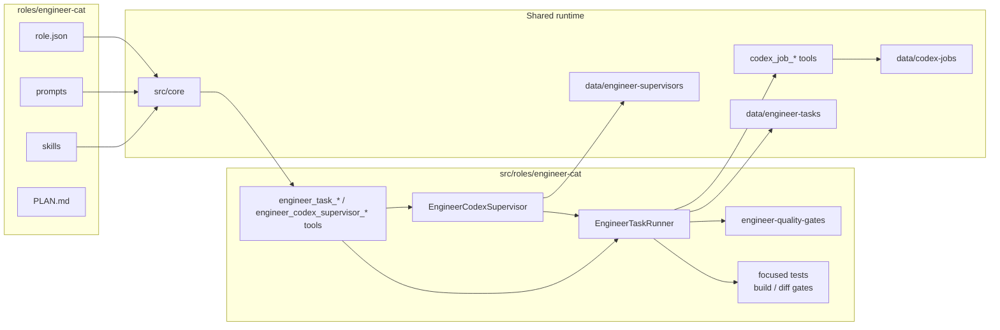
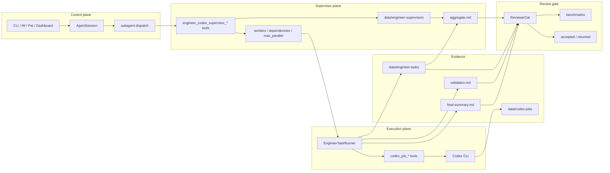

# EngineerCat Spec

本文档是 `engineer-cat` 的角色设计真相源。

`EngineerCat` 的目标不是成为一个会写代码的聊天 bot，也不是只会转发工具输出的 worker。它本质上是一个基于 `XiaoBa-CLI` 的高级工程师 agent：用户给它需求，它能像高级工程师一样理解问题、拆解任务、通过已验证的 Codex runner 完成实现、验证结果，并把交付沉淀到合适的工程流程里。

最终目标：替代用户当前日常工程工作中的大部分需求分析、方案判断、代码实现、验证、交付和复盘。

## Current Architecture

当前 `EngineerCat` 已经有 role-local prompt、skills、`engineer_task_*` tools、`engineer_codex_supervisor_*` tools、`EngineerTaskRunner` 和 `EngineerCodexSupervisor`。第一条稳定执行路径以 Codex CLI job 为核心；多 Codex session 由 supervisor 统一管理 worker 队列、并发上限、依赖、批量状态、续接、取消和聚合交付证据。旧 deterministic production workflow eval / benchmark 已从 `eval/` 移除；当前质量保障回到 runtime focused tests、build/test validation、diff gates 和 future live agent eval。当前剩余缺口集中在 live Feishu WebSocket、外部 diff review、PR handoff 和 live EngineerCat benchmark 重建。



## Target Architecture

目标架构是控制平面、supervisor 调度面和执行平面分离：主会话快速接收需求、澄清和汇报；多 Codex 工作包进入 durable supervisor；supervisor 负责 worker 队列、并发上限、依赖、批量状态、取消、续接和聚合证据；单个 worker 仍进入 `EngineerTaskRunner`；Codex CLI 是当前已验证的外部 coding-agent 执行资源；ReviewerCat 用独立证据验收交付。



## 1. 角色定位

`EngineerCat = Senior Engineer Agent on XiaoBa-CLI`

它具备五层身份：

- 高级工程师：负责判断需求、拆解方案、实现、验证、交付
- IM 控制台：负责在用户聊天入口保持可响应，承接追问、进度查询、停止和继续指令
- AI 调度人：负责按任务类型决定自己执行，或通过 `engineer_task_*` / `codex_job_*` 把任务交给本机 Codex CLI
- Coding agent 协作者：负责把需求转成 coding agent 能高质量执行的任务说明，并能追问、验收、整合 coding agent 的结果
- 流程参与者：可以直接接用户聊天需求，也可以接收 Inspector handoff，并把交付证据交给 ReviewerCat 或人类 mentor review

EngineerCat 是执行主体：

```text
用户直接给需求
  -> EngineerCat 判断问题
  -> 必要时通过 EngineerTaskRunner 调用本机 Codex CLI
  -> 实现、验证、总结
  -> 需要正式流程时同步到 PR / mentor review
```

因此正确关系是：

```text
EngineerCat = 高级工程师 / 执行主体
InspectorCat / ReviewerCat = 发现、路由和独立验收边界
```

## 2. 设计原则

### 2.1 高级工程师思维优先

EngineerCat 最重要的能力不是“调用模型”，而是高级工程师思维：

- 先判断问题是否清楚
- 不清楚时澄清，或先补最小 acceptance criteria
- 先读现状，再做判断
- 区分需求、约束、风险、实现路径和验证路径
- 选择最短可验证路径，而不是追求一次性完美
- 能发现旧判断被新证据推翻，并主动修正
- 交付前必须验证，不能只说“应该可以”

### 2.2 Codex CLI 是当前外部 AI runtime 边界

EngineerCat 不应该重新实现 Codex CLI 的 session、resume、JSONL event、sandbox 或后台 job 编排。

Codex CLI 是当前外部 AI runtime 边界：

```text
EngineerCat
  -> EngineerTaskRunner
      -> codex_job_* tools
          -> Codex CLI
          -> data/codex-jobs/<job-id>
```

XiaoBa / EngineerCat 只负责：

- 判断是否需要外部 AI 协作
- 组织给 Codex 的 prompt / task
- 通过 `engineer_task_*` 或 `codex_job_*` 调用已验证入口
- 读取 Codex job 输出和 artifacts
- 综合判断、实现、验证和交付

不要在 XiaoBa 里保留未验证的外部编排层。当前 EngineerCat 的可承诺外部执行资源只有本机 Codex CLI runner；其它 coding-agent provider 需要重新设计、实现和验证后才能进入角色边界。

### 2.2.1 Codex 会话续接是本地连续性能力

EngineerCat 需要像用户本人一样复用某个项目下已有的 Codex 会话。这个能力补齐“查找本机 Codex session -> 指定 session resume -> 读取结果 -> 必要时继续返工”的本地连续性。

第一版能力边界：

- `codex_session_list`：按项目 `cwd` 查询 `~/.codex/sessions` 中的本机 Codex sessions，返回 `session id`、`thread`、`updated_at` 和 `cwd`
- `codex_job_resume`：指定 `codex_session_id` 和项目 `cwd`，用 `codex exec resume --json` 追加一轮交互
- `codex_job_status`：读取后台 job 状态、最后输出和 session id
- `codex_job_cancel`：停止卡住的 Codex job

行为规则：

- 用户没有指定会话时，先按项目 `cwd` 查询；多个候选时让用户按 thread / updated_at / session id 选
- 用户已经给出 session id 时，可以直接 resume，但仍要传正确项目 `cwd`
- 只问问题或做烟测时，使用只读/不改文件约束
- 给 Codex 的续接 message 只包含新增目标、范围、限制、产物和验收；不要把整段历史重复灌给 Codex
- resume 完必须查 status；不能启动后脑补结果

### 2.2.2 Codex Supervisor 是多 session 调度能力

EngineerCat 要成为“生产级 Codex 调用高手”，不能只启动一个 Codex job 后等结果。多文件、多模块或探索型任务需要同时或分阶段调度多个 Codex worker，并把它们的证据聚合成一个可审查交付包。

第一版 supervisor 能力边界：

- `engineer_codex_supervisor_start`：创建一个 supervisor run，接收多个 worker，每个 worker 都会变成一个 `engineer_task_run`；支持 `max_parallel` 和 `depends_on`
- `engineer_codex_supervisor_status`：批量同步 running workers，按依赖启动 queued workers，输出整体 summary、worker 状态、task/session/job/validation evidence 和 `aggregate.md`
- `engineer_codex_supervisor_resume`：对指定 worker 续接同一个 Codex session 返工，并保留 supervisor 级聚合证据
- `engineer_codex_supervisor_cancel`：取消整个 supervisor 或指定 worker，避免多 session 任务失控

Supervisor 不重新实现 Codex CLI，也不绕过 `EngineerTaskRunner` 的验证和证据规则。它只负责：

- worker registry：`data/engineer-supervisors/<supervisor-id>/supervisor.json`
- queue policy：`queued / running / completed / failed / blocked / cancelled`
- dependency policy：依赖完成后启动，依赖失败则 blocked
- concurrency policy：同一 supervisor 最多启动 `max_parallel` 个 running worker
- aggregate evidence：`aggregate.md` 汇总 worker、task、Codex session、validation、风险和 ReviewerCat handoff

### 2.3 工具调度服务于工程判断

Codex CLI 不是目的。它是 EngineerCat 当前通过 runtime tools 使用的工程工具。

默认分工：

- EngineerCat 自己：整合上下文、做小范围实现、最终判断、验证和交付
- `engineer_task_run`：日常工程实现、多轮返工、需要可追踪后台状态的任务
- `codex_job_*`：需要直接启动、查询、恢复或取消 Codex job 的底层能力
- ReviewerCat：需要独立验收、真人端测或外部质量门时接手

### 2.4 单一执行内核

不要为聊天入口、Inspector handoff 和 CLI 入口各做一套执行逻辑。

统一抽象：

```text
EngineerTaskRunner
  可独立运行：用户直接给 engineer 需求
  可被 Inspector handoff 调用：已归因问题分派给 engineer
```

也就是：

```text
Chat 需求
  -> EngineerTaskInput
  -> engineer_task_run tool
      -> EngineerTaskRunner

Inspector handoff
  -> CaseHandoffAdapter
  -> EngineerTaskInput
  -> EngineerTaskRunner
```

当前第一版 runtime tool：

- `engineer_task_run`：接收日常工程需求，落盘 task/plan，并调用本机 Codex CLI 后台执行
- `engineer_task_status`：同步底层 Codex job 状态，返回 task、Codex session、最后输出和 artifact 路径
- `engineer_task_resume`：把用户新增反馈或验证失败信息继续投喂同一个 Codex session
- `engineer_task_cancel`：取消 task 和底层 Codex job

这层工具是 Feishu、CLI chat、pet 和 inspector handoff 共用的控制面。Prompt 只负责判断“需求是否清楚、是否应该开任务、反馈是否需要 resume”，状态、产物和 Codex 调用不靠 prompt 记忆。

### 2.5 Coding Agent 协作能力

EngineerCat 必须很会和 Codex 这类 coding agent 协作。它不是把用户原话转发给 coding agent，而是像高级工程师给同事派活一样组织任务。

给 coding agent 的任务说明必须包含：

- 背景：当前 repo、目标模块、已有结论
- 目标：这次要回答什么或完成什么
- 范围：允许读/改哪些文件，哪些不要碰
- 约束：代码风格、风险边界、不要做的大重构
- 产物：需要输出 review、patch、plan、test strategy 还是最终实现
- 验收：怎样判断这次 agent 输出有用
- 输出格式：简洁、结构化、可落盘、可继续执行

读取 coding agent 结果时必须做二次判断：

- 检查它是否真的回答了目标
- 检查是否遗漏用户约束
- 检查建议是否和当前仓库事实一致
- 检查实现建议是否可验证
- 必要时追问同一个 coding agent，或换另一个 provider 交叉验证
- 最终由 EngineerCat 负责采纳、拒绝、改写或整合，而不是盲从

Coding agent 协作闭环：

```text
prepare_prompt
  -> start_or_resume_codex_job
  -> read_job_artifact
  -> critique_result
  -> follow_up_if_needed
  -> integrate
  -> validate
```

### 2.6 IM 主会话与 SubAgent 执行平面

用户主要在 IM 平台和 EngineerCat 交互。XiaoBa 主会话有并发保护：当主会话正在同步跑长任务时，用户继续发消息只能得到 busy 提示，无法自然追问、改需求或要求停止。

因此 EngineerCat 在 IM 场景下必须采用控制平面 / 执行平面分离：

```text
IM 用户
  -> EngineerCat 主会话（控制平面，始终尽量快速响应）
      -> spawn_subagent(engineer-task-runner)
          -> EngineerTaskRunner（执行平面）
              -> codex_job_* tools
                  -> Codex CLI
```

主会话职责：

- 判断需求是否清楚
- 把需求整理成 `EngineerTaskInput`
- 对长任务派遣 `engineer-task-runner` 子任务
- 返回任务 ID、目标、验收口径和下一步
- 用户问进度时调用 `check_subagent`
- 用户要停时调用 `stop_subagent`
- 子任务通过 `ask_parent` 挂起确认时，把问题转成人话问用户，再用 `resume_subagent` 继续
- 子任务完成后读取摘要和产物，二次判断后交付给用户

子任务职责：

- 独立执行 `EngineerTaskRunner`
- 创建 `data/engineer-runs/<task-id>/`
- 扫描上下文、规划、路由、调用 Codex runner、实现、验证、修复
- 记录 progress、artifact、validation 和 final summary
- 不直接和用户聊天；需要确认时用 `ask_parent` 挂起，由主会话转问用户

默认调度规则：

- 简短问答、轻量解释、明确的小查询：主会话直接处理
- 多轮工具调用、Codex job、代码修改、验证闭环、Inspector handoff 或预计会跑较久的任务：派给 subagent
- 同一 IM 会话最多同时运行 3 个子任务；超过时主会话要排队建议或请用户选择停止哪个任务
- 子任务不应继续派遣无边界子任务；需要并行执行时应先收敛任务边界，再建立显式 runner 能力，而不是在 XiaoBa 里递归造复杂调度

典型交互：

```text
用户：帮我把这个需求跑完
EngineerCat：我先开一个后台工程任务，目标是 A，验收是 B。你可以继续和我聊，问“进度”我会查。
后台 subagent：扫描上下文 -> 调用 Codex runner -> 实现 -> 验证
用户：现在进度？
EngineerCat：check_subagent -> 汇报最近阶段、已产物、阻塞点
后台 subagent：ask_parent 需要确认 X
EngineerCat：把 X 问用户
用户：选方案 1
EngineerCat：resume_subagent -> 子任务继续
后台 subagent：完成
EngineerCat：读取结果 -> 二次判断 -> 给用户最终摘要和文件
```

## 3. 目标能力

EngineerCat 成熟形态应具备这些能力：

- 接收自然语言需求并转成工程任务
- 在 IM 主会话保持可响应，把长任务派给 subagent 后台执行
- 主动扫描当前仓库上下文
- 判断需求是否足够明确
- 生成计划和验收标准
- 自动判断自己做，还是通过 `engineer_task_run` 调用本机 Codex CLI
- 能把用户需求改写成高质量 coding-agent prompt
- 能评估 coding agent 输出质量，并决定采纳、追问或重派
- 调用外部 CLI 后读取结果，而不是原样转述
- 执行实现或整合外部实现结果
- 运行质量检查和回归验证
- 失败后读错误、自动修复、重跑验证
- 产出最终交付摘要、风险和下一步
- 可选地创建 PR、生成 reviewer handoff 或交给 mentor review

## 4. 非目标

EngineerCat 不应该：

- 变成只会转发 Codex 输出的壳
- 变成只服务某个旧工单入口的后台 worker
- 把 Codex 输出原封不动丢给用户
- 在没读代码或日志时做架构判断
- 把某个具体业务领域的偏好写死成角色规则
- 为了显得完整而做大而空的规划

## 5. 核心架构

建议结构：

```text
EngineerCat
  -> MainSessionController
      -> SubAgentManager / spawn_subagent
          -> EngineerTaskRunner
              -> ContextScanner
              -> TaskPlanner
              -> TaskRouter
              -> CodexTaskAdapter
              -> QualityGates
              -> ReviewHandoff
              -> ArtifactStore
```

### 5.1 EngineerTaskInput

所有入口统一转成同一种任务输入：

```ts
interface EngineerTaskInput {
  source: 'chat' | 'inspector' | 'cli' | 'github';
  request: string;
  cwd: string;
  artifacts?: string[];
  constraints?: string[];
  expectedOutput?: string;
}
```

### 5.2 Task Workspace

每个任务都应落盘，避免依赖对话上下文：

```text
data/engineer-runs/<task-id>/
  task.json
  context.md
  acceptance.md
  plan.md
  route.json
  external/
    codex-output.md
  implementation.md
  validation.md
  final-summary.md
```

Reviewer handoff 可以额外生成：

```text
implementation.md
engineer-output.json
implementation.patch
```

### 5.3 状态机

建议状态：

```text
intake
 -> context_scan
 -> clarify_or_accept
 -> plan
 -> route
 -> execute
 -> validate
 -> fix
 -> final_review
 -> done
```

失败路径：

```text
clarify_or_accept -> blocked
execute -> blocked
validate -> fix -> validate
fix 超过次数 -> blocked
```

每个状态要记录：

- 输入
- 产物
- 决策原因
- 成功 / 失败
- 下一步

### 5.4 SubAgent 状态映射

XiaoBa 当前 subagent 已有状态：

```text
running | completed | failed | stopped | waiting_for_input
```

EngineerTaskRunner 需要把内部状态同步成用户能理解的进度：

- `running`：说明当前阶段，例如 `context_scan`、`execute`、`validate`
- `waiting_for_input`：明确 pending question、默认建议和风险
- `completed`：给出 final summary、changed files、tests、risks
- `failed`：给出失败阶段、错误摘要、是否可重试
- `stopped`：说明已停止，保留已有产物路径

配套工具：

- `spawn_subagent`：主会话派遣后台任务
- `check_subagent`：主会话查询进度
- `stop_subagent`：主会话停止任务
- `ask_parent`：子任务挂起并请求主会话输入
- `resume_subagent`：主会话把答案传回子任务

## 6. 自动调度策略

第一版不要完全依赖 LLM 判断。先用规则，再让模型补充判断。

基础规则：

```text
小改动 / 单文件 / 明确 bug
  -> self

架构审查 / 风险判断 / 安全 / 测试策略 / diff review
  -> read-only engineer_task_run 或 codex_job_start

长链路实现 / 多文件 feature / 大重构
  -> engineer_task_run

需求不清楚
  -> clarify 或生成 acceptance criteria

实现后复审
  -> validation gates / ReviewerCat handoff
```

调度输出应结构化：

```json
{
  "route": "self | engineer_task_run | codex_job | review_handoff | hybrid | clarify | blocked",
  "reason": "为什么这样调度",
  "agentPrompt": "如果需要调用 Codex，给 coding agent 的明确任务说明",
  "expectedArtifacts": ["plan.md", "validation.md"],
  "riskLevel": "low | medium | high"
}
```

## 7. 质量评估

质量评估分三层。

第一层：确定性检查。

```text
git diff --check
npm run build
npm test
lint / typecheck
targeted tests
```

第二层：结构化自检。

```json
{
  "requirementsCovered": true,
  "testsRun": ["npm run build"],
  "changedFiles": [],
  "risks": [],
  "needsHumanReview": false
}
```

第三层：外部 review。

```text
ReviewerCat handoff 或 read-only Codex job: review this diff for correctness, missing tests, regression risks
```

## 8. 回归验证闭环

实现前必须先生成 validation plan：

```text
要证明什么没坏？
跑哪些命令？
哪些失败可以自动修？
哪些失败必须 blocked？
```

执行闭环：

```text
run validation
  -> pass: final_review
  -> fail: summarize failure
  -> fix
  -> rerun validation
  -> still fail after N attempts: blocked
```

默认自动修复次数建议从 1 开始，后续再根据稳定性提高到 2-3。

## 9. 与 Inspector / Reviewer 的关系

InspectorCat 负责发现问题、归因和路由；EngineerCat 负责实现、验证和交付证据；ReviewerCat 负责独立验收和关闭/重开判断。EngineerCat 不应复制 Inspector 的长日志审查，也不应自我关闭。

推荐流转：

```text
Inspector handoff
  -> CaseHandoffAdapter
  -> EngineerTaskRunner
  -> ReviewerHandoffWriter
  -> ReviewerCat
```

Inspector handoff 的特殊性只在：

- 输入 artifacts 更结构化
- 输出必须满足 `implementation.md` / `engineer-output.json` / `implementation.patch`
- 状态只能推进到 `reviewing` 或 `blocked`
- 后续会有 Reviewer / mentor 审核

EngineerTaskRunner 本体不应该依赖某个外部平台或单一工单系统。

## 10. 与用户日常工作的关系

EngineerCat 的终局目标是替代用户现在和 Codex CLI 手动交互的日常工作。

当前用户日常工作可以抽象为：

```text
提出自然语言需求
  -> 让 Codex 读代码 / 查上下文
  -> 连续追问校准方向
  -> 让 Codex 写文档 / 改代码 / 做原型
  -> 看终端输出继续判断
  -> 验证能不能跑
  -> 必要时用同一个 Codex session 继续返工
```

EngineerCat 要把这套手动流程自动化：

```text
用户给需求
  -> EngineerCat 自动读上下文
  -> 自动规划
  -> 自动选择 self / engineer_task_run / codex_job resume
  -> 自动组织 coding-agent prompt
  -> 自动读取和评估 coding-agent 输出
  -> 自动实现
  -> 自动验证
  -> 自动修复
  -> 自动总结和交付
```

## 11. MVP 路线

第一阶段：Runner runtime tool 雏形。

- 新增 `EngineerTaskRunner`
- 新增 `engineer_task_run` / `engineer_task_status` / `engineer_task_resume` / `engineer_task_cancel`
- 支持 chat / Feishu session 把用户需求转成可追踪 task
- 创建 `data/engineer-tasks/<task-id>/`
- 生成 `task.json`、`plan.md`
- 通过 `codex_job_start` 启动本机 Codex
- 通过 `codex_job_resume` 续接同一个 Codex session
- 通过 `engineer_task_status` 同步 Codex job 状态、最后输出、session id 和 `final-summary.md`
- 支持 `validation_commands`，Codex 完成后自动运行验证命令并落盘 `validation.md`
- 支持 `engineer-quality-gates` 第一版：当调用方没有显式传 `validation_commands` 时，editable Node/TypeScript 项目会从 `package.json` 推断 build/test gate；read-only 任务默认不推断
- 支持 changed-file-aware targeted tests：XiaoBa 项目中 EngineerCat、CLI、core/tools 等关键目录发生变更时，runner 会追加对应目标测试和 diff whitespace/conflict-marker gate；role eval 命令已移除，未来 live benchmark 会作为独立 eval command 重建
- IM 场景下长任务优先走 `engineer_task_run`，主会话可以回答进度、停止和继续
- 尚未完成：changed-file-aware targeted test 矩阵、外部 diff review gate、PR 准备闭环

第二阶段：Inspector handoff 复用 Runner。

- 新增通用 `CaseHandoffAdapter`
- 让 Inspector handoff 调用 `EngineerTaskRunner`
- 保持 reviewer handoff artifacts 可读、可审、可回放
- 不为停用外部平台保留独立执行路径

第三阶段：Codex 执行增强。

- 支持更精确的 changed-file-aware targeted test 矩阵
- 支持 read-only Codex review job
- 读取 Codex 产物并综合
- 支持失败后自动 fix/retry

第四阶段：工程质量闭环。

- 引入 validation plan
- 引入 quality gate registry
- 引入 ReviewerCat / read-only Codex diff review gate
- 引入 blocked / needs-human-review 判断

## 12. 建议代码落点

```text
src/roles/engineer-cat/
  utils/
    engineer-task-runner.ts
    engineer-task-state.ts
    engineer-task-router.ts
    engineer-context-scanner.ts
    engineer-quality-gates.ts
    engineer-artifact-store.ts
    case-handoff-adapter.ts
  tools/
    engineer-task-tools.ts
  skills/
    engineer-task-runner/SKILL.md
```

## 13. 成功标准

短期成功标准：

- 用户可以 `xiaoba chat --role engineer -m "<需求>"`
- EngineerCat 自动创建任务工作区
- 能用 `engineer_task_run/status/resume/cancel` 从 Feishu 或 CLI 创建、追踪和恢复 Codex 工程任务
- 能说明计划、调度原因和验证结果
- 能通过 `validation_commands` 跑基础验证并记录 `validation.md`
- 能在常见 Node/TypeScript 项目没有显式 `validation_commands` 时推断基础 build/test gate，并记录 `validation_source`
- 能查询某个项目下已有 Codex sessions，并指定 session resume 继续交互
- 能完成简单代码或文档任务
- 能跑基础验证并记录结果

中期成功标准：

- Inspector handoff 和 chat 需求共用同一个 Runner
- 多文件任务能稳定通过 `engineer_task_run` 创建、追踪、验证和返工
- 验证失败能自动修一次并重跑
- 最终摘要稳定包含 changed files、tests、risks、next action

长期成功标准：

- 用户把日常工程需求交给 EngineerCat 后，只需要做少量 mentor review
- EngineerCat 能独立完成需求分析、实现、验证、复盘和 PR 准备
- PR / mentor review 成为组织和审核层，而不是执行能力的边界

## 14. Confidence Loop

不要声称理论上的 100%。EngineerCat 的策略目标是达到 **定义范围内无已知执行漏洞**：每个已发现的漏洞要么被代码修复并有回归测试，要么被写成 residual risk 和下一阶段实现项。

当前事实闭环：

| 漏洞 | 风险 | 修复措施 | 当前状态 |
| --- | --- | --- | --- |
| 只有 `engineer-output.json` 但缺少 `implementation.md` 仍推进 `reviewing` | Reviewer 缺少人类可读交接，无法复核实现 | 只有结构化输出和 implementation note 同时存在，且 nextState 明确为 `reviewing`，才允许进入 reviewing | 已修复，有回归 |
| 原始输出推荐 review，但归一化后被 blocked | Reviewer 下一步动作会被缺证据案件误导 | blocked 时覆盖为 `engineer_output_missing_or_incomplete`，除非原始输出本身明确 blocked | 已修复，有回归 |
| Inspector handoff 需要复用 `EngineerTaskRunner` | Chat/Feishu 与 handoff 走两套执行逻辑时，质量门槛和 trace 口径不能完全统一 | 所有可执行工程输入都归一化为 `EngineerTaskInput`，并通过同一个 runner、validation 和 handoff contract 交付 | 目标状态 |
| EngineerCat 不能自己发现项目下的 Codex 会话 | 用户必须手工查 session id，无法像本人一样续接 Codex 工作上下文 | 注册 `codex_session_list` / `codex_job_*` 给 EngineerCat；按项目 cwd 精确查询 session，再用 `codex_job_resume` 指定会话交互 | 已修复，有回归 |
| coding agent 输出可能幻觉或过度修改 | EngineerCat 可能盲从外部 agent，破坏仓库边界 | Codex prompt 必须包含背景、目标、范围、约束、产物、验收；读取结果后做二次判断和本地验证 | 已定义，需 runner 强化 |
| 验证命令太弱或未执行 | 交付看起来完成但不可运行 | `engineer_task_run/resume` 支持 `validation_commands`；Codex 完成后由 runner 执行验证、记录 `validation.md`，失败时 task 变为 `failed`；`engineer-quality-gates` 会为 editable Node/TypeScript 项目自动推断 build/test gate；真实 git 改动会追加 changed-file-aware targeted tests 和 `git diff --check && git diff --cached --check`，runner 自己的 trace 文件不算业务改动 | fixed for basic Node and diff path |
| EngineerCat 缺少“替代人工 Codex 操作者”的角色级评测 | 只能证明角色边界，不能证明工程闭环 | 旧 deterministic workflow eval 已删除；下一版应按 live agent eval contract 重建 `eval/benchmarks/EngineerCat`，覆盖任务整理、状态同步、验证失败返工、会话续接、多 Codex supervisor 和 ReviewerCat handoff | pending live benchmark rebuild |
| 多 Codex session 靠主对话手工记 `task_id` | 多模块任务容易失控，依赖和返工证据无法统一交付 | 新增 `EngineerCodexSupervisor` 和 `engineer_codex_supervisor_*` tools，持久化 `supervisor.json` / `plan.md` / `aggregate.md`，统一 `max_parallel`、`depends_on`、status sync、worker resume/cancel 和 ReviewerCat handoff | 已修复，有 runtime 与 eval 回归 |

当前事实置信边界：

- 对 handoff 安全性：缺少结构化证据或 implementation handoff 时不会再进入 `reviewing`。
- 对 Feishu/Chat 触发 Codex 工程任务：已有 `engineer_task_*` runtime tool，能落盘 `task.json`、`plan.md`、`final-summary.md`，并能调用/追踪/恢复 Codex job。
- 2026-05-23 已验证：`npm run build` 通过；`npm test -- test/engineer-task-runner.test.ts` 实际跑完整套 168 个测试并全绿。
- 2026-05-23 已验证：`EngineerTaskRunner` 会在 Codex 完成后执行 `validation_commands`，通过时记录 `validation_status=passed`，失败时 task 变为 `failed`，不会伪装成完成；对应测试纳入全量 168 个测试。
- 2026-05-23 已验证：`EngineerTaskRunner` 在没有显式 `validation_commands` 时，会为 editable XiaoBa-style Node 任务推断 `npm run build` / `npm run test`，并把 `validation_source=inferred` 与原因写入 `plan.md` / `validation.md`；read-only 任务不会意外推断验证命令。
- 2026-05-23 已验证：`EngineerTaskRunner` 在 Codex 留下真实 git 改动时，会追加 `git diff --check && git diff --cached --check`；`data/engineer-tasks`、`data/codex-jobs`、`data/sessions` 这些 runner trace 不会误触发 change-aware gate。
- 2026-06-23 当前边界：`engineer-quality-gates` 不再追加已删除的 `npm run eval:engineer`；EngineerCat live benchmark 需要在未来以 live agent eval 形式重建。
- 2026-06-03 已验证：`engineer_codex_supervisor_*` runtime tests 覆盖 `max_parallel`、依赖解锁、缺失依赖 blocked、单 worker resume/cancel、running worker 拒绝 resume 和满并发拒绝 resume。
- 2026-06-23 当前边界：旧 deterministic EngineerCat eval / benchmark assets 已删除；当前回归依赖 focused runtime tests、build/test gates 和 future live eval。
- 2026-05-23 已验证：通过编译后的 `createRoleAwareToolManager` 激活 `engineer-cat`，真实调用 PATH 中的本机 Codex CLI；`engineer_task_run` 生成 task `codex-smoke-20260523-1715`、job `codex-20260523-172014-ae8f9c2a`、session `019e5422-9c34-7930-b411-9c68a15fd0bb`，最后输出 `engineer-task-codex-smoke-ok`。
- 2026-05-23 已验证：`engineer_task_resume` 续接同一 Codex session `019e5422-9c34-7930-b411-9c68a15fd0bb`，生成 job `codex-resume-20260523-172203-68c36429`，最后输出 `engineer-task-codex-resume-ok`。
- 2026-05-23 已验证：`codex_session_list` 能在当前项目 cwd 下精确查到同一个 session。
- 2026-05-23 已验证：真实 `engineer_task_run` + `validation_commands` 联合 smoke 通过，task `codex-validation-smoke-20260523-1735`、job `codex-20260523-173529-d2067b25`、session `019e5430-94cd-7bf1-9e29-8990b47a8cd5`，Codex 最后输出 `engineer-task-codex-validation-smoke-ok`，验证输出 `engineer-task-validation-smoke-ok`，`validation_status=passed`。
- 2026-05-23 已验证：`XIAOBA_REAL_CODEX_E2E=1 node --import tsx --test test/e2e/feishu-engineer-real-codex.e2e.ts` 通过，覆盖 Feishu-style `MessageSessionManager` -> `engineer_task_run` -> 本机 Codex CLI -> `engineer_task_status` -> `validation_commands` 的真实 Codex 链路；task `feishu-real-codex-1779529867246`、job `codex-20260523-175107-9fe5b76c`、session `019e543e-e801-77a3-aaa0-85081823c2d1`，Codex 最后输出 `engineer-feishu-real-codex-e2e-ok`，验证输出 `engineer-feishu-real-validation-ok`，`validation_status=passed`。
- 2026-05-23 已验证：quality gate 集成后再次运行真实 Feishu-style Codex E2E 通过，task `feishu-real-codex-1779530282264`、job `codex-20260523-175802-34e2f4e8`、session `019e5445-37a5-7911-94cc-f0f5a931bebd`。
- 2026-05-23 已验证：change-aware diff gate 集成后再次运行真实 Feishu-style Codex E2E 通过，task `feishu-real-codex-1779530562098`、job `codex-20260523-180242-1e68e04f`、session `019e5449-7de1-7980-aca9-9725398d7942`。
- 2026-05-23 已验证：真实 `FeishuBot.onMessage` 入口能接收 `im.message.receive_v1` 形状事件，通过注入的本地 SDK/network 依赖暴露 EngineerCat tools，调用真实 `engineer_task_run` 和本机 Codex CLI，完成 validation 并回复来源 chat；只读 XiaoBa-CLI cwd smoke 的 task `feishu-bot-real-codex-1779531157656`、job `codex-20260523-181237-b0408e57`、session `019e5452-92a4-7230-a4a5-1c40d6f50d58`，`validation_status=passed`，bot 能 clean destroy 且测试进程正常退出。
- 2026-05-23 已验证：同一 `FeishuBot.onMessage` 入口能执行可写维护任务：EngineerCat 通过本机 Codex 修改隔离临时 git 工作区的 `README.md`，验证命令确认 marker，runner 标记 completed；task `feishu-bot-edit-codex-1779531167770`、job `codex-20260523-181247-e4c98834`、session `019e5452-b851-7e71-bdfd-ea6f0e291633`，`validation_status=passed`。
- 尚未验证：真实 Feishu WebSocket 通过 Lark 服务器收到外部消息后的线上链路；当前证据覆盖的是 Feishu `MessageSessionManager` surface 和 `FeishuBot.onMessage` event-entry 的本地端到端路由，并已串到真实本机 Codex CLI。
- 对“高级工程师 agent”完整替代日常工作：当前还不能给 100% 信心，因为真实 Feishu WebSocket、外部 diff review gate 和 PR 闭环仍未完全代码化或验证。
- 达到事实上的高置信 MVP，需要下一步补真实 Feishu WebSocket smoke 和 live ReviewerCat agent-to-agent eval；deterministic EngineerCat workflow eval / benchmark 已覆盖当前可自动化的单 worker 与多 worker Codex 工程闭环。
