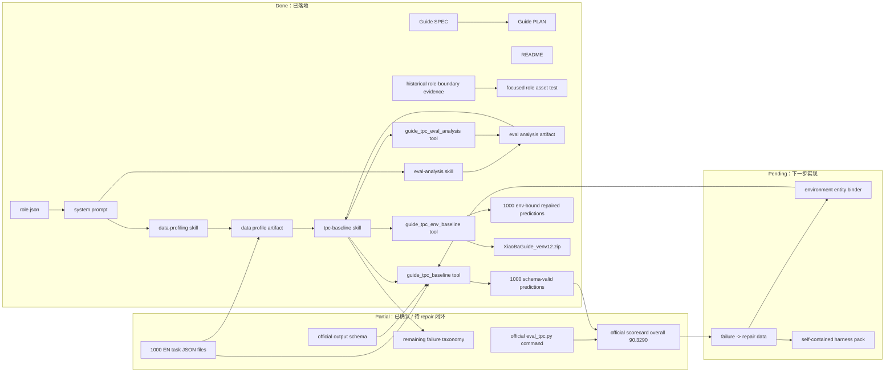

# Guide PLAN

状态：Active
最后更新：2026-06-12
Owner：Guide maintainers / competition maintainers

本文维护 `Guide` 的执行计划。[`SPEC.md`](SPEC.md) 定义 Guide 的角色边界、当前架构、目标架构和比赛数据契约。

## Current Status

`Guide` 已完成角色资产、文档基线、数据画像、eval stage analysis、schema baseline runner、environment-bound baseline runner 和第一版 verifier-filtered repair：`role.json`、README、`prompts/guide-system-prompt.md`、role-local `data-profiling` / `eval-analysis` / `tpc-baseline` skills、SPEC/PLAN、`guide_tpc_baseline` / `guide_tpc_eval_analysis` / `guide_tpc_env_baseline` runtime tools 和 focused tests。它可以通过 `--role guide` 激活，并把默认工作策略固定为先 profile 任务/数据库，再生成 Phase 1 prediction files、schema-valid itinerary JSON、官方 `eval_tpc.py` verifier、stage-level eval analysis、failure repair loop 和 submission zip。旧 role-wide boundary fixture 是历史证据，不再属于 active eval 命令面。

本地 Phase 1 EN 任务目录已确认是 1000 个扁平 JSON 文件，字段包括 `uid`、`nature_language`、`days`、`people_number`、`start_city`、`target_city` 和 `hard_logic_py`。`output/guide/data-profile/phase1-en-v0/profile.md` 记录了当前数据画像：2/3/4/5 天任务分别为 379/370/221/30，1-5 人任务分别为 213/200/218/271/98，`hard_logic_py` 有 1073 个 normalized unique constraints，最高频约束是 day/people/tickets/taxi shape、预算、room type、intercity mode 和实体 name/type。`database_en` 有 3413 attractions、4669 restaurants、3866 accommodations、90 train route files、720 airplane rows 和 subway data。`guide_tpc_baseline` 已在 `phase1-schema-baseline-v0` 生成 1000/1000 个 schema-valid prediction JSON 和 `XiaoBaGuide_v0.zip`；历史 schema-only 分数是 overall 4.2016 / FPR 0。`guide_tpc_env_baseline` 现在会先生成 environment-bound minimal itinerary，再用官方 commonsense / hard-logic functions 做最小侵入 repair 过滤。当前最高 Phase 1 候选是 `output/guide/tpc-env-baseline/phase1-v12-quoteparse-full/`：生成 1000/1000，repair stats 为 base all-pass 503、new all-pass 938、improved 451、commonsense_lost 0，动作分布为 chronology 134、restaurants 103、attractions 97、hotel 86、hotel_distance 33、budget_prune_metro 31、intercity_cheapest 20、time_place 49、transport_metro 6、transport_walk 4，zip 为 `XiaoBaGuide_venv12.zip`。官方 `eval_tpc.py --splits tpc_phase1 --method guide_v12_quoteparse --lang en` 分数：MicEPR 99.996、MacEPR 99.9、C-LPR 98.0661、FPR 93.8、DAV 1.7546、ATT 95.2431、DDR 68.8682、overall 90.3290。最新 `guide_tpc_eval_analysis` 产物在 `output/guide/eval-analysis/phase1-v12-quoteparse-full/`：schema 1000/1000，commonsense/environment 999/1000，raw hard logic 938/1000 full-pass，all-pass 938/1000。

## Milestones

### M0. Role Contract And Architecture Baseline

状态：Completed on 2026-06-09。

已完成：

- 新增 `roles/guide/role.json`，canonical role id 为 `guide`。
- 新增 `Guide` README、system prompt、SPEC 和 PLAN。
- 新增 role-local `data-profiling`、`eval-analysis` 和 `tpc-baseline` skills。
- 在顶层 Roles & Skills docs 中登记 Guide。
- 增加 focused role asset/runtime test，覆盖 role activation、prompt、skill loading、role-specific tool exposure 和 schema baseline artifact emission；旧 Guide role-wide 边界 fixture 仅作为历史证据保留。

验收条件：

- `xiaoba --role guide` 可以解析角色。
- Prompt 明确 schema-valid + verifier-repair baseline 优先级。
- SPEC 包含 Current Architecture 和 Target Architecture Mermaid diagrams。
- PLAN 明确官方 verifier / environment repair 尚未完成。

### M1. Local Official Repo And Verifier Readiness

状态：Completed for first local official verifier smoke / partial for durable repo setup。

目标：建立官方 ChinaTravel 仓库的本地工作副本或配置路径，确认 `eval_tpc.py --lang en` 能跑通一个小样本。

当前证据：已临时 clone 官方 repo 到 `/tmp/chinatravel-official-xiaoba-guide`，生成 `tpc_phase1` split，复制 baseline predictions 到 `results/guide_schema_baseline_en/`，挂载本地 `extract_zh/database` 到 `chinatravel/environment/database`，挂载本地 `extract_en/database_en` 到 `chinatravel/environment/database_en`，并用 `/tmp/chinatravel-official-xiaoba-guide/.venv/bin/python eval_tpc.py --splits tpc_phase1 --method guide_schema_baseline --lang en` 执行 verifier。当前运行记录为 `verifier_status=completed`，score file：`output/guide/tpc-baseline/phase1-schema-baseline-v0/verifier-scores.json`。

任务：

- 固化官方 ChinaTravel repo 位置，避免依赖 `/tmp` 临时 clone。
- 固化 `database` / `database_en` 的本地挂载或配置，避免每轮手动 symlink。
- 建立 Phase 1 split loader，能读取本地 1000 个 EN task uid。
- 运行 empty / minimal prediction 的 verifier smoke，确认 schema failure path 可记录。

验收条件：

- 有一条真实 `eval_tpc.py` command evidence。
- 有 verifier output 或明确 blocked reason。
- 不修改官方 verifier 源码作为通过手段。

### M2. Schema-Valid Prediction Baseline

状态：Completed on 2026-06-09 for local schema baseline。

目标：先让每个 uid 有 schema-valid JSON prediction。

任务：

- 写批量 prediction generator：`guide_tpc_baseline`。
- 复制 task-level `people_number`、`start_city`、`target_city`。
- 生成 exactly `days` 个 day objects。
- 使用官方 output schema 字段要求做本地 JSON validation。
- 把 schema failures 单独记录到 repair queue。

验收条件：

- `results/<method>_en/<uid>.json` 覆盖 1000 个 uid：已完成，`output/guide/tpc-baseline/phase1-schema-baseline-v0/results/guide_schema_baseline_en`。
- schema validation 有统计证据：已完成，1000 passed / 0 failed。
- prediction JSON 不含本地私有绝对路径：已完成；report 中外部数据目录以 `$HOME/...` redacted ref 记录。

### M2.5. Data Profile Driven Tool / Skill Plan

状态：Completed for Phase 1 profile v0; runtime profile tool not started。

目标：先分析任务和官方数据库，再决定 Guide 后续工具和 skill，而不是从 prompt 直觉出发。

当前证据：

- Profile artifacts: `output/guide/data-profile/phase1-en-v0/profile.md` and `output/guide/data-profile/phase1-en-v0/profile.json`.
- 1000 tasks profiled; days/people/routes/hard_logic categories/database coverage recorded.
- Tool/skill order derived from profile: `guide_tpc_data_profile` -> `guide_tpc_eval_analysis` -> entity binder -> constraint parser -> intercity route selector -> budget solver -> failure taxonomy extractor -> LLM writer.

任务：

- 把当前 ad hoc profile 变成 `guide_tpc_data_profile` runtime tool。
- 把 `hard_logic_py` parser 输出固定成 typed JSON contract。
- 用 profile 结果限定后续 tool scope，避免新增无数据依据的 prompt-only skill。

验收条件：

- 每次 Guide 新增 tool/skill 都引用最近 data profile artifact。
- P0/P1/P2 优先级来自任务分布、数据库覆盖或 verifier failure evidence。
- 不能在 FPR=0 时优先做 LLM 文案优化。

### M2.75. Official Eval Stage Analysis

状态：Completed for schema baseline analysis, v3/v6/v12 repair analysis and runtime eval-analysis tool。

目标：把官方 verifier 从 aggregate score 拆成 schema、commonsense/environment、raw hard logic、conditional hard logic、FPR 和 preference stage，作为 repair priority 的依据。

当前证据：

- Latest eval artifacts: `output/guide/eval-analysis/phase1-v12-quoteparse-full/eval-analysis.md`, `eval-analysis.json`, `commonsense-errors.csv`, `hard-logic-failures.csv`, `hard-logic-by-uid.csv`, `uid-stage-summary.csv`, runner logs and manifest.
- Historical schema-baseline artifacts remain under `output/guide/eval-analysis/phase1-schema-baseline-v1-tool/`.
- Schema 1000/1000 pass.
- Commonsense/environment 999/1000 pass; MicEPR 99.996, MacEPR 99.9.
- Raw hard logic 938/1000 full-pass; raw hard micro 98.206 and raw hard macro 93.8.
- C-LPR 98.0661 and FPR 93.8; all-pass is 938/1000.
- Remaining top blockers are one chronology edge case, `other.unclassified` 11/120, `budget.innercity_cost` 10/207, `accommodation.type.choice` 7/24, `accommodation.name.require` 5/70, `attraction.type.require` 5/27, `restaurant.name.require` 4/44 and `restaurant.type.require` 4/19.
- Local official `eval_tpc.py` currently duplicates MicEPR in the final formula where the published guide names EPR-macro; re-check before real submission.

已完成：

- `guide_tpc_eval_analysis` runtime tool writes per-stage matrix, runner config/logs and tool-owned artifact manifest.
- Runtime tool was executed against `/tmp/chinatravel-official-xiaoba-guide` with `output/guide/tpc-baseline/phase1-schema-baseline-v0/results/guide_schema_baseline_en`.
- Runtime tool was also executed against `output/guide/tpc-env-baseline/phase1-v6-route-full/results/guide_v6_route_en` and `output/guide/tpc-env-baseline/phase1-v12-quoteparse-full/results/guide_v12_quoteparse_en`.

任务：

- 将 `guide_tpc_env_baseline` 后续 repair loop 与 `guide_tpc_eval_analysis` 串联，避免手动二次调用。
- 用 v12 commonsense failure columns 和 hard-logic category failures 生成 targeted repair queue。

验收条件：

- 每轮 repair 前有 stage-level blocker。
- Repair priority cites eval-analysis artifact, not only overall score。
- Preference optimizer remains blocked until `all_pass_id` is non-empty。

### M3. Official Verifier Repair Loop

状态：Completed for v12 chronology, entity, budget-transport, route-mode, time/place, hotel-distance, cheapest-intercity, budget-prune and quote-safe entity repair loop; residual time-window/entity repair remains next。

目标：把 baseline 从 schema-valid 推到 verifier-repaired。

已完成：

- `guide_tpc_env_baseline` 已生成 environment-bound minimal itinerary，并用官方 commonsense / hard-logic functions 做 bounded candidate filtering。
- v12 repair 只接受 commonsense 保持通过且 hard logic 通过数提升的 chronology prune、景点、餐馆、酒店、市内交通、time/place、酒店距离、最低价城际交通、预算剪枝和 quote-safe entity parser 变更。
- 全量 Phase 1 v12 产物：`output/guide/tpc-env-baseline/phase1-v12-quoteparse-full/results/guide_v12_quoteparse_en`。
- Submission zip：`output/guide/tpc-env-baseline/phase1-v12-quoteparse-full/XiaoBaGuide_venv12.zip`。
- 官方 score delta：overall 70.4136 / FPR 53.7 的 env-bound v1 提升到 overall 90.3290 / FPR 93.8 的 v12 repair。
- 最新 eval-analysis：`output/guide/eval-analysis/phase1-v12-quoteparse-full/eval-analysis.md`。

剩余任务：

- 修复 1 条 residual chronology commonsense failure。
- 分类 `other.unclassified`，优先实现 time-window / duration repair。
- 扩展 residual budget / entity type-choice repair，并保持官方 route/time/cost/entity record 合法。
- 把 remaining failure taxonomy 转成下一轮 repair queue。

验收条件：

- 至少有一轮 end-to-end verifier scorecard：已完成，v12 overall 90.3290 / FPR 93.8。
- 每个 repair action 都绑定失败 uid、verifier stage 和 failure class：v12 generation-report 记录 base/new hard pass、actions 和 examples。
- 不把 soft preference 优化排在 hard constraint repair 前。

### M4. Phase 1 Submission Package

状态：Partial; v12 candidate zip exists。

目标：生成可提交 zip，并在官方 verifier / ReviewerCat 审查后进入真实提交。

任务：

- 选择 method/team/version 命名。
- 检查 zip 内只包含 prediction files / 官方允许的结构。
- 记录 verifier evidence、命令、生成时间和 manifest。
- 交给 ReviewerCat 做提交前审查。

验收条件：

- `{TeamName}_v{x}.zip` 存在：历史 schema zip 为 `output/guide/tpc-baseline/phase1-schema-baseline-v0/XiaoBaGuide_v0.zip`；当前高分候选为 `output/guide/tpc-env-baseline/phase1-v12-quoteparse-full/XiaoBaGuide_venv12.zip`。
- zip 内容和文件数可审计：v12 zip has `results/guide_v12_quoteparse_en/*.json` and 1000 prediction files plus directory entries。
- ReviewerCat 审查未发现 Phase 1 禁止物：未开始。

### M5. Phase 2 Harness Preparation

状态：Not started。

目标：把 Phase 1 有效 loop 迁移为 self-contained harness 设计。

任务：

- 冻结 prompt/scaffolding/data-contract。
- 移除本机私有路径依赖。
- 明确 Qwen3.6-27B 或官方最新模型/runtime 假设。
- 准备 reproducible entrypoint、requirements、README 和 smoke case。

验收条件：

- 新环境能从输入任务生成 prediction files。
- Harness 不依赖 Phase 1 本地临时输出。
- 官方 Phase 2 最新规则已复核。

## Next Steps

1. 修 1 条 residual `Does not follow Chronological Order` edge case，保持 v12 的 route、budget 和 entity gains 不回退。
2. 分类 `other.unclassified` 11/120 failure，优先处理 activity time-window / duration 约束。
3. 继续做 `budget.innercity_cost` 10/207 尾部 repair：减少非必需市内段或选择更近的住宿/活动组合，并用 verifier 过滤 route/time/cost。
4. 继续补实体 parser 的 type/choice/forbid 边界，处理剩余 accommodation/restaurant/attraction failures。
5. 把 `output/guide/data-profile/phase1-en-v0/profile.*` 固化为可复跑的 `guide_tpc_data_profile` runtime tool；`guide_tpc_eval_analysis` 已有 runtime tool 和 v12 evidence。
6. 固化官方 ChinaTravel repo、本地 `database` / `database_en` 挂载和 `tpc_phase1` split，避免依赖 `/tmp` 手工环境。

## Owners

- Guide role assets：`roles/guide/**`
- Role catalog and policy docs：`roles/SPEC.md` / `roles/PLAN.md`
- Guide runtime tools：`src/roles/guide/tools/tpc-baseline-tool.ts`, `src/roles/guide/tools/env-baseline-tool.ts`, and `src/roles/guide/tools/eval-analysis-tool.ts`
- Guide data profile skill/artifacts：`roles/guide/skills/data-profiling/**` and `output/guide/data-profile/**`
- Guide eval analysis skill/artifacts：`roles/guide/skills/eval-analysis/**` and `output/guide/eval-analysis/**`
- Official verifier wrapper：`guide_tpc_baseline` plus future `src/roles/guide/**` repair utilities
- Submission review：`roles/reviewer-cat/**`

## Acceptance Criteria

- Guide remains a role, not a second runtime.
- Phase 1 work produces prediction files, not code/model submission artifacts.
- No baseline is called ready without official verifier evidence or a documented blocker.
- No new Guide tool or skill is accepted without citing a current task/database profile and verifier stage-analysis artifact.
- Every substantial architecture change updates Guide SPEC and PLAN.
- Any Guide runtime tool has explicit artifact/evidence contracts before being exposed.

## Risks / Open Questions

- Official Phase 2 details may change; re-check the competition site before hard-coding harness assumptions.
- Official environment data may be missing locally, which would block real verifier execution.
- `hard_logic_py` can help repair, but overfitting to it without environment feasibility can still fail official evaluation.
- A pure LLM generator may produce plausible but nonexistent POIs, restaurants, hotels, flights or trains; environment binding must become first-class before score chasing.
- Current profile extraction is ad hoc; it must become a runtime tool before relying on it as repeated competition evidence.
- Eval-analysis extraction is now reproducible through `guide_tpc_eval_analysis`; the remaining risk is wiring it automatically into bounded repair loops.

## Verification Log

- 2026-06-12：Promoted Phase 1 candidate from v6 to v12. `guide_tpc_env_baseline` now keeps the environment-bound skeleton, then uses official commonsense / hard-logic functions to accept chronology pruning, lower-cost inner-city transport, per-leg route-mode, attraction, restaurant, hotel, hotel-distance, time/place, cheapest-intercity, budget-prune and quote-safe entity repairs only when verifier metrics improve or do not regress. Full run artifacts: `output/guide/tpc-env-baseline/phase1-v12-quoteparse-full/`; zip: `output/guide/tpc-env-baseline/phase1-v12-quoteparse-full/XiaoBaGuide_venv12.zip`; eval-analysis: `output/guide/eval-analysis/phase1-v12-quoteparse-full/`. Repair stats: base all-pass 503, new all-pass 938, improved 451, commonsense_lost 0, actions chronology 134 / restaurants 103 / attractions 97 / hotel 86 / time_place 49 / hotel_distance 33 / budget_prune_metro 31 / intercity_cheapest 20 / transport_metro 6 / transport_walk 4. Official `eval_tpc.py --splits tpc_phase1 --method guide_v12_quoteparse --lang en` score: MicEPR 99.996, MacEPR 99.9, C-LPR 98.0661, FPR 93.8, DAV 1.7546, ATT 95.2431, DDR 68.8682, overall 90.3290. Remaining blockers: other.unclassified 11/120, budget.innercity_cost 10/207, accommodation.type.choice 7/24, accommodation.name.require 5/70, attraction.type.require 5/27, restaurant.name.require 4/44, restaurant.type.require 4/19 and one chronology edge case. Verification：`npm run build`; `node --test -r tsx test/guide-role.test.ts test/tool-manager-roles.test.ts`; `npm run eval:all-roles`; `npm run check:eval-assets`; `git diff --check`; real v12 full run; real `guide_tpc_eval_analysis` v12 run; zip audit found 1000 prediction JSON files.
- 2026-06-10：Promoted Phase 1 candidate from v3 to v6. `guide_tpc_env_baseline` now keeps the environment-bound skeleton, then uses official commonsense / hard-logic functions to accept chronology pruning, lower-cost inner-city transport, per-leg route-mode, attraction, restaurant and hotel repairs only when verifier metrics improve or do not regress. Full run artifacts: `output/guide/tpc-env-baseline/phase1-v6-route-full/`; zip: `output/guide/tpc-env-baseline/phase1-v6-route-full/XiaoBaGuide_venv6.zip`; eval-analysis: `output/guide/eval-analysis/phase1-v6-route-full/`. Repair stats: base all-pass 503, new all-pass 826, improved 362, commonsense_lost 0, actions chronology 134 / attractions 95 / restaurants 93 / hotel 85 / transport_metro 29 / transport_walk 5. Official `eval_tpc.py --splits tpc_phase1 --method guide_v6_route --lang en` score: MicEPR 99.996, MacEPR 99.9, C-LPR 94.6749, FPR 82.6, DAV 1.4755, ATT 95.7261, DDR 69.7612, overall 85.0561. Remaining blockers: other.unclassified 51/120, accommodation.name.require 31/70, intercity.mode.airplane 22/186, budget.innercity_cost 18/207 and one chronology edge case. Verification：`npm run build`; `node --test -r tsx test/guide-role.test.ts test/tool-manager-roles.test.ts`; real v4/v5/v6 smoke/full tool runs; real `guide_tpc_eval_analysis` v6 run; zip audit found 1000 prediction JSON files.
- 2026-06-10：Promoted Phase 1 priority from environment-bound v1 to verifier-filtered v3 repair. `guide_tpc_env_baseline` now keeps the stable environment-bound skeleton, then uses official commonsense / hard-logic functions to accept only minimal attraction, restaurant and hotel entity repairs that preserve commonsense and improve hard-logic pass count. Full run artifacts: `output/guide/tpc-env-baseline/phase1-env-bound-v3-tool/`; zip: `output/guide/tpc-env-baseline/phase1-env-bound-v3-tool/XiaoBaGuide_venv3.zip`; eval-analysis: `output/guide/eval-analysis/phase1-v3-repair-tool/`. Repair stats: base all-pass 537, new all-pass 731, improved 245, commonsense_lost 0, actions attractions 95 / restaurants 89 / hotel 82. Official `eval_tpc.py --splits tpc_phase1 --method guide_v3_repair --lang en` score: MicEPR 99.824, MacEPR 95.6, C-LPR 89.2657, FPR 73.1, DAV 1.482, ATT 96.055, DDR 75.431, overall 80.1696. Remaining blockers: chronology 44, budget.innercity_cost 52/207, intercity.mode.airplane 41/186, and residual entity constraints. Verification：`npm run build`; real 100-task tool smoke overall 85.8716; real full tool run; real `guide_tpc_eval_analysis` v3 run.
- 2026-06-09：Added official eval stage analysis after the first schema baseline. Wrote initial manual artifacts under `output/guide/eval-analysis/phase1-schema-baseline-v0/`, then implemented `guide_tpc_eval_analysis` runtime tool and reran it into `output/guide/eval-analysis/phase1-schema-baseline-v1-tool/`. The tool calls official ChinaTravel evaluation functions directly because `eval_tpc.py` only appends aggregate scores; it writes `eval-analysis.json`, `eval-analysis.md`, `commonsense-errors.csv`, `hard-logic-failures.csv`, `hard-logic-by-uid.csv`, `uid-stage-summary.csv`, runner config/logs and manifest. Findings: schema 1000/1000, commonsense/environment 0/1000, raw hard logic 462/1000 full-pass with raw micro 81.362 and raw macro 46.2, C-LPR/FPR 0 because no uid enters `commonsense_pass_id` / `all_pass_id`. Added role-local `eval-analysis` skill and updated Guide prompt / skills / SPEC / PLAN so new repair tools must cite stage-level eval evidence before implementation. Also restored the existing SecretaryCat `feishu_auth_login_complete` role-tool artifact contract entry while updating the shared artifact contract. Verification：`node --test -r tsx test/guide-role.test.ts test/tool-manager-roles.test.ts` (25/25); `npm run build`; real tool run with `/tmp/chinatravel-official-xiaoba-guide/.venv/bin/python`; `npm run eval:all-roles` (6/6); `npm run check:eval-assets` (4779/4779); `git diff --check`.
- 2026-06-09：Added Guide data profiling pass before deciding new tools/skills. Wrote `output/guide/data-profile/phase1-en-v0/profile.json` and `profile.md`, added role-local `data-profiling` skill, updated Guide prompt and `tpc-baseline` workflow so new Guide tools/skills must cite task/database/verifier profile evidence. Profile findings: 1000 tasks, 1073 normalized hard_logic constraints, 3413 EN attractions, 4669 EN restaurants, 3866 EN accommodations, 90 train route files, 720 airplane rows; data-driven tool order is profile tool, constraint parser, entity binder, route selector, budget solver, failure taxonomy extractor, then LLM writer.
- 2026-06-09：Added `guide_tpc_baseline` runtime tool with task loader, local schema baseline generator, manifest/report/repair queue writer, optional zip packaging, optional official verifier invocation hook, role registry wiring, artifact contract coverage and focused runtime tests. Ran the local Phase 1 EN schema baseline over 1000/1000 tasks: `output/guide/tpc-baseline/phase1-schema-baseline-v0/results/guide_schema_baseline_en`, local schema 1000 passed / 0 failed, empty failure queue, zip `output/guide/tpc-baseline/phase1-schema-baseline-v0/XiaoBaGuide_v0.zip`. After mounting local `extract_zh/database` and `extract_en/database_en` into the temporary ChinaTravel clone, official `eval_tpc.py` completed against generated `tpc_phase1` split: MicEPR 21.008, MacEPR 0, C-LPR 0, FPR 0, DAV 0, ATT 0, DDR 0, overall 4.2016; scores at `output/guide/tpc-baseline/phase1-schema-baseline-v0/verifier-scores.json`. Verification：`node --test -r tsx test/guide-role.test.ts test/tool-manager-roles.test.ts` (24/24); `npm run build`; `legacy eval contract check` (12/12); `node --test -r tsx test/eval-schema-validation.test.ts` (65/65); `npm run eval:all-roles` (6/6); `npm run eval:runtime` (33/33 benchmark cases, 70/70 eval cases); `npm run eval:gate` (28/28 items, 146/146 cases); `legacy eval baseline check` (154/154); `legacy eval review check` (queued=56, manualRequired=2); `legacy eval coverage check` (125/125); `npm run check:eval-assets` (7340/7341 passed, 0 failed, 1 skipped); `git diff --check`.
- 2026-06-09：Added Guide role assets, `tpc-baseline` skill, role-level SPEC/PLAN, top-level role docs registration, All-Roles Guide boundary fixture, and focused role tests. Verification：`node --test -r tsx test/guide-role.test.ts test/tool-manager-roles.test.ts` (22/22); `npm run eval:all-roles` (6/6); `npm run eval:runtime` (33/33 benchmark cases, 70/70 eval cases); `npm run build`; `npm run eval:gate` (28/28 items, 146/146 cases); `legacy eval baseline check` (154/154); `legacy eval coverage check` (125/125); `npm run check:eval-assets` (7330/7331 passed, 0 failed, 1 skipped).
