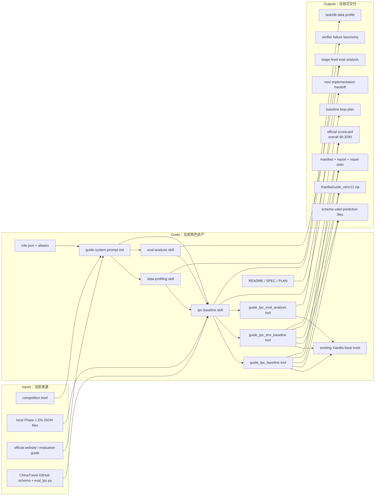
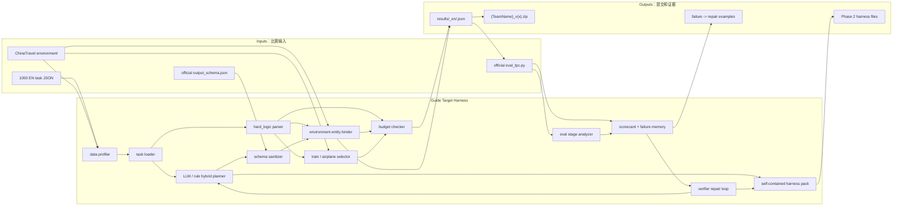

# Guide SPEC

状态：Active
最后更新：2026-06-12
适用范围：`roles/guide` 中国旅行规划比赛角色、Phase 1 prediction-file baseline、官方 verifier repair loop，以及后续 Phase 2 self-contained harness 准备。

`Guide` 是 XiaoBa 面向 ChinaTravel / Travel Planning Challenge 的比赛角色。它的职责是把自然语言旅行需求转成可执行、schema-valid、官方 verifier 可检验的多日中国旅行 itinerary JSON，并把 verifier 失败沉淀成可修复、可复现、可训练的数据闭环。

## Problem

Agentic AI 旅行规划比赛的第一阶段不是比谁写的游记更漂亮，而是比谁能为一批自然语言任务提交合法 prediction files。官方评价会检查 schema、环境可行性、逻辑约束、最终通过率和偏好指标；硬约束权重高于软偏好。因此 XiaoBa 需要一个专门角色，把工作方式固定为：

- 先让输出 JSON 合法；
- 再让官方 verifier 通过；
- 再优化每天景点数、交通时间、餐饮推荐等软偏好；
- 最后把 prediction files 打包提交；
- 等 baseline 有分数和失败类别后，再考虑 SFT/RL 或更复杂的搜索。

## Scope

In scope:

- 读取 Phase 1 EN 任务目录：`/Users/guowei/minimind/data/ijcai2026_chinatravel/TPC_IJCAI_2026_phase1_EN/`。
- 读取官方 ChinaTravel schema、runner 和 verifier。
- 生成每个 `uid` 对应的 itinerary JSON prediction file。
- 本地调用官方 `eval_tpc.py`，记录 schema、环境、逻辑、FPR 和偏好指标。
- 根据 verifier failure 分类修复 prediction。
- 输出 submission zip，只包含 Phase 1 要求的 prediction files。
- 设计后续 Phase 2 self-contained harness 的 prompt、scaffolding、repair loop 和可移植依赖。

Out of scope:

- Phase 1 提交代码、模型权重或私有运行日志。
- 在 baseline verifier loop 之前优先训练小模型或做 RL。
- 修改官方 verifier 作为通过比赛的手段。
- 让 Guide 取代 ReviewerCat 的 release judgement 或 benchmark acceptance。
- 把比赛数据、预测结果或官方环境复制进 XiaoBa core runtime。

## Current Architecture

当前 `Guide` 是可激活的比赛角色：`role.json`、README、system prompt、`data-profiling` / `eval-analysis` / `tpc-baseline` role-local skills、SPEC/PLAN、`guide_tpc_baseline`、`guide_tpc_eval_analysis` 和 `guide_tpc_env_baseline` runtime tools 已落地。`guide_tpc_baseline` 会读取本地 Phase 1 EN 任务目录，生成 schema-valid `results/<method>_en/<uid>.json`、run manifest、报告、repair queue 和可选 submission zip。`guide_tpc_env_baseline` 先调用官方 ChinaTravel environment API 绑定真实往返城际交通、酒店、餐馆和市内交通段，再用官方 commonsense / hard-logic functions 做最小侵入 repair 过滤：只在 commonsense 仍通过且 hard logic 通过数提升时接受 chronology prune、景点、餐馆、酒店、市内交通、time/place、酒店距离、最低价城际交通、预算剪枝和 quote-safe entity parser 候选。`guide_tpc_eval_analysis` 会调用官方 schema / commonsense / hard-logic evaluation functions，生成 stage-level JSON/Markdown/CSV failure matrices。当前最高 Phase 1 候选产物在 `output/guide/tpc-env-baseline/phase1-v12-quoteparse-full/`：生成 1000/1000 predictions、`XiaoBaGuide_venv12.zip` 和官方 `eval_tpc.py` scorecard，MicEPR 99.996、MacEPR 99.9、C-LPR 98.0661、FPR 93.8、DAV 1.7546、ATT 95.2431、DDR 68.8682、overall 90.3290。`output/guide/eval-analysis/phase1-v12-quoteparse-full/eval-analysis.md` 是最新 stage breakdown：schema 1000/1000、commonsense/environment 999/1000、raw hard logic 938/1000 full-pass、all-pass 938/1000。剩余 blocker 主要是一个 chronology edge case、`other.unclassified` time-window/duration 约束、预算、住宿/餐馆/景点类型与名字边界，以及少量 route/entity 尾部约束。



## Target Architecture

目标是把 Guide 从角色资产推进到可执行 baseline harness：先 profile 任务和官方数据库，再批量读取任务、解析 `hard_logic_py`、绑定官方环境实体、选择城际交通、预算检查、生成 schema-valid predictions、调用官方 verifier、按 failure class 做 targeted repair、记录 scorecard，并把通过本地 verifier 的 prediction files 打成 Phase 1 zip。Phase 2 目标是在不依赖本地私有状态的情况下，把同一套 agent/harness/prompt/scaffolding 打包给主办方环境运行。



## Data Contracts

## Data Profile Findings

Current data profile artifact:

```text
output/guide/data-profile/phase1-en-v0/profile.md
output/guide/data-profile/phase1-en-v0/profile.json
```

Phase 1 EN profile findings:

- 1000 tasks; days distribution is 2-day 379, 3-day 370, 4-day 221, 5-day 30.
- People distribution is 1 person 213, 2 people 200, 3 people 218, 4 people 271, 5 people 98.
- `hard_logic_py` is sparse/heterogeneous: 474 tasks have one constraint, 62 have five, 464 have six; 1073 unique normalized constraint strings.
- The highest-frequency task-level hard constraint classes are day count, people count, ticket count and taxi car count at 526 tasks each, then intercity/total/budget/room/transport constraints.
- `database_en` contains 3413 attractions, 4669 restaurants, 3866 accommodations, 90 train route files, 720 airplane rows and subway data.
- Historical schema-only baseline score was overall 4.2016 / FPR 0. The current environment-bound + verifier-filtered repair candidate is overall 90.3290 / FPR 93.8, so the next value comes from other.unclassified time-window/duration repair, the remaining chronology edge case, residual budget repair and entity boundary cases rather than prettier generation.

Data-driven Guide tool / skill order:

1. `guide_tpc_data_profile` runtime tool: make task/database/verifier profile reproducible instead of ad hoc.
2. `guide_tpc_eval_analysis` runtime tool: make verifier stage breakdown reproducible instead of aggregate-score-only.
3. Environment entity binder: choose official attractions, restaurants, accommodations and positions by city/name/type/cost/time.
4. Hard-logic constraint parser: normalize `hard_logic_py` into typed constraints that guide entity and route choices.
5. Intercity route selector: choose train/airplane records from official transport data.
6. Budget solver/checker: reject plans that exceed hard cost constraints before verifier.
7. Failure taxonomy extractor: turn verifier or symbolic results into uid/category repair queue.
8. LLM itinerary writer: only after parser/binder/solver have created a legal candidate space.

## Eval Analysis Findings

Current eval analysis artifact:

```text
output/guide/eval-analysis/phase1-v12-quoteparse-full/eval-analysis.md
output/guide/eval-analysis/phase1-v12-quoteparse-full/eval-analysis.json
```

Phase 1 v12 quote/entity/budget repair eval findings:

- Schema passes 1000/1000.
- Commonsense/environment passes 999/1000; MicEPR is 99.996 and MacEPR is 99.9.
- Raw hard logic passes 938/1000 full tasks; raw hard-logic micro is 98.206 and raw macro is 93.8.
- Conditional hard logic C-LPR is 98.0661 and FPR is 93.8 because 938 uid appear in schema pass, commonsense pass and hard-logic pass simultaneously.
- DAV/ATT/DDR are 1.7546 / 95.2431 / 68.8682 through official `eval_tpc.cal_default_pr_score`.
- Current top commonsense failure is one residual `Does not follow Chronological Order` edge case.
- Current top hard-logic failures are `other.unclassified` 11/120, `budget.innercity_cost` 10/207, `accommodation.type.choice` 7/24, `accommodation.name.require` 5/70, `attraction.type.require` 5/27, `restaurant.name.require` 4/44 and `restaurant.type.require` 4/19.
- The published evaluation guide names the second 10% score term as EPR-macro, while the local official `eval_tpc.py` currently computes `0.1*micro_comm + 0.1*micro_comm + ...`; Guide treats the local official code as executable truth for this run and must re-check before submission.

Input task contract:

```text
uid: string
nature_language: string
days: integer
people_number: integer
start_city: string
target_city: string
hard_logic_py: string[]
```

Prediction contract follows the official ChinaTravel output schema:

```text
people_number: integer
start_city: string
target_city: string
itinerary: [
  {
    day: integer,
    activities: [
      {
        type: airplane | train | attraction | breakfast | lunch | dinner | accommodation,
        start_time: HH:MM,
        end_time: HH:MM,
        cost: number,
        price: number,
        transports: [...]
      }
    ]
  }
]
```

Submission contract:

```text
results/<method_name>_en/<uid>.json
{TeamName}_v{x}.zip
```

Evidence contract:

- verifier command;
- evaluated split and method name;
- number of task files;
- schema pass rate;
- prediction directory and zip path;
- environment pass rate;
- C-LPR and FPR where available;
- DAV / ATT / DDR where available;
- eval-analysis artifact path and stage-level blocker;
- top failure classes;
- representative failing uid;
- repair action and rerun result.

## Interaction With Other Modules

- `roles/SPEC.md` owns the top-level role boundary and role catalog.
- `docs/agent-runtime/SPEC.md` owns runtime loop, tool execution and provider transcript contracts.
- `eval/` and `eval/benchmarks/` own XiaoBa release gates; Guide's competition verifier is an external domain verifier until a dedicated benchmark module exists.
- `ReviewerCat` should review a Phase 1 submission package before real submission.
- `UserCat` may later generate low-information prompts to stress-test Guide, but it must not judge competition scores.
- `roles/guide/skills/eval-analysis/SKILL.md` owns the stage-level verifier analysis workflow.
- `src/roles/guide/tools/tpc-baseline-tool.ts` owns the schema-only baseline runner and tool-owned artifact manifest.
- `src/roles/guide/tools/env-baseline-tool.ts` owns the current highest-scoring Phase 1 environment-bound + verifier-filtered repair runner and submission zip artifact.
- `src/roles/guide/tools/eval-analysis-tool.ts` owns the reproducible official eval stage analyzer and tool-owned artifact manifest.
- Future Guide tools should remain under `src/roles/guide/**` and update this SPEC before expanding beyond schema baseline / verifier wrapper responsibilities.
