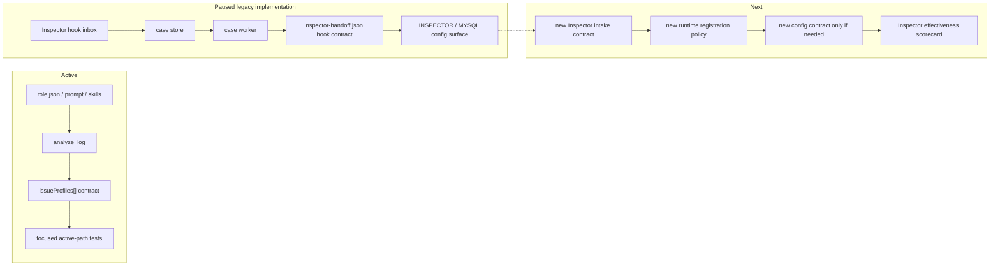

# InspectorCat PLAN

状态：Refactor prep
最后更新：2026-06-27
Owner：InspectorCat maintainers

本文维护 `roles/inspector-cat/` 的当前状态和后续计划。设计真相源见 `SPEC.md`。

## Current Status

InspectorCat 已进入重构准备状态。当前 active 路径保留角色资产、prompt、role-local skills 和 `analyze_log` 日志取证工具；旧 Inspector hook inbox、case store、case worker、agent review executor 和 MySQL archive 实现仍保留在 `src/roles/inspector-cat/**`，但已经从默认 runtime 启动、Dashboard API 挂载和 Dashboard 配置页中移除。

`analyze_log` 仍是最小可用合同：除了 `summary`、`toolStats`、`issues` 和 bounded deep `turns`，还输出 `summary.signalQuality`、`summary.recommendedIntakeAction` 和 `issueProfiles[]`。旧 hook executor 的自动 case 审查合同暂时不再作为 active 路径承诺；重构前不要继续扩展 `INSPECTOR_*` / `MYSQL_*` 配置面。

## Milestones

1. Role resource baseline: completed.
2. Log review skill baseline: completed.
3. Inspector hook runtime baseline: paused for refactor; code retained, but default registration/startup and Dashboard config are removed.
4. SPEC/PLAN governance baseline: completed.
5. Structured issue profile schema: completed via `analyze_log.issueProfiles[]`.
6. Hook handoff contract: paused with the legacy hook implementation; `inspector-handoff.json` remains a useful shape but is not an active hook guarantee.
7. Historical role-boundary deterministic gates: completed v0 through retired `eval:all-roles` and `eval:role-handoff`; current follow-up is live runtime handoff capture, not reusing those commands.
8. Evidence-to-candidate handoff: partial; deterministic handoff exists, but live issue profiles remain quarantined candidate evidence until a runtime or role owner makes an explicit source edit.
9. Live Inspector effectiveness gate: blocked on the new Inspector refactor contract.

## Next Steps

- Define the new Inspector intake/runtime/config contract before re-enabling hook server behavior.
- Keep `analyze_log` stable enough to support refactor evidence and regression checks.
- Decide whether the refactored Inspector needs any Dashboard config surface; do not re-add `INSPECTOR_*` / `MYSQL_*` fields by default.
- Add sanitized session JSONL fixtures after the new intake contract is clear.
- Keep InspectorCat's implementation boundary narrow: it can diagnose and route; EngineerCat fixes; ReviewerCat verifies.

## Owners

- Role assets：`roles/inspector-cat/**`
- Runtime tool：`src/roles/inspector-cat/tools/analyze-log-tool.ts`
- Legacy hook/runtime reference：`src/roles/inspector-cat/inspector-case-worker.ts`, `src/roles/inspector-cat/utils/**`
- Runtime issue fixes：EngineerCat
- Verification / closure：ReviewerCat
- Benchmark feedback：runtime harness and role benchmark owners

## Acceptance Criteria

- Formal Inspector outputs cite concrete log/session evidence.
- `analyze_log` returns `summary.signalQuality` and `issueProfiles[]` for production routing.
- Each issue profile identifies suspected owner, route target, recommended next action and evidence refs.
- Thin samples are marked `insufficient_signal` instead of being treated as healthy.
- Legacy Inspector hook services are not auto-started and are not exposed through Dashboard config while the refactor is pending.
- InspectorCat does not implement fixes or mark cases closed.
- Repeated patterns require repetition evidence before becoming skill proposals.
- Runtime invariant findings can become quarantined benchmark/replay candidates, but InspectorCat cannot mark them accepted.

## Verification Log

- 2026-05-29：Created InspectorCat `SPEC.md` and `PLAN.md` with Current/Target architecture diagrams.
- 2026-05-31：Added deterministic InspectorCat -> EngineerCat -> ReviewerCat handoff evidence through `eval:role-handoff`, including Inspector issue route, Engineer patch/validation handoff and Reviewer final decision.
- 2026-06-03：Promoted InspectorCat to production triage contract. `analyze_log` now emits `signalQuality` and `issueProfiles[]`; hook executor explicitly runs as `inspector-cat` and records `inspector-handoff.json` readiness with routeable `inspector-handoff.json`. Verification：`node --test -r tsx test/analyze-log-tool.test.ts test/inspector-case-worker.test.ts test/inspector-runtime-support.test.ts test/tool-manager-roles.test.ts test/skill-manager-runtime.test.ts` passed (21/21); `npm run eval:all-roles` passed (5/5); `npm run eval:role-handoff` passed (1/1); `npm run check:eval-assets` passed (3270/3270); `npm run build` passed.
- 2026-06-10：Slimmed InspectorCat benchmark language from automatic source acceptance to quarantined candidate evidence owned by runtime/role benchmark maintainers. Verification：`node --test -r tsx test/dashboard-observability-api.test.ts test/eval-schema-validation.test.ts` (65/65); `npm run eval:role-benchmarks` (10/10 items, 88/88 cases); `git diff --check`.
- 2026-06-27：Removed the legacy Inspector standalone config surface from Dashboard and `.env.example`, and stopped auto-registering/auto-starting the Inspector hook runtime from the role registry while the Inspector refactor is pending. Verification：`node --test -r tsx test/tool-manager-roles.test.ts`; `node --test -r tsx test/skill-manager-runtime.test.ts`; `node --test -r tsx test/analyze-log-tool.test.ts test/inspector-runtime-support.test.ts`; `npm run build`; `git diff --check`.

## Risks / Open Questions

- Refactor target is not yet written; do not rebuild hook/server behavior until the target contract is explicit.
- Live model output quality over real uploaded cases is not currently an active gate because the hook path is paused.
- Current issue profile classification is deterministic and conservative; more categories may be needed as real traces accumulate.
- Skill mining can create noise if repetition thresholds are not enforced.
- All-role live E2E may become expensive; keep deterministic boundary gates fast and add live lanes selectively.

## Status Maintenance Rules

- Update `SPEC.md` when InspectorCat gains new issue profile fields, routing destinations, hook artifacts, or runtime tools.
- Update this plan when milestone status changes or new verification evidence exists.
- Do not mark a finding route complete until the receiving role has enough evidence to act.
- Do not re-expand InspectorCat into implementation or closure ownership.
