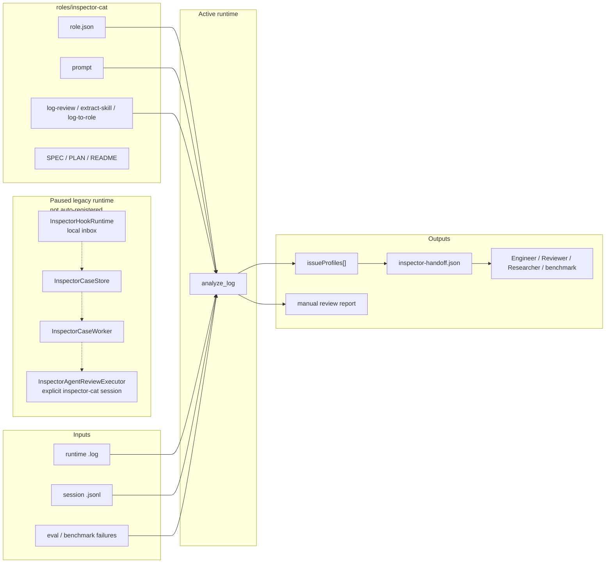
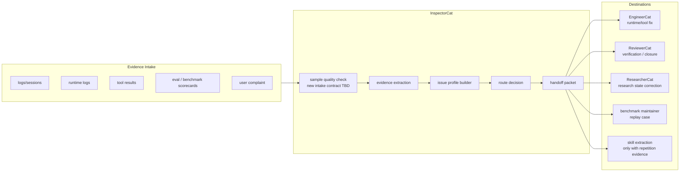

# InspectorCat SPEC

状态：Refactor prep
最后更新：2026-06-27
适用范围：`roles/inspector-cat/` 角色资源、`analyze_log` 生产 issue profile 合同、跨角色 handoff，以及暂存的 `src/roles/inspector-cat/` legacy hook/runtime 实现。

`InspectorCat` 是 XiaoBa Runtime 的生产级故障分诊、证据取证和路由角色。它不负责修复，也不负责最终验收；它负责把混乱的日志、session trace、tool failure、role 行为异常和 eval/benchmark 失败转成可复查、可路由、可执行的 issue profile。

一句话边界：

```text
InspectorCat = Triage / Forensics / Router
```

## Problem

XiaoBa 的复杂度已经超过“工程师修、审查员验”两段式。很多失败第一时间并不知道归属：

- 是 runtime agent loop、provider transcript、tool registry、surface delivery 还是 session restore 的问题？
- 是 role prompt、skill 触发、tool policy、外部 API、用户样本太薄，还是目标角色越界？
- 证据来自哪条 session JSONL、哪一轮、哪个 tool call/result、哪个 artifact？
- 这个问题应该交给 EngineerCat 修，交给 ReviewerCat 验，交给 ResearcherCat 更新长期状态，还是先补日志？
- 重复失败是否应该升级成 benchmark / replay / skill opportunity？

InspectorCat 的生产职责是回答这些问题，并生成下游角色能直接消费的结构化交接物。

## Scope

In scope:

- `roles/inspector-cat/role.json`
- `roles/inspector-cat/prompts/`
- `roles/inspector-cat/skills/`
- `src/roles/inspector-cat/tools/analyze-log-tool.ts`
- `src/roles/inspector-cat/inspector-case-worker.ts` and `utils/*` as retained refactor reference code
- XiaoBa text runtime logs and session JSONL review
- `issueProfiles[]` production output from `analyze_log`
- `inspector-handoff.json` for EngineerCat / ReviewerCat routing
- runtime invariant and replay/benchmark candidate identification

Out of scope:

- 主动实现修复；实现主体是 EngineerCat。
- `closed / reopened / blocked` 最终验收；裁决主体是 ReviewerCat。
- 长周期科研项目状态维护；状态主体是 ResearcherCat。
- 普通用户事务、日程、消息或外部副作用；属于 SecretaryCat 或 surface tools。
- 通用日志平台；InspectorCat 深度耦合 XiaoBa Runtime 证据语义。
- Legacy Inspector hook server operation, Dashboard Inspector config, and MySQL-backed Inspector storage until the refactor defines a new target contract.

## Current Architecture

当前 InspectorCat 处于重构准备状态：角色资产、prompt、role-local skills 和 `analyze_log` 专属工具仍然保留；旧 Inspector hook runtime、case store、worker、agent review executor 和 MySQL archive 实现保留在 `src/roles/inspector-cat/**`，但不再由 `runtime-role-registry` 自动挂载 `/api/inspector`，也不再随 `inspector-cat` 激活自动启动。Dashboard 配置页和 `.env.example` 不再暴露 `INSPECTOR_*` / `MYSQL_*` 旧配置项。

`analyze_log` 仍返回 `summary` / `issues` / `turns` / `toolStats` / `issueProfiles[]`，用于保留当前日志取证和 handoff 的最小可用路径。旧 hook/server/storage 代码只是重构参考，不能被当作 active 架构入口。



## Target Architecture

目标是先移除旧的独立配置面，再重新定义 InspectorCat 的接入方式。重构后的 InspectorCat 仍应是 runtime/role/skill/surface 异常的分诊入口：先收集证据，产出 issue profile，再按 owner 和 confidence 路由。它可以建议 replay、benchmark 或 skill extraction，但不能直接替 EngineerCat 修复，也不能替 ReviewerCat 关单。新的 hook/server/storage 合同需要在重构设计里重新明确，不能沿用旧 `INSPECTOR_*` / `MYSQL_*` 配置作为默认 active 路径。



## Production Data Contracts

### `analyze_log` Output

`analyze_log` returns compact JSON. The production fields are:

- `summary.signalQuality`: `insufficient | runtime_only | actionable`
- `summary.recommendedIntakeAction`: next intake action when the sample is thin or routeable
- `issues[]`: raw detected issue evidence
- `issueProfiles[]`: routeable production profiles
- `toolStats[]`: tool-level success/failure/duration evidence
- `turns[]`: bounded deep turn evidence when `analysis_depth=deep`

Each `issueProfiles[]` entry must include:

- `issue_id`
- `issue_type`
- `category`: `runtime_bug | tool_policy_boundary | external_dependency | skill_fix | role_prompt_issue | insufficient_signal | benchmark_candidate`
- `severity`
- `confidence`
- `suspected_owner`
- `route_to_role`
- `recommended_next_action`
- `rationale`
- `evidence_refs`
- `handoff.target_role`
- `handoff.required_artifacts`

### `inspector-handoff.json`

Every hook case must produce `inspector-handoff.json`, even when no engineering case should be created.

Minimum fields:

- `version`
- `shouldCreateCase`
- `title`
- `category`
- `priority`
- `routeToRole`
- `recommendedNextAction`
- `summary`
- `nextState`
- `evidenceSummary.rootCauseHypothesis`
- `evidenceSummary.confidence`
- `evidenceSummary.signals[]`
- `labels[]`

If evidence is insufficient, `shouldCreateCase=false`, `category=insufficient_signal`, and `recommendedNextAction=collect_more_signal`.

## Boundaries

- InspectorCat discovers, profiles and routes issues; EngineerCat implements fixes.
- InspectorCat can recommend replay, verifier or benchmark coverage; ReviewerCat owns acceptance decisions.
- InspectorCat can propose skill extraction only when repetition evidence exists; a one-off workaround is not a durable skill.
- InspectorCat can route research-state defects to ResearcherCat, but it does not maintain Research Board state.
- InspectorCat must never weaken root runtime contracts because a current log schema cannot prove them; missing evidence stays visible.
- InspectorCat must not claim `closed`, `fixed`, `verified`, or `released`; those words belong to EngineerCat / ReviewerCat after implementation and verification evidence exists.

## Interaction With Other Modules

- `docs/SPEC.md` owns harness-wide invariants and agent-loop contracts.
- `roles/SPEC.md` owns top-level role policy and role/surface tool boundaries.
- `src/roles/runtime-role-registry.ts` owns InspectorCat role-specific tool visibility.
- `src/roles/inspector-cat/**` owns Inspector hook runtime, issue profile extraction and handoff package generation.
- `eval/benchmarks/RoleArena/suites/role-arena-smoke.json` and `eval/benchmarks/RoleArena/suites/cross-role-handoff-gate.json` verify deterministic role-boundary and handoff behavior.
