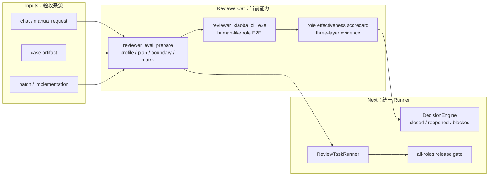

# ReviewerCat Plan

状态：Active
最后更新：2026-06-30
Owner：ReviewerCat maintainers

本文记录 `roles/reviewer-cat/` 的当前进度、下一步和验收标准。设计真相源见 `SPEC.md`；计划状态变化必须与 spec 保持同步。

## Current Status

ReviewerCat 已收束为真人端测验收角色，能通过 Codex job 驱动实现/返工，并通过 eval preparation 和 XiaoBa-CLI E2E 工具产出验收工件。`reviewer_module_test` 仍作为历史/辅助证据入口存在，但不再是 ReviewerCat 的默认职责；单元测试、集成测试、红绿测试和常规 CI 属于 EngineerCat / 工程流水线。ReviewerCat 保留通用 case artifact review contract，但不依赖已停用的外部平台。Observability 现在只提供 evidence，ReviewerCat 不再暴露 telemetry-to-benchmark patch curation 工具。

当前已完成：

- `reviewer_eval_prepare` 能生成 Project Eval Profile、Review Eval Plan、Boundary Map、真人端测场景矩阵。
- Eval plan 已包含 test-engineer、code-quality、security、runtime-e2e、debugging-recovery lens。
- ReviewerCat 的主验证口径已调整为真人端测；低层测试结果只作为辅助证据读取。
- `reviewer_xiaoba_cli_e2e` 可通过 tmux 或 process surface 模拟人类 CLI 交互，保存 trace、verifier logs、report、scorecard。
- ReviewerCat 面向人的 Markdown 报告默认中文输出；`scorecard.json` 等机器可读字段继续保持稳定结构化 contract。
- 2026-05-28 补齐 agent harness 三层验收原则：Durable Session、Working Trace、Provider Transcript。
- 2026-05-28 补齐 XiaoBa-CLI role effectiveness rubric：每个目标 role 需要 contract、human-like scenario、runtime evidence、independent verifier、residual risks。

尚未完成：

- 还没有统一 `ReviewTaskRunner` 把 eval、执行、证据、返工、决策串成一个代码级状态机。
- `reviewer_xiaoba_cli_e2e` 目前按单个目标 role 运行；全 roles release gate 需要 ReviewerCat 多次调用并手动/后续工具合并。
- 三层证据摘要已进入 eval 和 scorecard，但 provider-visible transcript 的深度合法性检查仍依赖 session log 字段质量和后续 verifier。
- Web / API / Desktop / Robot 的真实 E2E runner 仍是路线图，不应称为全项目完美验收。
- Observability evidence 可作为 ReviewerCat 端测证据输入，但不能由 ReviewerCat 自动接受为 benchmark。

## Progress Diagram

## Milestones

M1：Spec / Prompt / Eval 对齐

状态：Done

验收：

- Spec 明确真实 E2E、零假设用户、证据等级、review lens。
- Prompt 要求先 eval 后验收。
- Eval preparation 能落盘 profile / plan / boundary / matrix。
- 三层状态和 role effectiveness rubric 已进入 spec、prompt、README、skill 和 eval artifacts。
- ReviewerCat 角色边界已明确：只拥有真人端测；低层测试归 EngineerCat / CI，ReviewerCat 只消费其结果作为辅助证据。

M2：XiaoBa-CLI role effectiveness MVP

状态：Partial

验收：

- `reviewer_xiaoba_cli_e2e` 为单个 target role 产出 trace、verifier logs、three-layer evidence、role effectiveness scorecard、report。
- `reviewer_eval_prepare` 对 XiaoBa-CLI 自动生成 role effectiveness rubric。
- 未覆盖 roles 必须列为 missing evidence，不能声称全量通过。

M3：统一 ReviewTaskRunner

状态：Not Started

验收：

- 直接聊天和 case artifact 共用一个 review runner。
- Runner 维护 intake -> eval -> human E2E scenario matrix -> evidence -> feedback -> retest -> decision 状态机。
- 决策工件稳定包含 evidence level、missing evidence、three-layer issues、role scorecards。

M4：All Roles Release Gate

状态：Not Started

验收：

- 能从 `roles/*/role.json` 自动列出目标 roles。
- 能按 role effectiveness rubric 为每个 role 运行或阻塞 E2E。
- 生成合并 scorecard，区分 pass / partial / fail / blocked。
- 任一 critical role fail 或三层证据缺失时默认不能 release close。

M5：Observability Evidence Boundary

状态：Done

验收：

- ReviewerCat 不再注册 observability benchmark patch curation tool。
- Observability evidence 只能作为端测证据输入或问题线索。
- telemetry-derived candidate 进入 benchmark 前必须由对应 runtime harness 或 role benchmark owner 显式编辑 source。
- ReviewerCat / maintainer review 记录可以引用 trace continuity、privacy governance 和 artifact evidence，但不能自动 apply suite patch。

## Next Steps

1. 新增 `review-task-runner.ts`，把现有 eval preparation、真人端测场景、XiaoBa E2E、decision artifact 串成统一状态机。
2. 新增 all-roles suite 合并器，把多个 `reviewer_xiaoba_cli_e2e` run 合并成 release gate scorecard。
3. 为 provider transcript 增加更强 verifier：检查 tool call/result 配对、provider message 顺序、context compression 后的 active task 保留。
4. 为 `reviewer-output.json` 扩展 roleEffectiveness、threeLayerIssues、missingEvidence 字段。
5. 建立 XiaoBa-CLI 项目级 `.reviewercat/evaluation-profile.md/json`，把 Dashboard Chat / Pet / IM 真人端测门槛从 inferred profile 固化为项目 policy。
6. 设计 ReviewerCat 如何引用 observability evidence：只读 trace continuity、privacy governance 和 artifact evidence，输出 missing evidence / risk，不写 benchmark source。

## Owners

- ReviewerCat maintainers：spec、prompt、review workflow、scorecard、decision engine。
- EngineerCat：实现 ReviewerCat 发现的代码变更和 runner/tool 改造。
- InspectorCat：提供 trace/case 来源和失败归因输入。
- ResearcherCat：维护长期研究证据，不承担 runtime replay release gate。
- Human owner：确认无法自动判断的业务语义、账号/API key/设备/生产环境权限。

## Acceptance Criteria

ReviewerCat 不能以“完美验收所有项目”为承诺；它的可验收目标是：

- 每次 review 都有 eval profile 或明确 missing profile。
- 每次 review 都有 Review Eval Plan 和真人端测场景矩阵。
- 每个结论都标注 evidence level，不能把 Level 0-3 包装成 E2E。
- Agent harness 改动必须检查 Durable Session、Working Trace、Provider Transcript 三层证据。
- XiaoBa-CLI role effectiveness 必须有 per-role scorecard 或 blocked reason。
- 面向人的 ReviewerCat `report.md` 必须默认中文，保留真实入口、证据路径、验收结论、剩余风险和返工请求。
- Telemetry-derived regression candidate 进入 suite 前必须由 runtime harness 或 role benchmark owner 显式接收；ReviewerCat 只能提供只读证据审阅和 blocked reason。
- `closed` 必须有可复核证据；证据不足、核心路径失败或高风险未解决时必须 `reopened` 或 `blocked`。

## Verification Log

- 2026-06-30: ReviewerCat human-facing reports now default to Chinese in `reviewer_xiaoba_cli_e2e` while preserving machine-readable scorecard contracts. Verification: `node --test -r tsx test/reviewer-xiaoba-cli-e2e.test.ts test/arena-runner.test.ts`; `npm run build`.
- 2026-05-29: `SPEC.md` gained explicit Current Architecture and Target Architecture Mermaid diagrams covering current reviewer tools and the target ReviewTaskRunner state machine.
- 2026-05-29: ReviewerCat scope was narrowed to human-like E2E ownership; unit/integration/red-green tests are now EngineerCat / CI responsibilities and only auxiliary evidence for ReviewerCat.
- 2026-05-29: Verification passed with `node --import tsx --test test/reviewer-eval-profile.test.ts test/reviewer-xiaoba-cli-e2e.test.ts test/tool-manager-roles.test.ts` and `npm run build`.
- 2026-06-03: Removed retired platform references from ReviewerCat README, prompt, skill, SPEC and PLAN while keeping the generic case artifact review contract. Verification: `npm run build`, `node --test -r tsx test/skill-manager-runtime.test.ts test/tool-manager-roles.test.ts test/engineer-task-runner.test.ts test/reviewer-eval-profile.test.ts` (29/29), `npm run eval:engineer` (5/5), `npm run eval:engineer:benchmark` (5/5 benchmark cases, 5/5 eval cases), `npm run eval:role-handoff` (1/1), and `npm run check:eval-assets` (3270/3270 checks).
- 2026-06-09: Removed ReviewerCat observability curation from the current role boundary; observability is now evidence-only and benchmark acceptance belongs to runtime harness / role benchmark owners.

## Risks / Open Questions

- 真正的人类端到端测试仍依赖可用的 CLI/IM/Pet/Dashboard 入口、provider credentials、环境变量和外部服务。
- Provider transcript 目前可能没有完整原文落盘；需要确认日志 schema 能支持合法性 verifier。
- All-roles suite 若直接调用真实模型可能成本高、耗时长，需要分层：agent_session replay -> selected true E2E -> release gate。
- Observability evidence 若重新被设计成 benchmark source，必须先明确 runtime harness / role benchmark owner，避免 telemetry 自动污染 release benchmark。
- 全项目通用 E2E runner 容易过度泛化；应先把 XiaoBa-CLI agent harness gate 做稳。

## Status Maintenance Rules

- `SPEC.md` 新增概念、字段、边界或阶段时，必须同步本 `PLAN.md`。
- 计划项标记 Done 前必须有代码、文档和验证证据。
- 如果实现偏离 spec，优先更新实现；确认为新决策时同步更新 spec。
- 三层验收和 role effectiveness 是 ReviewerCat 当前主线，不应在后续重构中丢失。
