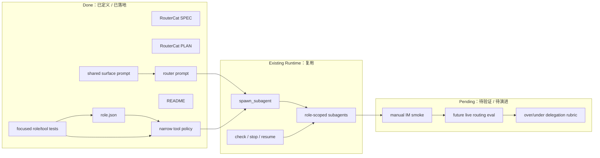

# RouterCat PLAN

状态：Active
最后更新：2026-06-24
Owner：Policy maintainers / runtime maintainers

本文维护 `RouterCat` 的执行计划。[`SPEC.md`](SPEC.md) 定义 RouterCat 的角色边界、路由合同和 target architecture。

## Current Status

`RouterCat` 已完成初始 role asset slice：仓库现在有 `roles/router-cat/role.json`、README、`prompts/router-system-prompt.md`、SPEC 和 PLAN。它通过 `inheritBaseTools:false` 把 base tools 收窄到 subagent 控制工具和只读 context 工具，不继承 base skills，也没有 role-local skills。当前 RouterCat 依赖已有 Agent Runtime `spawn_subagent` role-only dispatch：主会话只传 `role_name`，目标 subagent 加载自己的 role prompt、role-local skills 和 role tools 后自行选择 skill。Prompt 通过 `{{include:surface.md}}` 引用 `prompts/surface.md`，沿用全局 channel delivery contract，避免在 RouterCat 里复制维护另一份交付规则。

## Milestones

### M0. Role Asset Baseline

状态：Completed on 2026-06-24。

已完成：

- 新增 `roles/router-cat/role.json`。
- 新增 `roles/router-cat/README.md`。
- 新增 `roles/router-cat/prompts/router-system-prompt.md`。
- 新增 `roles/router-cat/SPEC.md` 和 `PLAN.md`。
- 角色不继承 base skills。
- 角色不继承 broad base tools，只 allowlist subagent control 和 read/search helpers。
- Prompt 通过 `{{include:surface.md}}` 引用共享 channel delivery prompt，明确 channel-delivered 会话只有 `send_text` / `send_file` 是用户可见输出。
- 顶层 `roles/SPEC.md` / `roles/PLAN.md` 同步 RouterCat。
- Focused tests 覆盖 alias、prompt、skill loading 和 tool visibility。

验收条件：

- `xiaoba chat --role router-cat` 可以加载角色。
- `xiaoba chat --role router` 可以通过 alias 激活角色。
- RouterCat 可见 `spawn_subagent`、`check_subagent`、`stop_subagent`、`resume_subagent`、`read_file`、`grep`、`glob`。
- RouterCat 不可见 `write_file`、`edit_file`、`execute_shell`、`skill`、EngineerCat/ResearcherCat/ReviewerCat/SecretaryCat 专属工具。
- RouterCat build 后的 system prompt 明确普通最终回复、thinking、tool result 和 subagent status 不是 channel 用户可见交付，且源 prompt 不复制完整 surface prompt 正文。

### M1. Manual IM Smoke

状态：Not started。

目标：用真实 CLI 或 IM session 验证 RouterCat 能把典型请求派给正确 role。

建议样例：

- 代码修复请求 -> `engineer-cat`。
- 论文精读请求 -> `researcher-cat`。
- 日志分析请求 -> `inspector-cat`。
- 验收请求 -> `reviewer-cat`。
- 飞书消息/日程请求 -> `secretary-cat`。

验收条件：

- RouterCat 不直接执行 worker 工具。
- 派发 `spawn_subagent` 时只传 `role_name`。
- 子任务完成后 RouterCat 汇总 evidence 和风险，不自称完成验收。

### M2. Live Routing Evaluation

状态：Not started。

目标：把 RouterCat routing behavior 做成 future live role eval，而不是静态 fixture。

候选指标：

- intent routing hit-rate；
- ambiguous request clarification rate；
- over-delegation / under-delegation；
- worker prompt completeness；
- result integration quality；
- stop/resume behavior。

验收条件：

- 评测使用 live AgentSession replay。
- 每个 case 有 expected target role 或 expected clarification。
- 验证器检查 tool sequence、role_name、是否误用 `skill_name`、是否越权使用 worker tools。

## Next Steps

1. 跑一次真实 `xiaoba chat --role router-cat` smoke，观察 prompt 是否过度派发。
2. 为 RouterCat 补 future live routing eval 设计，但不要把静态 JSON fixture 放回 `eval/`。
3. 根据 smoke 结果决定是否把 RouterCat 做成某些 IM entrypoint 的默认 role，或只作为显式 `--role router` 入口。

## Owners

- RouterCat role assets：`roles/router-cat/**`
- Subagent dispatch runtime：`src/tools/spawn-subagent-tool.ts`, `src/core/sub-agent-*`
- Role activation and tool visibility：`src/utils/role-resolver.ts`, `src/tools/tool-manager.ts`
- Future verification：`test/**` and future live `eval/benchmarks/**`

## Acceptance Criteria

- RouterCat 是 control-plane role，不直接执行 worker responsibilities。
- RouterCat 的 tool policy 不暴露 write/edit/shell/skill。
- Cross-role dispatch 只使用 `role_name`。
- Target role subagent 自己选择 role-local skill。
- RouterCat 汇总结果时保留 evidence、artifact 和 risk 边界。
- Channel-delivered RouterCat sessions must use `send_text` / `send_file` for user-visible output when those surface tools are visible, following the shared `prompts/surface.md` contract.

## Risks / Open Questions

- Prompt-only intent routing 可能过度派发或漏派发，需要 live smoke 后调整。
- RouterCat 当前没有机器学习或规则化 classifier；首版完全由 prompt 和 tool visibility 控制。
- 如果未来把 RouterCat 设为默认 IM 主 agent，需要额外验证普通短问答不会被过度派给 subagent。

## Status Maintenance Rules

- 修改 RouterCat prompt、tool policy、role aliases 或 routing contract 时，必须更新本 PLAN 和 `SPEC.md`。
- 如果新增 role-local skills 或 role-specific runtime tools，先更新 `SPEC.md` 的 Current Architecture。
- 不把 RouterCat 标记为 live-routing-ready，除非有真实 IM smoke 或 live eval evidence。
