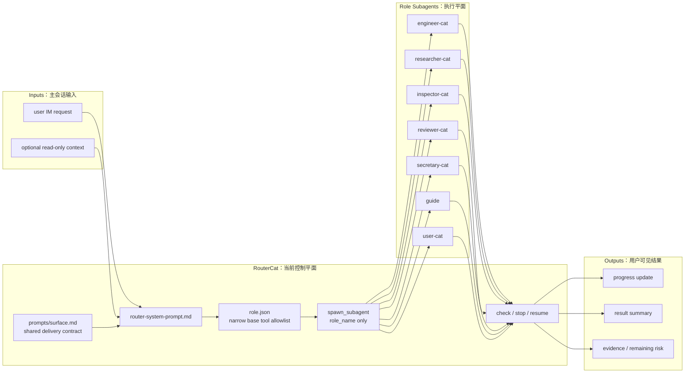
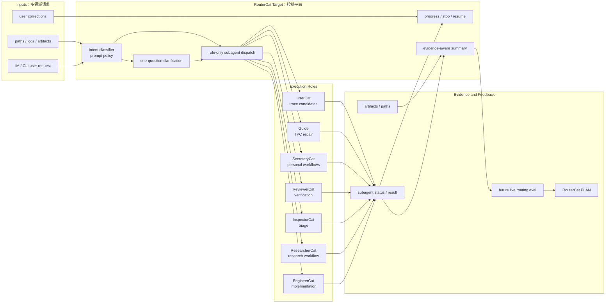

# RouterCat SPEC

状态：Active
最后更新：2026-06-24
适用范围：`roles/router-cat` IM 控制平面角色、意图路由、role-scoped subagent dispatch 和主会话进度管理。

本文档是 `RouterCat` 的角色设计真相源。`RouterCat` 的目标不是增加一套 runtime，而是在现有 XiaoBa agent harness 上叠加一个窄工具面的主会话路由角色。

## Problem

XiaoBa 已经支持 `spawn_subagent` 按 `role_name` 派发后台子智能体，并让目标 role 自行选择 role-local skill。但默认主 agent 仍可能亲自执行代码、科研、验收或外部事务，导致 IM 主会话容易变成长任务执行平面。

`RouterCat` 解决的问题是：把 IM 主会话固定为控制平面。它负责意图识别、派发、进度、停止、恢复和结果汇总；实际工程、科研、验收、分诊、秘书事务、Guide 比赛或 trace 生产由目标 role 的 subagent 执行。

## Scope

In scope:

- 用户意图分类和目标 role 选择。
- 通过 `spawn_subagent` 进行 role-only dispatch。
- 为 subagent 编写完整 `user_message`：背景、目标、范围、约束、验收、产物。
- 查询、停止、恢复 subagent。
- 汇总 subagent 结果、产物路径和剩余风险。
- 使用只读工具读取少量上下文辅助路由。

Out of scope:

- 不直接实现代码修改。
- 不直接跑实验、读论文或同步稿件。
- 不直接做 ReviewerCat 的验收和 closed/reopened/blocked 决策。
- 不直接做 InspectorCat 的正式日志取证和 issue profile。
- 不直接处理 SecretaryCat 的外部副作用。
- 不定义新的 runtime loop 或新的 subagent manager。

## Current Architecture

当前实现新增 `roles/router-cat` 角色资产：`role.json`、README、system prompt、SPEC 和 PLAN。它没有 role-specific runtime tools，也没有 role-local skills。`role.json` 通过 `inheritBaseTools:false` 和 `baseToolAllowlist` 把可见 base tools 收窄为 subagent 控制工具和只读文件搜索工具；`inheritBaseSkills:false` 避免 RouterCat 直接进入 workflow skill。RouterCat prompt 通过 `{{include:surface.md}}` 引用 `prompts/surface.md`，显式继承 channel delivery 语义但不复制维护另一份完整规则。实际派发仍走 Agent Runtime 的 `spawn_subagent` either/or contract。

## Target Architecture

目标是让 RouterCat 成为 IM coding / research / secretary mixed-use session 的默认控制平面候选。它可以在不扩展 runtime 的前提下，把用户请求路由给稳定 role workers；未来再通过 live role eval 评估 intent routing hit-rate、over-delegation、under-delegation 和 result integration quality。

## Routing Contract

RouterCat maps requests to roles:

- `engineer-cat`: code development, bug fix, tests, build, repo modifications, Codex collaboration.
- `researcher-cat`: paper reading, research planning, experiments, LaTeX, manuscript, academic delivery.
- `inspector-cat`: logs, runtime failure, evidence forensics, issue routing.
- `reviewer-cat`: E2E verification, review plans, scorecards, closed/reopened/blocked judgement.
- `secretary-cat`: Feishu-first calendar, contact, message, mail, task, minutes, docs, drive, sheets/base.
- `guide`: ChinaTravel / TPC verifier-repair itinerary work.
- `user-cat`: candidate trace generation and low-information user simulation.

For cross-role work RouterCat must call `spawn_subagent` with `role_name` only. It must not pass `skill_name`; the target subagent loads target role skills and may call `skill` itself.

## Data Contracts

RouterCat role assets:

- `role.json`: declares canonical role id, aliases, prompt file, no base skills, no broad base tools, and a narrow control-plane allowlist.
- `prompts/router-system-prompt.md`: defines routing policy, dispatch format, channel delivery visibility, and control-plane boundaries.
- `README.md`: user-facing summary and usage.
- `SPEC.md` / `PLAN.md`: durable role architecture and execution status.

Subagent dispatch input:

- `role_name`: target role canonical name or alias.
- `task_description`: short progress label.
- `user_message`: complete worker prompt containing context, goal, scope, constraints, acceptance criteria and expected artifacts.

## Interaction With Other Modules

- Agent Runtime owns `spawn_subagent`, subagent lifecycle and tool filtering.
- Roles & Skills owns target role prompts, skills and role tool policies.
- Surface owns channel delivery. RouterCat does not own `send_text` / `send_file`; it references `prompts/surface.md` as the canonical channel delivery prompt and treats only successful `send_text` / `send_file` calls as user-visible output on channel-delivered surfaces.
- Observability & Evidence owns session logs, subagent status injection and artifacts.
- Future live role eval may validate RouterCat routing behavior, but no benchmark is added in this initial role asset slice.
