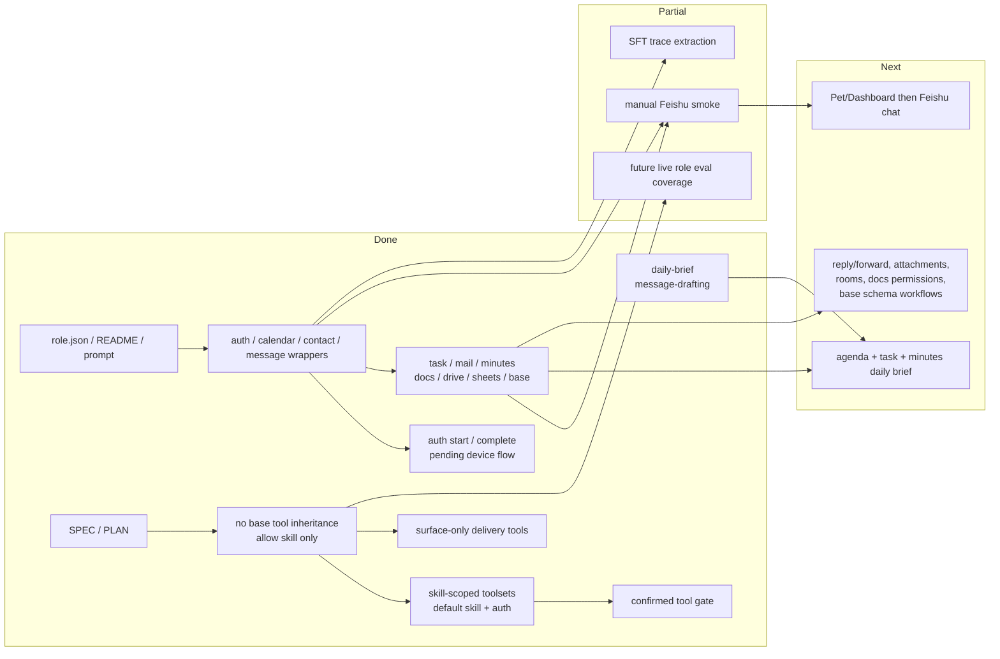

# SecretaryCat PLAN

Status: Active
Last updated: 2026-06-09
Owner: Policy maintainers

This plan tracks the SecretaryCat role implementation. Design source of truth: `SPEC.md`.

## Current Status

SecretaryCat now has role assets, a prompt, domain role-local skills, Feishu auth/calendar/contact/message wrapper tools, and the first expanded Feishu wrapper slice for task, mail, minutes, docs, drive, sheets, and base. The auth wrapper now includes a two-step user OAuth recovery flow: start returns a browser URL/code plus `auth_request_id`, while complete finishes the pending device flow after the user approves in the browser. The role-aware tool manager limits `secretary-cat` with two layers: `inheritBaseTools:false` + `baseToolAllowlist:["skill"]` removes raw base tools, and `toolVisibility.mode:"skill_scoped"` keeps provider-visible tools at `skill + auth` until a role-local skill activates a domain toolset. Delivery tools are not role tools and are also subject to the scoped policy. Product scope includes all secretary-relevant Feishu domains; deeper workflows remain phased through narrow wrappers.

## Milestones

1. M0: Feishu wrapper prototype: completed for auth, calendar, contact, and message MVP wrappers.
2. M1: SecretaryCat role MVP: completed for role files, prompt, role skills, tool registration, no-base-tool inheritance policy, and raw shell/write/edit blocking.
3. M2: Messaging draft flow: completed for draft and confirmation-gated send wrapper; real tenant smoke remains manual.
4. M3: Daily brief: partial through role skill plus scoped agenda/task/mail/minutes wrappers; end-to-end prompt workflow still needs live smoke.
5. M4: Expanded secretary Feishu domains: first typed wrapper slice completed for task, mail, minutes, docs, drive, sheets, and base.
6. M5: Role-level two-stage skill/tool visibility: completed v1 for `skill_scoped` default tools, domain skills, aliases, confirmed gate, and session log visibility evidence.
7. M6: SFT readiness: not started.

## Next Steps

- Run a manual Feishu smoke with a dedicated test event: auth status, query, create, query, confirmed delete, query.
- Add live role eval evidence for SecretaryCat only after it can run through the live agent eval contract.
- Add SecretaryCat small-model boundary benchmark evidence for scoped tool count, mail/message separation, docs/drive separation, and unconfirmed write blocking.
- Add manual Feishu smoke for the expanded wrapper slice with a dedicated test tenant or low-risk personal fixtures.
- Add deeper mail reply/forward, IM search/chat/file, calendar busy/free and room wrappers where workflows need them.
- Add drive permission/share/delete wrappers only after a stricter confirmation UX exists.
- Add sheets write-overwrite and Base schema/view workflows only after field inspection and confirmation patterns are stable.
- Decide whether Pet/Dashboard should require stricter confirmation for create-event requests than CLI.
- Define SFT trace export once real tool-use trajectories accumulate.

## Owners

- Role assets: `roles/secretary-cat/**`
- Wrapper tools: `src/roles/secretary-cat/tools/**`
- lark-cli runner: `src/roles/secretary-cat/utils/lark-cli-runner.ts`
- Role registration: `src/roles/runtime-role-registry.ts`
- Tool visibility policy: `src/tools/tool-manager.ts`
- Verification: `test/secretary-*.test.ts`, future eval role gate

## Acceptance Criteria

- `xiaoba chat --role secretary-cat` can load the role prompt and role-local skills.
- Role-specific tool registration exposes Feishu wrapper tools for `secretary-cat`.
- Before skill activation, SecretaryCat exposes only `skill`, `feishu_auth_status`, `feishu_auth_login_start`, and `feishu_auth_login_complete`.
- After activating a domain skill, SecretaryCat exposes only that skill's scoped Feishu toolset plus default tools.
- Expired or missing user OAuth can be recovered through `feishu_auth_login_start` followed by `feishu_auth_login_complete` after browser approval; raw device codes are not returned to the model.
- Confirmed write/send/delete tools are hidden or blocked unless the immediately preceding user turn has explicit confirmation intent.
- Raw shell, file read/write/edit, glob/grep, and sub-agent tools are not available to SecretaryCat through the role-aware manager and are blocked if attempted through a secretary execution context.
- CLI SecretaryCat does not expose `send_text` / `send_file`; Feishu、Weixin、Pet and Dashboard channel-backed surfaces expose them through surface context.
- Calendar query/create wrappers build `lark-cli` argument arrays and normalize JSON output.
- Calendar update/delete and message send reject calls without explicit confirmation.
- Expanded-domain wrappers preserve the same pattern: read/query helpers first; writes, sends, deletes, permission changes, and structured data mutations are confirmation-gated.
- SecretaryCat exposes typed wrappers for task list/create/update/state, mail triage/read/draft/send, minutes search/get/notes/download, docs search/fetch/create/update, drive search/upload/download/import, sheets read/append, and base table/field/record read/upsert.
- Wrapper output redacts tokens and secrets.
- Manual real Feishu smoke is documented before promoting Pet/Dashboard/Feishu chat rollout.

## Verification Log

- 2026-06-01: Added SecretaryCat MVP role assets, prompt, role-local skills, Feishu wrapper tools, role registration, and initial role-aware visibility for Feishu wrappers plus delivery/helper tools. Verification: `node --test -r tsx test/secretary-cat-role.test.ts test/secretary-feishu-tools.test.ts test/tool-manager-roles.test.ts`, `node --test -r tsx test/reviewer-eval-profile.test.ts`, `npm run build`, and targeted `git diff --check` passed.
- 2026-06-02: Expanded SecretaryCat target scope to include task, mail, minutes, docs, drive, sheets, and base as future narrow wrapper domains. Verification: documentation update only.
- 2026-06-02: Implemented the first expanded SecretaryCat Feishu wrapper slice for task, mail, minutes/VC notes, docs, drive, sheets, and base; registered all tools in the role runtime and added parameter/confirmation-gate tests. Verification: `node --test -r tsx test/secretary-cat-role.test.ts test/secretary-feishu-tools.test.ts test/tool-manager-roles.test.ts`, `node --test -r tsx test/secretary-feishu-tools.test.ts`, `npm run build`, and SecretaryCat forbidden-flag `rg` check passed.
- 2026-06-02: Updated SecretaryCat tool policy for the three-layer ToolManager: `inheritBaseTools:false`, `baseToolAllowlist:["skill"]`, Feishu wrappers as role tools, and `send_text` / `send_file` as surface-only tools excluded from CLI. Verification: targeted SecretaryCat, tool manager, skill runtime, rate-limit and session-log tests plus `npm run build` passed.
- 2026-06-04: Added two-stage skill/tool visibility for SecretaryCat. `role.json` now declares `toolVisibility.mode:"skill_scoped"`, default auth tools, scoped domain toolsets, `skillToolsetAliases`, and `confirmedToolGate`; domain skills carry `toolsets`; runtime logs visible/hidden tools per provider request. Verification: `node --test -r tsx test/secretary-cat-role.test.ts test/conversation-runner-skill-activation.test.ts test/tool-manager-roles.test.ts test/logger.test.ts` and `npm run build` passed.
- 2026-06-04: Aligned SecretaryCat prompts with two-stage skill/tool visibility by removing hard-coded domain Feishu tool names from the global prompt, directing domain requests through the visible `skill` tool first, warning against invented router names such as `activate_skill`, adding domain-skill execution discipline so visible tools are called instead of narrated, adding a scoped `contact` skill/toolset for standalone contact lookup, and hardening confirmed-operation/token/drive-routing plus mail/message separation instructions based on Gemma E4B boundary reruns. Verification: focused SecretaryCat prompt/tool visibility test, `npm run build`, and `gemma4:e4b` boundary evidence passed or recorded known failures.
- 2026-06-09: Hardened SecretaryCat small-model routing prompts for local-file import and unsupported meeting-room booking. The system prompt now routes local file imports to Drive even when the destination is an online sheet/doc, marks meeting-room/resource booking as unsupported by the current wrapper slice, and domain skills add the matching drive/calendar/sheets execution rules. Verification: `node --test -r tsx test/secretary-cat-role.test.ts`, `npm run build`, and `npx tsx scripts/run-secretary-e4b-boundary.ts` passed. Final `gemma4:e4b` boundary evidence: `50/50` cases passed, default visible tools `3`, average visible tools `5.91`, max visible tools `8`, average latency `8746ms`, average prompt tokens per case `6599`; output report at `output/secretary-e4b-boundary/secretary-e4b-boundary-report.md`. Residual prompt risk: safety cases still produced schema-outside raw attempts `feishu_docs_create` and `feishu_drive_upload_confirm`, but neither executed successfully.
- 2026-06-09: Added SecretaryCat user OAuth recovery completion. `feishu_auth_login_start` now stores the raw device code in a local pending-auth store with CLI expiry or a 10-minute fallback, and returns only URL/code/`auth_request_id`; `feishu_auth_login_complete` finishes the pending device flow after browser approval and clears the pending record. Default visible tools are now `skill`, `feishu_auth_status`, `feishu_auth_login_start`, and `feishu_auth_login_complete`. Verification: `node --test -r tsx test/secretary-feishu-tools.test.ts test/secretary-cat-role.test.ts` passed 29/29 and `npm run build` passed.

## Risks / Open Questions

- `lark-cli` output can change across versions; wrappers normalize common shapes but should be verified against real tenant responses.
- Create-event confirmation policy may need to vary by surface.
- The current daily brief prompt has not been live-smoked against the new task/minutes wrappers.
- The first expanded wrapper slice does not yet include every domain operation, such as mail reply/forward, IM search/files/groups, calendar busy/free/rooms, drive permission changes, sheets overwrite, or Base schema/view/workflow management.
- All-roles release gate does not yet include SecretaryCat deterministic evidence.
- Daily brief intentionally uses a lean `brief` toolset rather than exposing every calendar/task/mail/minutes tool; richer brief behavior should be added through focused toolsets instead of widening the default surface.

## Status Maintenance Rules

- Update this plan when SecretaryCat gains a new wrapper domain, surface, confirmation policy, or eval gate.
- Keep `SPEC.md` diagrams aligned with implemented runtime boundaries.
- Do not mark real Feishu E2E complete without manual smoke evidence or a dedicated test tenant.
