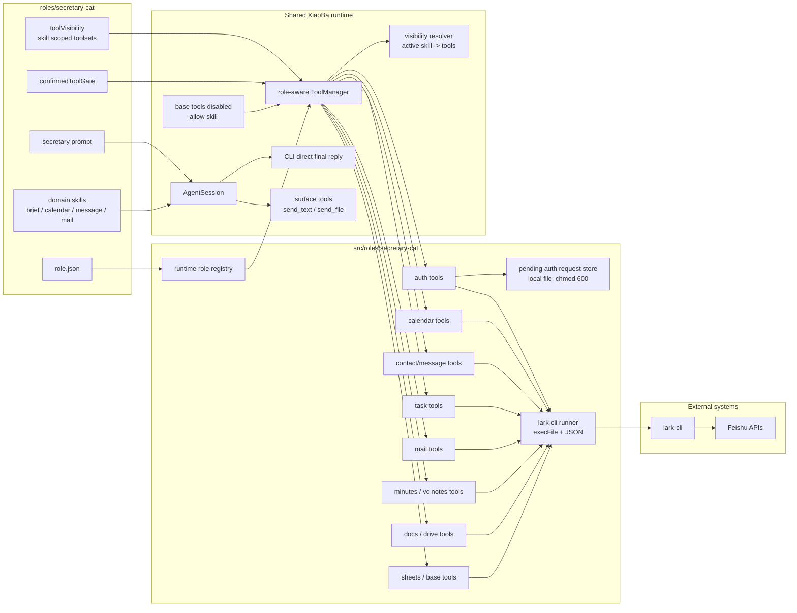
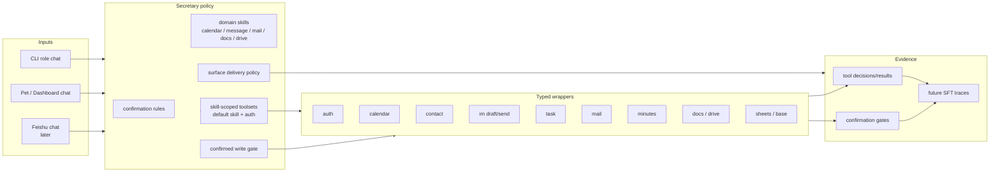

# SecretaryCat SPEC

Status: Active
Last updated: 2026-06-09
Scope: `roles/secretary-cat/` role assets and `src/roles/secretary-cat/` Feishu wrapper tools.

This document is the design source of truth for SecretaryCat. The product requirement lives in `docs/roles-skills/secretary-cat-prd.md`.

## Problem

SecretaryCat provides a local personal secretary role that can operate day-to-day Feishu workflows without exposing raw shell or broad code-editing tools to the model. The implemented runtime now covers auth, calendar, contact lookup, IM message drafting/sending, tasks, mail, minutes, docs, drive, sheets, and base through typed wrapper tools. Deeper workflow coverage remains phased and must stay behind narrow tool contracts and confirmation gates.

## Scope

In scope:

- `roles/secretary-cat/role.json`
- `roles/secretary-cat/prompts/secretary-system-prompt.md`
- `roles/secretary-cat/skills/daily-brief`
- `roles/secretary-cat/skills/message-drafting`
- `src/roles/secretary-cat/tools/*`
- `src/roles/secretary-cat/utils/lark-cli-runner.ts`
- Role-specific registration in `src/roles/runtime-role-registry.ts`
- Secretary-specific base-tool inheritance policy in the role-aware tool manager path
- Narrow wrapper domains: task, mail, minutes, docs, drive, sheets, and base

Out of scope:

- Mac-native reminders/calendar integration
- Raw generic `lark-cli` execution exposed to the model
- SFT or LoRA training
- Production Feishu chat surface rollout before delivery and confirmation gates are hardened

## Current Architecture

The current implementation is a Feishu-first secretary role with prompt and role-local skills plus typed Feishu CLI wrapper tools. It disables base tool inheritance and keeps only the `skill` helper from the base layer. It also uses role-level `toolVisibility.mode:"skill_scoped"`: unactivated turns expose only `skill` plus auth helpers, then domain skills activate scoped Feishu toolsets. It uses the shared XiaoBa harness and does not run a separate agent loop.



## Target Architecture

The target keeps SecretaryCat narrow and auditable while extending the first broad Feishu wrapper slice into richer task, notes, daily brief, document, and structured-data workflows plus clean SFT trace collection. SecretaryCat uses a two-stage visibility policy: the default provider-visible tool set stays tiny (`skill` plus auth helpers), and role-local skills activate only the scoped Feishu toolsets needed for the current domain.



## Tool Contracts

All SecretaryCat Feishu tools return compact JSON strings:

```json
{
  "ok": true
}
```

or:

```json
{
  "ok": false,
  "error": {
      "code": "AUTH_MISSING",
      "message": "Feishu user identity is missing.",
      "next_action": "call feishu_auth_login_start with domain calendar, then feishu_auth_login_complete after browser approval"
  }
}
```

Supported error codes:

- `AUTH_MISSING`
- `SCOPE_MISSING`
- `CLI_NOT_INSTALLED`
- `CLI_NOT_CONFIGURED`
- `API_ERROR`
- `VALIDATION_ERROR`
- `AMBIGUOUS_REQUEST`
- `WRITE_CONFIRMATION_REQUIRED`
- `TOOL_TIMEOUT`

Auth recovery is a two-step wrapper contract:

- `feishu_auth_login_start` starts `lark-cli auth login --no-wait --json --domain ...`, returns the verification URL, user code, optional complete URL, expiry metadata, and an `auth_request_id`.
- The raw `device_code` is not returned in tool output. It is stored in `data/secretary-cat/auth/pending-device-auth.json` under the active working directory with best-effort `0600` permissions.
- Pending auth requests use the CLI-provided expiry when present and fall back to a local 10-minute expiry when it is absent.
- `feishu_auth_login_complete` accepts the `auth_request_id` after the user finishes browser approval, calls `lark-cli auth login --device-code ... --json`, clears the pending record, and returns structured JSON.
- If the pending request is missing or expired, the tool returns a structured error with `next_action` pointing back to `feishu_auth_login_start`.

## Boundaries

- SecretaryCat role tools are typed Feishu wrappers from `src/roles/secretary-cat/tools/**`.
- SecretaryCat sets `inheritBaseTools:false`; the current base-tool allowlist is only `skill` for role-local secretary skills.
- SecretaryCat sets `toolVisibility.mode:"skill_scoped"` so unactivated turns expose only `skill`, `feishu_auth_status`, `feishu_auth_login_start`, and `feishu_auth_login_complete`. Role-local skills and aliases activate narrow toolsets such as `calendar`, `message`, `mail`, `docs`, `drive`, `sheets`, and `base`.
- The active domain toolset is kept in session memory across the immediate confirmation turn, so a draft/send flow can expose the confirmed send tool after the user confirms. A new skill activation switches the active domain.
- `send_text` and `send_file` are surface tools, not SecretaryCat role tools. They are visible only on channel-backed surfaces such as Feishu、Weixin、Pet and Dashboard; CLI uses direct final reply and does not expose them.
- SecretaryCat must not use raw shell, file read/write/edit, glob/grep, or sub-agent tools.
- Calendar update/delete, task mutation, message/mail send, docs/drive writes, docs edits, drive imports/uploads, and sheets/base writes require explicit confirmation when they can modify external state.
- Mail draft creation is allowed as a draft-only write helper; sending drafts still requires explicit confirmation.
- Minutes media URL lookup is read-only; local media download and overwrite require explicit confirmation.
- Wrapper modules must call `lark-cli` through `execFile` argument arrays, not shell strings.
- Tool output must redact tokens and secrets.

## Interaction With Other Modules

- `roles/SPEC.md` owns top-level role and skill policy.
- `docs/SPEC.md` owns harness-wide runtime and delivery contracts.
- `src/tools/tool-manager.ts` owns the role-aware blocked-tool behavior used to keep secretary raw action space narrow.
- `src/roles/runtime-role-registry.ts` owns SecretaryCat wrapper tool registration.
- Future eval coverage should be added as live SecretaryCat replay cases after the role has safe Feishu smoke evidence and explicit tool/result verifiers.
