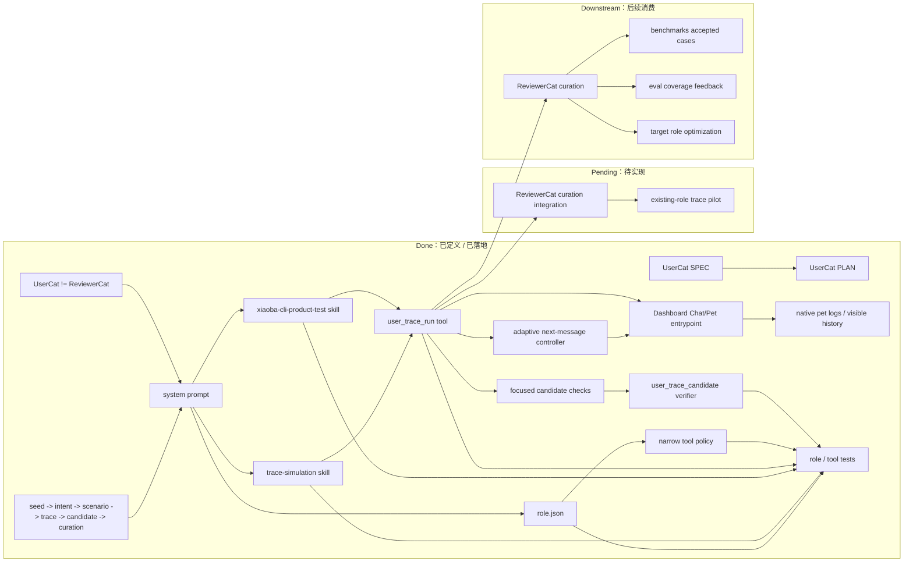

# UserCat PLAN

状态：Active
最后更新：2026-07-01
Owner：Evaluation maintainers / role maintainers

本文维护 `UserCat` 的执行计划。[`SPEC.md`](SPEC.md) 定义 UserCat 的角色边界、数据流、target architecture 和 candidate trace contract。

## Current Status

`UserCat` 已推进到低质量用户 candidate trace 生产角色 v1：仓库现在有 `roles/user-cat/role.json`、README、`prompts/user-system-prompt.md`、role-local `trace-simulation` skill、XiaoBa-CLI product-use preset skill、`user_trace_run` runtime tool 和 focused role/tool tests。它可以通过 role resolver 加载，prompt 明确要求低质量/低信息终端用户压力，而不是 developer / engineer / QA lead 行为；role tool policy 通过 `inheritBaseTools:false` + `baseToolAllowlist:["read_file","grep","glob","skill"]` 禁止 shell/write/edit/subagent 等生产越权工具；`xiaoba-cli-product-test` 可以把一句产品试用需求转换成 seed、role intent map、persona、scenario plan 和 opening / fallback user pressures；`user_trace_run` 默认通过 Dashboard Chat/Pet 的 `/api/pet/message` 原生入口驱动目标 role，让产品观测层自然写入 `logs/sessions/pet/**`、`runtime.log` 和 `data/chat/sessions/**`。`interaction_mode:"adaptive"` 已落地：UserCat 发送开场消息后，会读取目标 role 上一轮可见回复、tool events 和证据，再决定下一句低信息用户输入或停止；当 planner 想在两轮前停止且 turn budget 仍允许时，UserCat 会继续发出 fallback / heuristic 追问，形成最少两轮证据压力；当 planned fallback 包含明确的 required artifact/schema pressure（例如 `answer.json`、`fake_citations`）且 adaptive planner 没覆盖时，UserCat 会保留这条用户侧验收压力，避免真实多轮使用丢掉关键产物要求；`interaction_mode:"scripted"` 保留给固定脚本回放/兼容。UserCat 只额外写 raw candidate trace 和 candidate package，同时强制 candidate 保持 `curation_status:not_curated` / `benchmark_acceptance:forbidden_until_curated`，避免把候选 trace 误标为正式 benchmark。`entrypoint:"agent_session"` 仅作为显式 legacy fallback 保留。旧 `eval:user-cat` smoke 和 `eval/benchmarks/UserCat` 已删除；ReviewerCat curation integration 和 full existing-role trace pilot 仍未实现。

## Milestones

### M0. Spec / Plan Baseline

状态：Completed draft on 2026-06-02。

目标：先把 UserCat 的数据流向、角色边界和 trace 生产闭环讲清楚。

已完成：

- 定义 UserCat 的问题定位：真实多轮候选 trace 生产。
- 定义 UserCat 和 ReviewerCat 的职责分离。
- 定义 Current Architecture 和 Target Architecture Mermaid diagrams。
- 定义 seed、role-intent-map、scenario-plan、candidate-case 数据契约。
- 定义 trace quality bar 和反馈分流规则。

验收条件：

- `roles/user-cat/SPEC.md` 存在并包含 Current/Target architecture。
- `roles/user-cat/PLAN.md` 存在并列出实现里程碑。
- 顶层 `roles/SPEC.md` / `roles/PLAN.md` 同步 UserCat planned role 状态。

### M1. Role Asset MVP

状态：Completed on 2026-06-02。

目标：让 `UserCat` 成为可选择角色，但只做候选 trace 生产，不做 curation。

已完成：

- 新增 `roles/user-cat/role.json`。
- 新增 `roles/user-cat/README.md`。
- 新增 `roles/user-cat/prompts/user-system-prompt.md`。
- 新增 role-local skill：`roles/user-cat/skills/trace-simulation/SKILL.md`。
- 通过 `role.json` 接入 role resolver。
- 加 role asset tests，确认 role 可发现、prompt 可加载、只加载 role-local skill、只暴露 `user_trace_run` 专属工具，不暴露 reviewer / engineer / secretary 专属工具。

验收条件：

- `xiaoba --role user-cat` 可以加载角色。
- UserCat prompt 明确禁止判分、关闭 case 或直接进入 benchmark。
- UserCat 可以输出 role intent map 和 scenario plan。

### M2. Candidate Trace Package V0

状态：Completed v1 on 2026-06-03。

目标：把一次 UserCat 对话产出为结构化 candidate trace package。

已完成：

- 定义 `user_trace_run` candidate trace package writer。
- 约定 raw local storage：`data/user-cat/traces/<run-id>/`。
- 约定 candidate output：`output/user-cat/candidates/<run-id>/`。
- 默认真实入口约定为 Dashboard Chat/Pet `/api/pet/message`；native session trace 和 visible history 仍由产品观测层写入 `logs/sessions/pet/**` 和 `data/chat/sessions/**`。
- 输出 `seed.json`、`role-intent-map.json`、`persona.json`、`scenario-plan.json`、`trace.jsonl`、`candidate-case.json`、`trace-quality-self-check.json`。
- 增加 TypeScript semantic checks through focused runtime tests.
- 收窄 UserCat base tool policy：只允许 read/search/skill 和 `user_trace_run`，禁止 shell/write/edit/subagent/role-judgement tools。
- 固定 candidate invariants：`curation_status:not_curated`、`benchmark_acceptance:forbidden_until_curated`、workspace-relative trace path、manifest 不记录本地 cwd。
- 禁止 recursive self-target：`target_role:user-cat` 直接 rejected。

验收条件：

- 用固定 seed 生成一条 deterministic-ish candidate package。
- package 可被 ReviewerCat 或测试读取。
- raw trace 和 candidate metadata 分层，不把隐私 trace 误提交为 benchmark case。

### M2.5. Candidate Trace Evaluation Gate

状态：Retired from active eval on 2026-06-23。

目标：旧版本让 UserCat 产出的 candidate package 在进入 ReviewerCat curation 前可被 deterministic hard gate 检查，做到“生产级但不越权接受 benchmark”。这套 deterministic eval smoke 已从 `eval/` 删除；后续只能以 focused tests 或 live agent eval 重建。

已完成：

- 旧 deterministic fixture、`eval:user-cat` 和 `eval/benchmarks/UserCat/**` 已删除。
- Candidate package invariants 仍应由 `user_trace_run` 自身、focused tests 或 future live benchmark curation 检查。

验收条件：

- 不恢复 `npm run eval:user-cat`。
- Candidate trace 不直接进入 accepted benchmark。
- Future UserCat benchmark 必须从 live target-role replay、expected behavior 和 verifier 重新构造。

### M2.6. XiaoBa-CLI Product-Test Preset

状态：Completed on 2026-06-24。

目标：让用户只给一句 XiaoBa-CLI 产品测试需求时，UserCat 能自动按真实用户方式构造多轮 candidate trace run。

已完成：

- 新增 role-local skill：`roles/user-cat/skills/xiaoba-cli-product-test/SKILL.md`。
- 在 UserCat system prompt 中加入 product-test routing，要求 XiaoBa-CLI 产品试用需求优先使用该 skill。
- README 增加“像真实用户一样测试 XiaoBa-CLI”的调用示例。
- SPEC current/target architecture 增加 product-use preset skill。
- focused role tests 覆盖新增 skill 可加载、可 auto-invoke、prompt 包含路由提示。

验收条件：

- UserCat 能把短需求转换为 seed、role intent map、persona、scenario plan 和 5-7 轮低信息 user messages。
- 真实测试请求仍通过 `user_trace_run` 走 Dashboard Chat/Pet 原生入口驱动目标 role；native trace 不能落到 UserCat 特殊 session。
- 输出仍是 candidate trace，不允许 UserCat 判定 pass/fail 或 accepted benchmark。

### M2.7. Adaptive Live Dialogue

状态：Completed on 2026-06-30；minimum evidence pressure and required artifact/schema pressure preservation updated on 2026-07-01。

目标：让 UserCat 不再只是固定 messages 播放器，而是在真实目标 role 每轮回复后，根据可见结果继续像低信息用户一样追问、补约束或停止。

已完成：

- `user_trace_run` 增加 `interaction_mode=scripted|adaptive`。
- `adaptive` 模式第一轮使用 opening/fallback plan，后续每轮读取上一轮 TargetRole 回复、visible delivery 和 tool events，再生成下一条 user message。
- adaptive decision 以 `usercat_decision` 写入 raw trace，candidate manifest / candidate-case / self-check 都记录 `interaction_mode`。
- Arena runner 默认用 `interaction_mode:"adaptive"` 调用 UserCat。
- adaptive planner 如果在两轮前想停止，且 `maxTurns` 仍允许，会被 minimum two-turn evidence pressure 覆盖，继续追问 artifact path、完成证明或缺口说明。
- adaptive planner 如果漏掉 planned fallback 里的 required artifact/schema pressure，会回退到该 fallback message，继续要求目标 runtime 给出可验收的产物或格式证据。
- 保留 `scripted` 模式，用于 deterministic 兼容和固定回放。

验收条件：

- focused tool test 能证明第二轮用户输入来自上一轮目标 role 回复。
- focused tool test 能证明 adaptive mode 不会丢掉 planned required artifact/schema pressure。
- 真实入口仍走 Dashboard Chat/Pet，native trace 不落到 UserCat 特殊路径。
- UserCat 仍不判 pass/fail。

### M3. Existing Roles Trace Pilot

状态：Not started。

目标：用 UserCat 针对现有 roles 各生成少量候选 trace，观察质量。

目标 roles：

- `engineer-cat`
- `inspector-cat`
- `reviewer-cat`
- `researcher-cat`
- `secretary-cat`

任务：

- 每个 role 至少准备 2 个 seed：一个 happy-ish path，一个边界/失败 path。
- UserCat 生成多轮 trace。
- ReviewerCat 只做 curation，不参与生成。
- 输出 accepted / rejected / needs-fixture / needs-verifier 统计。

验收条件：

- 每个 role 至少有一条 trace 覆盖其 role intent。
- trace quality review 能指出 UserCat 缺陷和目标 role 缺陷。
- 不把没有 hard verifier 的 trace 直接并入 release-blocking benchmark。

### M4. Feedback Optimization Loop

状态：Not started。

目标：建立“trace 质量 -> 优化 UserCat / 优化目标 role / 优化 verifier”的闭环。

任务：

- 定义 trace rejection reason taxonomy。
- 把 rejection reason 聚合成 UserCat prompt 改进项。
- 把 target role failure 聚合成对应 role prompt/tool/eval 改进项。
- 把 missing verifier 聚合成 benchmark/verifier backlog。
- 增加 regression seeds，防止 UserCat 退化成太配合或太随机。

验收条件：

- 每轮 pilot 后能明确分出 UserCat defect、target role defect、benchmark infra gap、environment blocked。
- UserCat prompt 更新后，同 seed 的 trace quality 有可观察提升。
- 至少一条 UserCat 生成的 trace 进入 accepted benchmark case pipeline。

## Next Steps

1. 接入 ReviewerCat curation 输出 accepted / needs_fixture / needs_verifier / reject_usercat_quality。
2. 用 `xiaoba-cli-product-test` 为 EngineerCat 先做 2 条 non-committed product-use pilot seed，通过 Dashboard Chat/Pet 入口验证 UserCat 是否能测到工程交付、证据追问和不越权边界。
3. 再扩展到 ReviewerCat、InspectorCat、ResearcherCat 和 SecretaryCat。

## Owners

- UserCat role docs / prompt：`roles/user-cat/**`
- Role registry integration：`src/roles/runtime-role-registry.ts`
- Candidate trace schemas / runner：`src/roles/user-cat/**`；后续若接入 `src/eval/**`，需在实现前更新 SPEC。
- UserCat runtime tool：`src/roles/user-cat/tools/user-trace-run-tool.ts`
- Trace curation：`roles/reviewer-cat/**`
- Benchmark acceptance：`eval/benchmarks/**`, `eval/**`

## Acceptance Criteria

- UserCat 只能生产 candidate trace，不能判定正式 benchmark pass/fail。
- 每条 trace 必须绑定 seed、target role 和 role intent map。
- 每条 candidate case 必须声明 replay readiness、verifier candidates 和 known gaps。
- ReviewerCat curation 与 UserCat generation 分离。
- Raw trace 默认本地保存，进入仓库前必须经过隐私和 fixture 审查。
- 任一 milestone 标记完成必须有文档、代码或测试证据支持。

## Risks / Open Questions

- 如果 seed 质量低，UserCat 仍会生成低价值 trace；因此 seed intake 必须优先来自真实任务、失败日志和 eval gap。
- 如果 UserCat 太配合，会生成“模型喜欢的任务”而不是真实任务；需要 rejection reason 和 regression seeds 约束。
- 如果 UserCat 太像开发者，会把复现、测试计划和实现线索喂给目标 role，掩盖真实用户压力；需要 persona policy 和 ReviewerCat rejection reason 约束。
- 如果 UserCat 太随机，会降低 replayability；需要 scenario plan 和 stop conditions。
- 如果 ReviewerCat 和 UserCat 职责混淆，会污染 benchmark；必须保持生产和审核分离。
- `agent_session` fallback 只能用于窄 harness debugging；默认 product-use testing 必须走 Dashboard Chat/Pet 原生入口，否则会把 UserCat 特殊路径误认为用户真实路径。

## Verification Log

- 2026-06-30：Implemented adaptive UserCat live dialogue. `user_trace_run` now supports `interaction_mode=adaptive`, records `usercat_decision` events, writes interaction mode into candidate metadata, and Arena uses adaptive UserCat by default. Verification：`node --test -r tsx test/user-trace-run-tool.test.ts test/user-cat-role.test.ts test/arena-runner.test.ts`；`npm run build`。
- 2026-07-01：Tightened adaptive UserCat minimum evidence pressure after the first SkillsBench live proof exposed early stopping risk. Adaptive mode now keeps at least two target turns when turn budget allows, even if the planner wants to stop after the first assistant answer. Verification：`node --test -r tsx test/user-trace-run-tool.test.ts`；`npm run build`。

- 2026-06-02：Created UserCat SPEC/PLAN draft with data-flow-first target architecture, candidate trace contracts, trace quality bar, curation boundary, and implementation milestones.
- 2026-06-02：Added UserCat M1 role assets: `role.json`, README, low-information system prompt, `trace-simulation` role-local skill, and focused role tests covering alias activation, prompt boundaries, skill isolation, no role-specific reviewer/engineer/secretary tools, and no background runtime service.
- 2026-06-02：Added `user_trace_run` runtime tool for true multi-turn target-role interaction through real `AgentSession`, with raw trace storage, candidate package output, role-specific tool registration, and focused fake-AI tests proving 3-turn interaction against `engineer-cat`. Verification：`node --test -r tsx test/user-cat-role.test.ts test/user-trace-run-tool.test.ts test/tool-manager-roles.test.ts` and `npm run build`.
- 2026-06-03：Promoted UserCat to production-gated v1: narrowed base tool policy to read/search/skill helpers plus `user_trace_run`, hardened candidate package invariants, rejected recursive `target_role:user-cat`, added deterministic UserCat candidate fixture, `user_trace_candidate` hard verifier, `eval:user-cat`, All-Roles UserCat boundary case, and focused negative verifier tests. Historical verification before the 2026-06-10 suite split：`npm run build`; `npm run eval:user-cat` (1/1); `node --test -r tsx test/user-cat-role.test.ts test/user-trace-run-tool.test.ts` (8/8); `node --test -r tsx test/eval-runner.test.ts test/eval-benchmark-bridge.test.ts test/eval-gate.test.ts` (54/54); `npm run eval:all-roles` (5/5); `npm run eval:runtime` (23/23 benchmark cases, 47/47 eval cases); `npm run eval:gate` (28/28 items, 108/108 cases); `legacy eval baseline check` (154/154 checks, 0 regressions); `legacy eval review check` (42 queued, 2 manual, 40 samples); `legacy eval coverage check` (82/82 checks); and `npm run check:eval-assets` (3070/3070 checks).
- 2026-06-24：Added `xiaoba-cli-product-test` role-local skill so UserCat can turn short XiaoBa-CLI product-use requests into seed、role intent map、persona、scenario plan and candidate `user_trace_run` messages. Updated prompt routing, README, SPEC/PLAN and focused role tests. Verification：`node --test -r tsx test/user-cat-role.test.ts test/user-trace-run-tool.test.ts` (9/9) and `npm run build`.
- 2026-06-24：Changed `user_trace_run` default from direct target-role `AgentSession` to the native Dashboard Chat/Pet `/api/pet/message` entrypoint. Product-use runs now use role-scoped session keys like `pet:xiaoba:role-engineer-cat:run-<run-id>`, native evidence lands under `logs/sessions/pet/**` and `data/chat/sessions/**`, and UserCat candidate files remain only a curation index. Verification：`node --test -r tsx test/user-cat-role.test.ts test/pet-channel.test.ts test/user-trace-run-tool.test.ts` (26/26); `npm run build`.
- 2026-06-29：Clarified UserCat persona boundary as low-quality / low-information end user, not developer, engineer, QA lead, reviewer or benchmark author. Verification：docs review and `git diff --check -- docs README.md roles`。

## Status Maintenance Rules

- UserCat prompt、skill、trace package schema 或 role boundary 变化时，必须同步更新 `SPEC.md` 和本计划。
- 顶层 `roles/SPEC.md` / `roles/PLAN.md` 必须反映 UserCat 是 planned、partial、production-gated 还是 completed role。
- 不能把 UserCat 生成的 candidate trace 标记为正式 benchmark，除非 ReviewerCat curation、fixture、hard verifier 和 baseline 均已完成。
