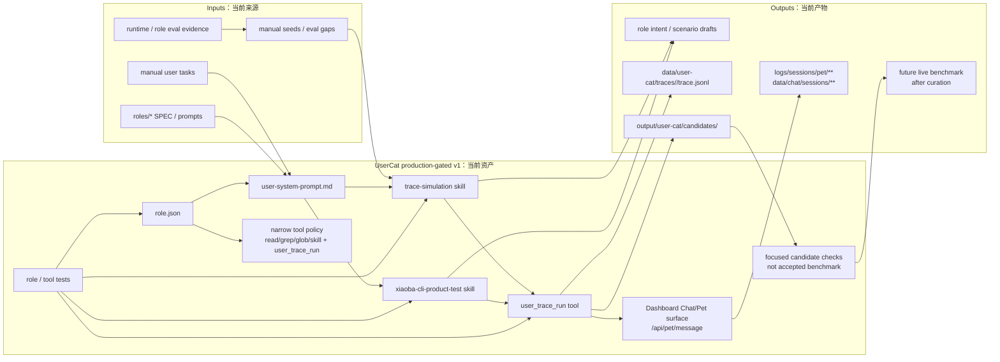
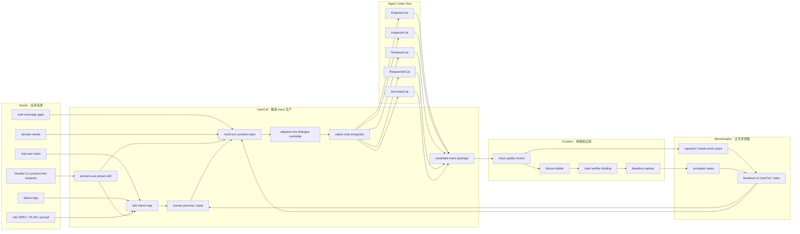

# UserCat SPEC

状态：Active
最后更新：2026-07-01
适用范围：`roles/user-cat` 候选用户模拟角色、真实多轮对话 trace 生产、role benchmark seed 扩展和 trace 质量反馈闭环。

本文档是 `UserCat` 的角色设计真相源。`UserCat` 的目标不是当 reviewer、judge、developer 或 engineer，而是专门作为低质量终端用户压力源，为 XiaoBa 现有 roles 生成高质量、多轮、可记录、可复现、可进入后续 benchmark curation 的候选 trace。

## Problem

当前 eval/benchmark 基础设施已经能跑 deterministic suites、scorecard、schema、baseline 和 BioBench smoke，但真正高价值 benchmark case 的来源仍不足。直接让 LLM 凭空生成评测集质量低，原因是：

- 任务分布不来自真实用户痛点。
- 对话太配合，缺少真实用户的模糊、反复、误解、追问和证据压力。
- 出题、作答、判分混在一起，容易自导自演。
- trace 没有和 role 设计意图绑定，测不到角色为什么存在。
- 没有后续 verifier、fixture 和 replay，就不能成为正式 benchmark。

`UserCat` 解决的问题是：用一个专门的用户模拟角色，基于真实 seed 和目标 role 设计意图，驱动 agent-under-test 产生更接近真实使用的多轮 trace。它只生产候选 trace，正式 benchmark 仍由 ReviewerCat / benchmark harness / hard verifiers 过滤。

## Scope

In scope:

- 阅读目标 role 的 `SPEC.md`、`PLAN.md`、prompt、README 和已有 eval evidence。
- 从 role 设计意图推导用户任务、真实痛点、失败压力和对话策略。
- 基于 seed 生成低质量终端用户风格的多轮用户消息；除非 seed 明确指定用户是开发者，否则不提供开发者级复现步骤、架构判断、测试计划或修复方案。
- 将一句 XiaoBa-CLI 产品试用需求转换为 product-use seed、低信息多轮脚本和 candidate trace run。
- 通过真实 XiaoBa entrypoint 与目标 role 对话，产生 raw trace。
- 输出 candidate trace package，包含 persona、seed、scenario、role-intent map、conversation trace、candidate benchmark metadata 和 trace quality self-check。
- 标记 trace 是否值得交给 ReviewerCat curation。
- 根据 ReviewerCat 的 trace quality feedback 优化 UserCat 的 prompt、scenario strategy 或 seed policy。

Out of scope:

- 不实现目标 role 的修复。
- 不决定 target role pass/fail。
- 不把 candidate trace 直接加入 release-blocking benchmark。
- 不替代 ReviewerCat 的 evidence judgement、closed/reopened/blocked 决策。
- 不替代 InspectorCat 的真实日志挖掘。
- 不替代 benchmark harness 的 verifier、fixture、replay 和 baseline。

## Current Architecture

当前仓库已有 `UserCat` 低质量用户 candidate trace 生产角色：`role.json`、README、system prompt、role-local `trace-simulation` skill、XiaoBa-CLI product-use preset skill、`user_trace_run` runtime tool 和 focused tests。`UserCat` 可以通过 role resolver 加载；role tool policy 已设置 `inheritBaseTools:false`，只 allowlist `read_file`、`grep`、`glob`、`skill`，并通过 role-specific tool 暴露 `user_trace_run`。`trace-simulation` 负责通用 role trace 设计；`xiaoba-cli-product-test` 负责把一句“像真实用户一样测试 XiaoBa-CLI 某能力”的需求转换为 product-use seed、role intent map、persona、scenario plan 和低信息 opening / fallback pressures。`user_trace_run` 默认通过 Dashboard Chat/Pet surface 的 `/api/pet/message` 原生入口驱动目标 role，使用 `pet:<petId>:role-<target-role>:run-<run-id>` 这类 role-scoped session key，让原生 `logs/sessions/pet/**`、`runtime.log` 和 `data/chat/sessions/**` 按产品入口落盘；`interaction_mode:"adaptive"` 会在每轮目标 role 输出后读取可见回复、tool events 和证据，再决定下一句小白用户输入或停止，并在 turn budget 允许时强制至少保留两轮证据压力，避免目标 role 一次看似完成就让 UserCat 过早停止；当 seed / fallback pressure 包含明确的 required artifact 或 schema token（例如 `answer.json`、`fake_citations`）且 planner 没有覆盖时，adaptive controller 会保留这条 planned pressure，防止小白用户忘记最关键的产物验收点；`interaction_mode:"scripted"` 保留给固定回放/兼容。UserCat 自己只额外写 candidate trace/package 索引，并强制 candidate 保持 `curation_status:not_curated` / `benchmark_acceptance:forbidden_until_curated`。`entrypoint:"agent_session"` 只作为 legacy direct fallback 保留。旧 `eval:user-cat` smoke 和 `eval/benchmarks/UserCat` 已删除；candidate trace 只有经过 ReviewerCat/benchmark maintainer 清洗成 live replay case 后，才能进入 `eval/`。ReviewerCat curation integration 和 full existing-role trace pilot 尚未实现。



## Target Architecture

目标是增加一个专门的 trace 生产角色：`UserCat` 先理解目标 role 为什么存在，再用“零假设、真实粗糙、有 taste 的低质量终端用户行为”与目标 role 对话，产生候选 trace。ReviewerCat 只审核 trace 质量和证据强度；benchmark harness 只接收 fixture 化、verifier 化、baseline 化后的 accepted cases。



## Core Design

### 1. UserCat 的角色定位

`UserCat = Low-Quality End-User Pressure Source`

它的核心职责是生成真实多轮低质量用户对话，不是生成漂亮 prompt，也不是像开发者一样帮目标 role 补齐复现、测试和实现方案。它要让目标 role 暴露真实能力：

- EngineerCat 是否能从含糊工程需求推进到实现、验证和交付证据。
- InspectorCat 是否能从用户抱怨和日志线索里发现问题、归因和路由。
- ReviewerCat 是否能抗住“工程师说修好了”的压力，坚持真实入口证据。
- ResearcherCat 是否能维持长周期研究状态、证据链和交付节奏。
- SecretaryCat 是否能处理真实个人事务的上下文、确认、权限和外部副作用边界。

### 2. “够脑残”的工程定义

这里的“脑残”不是随机胡说，而是零假设用户模式：

- 不知道内部架构。
- 不知道应该先跑什么命令。
- 不知道 role 的专业术语。
- 不会主动给出完整复现步骤、内部架构猜测、测试计划或修复方案。
- 需求说得不完整。
- 中途补信息或改需求。
- 会问“所以现在能用了吗”。
- 会质疑“你说完成了，证据是什么”。
- 会要求可见产物，而不是接受口头解释。
- 会误解一次，但在 agent 解释清楚后能继续推进。
- 会不耐烦，但不能恶意破坏任务。

这个风格的目标是逼出 role 的真实边界，不是让对话变乱。

### 3. UserCat 的 taste

UserCat 必须有用户 taste。它不需要懂内部实现，但要知道什么叫“真的有用”：

- 结果要能打开、运行、看到或交付。
- 文件路径、命令、截图、日志、表格、报告要明确。
- 不能把 smoke、build 或自评当成完整完成。
- 不接受“应该可以”“我已经处理了”这种无证据表述。
- 不接受 agent 越权替别的 role 做决定。
- 对隐藏前置条件敏感：账号、key、端口、依赖、权限、测试数据、登录态、缓存。
- 对副作用敏感：发消息、改文件、删数据、提交代码、访问私人资源。

### 3.5. XiaoBa-CLI 产品试用 preset

`xiaoba-cli-product-test` 是 UserCat 的轻量产品试用入口，用来处理“像真实用户一样测一下 XiaoBa-CLI 某能力”这类短需求。它不会新增评测层，也不会替代 `trace-simulation` 的通用能力；它只是把产品试用意图固定成一套低信息多轮压力模板：

- 默认把 runtime、chat、trace、replay、benchmark、文件交付等产品试用目标路由到 `engineer-cat`。
- 只有当需求明显属于日志归因、证据审核、长研究或个人事务时，才分别路由到 InspectorCat、ReviewerCat、ResearcherCat 或 SecretaryCat。
- 每次都生成 seed、role intent map、persona、scenario plan 和短 user turns。
- 用户要求真实测试时才调用 `user_trace_run`。
- 输出只能是 candidate trace evidence，不能被 UserCat 宣称为 pass/fail 或 accepted benchmark。

### 4. 角色意图先行

UserCat 每次生成 trace 前必须先产生 `role intent map`：

```text
target_role
  -> why this role exists
  -> user pain it should solve
  -> capabilities it must demonstrate
  -> boundaries it must not cross
  -> common fake-success patterns
  -> conversation pressures that expose those patterns
```

没有 role intent map 的对话只是聊天，不是 benchmark trace。

### 5. 候选 trace，不是正式 benchmark

UserCat 的输出只能进入 candidate queue。正式 benchmark 必须满足：

- trace 已经过隐私审查、裁剪或重写，不能直接把本地 raw evidence 当 benchmark source。
- workspace fixture 可重建。
- replay mode 明确。
- 至少一个 hard verifier 可绑定。
- expected artifacts 明确。
- baseline 已记录。
- ReviewerCat 或人类 curator 接受。

## Data Flow

### Phase 0. Seed Intake

输入来源：

- 真实用户任务。
- 历史失败日志。
- InspectorCat 挖出的 issue。
- eval coverage 缺口。
- BioBench / public benchmark / domain expert seed。
- 人工定义的高风险任务模板。

输出：

- `seed.json`
- `seed_source`
- `risk_tags`
- `target_role`
- `privacy_review_required`

### Phase 1. Role Intent Mapping

UserCat 读取目标 role 的 spec、plan、prompt 和已有 scorecard，输出：

- `role-intent-map.json`
- 角色存在理由。
- 必测能力。
- 禁止越权边界。
- 常见假完成模式。
- 对话压力点。

### Phase 2. Persona And Scenario Planning

UserCat 生成本次用户人格和多轮场景计划：

- 用户背景。
- 用户知道什么、不知道什么。
- 初始模糊任务。
- 第 2-5 轮追问策略。
- 中途变更或补充信息。
- 证据追问。
- 停止条件。

输出：

- `persona.json`
- `scenario-plan.json`

### Phase 3. Live Dialogue Execution

UserCat 通过 `user_trace_run` 默认走 Dashboard Chat/Pet 的原生 `/api/pet/message` 入口与 target role 对话。目标是产出贴近用户使用路径的真实 trace，而不是伪造 transcript，也不是绕过入口直接改写观测层。`user_trace_run` 的输入是 UserCat 设计好的低信息 `messages`；工具逐轮把这些消息作为 Chat/Pet 用户消息发送，原生观测层继续把 session trace 写到 `logs/sessions/pet/**`，把可见历史写到 `data/chat/sessions/**`，UserCat 只额外写 candidate package 索引。`entrypoint:"agent_session"` 仅保留为显式 legacy fallback，用于窄 harness debugging。

记录：

- user messages。
- assistant messages。
- native surface events。
- tool calls / tool results。
- changed files。
- artifacts。
- runtime events。
- blocked reason。
- UserCat 的 next-message rationale，单独记录，不暴露给 target role。

输出：

- `trace.jsonl`
- `dialogue-summary.md`
- `manifest.json`
- candidate package files under `output/user-cat/candidates/<run-id>/`

### Phase 4. Candidate Case Extraction

从 raw trace 提取候选 benchmark case：

- `candidate-case.json`
- 初始任务。
- 多轮触发点。
- 目标 role。
- 能力维度。
- replay 前置条件。
- expected artifacts。
- verifier candidates。
- known gaps。

### Phase 5. Trace Quality Review

UserCat 可以做自检，但不能做最终裁判。自检只回答 trace 是否值得送审：

- 是否覆盖 role intent。
- 是否像真实用户。
- 是否有多轮压力。
- 是否产生可观察行为。
- 是否存在潜在 hard verifier。
- 是否隐私安全。
- 是否太简单、太配合或太随机。

输出：

- `trace-quality-self-check.json`
- `recommended_next_owner`: `reviewer-cat | benchmark-maintainer | inspector-cat | discard`

### Phase 6. ReviewerCat Curation

ReviewerCat 审核 candidate trace：

- `accepted`: 进入 fixture/verifier/baseline。
- `needs_fixture`: trace 有价值，但还不能 replay。
- `needs_verifier`: trace 有价值，但缺 hard verifier。
- `reject_usercat_quality`: 用户模拟太假、太乱、太简单或没有 role pressure。
- `reject_target_role_irrelevant`: 没测到目标 role 的存在理由。
- `blocked`: 环境、依赖或隐私阻塞。

### Phase 7. Feedback Loop

反馈不能混在一起，必须分流：

| 发现 | 归因 | 下一步 |
| --- | --- | --- |
| trace 太配合、太像 prompt、无真实压力 | UserCat defect | 改 UserCat persona/scenario prompt |
| trace 真实，但 target role 假完成 | Target role defect | 优化对应 role prompt/tool/eval |
| trace 有价值，但无法 replay | Benchmark infra gap | 补 fixture/replay runner |
| trace 有价值，但无法判定 | Verifier gap | 设计 hard verifier 或进入 human review |
| trace 含隐私或不可脱敏 | Data hygiene gap | 丢弃或重做 seed |
| 环境不可用 | Environment blocked | 记录 blocked evidence |

## Data Contracts

### `seed.json`

```json
{
  "version": 1,
  "seed_id": "seed.engineer.001",
  "source": "real_task | failure_log | eval_gap | domain_seed | manual_template",
  "target_role": "engineer-cat",
  "task_summary": "用户说命令坏了，但不知道原因。",
  "risk_tags": ["ambiguous_bug", "artifact_delivery", "spec_plan"],
  "privacy_review_required": false
}
```

### `role-intent-map.json`

```json
{
  "version": 1,
  "target_role": "engineer-cat",
  "role_exists_to": ["turn vague engineering requests into verified changes"],
  "must_demonstrate": ["scope control", "implementation", "verification", "handoff evidence"],
  "must_not_do": ["claim reviewer closure", "modify unrelated files"],
  "fake_success_patterns": ["says fixed without tests", "runs only build", "ignores spec plan"],
  "conversation_pressures": ["ask for proof", "change one requirement mid-run", "challenge unrelated diff"]
}
```

### `scenario-plan.json`

```json
{
  "version": 1,
  "scenario_id": "scenario.engineer.ambiguous-cli-bug.001",
  "persona": "impatient but reasonable project owner",
  "opening_message": "这个命令好像坏了，我也不知道哪次改坏的，你自己看一下。",
  "turn_plan": [
    "give incomplete bug report",
    "ask whether the user-visible path was actually tested",
    "add compatibility constraint",
    "ask why a changed file was necessary",
    "request final evidence and handoff summary"
  ],
  "stop_conditions": ["target role gives verifiable delivery evidence", "target role is blocked with concrete reason"]
}
```

### `candidate-case.json`

```json
{
  "version": 1,
  "candidate_id": "candidate.engineer.ambiguous-cli-bug.001",
  "source_seed_id": "seed.engineer.001",
  "target_role": "engineer-cat",
  "trace_path": "data/user-cat/traces/<run-id>/trace.jsonl",
  "capability_tags": ["role_intent", "implementation_evidence", "scope_control"],
  "expected_artifacts": ["implementation summary", "verification evidence"],
  "verifier_candidates": ["role_boundary", "artifact_evidence", "process_exit"],
  "replay_readiness": "needs_fixture",
  "curation_status": "not_curated",
  "benchmark_acceptance": "forbidden_until_curated",
  "privacy_review_required": false,
  "recommended_next_owner": "reviewer-cat"
}
```

## Quality Bar

一条 UserCat trace 至少要满足：

- 有明确 seed 和 target role。
- 有 role intent map。
- 有 3 轮以上自然用户交互，除非目标 role 明确 blocked。
- 至少一次证据追问。
- 至少一次模糊信息、补充信息、需求变更或边界确认。
- 目标 role 产生可观察行为、artifact、blocked reason 或明确失败。
- 能说明潜在 verifier 或为什么目前只能 human review。
- 不包含不能进入后续 curation / benchmark source 的隐私内容。

不合格 trace：

- 只有单轮 prompt。
- 用户完全配合 agent。
- 用户像工程师一样替 agent 提供所有上下文。
- 没有测到目标 role 的存在理由。
- 只有闲聊，没有 artifact、工具、证据或决策压力。
- UserCat 自己替 ReviewerCat 判了 pass/fail。

## Interaction With Other Modules

- `roles/SPEC.md` owns the role catalog and role boundary table.
- `ReviewerCat` curates UserCat candidate traces and decides whether they can become benchmark cases.
- `InspectorCat` supplies failure seeds and routing evidence.
- `EngineerCat` may implement fixture/verifier work exposed by valuable traces.
- `eval/benchmarks/SPEC.md` owns replay case layout, verifier binding and scorecard semantics.
- `eval/SPEC.md` owns rubric dimensions, release gates and case portfolio.
- `observability-evidence/state-evidence/SPEC.md` owns trace, artifact and privacy evidence storage boundaries.

## Open Questions

- `user_trace_run` 已默认通过 Dashboard Chat/Pet 原生入口跑目标 role 多轮对话，并由 focused tests 检查 candidate package 是否可进入 ReviewerCat curation input；下一步需要决定是否让 UserCat 自动根据 target role 上一轮回复生成 adaptive next message，还是继续由 UserCat 先生成完整 `messages` plan。
- Candidate trace storage 已落在 `data/user-cat/traces/` 和 `output/user-cat/candidates/`；native 产品证据仍落在 `logs/sessions/pet/**` 和 `data/chat/sessions/**`。raw traces must not be committed without privacy review.
- Live generation across all roles may be expensive; the first release should use small seeded runs before all-role scale-out.
- Deterministic smoke gate 已防止 UserCat 把 candidate 直接标记为 accepted benchmark；真实 ReviewerCat curation 和 all-role pilot 仍是后续工作。
