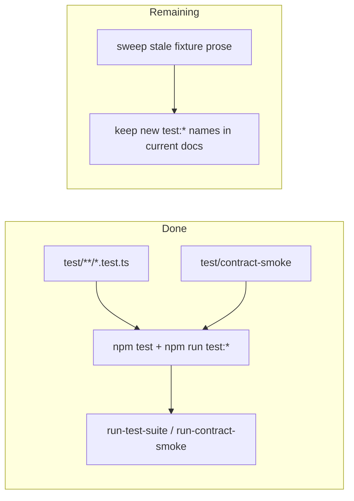

# Test Harness PLAN

状态：Active
最后更新：2026-06-25
Owner：Runtime / evaluation maintainers

## Current Status

`test/` now owns code correctness and deterministic runtime contract smoke:

- `tests/` was moved to `test/`.
- Runtime harness suites moved from `eval/suites` to `test/contract-smoke/suites`.
- Runtime harness fixtures moved from `eval/fixtures` to `test/contract-smoke/fixtures`.
- `npm test` runs `test/**/*.test.ts`.
- `npm test` no longer re-runs full production eval gate / benchmark suites or eval schema governance; full behavior evaluation stays in explicit `test:*` and `eval:*` scripts.
- `npm run test:*` runs contract smoke suites into `output/test/**` through `scripts/run-test-suite.ts` or `scripts/run-contract-smoke.ts`.
- `check:benchmarks` is eval asset preflight and no longer appears in the test harness flow; `eval-smoke` no longer wraps contract smoke as a benchmark.
- Low-level replay smoke suites for `conversation_runner`、`agent_session`、`surface_adapter` and standalone delivery evidence have been removed; surface behavior smoke now goes through `surface_runtime`.

## Milestones

1. M1：Physical boundary split：completed.
2. M2：Package / CI command split：completed for recommended commands.
3. M3：Benchmark manifest preflight moved out of the test harness flow：completed.
4. M4：Docs sweep：mostly complete; current core docs are updated, older fixture prose may still mention historical paths.
5. M5：Low-level replay smoke removal：completed.

## Next Steps

- Keep new deterministic runtime smoke under `test/contract-smoke`.
- Keep unit/integration files under `test/`.
- Avoid adding role behavior fixtures to `test/contract-smoke`; move them to `eval/benchmarks/<Role>/`.
- Keep generated-output validation out of `npm test`; eval asset preflight remains `npm run check:benchmarks`.
- Keep current docs and commands on `test:*` / `eval:*` / `check:*`; only historical verification logs may mention retired command names.

## Acceptance Criteria

- `npm test` runs from `test/`.
- `npm run test:contract-smoke` passes.
- `npm run test:contract-smoke` only aggregates the six maintained contract/runtime smoke suites.
- `eval/benchmarks/eval-smoke` is absent; `npm run test:contract-smoke` is the maintained contract-smoke gate.
- `npm run check:benchmarks` scans live eval benchmark manifests and referenced live suites outside the test harness flow.
- No top-level `tests/` or `benchmarks/` source directory is required.

## Verification Log

- 2026-06-25：Added regression coverage for Feishu text delivery failures and main Dashboard pet Chat role-scoped session/message-mode rendering. Verification：`node --test -r tsx test/feishu-message-sender.test.ts test/dashboard-pet-runtime.test.ts`（6/6）；`npm test`（358/358）；`npm run test:contract-smoke`（6/6 items，23/23 cases）；`npm run build`；`git diff --check`。
- 2026-06-25：Non-Room release-blocker follow-up added regression coverage for Weixin visible final delivery, Dashboard blocked-reason redaction, and Pet live benchmark payload preflight. Verification：`npm test`（354/354）；`npm run test:contract-smoke`（6/6 items，23/23 cases）；`npm run check:benchmarks`（1 manifest，11 cases）；`npm run build`。
- 2026-06-25：Non-Room PR blocker sweep restored the maintained test gates: provider buildability, canonical AgentToolExecutor facts, single `test/` runner boundary, exposed `test:contract-smoke`, Feishu delivery semantics, Dashboard observability redaction, and replay session-key compatibility are all covered by current Feishu/Pet gates. Verification：`npm test`（351/351）；`npm run test:contract-smoke`（6/6 items，23/23 cases）；`npm run check:benchmarks`（1 manifest，11 cases）；`npm run build`。
- 2026-06-23：Removed low-level replay contract smoke suites and package scripts: no `test:replay`、`test:agent`、`test:delivery` or `test:surface-adapter`; aggregate contract smoke now runs the six maintained runtime/test suites. Verification：`npm run test:contract-smoke`（6/6 items，28/28 cases）；`node --test -r tsx test/eval-gate.test.ts test/eval-benchmark-bridge.test.ts test/eval-runner.test.ts test/provider-network-readiness-runner.test.ts`（42/42）；`npm test`（360/360）；`npm run build`；`git diff --check`。
- 2026-06-23：Test runner naming boundary landed: deterministic suite CLI moved from `scripts/run-eval.ts` to `scripts/run-test-suite.ts`, aggregate contract smoke moved to `scripts/run-contract-smoke.ts`, and `test:contract-smoke` no longer uses `src/eval/gate-runner.ts` runtime-harness profiles. Verification：`npm run test:contract-smoke`（10/10 items，34/34 cases）；`node --test -r tsx test/eval-gate.test.ts test/eval-benchmark-bridge.test.ts test/eval-runner.test.ts`（43/43）；`npm test`（364/364）；`git diff --check`。
- 2026-06-23：Removed the `eval-smoke` benchmark wrapper so `test/contract-smoke` remains the direct deterministic contract-smoke boundary. Verification：`npm run build`; `npm run check:benchmarks`（6 manifests，52 cases）；`node --test -r tsx test/eval-benchmark-bridge.test.ts test/eval-gate.test.ts test/logger.test.ts`（12/12）；runtime-harness direct gate to `/tmp/xiaoba-contract-smoke-cleanup`（10/10 items，34/34 cases）。
- 2026-06-17：Public quality commands now separate into `test:*`, `eval:*`, and `check:*`; the former benchmark namespace was removed from the maintained command surface. Runtime/role benchmarks run through `eval:runtime`, `eval:engineer:benchmark`, and `eval:researcher:benchmark`, while eval asset/source/output drift checks run through `check:eval-assets`. Verification：`npm run build`; `node --test -r tsx test/eval-schema-validation.test.ts`（60/60）；`npm run eval:runtime`（20/20 benchmark cases，44/44 eval cases）；`npm run eval:engineer:benchmark`（5/5 benchmark cases，5/5 eval cases）；`npm run eval:researcher:benchmark`（32/32 benchmark cases，32/32 eval cases）；`npm run eval:gate`（21/21 items，132/132 cases）；`npm run check:eval-assets`（5057/5068 passed，0 failed，11 skipped）；`git diff --check`.
- 2026-06-17：Slimmed ordinary harness tests by removing duplicated production eval/gate/benchmark executions from `npm test`. `eval-gate` now keeps only profile composition coverage; `eval-benchmark-bridge` uses one synthetic bridge run instead of replaying all runtime/role benchmarks; `eval-runner` no longer embeds production role/runtime suite positive runs; generated-output validation moved out of `test/eval-schema-validation.test.ts` and remains owned by `npm run check:eval-assets`; Feishu engineer runtime test now uses explicit `send_text` delivery instead of final-text fallback. Verification：`node --test -r tsx test/eval-gate.test.ts test/eval-benchmark-bridge.test.ts test/eval-runner.test.ts`（49/49）；`node --test -r tsx test/feishu-engineer-runtime.test.ts`（1/1）；`node --test -r tsx test/eval-schema-validation.test.ts`（60/60）；`npm test`（422/422）；`npm run test:contract-smoke`（10/10 items，34/34 cases）；`npm run eval:runtime`（20/20 benchmark cases，44/44 eval cases）；`npm run eval:gate`（21/21 items，132/132 cases）；`npm run check:eval-assets`（5058/5069 passed，0 failed，11 skipped）；`npm run build`; `git diff --check`.
- 2026-06-17：Renamed eval-system schema/source/generated-evidence validation into the `check:*` namespace as `check:eval-assets`; CI and contracts now call `npm run check:eval-assets`, while `eval:*` remains reserved for behavior eval and release gates. Verification：`npm run build`; `node --test -r tsx test/eval-schema-validation.test.ts`（62/62）；`npm run check:eval-assets`（4973/4984 passed，0 failed，11 skipped）；`git diff --check`；`rg` found no retired schema command references.
- 2026-06-17：Split test/eval source roots, moved deterministic smoke to `test/contract-smoke`, moved benchmark source to `eval/benchmarks`, updated CI/package/schema validators, and fixed stale test assertions for new paths/counts. Verification：`npm run build`; `npm test`（440/440）；`node --test -r tsx test/eval-schema-validation.test.ts`（62/62）；`npm run test:contract-smoke`（10/10 items，34/34 cases）；`npm run eval:runtime`（20/20 benchmark cases，44/44 eval cases）；`npm run check:eval-assets`（4883/4894 passed，0 failed，11 skipped）；`git diff --check`.
