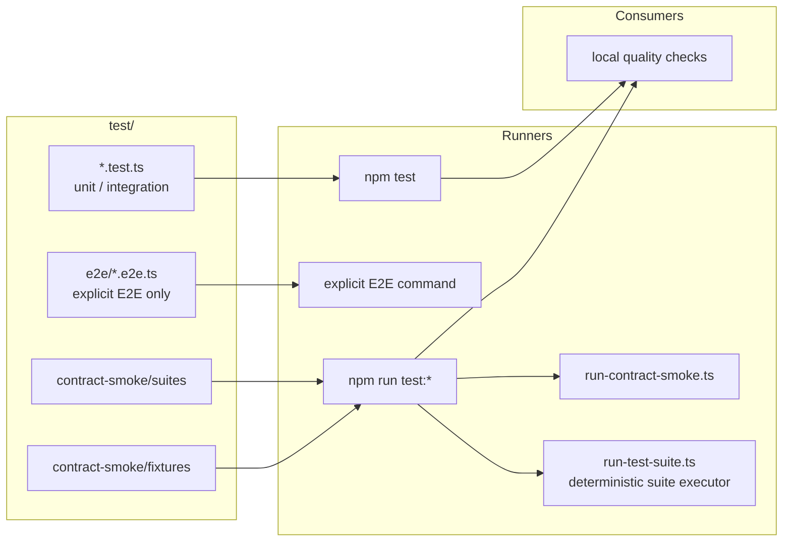
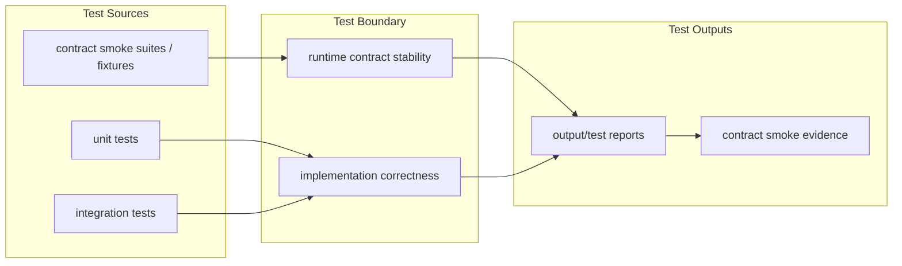

# Test Harness SPEC

状态：Active
最后更新：2026-06-23

`test/` 是 XiaoBa-CLI 的代码正确性和 deterministic contract smoke 边界。它回答“代码有没有坏、runtime contract 有没有破”，不回答“agent 行为是否变强”。

## Problem

历史上 runtime contract smoke、unit/integration tests 和 eval benchmark 混在 `eval/` / `benchmarks/` / `tests/` 三个入口里，导致 test 和 eval 语义互相污染。当前边界把 deterministic checks 收敛到 `test/`：

- Unit tests：模块级行为正确性。
- Integration tests：跨模块 runtime/tool/surface 协作正确性。
- Contract smoke：稳定 runtime contract、JSONL、provider fallback、surface runtime、delivery 和 state evidence smoke。

## Scope

In scope:

- `test/**/*.test.ts`
- `test/e2e/**/*.e2e.ts`
- `test/contract-smoke/suites/*.json`
- `test/contract-smoke/fixtures/**`
- `npm test`
- `npm run test:*`

Out of scope:

- Role-owned behavior benchmark data。
- Long-running role replay scorecards。
- Rubric authoring and benchmark source acceptance。
- Observability trace proposal acceptance。

## Current Architecture

## Target Architecture

## Contracts

- `test/` is the only top-level source root for unit/integration tests.
- `test/contract-smoke/suites` is runtime-harness-only; live agent eval suites must live under `eval/benchmarks/<Owner>/suites`.
- `test/contract-smoke/fixtures` is runtime-harness-only; live agent eval fixtures must live under `eval/benchmarks/<Owner>/fixtures`.
- Test outputs use `output/test/**`.
- `check:benchmarks` belongs to eval asset preflight, not test execution. It may read live benchmark manifests and referenced live suites, but it must not consume `test/contract-smoke` as benchmark source.

## Interactions

- `eval/benchmarks/eval-smoke` has been removed; contract-smoke remains test-owned evidence, not an eval benchmark wrapper.
- `eval/` owns live agent eval benchmark manifests and scorecards only.
- Local quality runs `npm test`, `npm run test:contract-smoke`, `npm run eval:base-runtime`, `npm run eval:gate`, and `npm run check:benchmarks`.
